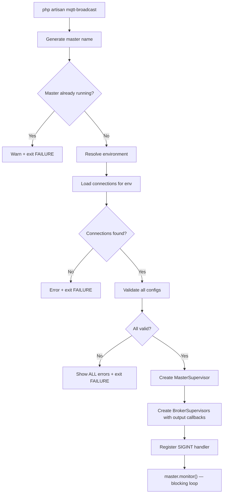
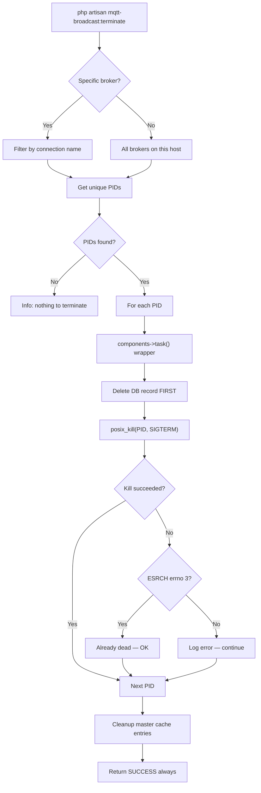
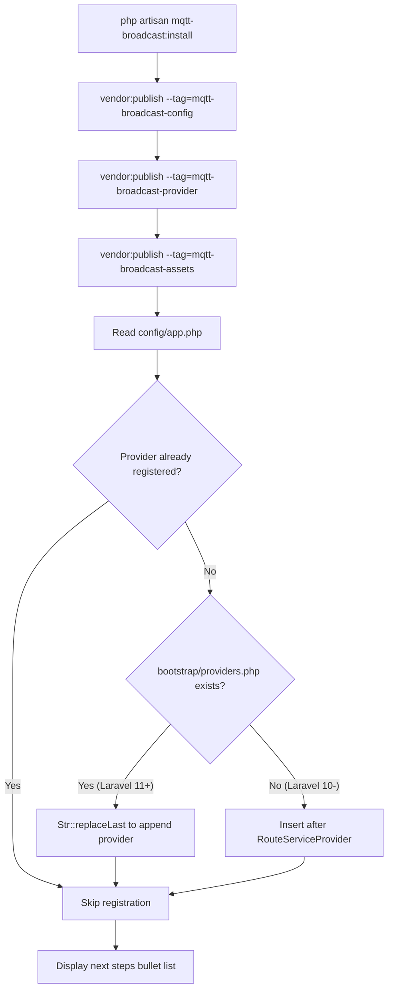
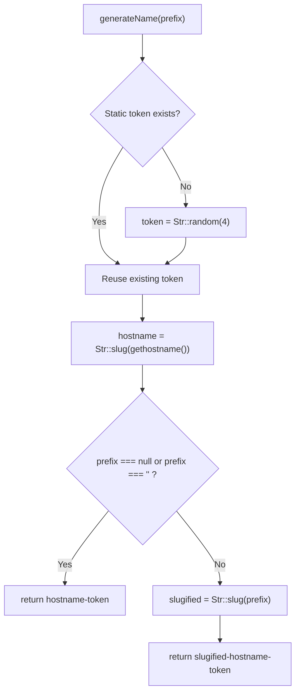
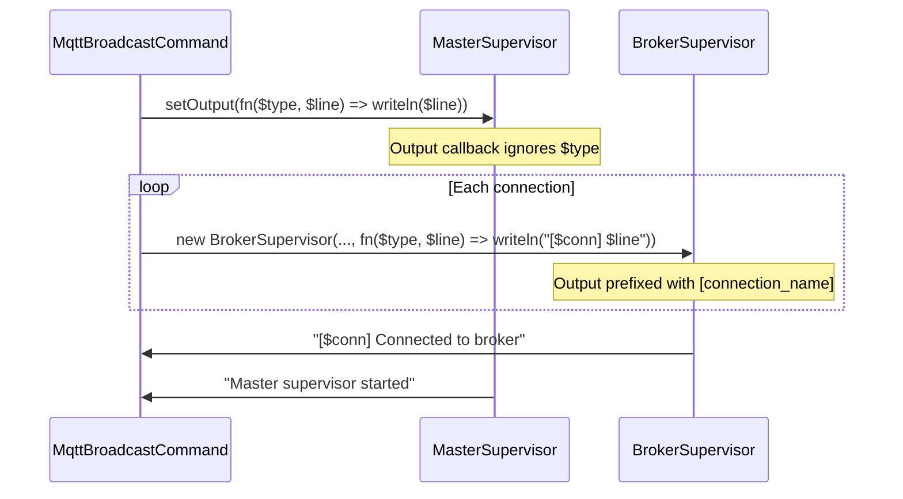

# Artisan Commands

## Overview

MQTT Broadcast provides four Artisan commands that manage the full lifecycle of the supervisor system: installation, startup, termination, and connectivity testing. These commands follow Laravel Horizon's CLI patterns — a blocking foreground process for the supervisor, signal-based termination, and a one-time installer that publishes config, service provider, and frontend assets.

All commands are registered conditionally via `MqttBroadcastServiceProvider::registerCommands()`, which guards registration behind `$this->app->runningInConsole()`. All four commands are registered inside a single `$this->commands()` call — there is no conditional per-command registration.

## Architecture

The commands are intentionally thin — they delegate all heavy lifting to the supervisor and repository layers:

- **InstallCommand** — orchestrates `vendor:publish` for three tags and registers the service provider in the application bootstrap file.
- **MqttBroadcastCommand** — the main entry point. Creates `MasterSupervisor` + N `BrokerSupervisor` instances and enters a blocking monitor loop.
- **MqttBroadcastTerminateCommand** — sends `SIGTERM` to running supervisor processes and cleans up database/cache state.
- **MqttBroadcastTestCommand** — one-shot synchronous publish to verify broker connectivity.

Design decisions:
- **Fail-fast validation**: `MqttBroadcastCommand` validates all connection configs by calling `MqttClientFactory::create()` before creating any supervisors. Invalid configs abort startup entirely.
- **Duplicate prevention**: checks cache for an existing master supervisor with the same hostname-based name. Only one master per machine.
- **Best-effort terminate**: `MqttBroadcastTerminateCommand` always returns `SUCCESS` — cleanup is best-effort. Stale processes and cache entries are cleaned even if `posix_kill` fails.
- **Horizon-style environment resolution**: environment is resolved via CLI option > `mqtt-broadcast.env` config > `APP_ENV`, matching Horizon's precedence.

### PHP 8 Attribute Registration

All four commands use Symfony's `#[AsCommand]` PHP 8 attribute for command metadata. There is an inconsistency in how much metadata each command provides:

| Command | `#[AsCommand]` params | `$signature` visibility |
|---|---|---|
| `InstallCommand` | `name` only | `protected` |
| `MqttBroadcastCommand` | `name` + `description` | `public` |
| `MqttBroadcastTerminateCommand` | `name` + `description` | `public` |
| `MqttBroadcastTestCommand` | `name` + `description` | `protected` (implicit) |

The `$signature` visibility difference (`public` vs `protected`) has no functional impact — Laravel reads it via reflection regardless. The commands with `public $signature` likely follow an older template; `protected` is the Laravel convention.

### Dependency Injection Patterns

The commands use two distinct patterns for obtaining dependencies:

| Command | DI approach | Dependencies |
|---|---|---|
| `InstallCommand` | None — all operations are self-contained | Uses `Filesystem`, `Str`, `file_get_contents()` directly |
| `MqttBroadcastCommand` | Container injection via `handle()` params | `MasterSupervisorRepository`, `BrokerRepository`, `MqttClientFactory` |
| `MqttBroadcastTerminateCommand` | Container injection via `handle()` params | `BrokerRepository`, `MasterSupervisorRepository` |
| `MqttBroadcastTestCommand` | None — calls static method directly | `MqttBroadcast::publishSync()` (class, not Facade) |

Note: `MqttBroadcastTestCommand` imports `enzolarosa\MqttBroadcast\MqttBroadcast` (the concrete class), not `enzolarosa\MqttBroadcast\Facades\MqttBroadcast` (the Facade). This works because `publishSync()` is a static method on the class itself. The Facade is not needed here.

## How It Works

### mqtt-broadcast:install

Publishes all package resources and registers the service provider:

1. Calls `vendor:publish --force` for three tags sequentially (via `collect()->each()`):
   - `mqtt-broadcast-config` → copies `config/mqtt-broadcast.php` to the application config directory.
   - `mqtt-broadcast-provider` → copies `MqttBroadcastServiceProvider.stub` to `app/Providers/MqttBroadcastServiceProvider.php`.
   - `mqtt-broadcast-assets` → copies compiled React dashboard assets to `public/vendor/mqtt-broadcast/`.
2. Calls `registerMqttBroadcastServiceProvider()`:
   - Resolves the application namespace via `$this->laravel->getNamespace()` and strips the trailing backslash with `Str::replaceLast()`.
   - Reads `config/app.php` to check if the provider class string is already present (using `Str::contains()`).
   - If `bootstrap/providers.php` exists (Laravel 11+): appends the provider class to the return array via `Str::replaceLast('];', ...)`.
   - Otherwise (Laravel 10 and below): calls `registerInConfigApp()`.
3. Displays next-step instructions (configure broker, update gate, run migrations, start supervisor) via `$this->components->bulletList()`.

#### registerInConfigApp() Implementation Detail

The `registerInConfigApp()` method checks for the `defaultProviders()->merge()` pattern to distinguish between Laravel config/app.php formats. However, **both branches execute identical code**: they insert the provider class after `RouteServiceProvider::class` using `str_replace()`. This means the format detection has no practical effect — the insertion strategy is the same regardless. The branch likely exists as a forward-looking scaffold for a future differentiation that was never implemented.

Both branches use `PHP_EOL` for line breaks and 8-space indentation to match the standard `config/app.php` formatting.

### mqtt-broadcast

Starts the supervisor system as a blocking foreground process:

1. **Name generation**: `ProcessIdentifier::generateName('master')` → format `master-{hostname}-{4-char-token}`. The token is `Str::random(4)` (4 alphanumeric characters), memoized via `static $token` so it persists for the process lifetime. See [ProcessIdentifier Details](#processidentifier-internals) below.
2. **Duplicate check**: `MasterSupervisorRepository::find($masterName)` — if a master exists in cache, aborts with `$this->components->warn()` and returns `Command::FAILURE`.
3. **Environment resolution**: `--environment` option > `config('mqtt-broadcast.env')` > `config('app.env')` using PHP's `??` null coalescing chain.
4. **Connection loading**: calls `getEnvironmentConnections($environment)` which reads `config('mqtt-broadcast.environments')` and returns the array for the given environment key, or `[]` if not found.
5. **Validation pass**: iterates all connections, calls `MqttClientFactory::create()` on each inside a try/catch for `\Throwable`. Collects **all** errors into `$validationErrors` keyed by connection name, then displays them together with colored output (`<fg=red>✗</> <fg=yellow>{$connection}</>`) before aborting. This "collect all then fail" pattern is intentional — it shows all broken connections at once rather than failing on the first.
6. **Master creation**: `new MasterSupervisor($masterName, $masterRepository)` — only two constructor args, no config injection.
7. **Output callback setup**:
   - Master: `$master->setOutput(function ($type, $line) { $this->output->writeln($line); })` — the `$type` parameter is received but **not used** by this callback. The master's output is written verbatim.
   - Broker supervisors: each gets a closure that prefixes with the connection name: `"[$connection] $line"`. The `$type` parameter is also unused. This means all output from a broker supervisor is visually tagged with its connection name.
8. **Broker creation loop**: For each connection, generates a name via `$brokerRepository->generateName()` (not `ProcessIdentifier::generateName()`), creates a `BrokerSupervisor` with 5 constructor arguments (name, connection, repository, factory, output callback), and adds it to the master via `$master->addSupervisor()`.
9. **Startup display**: `$this->components->info()` with broker count + environment, then `$this->line('Brokers: '.implode(', ', $connections))`.
10. **SIGINT handler**: `pcntl_async_signals(true)` enables async signal dispatch, then `pcntl_signal(SIGINT, ...)` registers a handler that writes a blank line, displays "Shutting down...", and calls `$master->terminate()`. The handler **returns** the result of `terminate()`, but this return value is discarded by the signal dispatch mechanism.
11. **Blocking monitor**: `$master->monitor()` — enters the infinite 1-second tick loop. This call never returns under normal operation. The `handle()` method has no explicit return statement after `monitor()`, so if `monitor()` ever did return, PHP would implicitly return `null` (not `0` / `SUCCESS`). Since `monitor()` is documented to never return, this is not a bug but it means the exit code of the command would be undefined in that edge case.

### mqtt-broadcast:terminate

Gracefully terminates running supervisor processes:

1. Reads optional `{broker}` argument via `$this->argument('broker')` — returns `null` if not provided.
2. Gets hostname via `ProcessIdentifier::hostname()` (slugified via `Str::slug(gethostname())`).
3. Loads all brokers from `$brokerRepository->all()`, wraps in `collect()`, filters to those whose `name` starts with the current hostname via `Str::startsWith()`.
4. If a specific broker was requested, further filters by `connection` property. If this results in an empty collection, warns and returns `SUCCESS` (not `FAILURE` — missing target is not an error).
5. Extracts unique PIDs via `$brokers->pluck('pid')->unique()`. Multiple broker records can share the same PID (one process manages multiple connections).
6. For each PID, wraps the work in `$this->components->task()` for visual output:
   - Uses a `&$result` by-reference variable to communicate the kill result out of the closure (since `components->task()` discards the closure's return value for display purposes — it uses it only to determine pass/fail rendering).
   - Calls `$brokerRepository->deleteByPid($processId)` **before** sending the signal — ensures DB cleanup happens even if the kill fails.
   - Calls `posix_kill($processId, SIGTERM)` and stores the boolean result.
7. After the task closure, checks `$result`:
   - Success: no additional output.
   - Failure with `posix_get_last_error() === 3` (ESRCH = "No such process"): treated as success — process already died.
   - Failure with any other errno: displays error with `posix_strerror()` message but **continues** to next PID.
8. **Master cache cleanup (safety net)**: loads all master supervisor names from `$masterRepository->names()`, filters to current hostname, deletes matching cache entries via `forget()`. Displays count using `Str::plural('entry', $count)` for correct grammar.
9. Always returns `Command::SUCCESS`.

### mqtt-broadcast:test

Sends a single synchronous test message:

1. Takes three required arguments: `{broker}`, `{topic}`, `{message}` — all required, no defaults.
2. Calls `MqttBroadcast::publishSync($topic, $message, $broker)` inside a `$this->components->task()` wrapper. The task label is `"Sending a message to $broker broker"`.
3. Uses the `MqttBroadcast` class directly (static call), not the Facade. This bypasses the service container entirely.
4. If `publishSync()` throws an exception (e.g., invalid broker config, network failure), the `components->task()` wrapper catches it and displays a failure indicator.
5. Returns `Command::SUCCESS` regardless — the visual task indicator shows pass/fail, but the exit code is always 0.

## ProcessIdentifier Internals

The `ProcessIdentifier` class provides process naming and identification utilities used by both `MqttBroadcastCommand` and `MqttBroadcastTerminateCommand`.

### Methods

| Method | Return Type | Description |
|---|---|---|
| `pid()` | `int` | Wraps `getmypid()` — returns the current PHP process ID |
| `hostname()` | `string` | Wraps `gethostname()` through `Str::slug()` — returns a URL-safe hostname |
| `generateName(?string $prefix = null)` | `string` | Generates `{prefix}-{hostname}-{token}` or `{hostname}-{token}` if no prefix |

### Token Generation

The token is generated via `Str::random(4)` on first call and stored in a `static $token` variable. This means:
- The token is 4 alphanumeric characters (a-z, A-Z, 0-9).
- It is generated once per PHP process and reused for all subsequent calls.
- Different calls to `generateName()` within the same process return names with the **same** token but potentially different prefixes.
- Each new process (e.g., each `php artisan mqtt-broadcast` invocation) gets a fresh token.

### Prefix Handling

The prefix parameter has three behaviors:
- `null` → no prefix: `{hostname}-{token}`
- `''` (empty string) → treated as `null`: `{hostname}-{token}` (explicit empty-string check)
- Any other string → slugified via `Str::slug($prefix)`: `{slugified-prefix}-{hostname}-{token}`

Example: `ProcessIdentifier::generateName('master')` on a machine named `web-server-01` → `master-web-server-01-a3Kx`.

## Key Components

| File | Class / Method | Responsibility |
|------|---------------|----------------|
| `src/Commands/InstallCommand.php` | `InstallCommand::handle()` | Publishes config, provider stub, and assets via `collect()->each()` |
| `src/Commands/InstallCommand.php` | `InstallCommand::registerMqttBroadcastServiceProvider()` | Auto-registers provider in bootstrap or config; checks existing registration first |
| `src/Commands/InstallCommand.php` | `InstallCommand::registerInBootstrapProviders()` | Laravel 11+ provider registration via `Str::replaceLast('];', ...)` |
| `src/Commands/InstallCommand.php` | `InstallCommand::registerInConfigApp()` | Laravel 10 and below provider registration; both branches identical |
| `src/Commands/MqttBroadcastCommand.php` | `MqttBroadcastCommand::handle()` | Creates supervisors, enters monitor loop; 3 injected dependencies |
| `src/Commands/MqttBroadcastCommand.php` | `MqttBroadcastCommand::getEnvironmentConnections()` | Reads environment-specific broker list from config; returns `[]` on missing env |
| `src/Commands/MqttBroadcastTerminateCommand.php` | `MqttBroadcastTerminateCommand::handle()` | Sends SIGTERM, cleans DB and cache records; 2 injected dependencies |
| `src/Commands/MqttBroadcastTestCommand.php` | `MqttBroadcastTestCommand::handle()` | Synchronous publish via `MqttBroadcast` class (not Facade); no DI |
| `src/Support/ProcessIdentifier.php` | `ProcessIdentifier::pid()` | Returns current process ID via `getmypid()` |
| `src/Support/ProcessIdentifier.php` | `ProcessIdentifier::hostname()` | Slugified machine hostname via `Str::slug(gethostname())` |
| `src/Support/ProcessIdentifier.php` | `ProcessIdentifier::generateName()` | Generates `{prefix}-{hostname}-{token}` with static token memoization |
| `src/MqttBroadcastServiceProvider.php` | `registerCommands()` | Guards registration with `runningInConsole()`; all 4 commands in single `$this->commands()` call |

## Configuration

| Config Key / Option | Default | Description |
|---|---|---|
| `--environment` (CLI option) | — | Override environment for broker resolution |
| `mqtt-broadcast.env` | `null` | Config-level environment override |
| `mqtt-broadcast.environments.{env}` | `['default']` | Array of connection names per environment |
| `mqtt-broadcast.connections.{name}` | — | Broker connection settings (host, port, auth, TLS) |
| `mqtt-broadcast.master_supervisor.cache_driver` | `redis` | Cache driver for master supervisor state |
| `mqtt-broadcast.master_supervisor.cache_ttl` | `3600` | TTL for master supervisor cache entries |

Published assets (via `mqtt-broadcast:install`):

| Tag | Source | Destination |
|---|---|---|
| `mqtt-broadcast-config` | `config/mqtt-broadcast.php` | `config_path('mqtt-broadcast.php')` |
| `mqtt-broadcast-provider` | `stubs/MqttBroadcastServiceProvider.stub` | `app_path('Providers/MqttBroadcastServiceProvider.php')` |
| `mqtt-broadcast-assets` | `public/vendor/mqtt-broadcast/` | `public_path('vendor/mqtt-broadcast/')` |

## Error Handling

| Command | Error Scenario | Behavior |
|---|---|---|
| `mqtt-broadcast` | Master already running | Warns via `components->warn()` and exits with `FAILURE` |
| `mqtt-broadcast` | No connections for environment | Error message with config hint (`"Check config/mqtt-broadcast.php -> environments section"`), exits with `FAILURE` |
| `mqtt-broadcast` | Connection config validation fails | Collects **all** errors (does not fail on first), displays each with `<fg=red>✗</>` prefix, exits with `FAILURE` |
| `mqtt-broadcast` | `monitor()` returns unexpectedly | No explicit return — PHP returns `null`, which maps to exit code `0` |
| `mqtt-broadcast:terminate` | No processes found for broker | Warns with broker name, returns `SUCCESS` |
| `mqtt-broadcast:terminate` | No processes on this host | Info message `"No processes to terminate."`, returns `SUCCESS` |
| `mqtt-broadcast:terminate` | `posix_kill` fails with ESRCH (errno 3) | Treated as success — `"Process $processId already terminated"` |
| `mqtt-broadcast:terminate` | `posix_kill` fails with other error | Displays `posix_strerror()` error, continues to next PID |
| `mqtt-broadcast:test` | Broker unreachable or invalid | Exception from `publishSync()` caught by `components->task()`, shows failure indicator |
| `mqtt-broadcast:test` | Any exception | Exit code is still `SUCCESS` (0) — only the visual task indicator shows failure |
| `mqtt-broadcast:install` | Provider already registered | Silently skips registration (checked via `Str::contains()` on file contents) |

## Mermaid Diagrams

### Supervisor Startup Flow

### Terminate Flow

### Install Flow

### ProcessIdentifier Name Generation

### Output Callback Architecture

