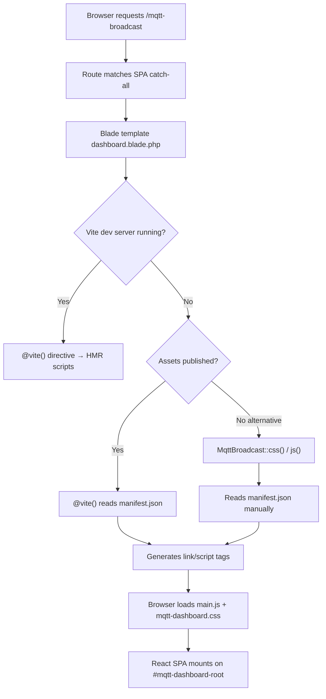
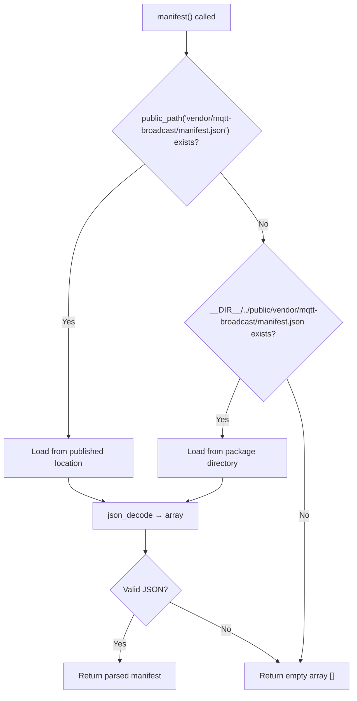
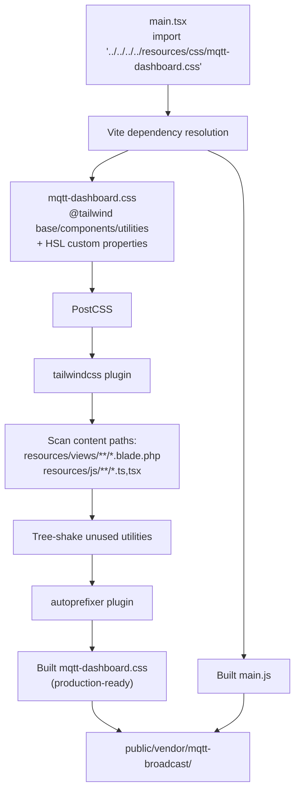
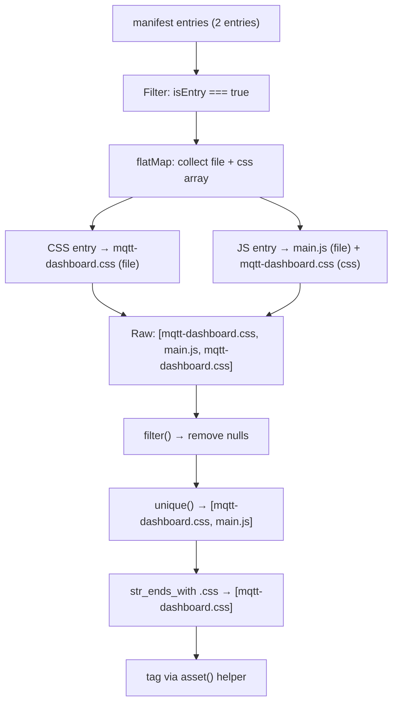

# Dashboard Asset Pipeline

## Overview

The MQTT Broadcast dashboard serves a React 19 SPA that needs CSS and JavaScript assets delivered to the browser. The asset pipeline handles building these assets with Vite, publishing them to the host application's `public/` directory, and injecting them into the Blade template. The package provides two asset-loading strategies: the `@vite()` directive (used in development) and the `MqttBroadcast::css()`/`MqttBroadcast::js()` static helpers (for production without Vite dev server).

## Architecture

### Build Toolchain

The asset pipeline is built on three layers:

1. **Vite** — bundles TypeScript/React/CSS into production-ready files with deterministic names (`main.js`, `mqtt-dashboard.css`)
2. **laravel-vite-plugin** — integrates Vite with Laravel's asset serving, directing output to `vendor/mqtt-broadcast/` instead of the default `build/` directory
3. **Manifest-based resolution** — a `manifest.json` file maps source entry points to built filenames, enabling the `css()`/`js()` helpers to locate assets without hardcoding paths

### Vite Configuration

```typescript
// vite.config.ts
export default defineConfig({
  plugins: [
    laravel({
      input: [
        'resources/js/mqtt-dashboard/src/main.tsx',
        'resources/css/mqtt-dashboard.css',
      ],
      refresh: true,
      buildDirectory: 'vendor/mqtt-broadcast',
    }),
    react(),
  ],
  build: {
    rollupOptions: {
      output: {
        entryFileNames: '[name].js',
        chunkFileNames: '[name].js',
        assetFileNames: '[name].[ext]',
      },
    },
  },
  resolve: {
    alias: {
      '@': path.resolve(__dirname, './resources/js/mqtt-dashboard/src'),
    },
  },
});
```

Key decisions:
- **`buildDirectory: 'vendor/mqtt-broadcast'`** — isolates package assets from the host application's own Vite build (`build/`)
- **Deterministic filenames** (`[name].js` instead of `[name]-[hash].js`) — simplifies manifest parsing and makes published assets predictable. Cache busting relies on the publish step rather than content hashing. This means browsers will serve stale cached assets after a package update unless the user re-publishes and clears their browser cache.
- **`@` path alias** — maps to `resources/js/mqtt-dashboard/src/` for clean imports within the SPA. This alias is duplicated in `tsconfig.json` (`"@/*": ["./resources/js/mqtt-dashboard/src/*"]`) — Vite uses the `vite.config.ts` alias for bundling, TypeScript uses the `tsconfig.json` path for IDE resolution and type checking. Both must stay in sync.
- **`refresh: true`** — enables the laravel-vite-plugin file watcher. When Blade templates change (matched by `resources/views/**`), the dev server triggers a full page reload (not HMR). This means changes to `dashboard.blade.php` are reflected without manually refreshing.

### Hot File Detection

When `npm run dev` starts, the laravel-vite-plugin creates a `public/hot` file containing the dev server URL (e.g., `http://[::1]:5173`). The `@vite()` directive checks for this file's existence at runtime:

- **File exists** → dev mode: generates `<script>` tags pointing to the Vite dev server URL for HMR
- **File absent** → production mode: reads `manifest.json` and generates tags pointing to built assets

The `public/hot` file is **not** cleaned up automatically when the Vite dev server crashes or is killed without `Ctrl+C`. A stale `public/hot` file causes `@vite()` to generate dev server URLs in production, resulting in broken assets. The file should be in `.gitignore`.

### PostCSS Pipeline

CSS processing goes through a two-stage PostCSS pipeline configured in `postcss.config.js`:

1. **tailwindcss** — processes `@tailwind` directives and utility classes, scanning content paths defined in `tailwind.config.js`
2. **autoprefixer** — adds vendor prefixes for browser compatibility

### Tailwind Configuration

`tailwind.config.js` uses a shadcn/ui-compatible design system:

- **`darkMode: ['class']`** — dark mode toggled via `.dark` class on `<html>`, not via `prefers-color-scheme` media query. The `ThemeToggle` component in the SPA manages this class.
- **Content scanning paths**: `./resources/views/**/*.blade.php` and `./resources/js/mqtt-dashboard/src/**/*.{ts,tsx}` — Tailwind tree-shakes unused classes based on these paths
- **HSL CSS custom properties** — all colors are defined as HSL values without the `hsl()` wrapper (e.g., `--primary: 221.2 83.2% 53.3%`), then consumed via `hsl(var(--primary))` in the Tailwind theme. This pattern allows the same variable to be used with opacity modifiers (`bg-primary/50`).
- **Two theme layers** — `:root` defines light mode values, `.dark` overrides them. The CSS uses `@layer base` to set these, ensuring they have the lowest specificity.

### TypeScript Configuration

Two TypeScript configs work together:

| File | Scope | Purpose |
|---|---|---|
| `tsconfig.json` | `resources/js/mqtt-dashboard/src` | Main app — strict mode with `noUnusedLocals`, `noUnusedParameters`, `noFallthroughCasesInSwitch`. Target ES2020, JSX via `react-jsx` (automatic runtime, no `React` import needed). |
| `tsconfig.node.json` | `vite.config.ts` only | Build tooling — ESNext modules, `composite: true` for project references |

The `tsconfig.json` sets `noEmit: true` — TypeScript is used only for type checking; Vite handles transpilation via esbuild.

### CSS Import Chain

`main.tsx` imports the CSS entry point directly via relative path traversal:

```typescript
import '../../../../resources/css/mqtt-dashboard.css';
```

This creates a dependency from the JS entry to the CSS file at bundle time, which is why the manifest's JS entry has a `css: ["mqtt-dashboard.css"]` key. Since both files are also declared as separate Vite entry points, the CSS is processed twice during build — once as a standalone entry and once as a JS dependency. The outputs are deduplicated by Vite's build, producing a single `mqtt-dashboard.css` file.

### Entry Points

| Entry Point | Output File | Purpose |
|---|---|---|
| `resources/js/mqtt-dashboard/src/main.tsx` | `main.js` | React SPA bootstrap |
| `resources/css/mqtt-dashboard.css` | `mqtt-dashboard.css` | Tailwind CSS styles |

### Manifest Structure

After `npm run build`, Vite generates `public/vendor/mqtt-broadcast/manifest.json`. The actual manifest contains additional fields not consumed by the package:

```json
{
  "resources/css/mqtt-dashboard.css": {
    "file": "mqtt-dashboard.css",
    "name": "mqtt-dashboard",
    "names": ["mqtt-dashboard.css"],
    "src": "resources/css/mqtt-dashboard.css",
    "isEntry": true
  },
  "resources/js/mqtt-dashboard/src/main.tsx": {
    "file": "main.js",
    "name": "main",
    "src": "resources/js/mqtt-dashboard/src/main.tsx",
    "isEntry": true,
    "css": ["mqtt-dashboard.css"]
  }
}
```

| Field | Used by `css()`/`js()` | Description |
|---|---|---|
| `file` | Yes | Built output filename |
| `src` | No | Original source path (same as manifest key) |
| `isEntry` | Yes | Filters to only top-level entry points |
| `css` | Yes (`css()` only) | CSS dependencies of JS entries |
| `name` | No | Vite-internal chunk name |
| `names` | No | Vite-internal — only present on CSS entries |

The `css` key on the JS entry exists because `main.tsx` imports `mqtt-dashboard.css` directly. This means `mqtt-dashboard.css` appears in the manifest twice: as its own entry's `file` and in the JS entry's `css` array. The `css()` method's `->unique()` call is load-bearing — without it, duplicate `<link>` tags would be generated.

## How It Works

### Asset Loading Flow



### Strategy 1: `@vite()` Directive (Default)

The Blade template uses the `@vite()` directive as the primary asset-loading mechanism:

```blade
@vite([
    'resources/js/mqtt-dashboard/src/main.tsx',
    'resources/css/mqtt-dashboard.css'
], 'vendor/mqtt-broadcast')
```

The second argument (`'vendor/mqtt-broadcast'`) tells `laravel-vite-plugin` to look for the manifest in `public/vendor/mqtt-broadcast/manifest.json` instead of the default `public/build/manifest.json`.

- **In development**: connects to Vite dev server for HMR (Hot Module Replacement)
- **In production**: reads the manifest and generates `<link>` and `<script>` tags pointing to built files

### Strategy 2: `MqttBroadcast::css()` / `MqttBroadcast::js()` Helpers

These static methods on `enzolarosa\MqttBroadcast\MqttBroadcast` provide an alternative manifest-based asset loading that does not depend on the `@vite()` directive.

#### `MqttBroadcast::css()`

```php
public static function css(): string
```

1. Calls `static::manifest()` to load the manifest array
2. Filters entries where `isEntry` is `true`
3. Uses `flatMap` to collect **both** the `file` key and all items from the `css` array for every entry
4. Filters out `null` values (via `->filter()`)
5. Deduplicates via `->unique()`
6. Filters to `.css` extensions only via `str_ends_with()`
7. Returns `<link rel="stylesheet">` tags joined with `"\n        "` (8 spaces indentation)

With the current manifest, step 3 collects these raw values:
- From CSS entry: `mqtt-dashboard.css` (file), no `css` array
- From JS entry: `main.js` (file), `mqtt-dashboard.css` (css array)

After step 6 filtering, `main.js` is discarded (not `.css`), and `unique()` deduplicates the two `mqtt-dashboard.css` entries.

Example output:
```html
<link rel="stylesheet" href="https://example.com/vendor/mqtt-broadcast/mqtt-dashboard.css">
```

#### `MqttBroadcast::js()`

```php
public static function js(): string
```

1. Calls `static::manifest()` to load the manifest array
2. Filters entries where `isEntry` is `true`
3. Extracts the `file` key from each entry via `->map()`
4. Filters out `null` values
5. Filters to `.js` extensions only via `str_ends_with()`
6. Returns `<script type="module">` tags joined with `"\n    "` (4 spaces indentation)

Note: `css()` and `js()` use different indentation in their `implode()` separators (8 spaces vs 4 spaces). This is an inconsistency — the generated HTML will have mismatched indentation levels.

Example output:
```html
<script type="module" src="https://example.com/vendor/mqtt-broadcast/main.js"></script>
```

#### `MqttBroadcast::manifest()` (Protected)

```php
protected static function manifest(): array
```

Loads and parses `manifest.json` with a two-step resolution strategy:

1. **Published location**: `public_path('vendor/mqtt-broadcast/manifest.json')` — used when assets have been published to the host application
2. **Package location**: `__DIR__.'/../public/vendor/mqtt-broadcast/manifest.json'` — fallback for development when running directly from the package directory
3. **Empty fallback**: returns `[]` if neither path exists (no assets available)

### Blade Template Integration

```blade
<!-- resources/views/dashboard.blade.php -->
<head>
    <script>
        window.mqttBroadcast = {
            basePath: '{{ config('mqtt-broadcast.path', 'mqtt-broadcast') }}',
            apiUrl: '/{{ config('mqtt-broadcast.path', 'mqtt-broadcast') }}/api',
            loggingEnabled: {{ config('mqtt-broadcast.logs.enable', false) ? 'true' : 'false' }},
            refreshInterval: 5000,
        };
    </script>
    @vite([
        'resources/js/mqtt-dashboard/src/main.tsx',
        'resources/css/mqtt-dashboard.css'
    ], 'vendor/mqtt-broadcast')
</head>
<body>
    <div id="mqtt-dashboard-root"></div>
</body>
```

The template injects runtime configuration via `window.mqttBroadcast` before loading the SPA assets.

## Key Components

| File | Class/Method | Responsibility |
|---|---|---|
| `src/MqttBroadcast.php` | `MqttBroadcast::css()` | Generates `<link>` tags from manifest |
| `src/MqttBroadcast.php` | `MqttBroadcast::js()` | Generates `<script type="module">` tags from manifest |
| `src/MqttBroadcast.php` | `MqttBroadcast::manifest()` | Loads and parses `manifest.json` with fallback resolution |
| `src/MqttBroadcastServiceProvider.php` | `offerPublishing()` | Registers publishable assets with `mqtt-broadcast-assets` tag |
| `resources/views/dashboard.blade.php` | Blade template | Bootstraps SPA with config injection and `@vite()` directive |
| `vite.config.ts` | Vite config | Defines entry points, build directory, and output naming |
| `public/vendor/mqtt-broadcast/manifest.json` | Manifest | Maps source entry points to built output files |
| `tailwind.config.js` | Tailwind config | Dark mode strategy, HSL design system, content scanning paths |
| `postcss.config.js` | PostCSS config | Tailwind + autoprefixer processing pipeline |
| `tsconfig.json` | TypeScript config | Strict mode, `@/*` path alias for IDE, `react-jsx` runtime |
| `tsconfig.node.json` | TypeScript config (node) | Covers `vite.config.ts` only, composite project reference |
| `resources/css/mqtt-dashboard.css` | CSS entry point | Tailwind directives + HSL CSS custom properties for light/dark themes |
| `resources/js/mqtt-dashboard/src/main.tsx` | JS entry point | React 19 SPA mount, imports CSS via relative path traversal |
| `public/hot` | Hot file (dev only) | Created by `npm run dev`, contains dev server URL for `@vite()` detection |

## Configuration

### Asset Publishing

Assets are published via the ServiceProvider with two tags:

```php
$this->publishes([
    __DIR__.'/../public/vendor/mqtt-broadcast' => public_path('vendor/mqtt-broadcast'),
], ['mqtt-broadcast-assets', 'laravel-assets']);
```

| Tag | Usage |
|---|---|
| `mqtt-broadcast-assets` | `php artisan vendor:publish --tag=mqtt-broadcast-assets` — publishes only dashboard assets |
| `laravel-assets` | `php artisan vendor:publish --tag=laravel-assets` — included in Laravel 11+'s bulk asset publishing |

The `InstallCommand` publishes these assets automatically during `php artisan mqtt-broadcast:install`.

### Build Commands

| Command | Purpose |
|---|---|
| `npm run dev` | Starts Vite dev server with HMR. Creates `public/hot` file for `@vite()` detection. |
| `npm run build` | Produces optimized production build in `public/vendor/mqtt-broadcast/`. Does NOT remove `public/hot` — must be deleted manually if present. |
| `npm run preview` | Serves the production build locally via Vite's preview server. Useful for testing built assets without deploying. Does not create a `public/hot` file. |

### Re-publishing After Package Update

`vendor:publish` does not overwrite existing files by default. After updating the package, users must pass `--force`:

```bash
php artisan vendor:publish --tag=mqtt-broadcast-assets --force
```

Without `--force`, stale assets remain in `public/vendor/mqtt-broadcast/` and the dashboard may break or show outdated behavior.

### Version Pinning

| Dependency | Version | Notes |
|---|---|---|
| Vite | `^8.0.3` | Major version 8 |
| laravel-vite-plugin | `^3.0.0` | Must match the host app's laravel-vite-plugin version — version mismatch between package and host can cause manifest format incompatibilities |
| React | `^19.0.0` | React 19 with automatic JSX runtime (`react-jsx` in tsconfig) |
| Tailwind CSS | `^3.4.17` | v3, not v4 — uses `@tailwind` directives, not `@import "tailwindcss"` |
| TypeScript | `^5.7.2` | Type checking only, Vite transpiles via esbuild |

### Facade Docblock

The `css()` and `js()` methods are not currently listed in the Facade docblock (`src/Facades/MqttBroadcast.php`). They can be called directly on the concrete class:

```php
use enzolarosa\MqttBroadcast\MqttBroadcast;

MqttBroadcast::css(); // returns <link> tags
MqttBroadcast::js();  // returns <script> tags
```

## Error Handling

| Scenario | Behavior |
|---|---|
| `manifest.json` not found at published or package path | `manifest()` returns `[]`; `css()` and `js()` return empty strings — no tags injected, dashboard renders blank. No exception thrown, fails silently. |
| `manifest.json` contains invalid JSON | `json_decode()` returns `null`, fallback to `[]` via null coalescing. No error logged. |
| `manifest.json` not readable (permissions) | `file_get_contents()` emits a PHP warning and returns `false`. `json_decode(false)` returns `null` → falls back to `[]`. |
| Assets not published but `@vite()` used (production) | Laravel's Vite integration throws `Vite manifest not found` exception — 500 error. The `MqttBroadcast::css()`/`js()` helpers would silently return empty strings instead. |
| Vite dev server not running but `public/hot` file exists | `@vite()` generates tags pointing to dev server URLs (e.g., `http://[::1]:5173/...`) that fail to load — browser console errors, blank dashboard. This is the stale hot file scenario. |
| `public/hot` file left after `npm run dev` crash | Same as above. The hot file must be manually deleted: `rm public/hot`. |
| Package update without `--force` re-publish | Stale assets served from `public/vendor/mqtt-broadcast/`. Dashboard may show old UI or break if JS/CSS are incompatible with updated PHP backend. |
| Host app uses different `laravel-vite-plugin` major version | Manifest format may differ. `@vite()` reads manifest via the host's plugin — if the host uses v1 and the manifest was built with v3, the format may be incompatible. |
| `#mqtt-dashboard-root` element missing from DOM | `main.tsx` throws `Error('Root element not found')` — caught by browser, blank page with console error. The `<noscript>` fallback only shows when JavaScript is disabled, not when the mount point is missing. |
| Deterministic filenames + browser cache | After a package update and re-publish, `main.js` and `mqtt-dashboard.css` have the same filenames as before. Browsers may serve cached versions. No cache-busting mechanism exists beyond standard HTTP cache headers. |

## Mermaid Diagrams

### Asset Build and Publish Flow

```mermaid
flowchart LR
    subgraph Development
        A[main.tsx + mqtt-dashboard.css] -->|npm run build| B[Vite]
        B --> C[public/vendor/mqtt-broadcast/main.js]
        B --> D[public/vendor/mqtt-broadcast/mqtt-dashboard.css]
        B --> E[public/vendor/mqtt-broadcast/manifest.json]
    end

    subgraph Publishing
        C & D & E -->|vendor:publish --tag=mqtt-broadcast-assets| F[Host app public/vendor/mqtt-broadcast/]
    end

    subgraph Runtime
        F --> G{Loading strategy}
        G -->|@vite directive| H[laravel-vite-plugin reads manifest]
        G -->|css/js helpers| I[MqttBroadcast reads manifest]
        H & I --> J[HTML link + script tags]
    end
```

### Manifest Resolution in `MqttBroadcast::manifest()`



### CSS Processing Pipeline



### `css()` Collection Logic


