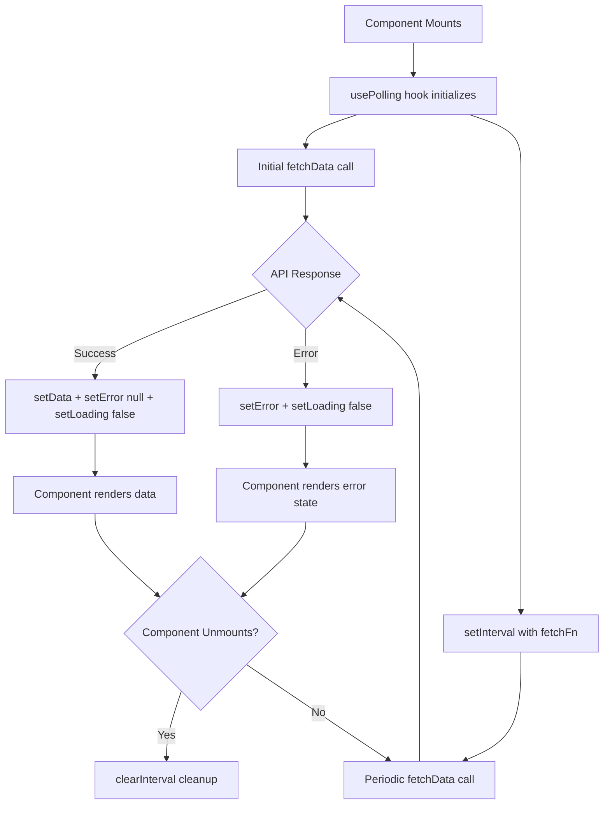
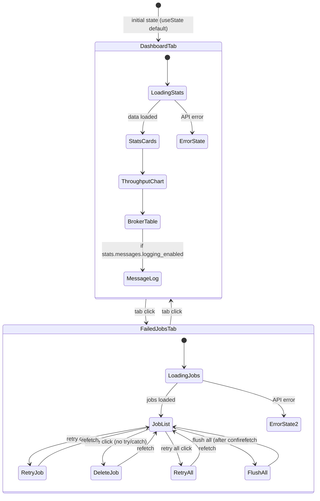
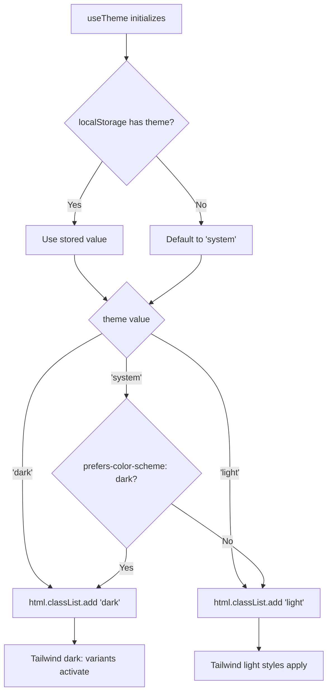
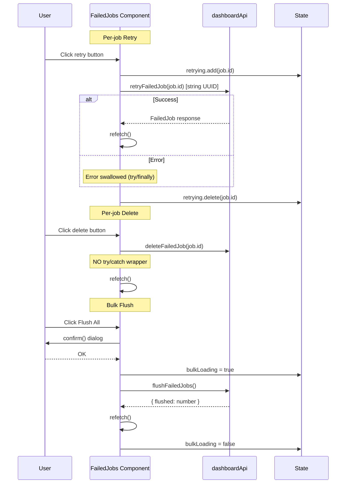
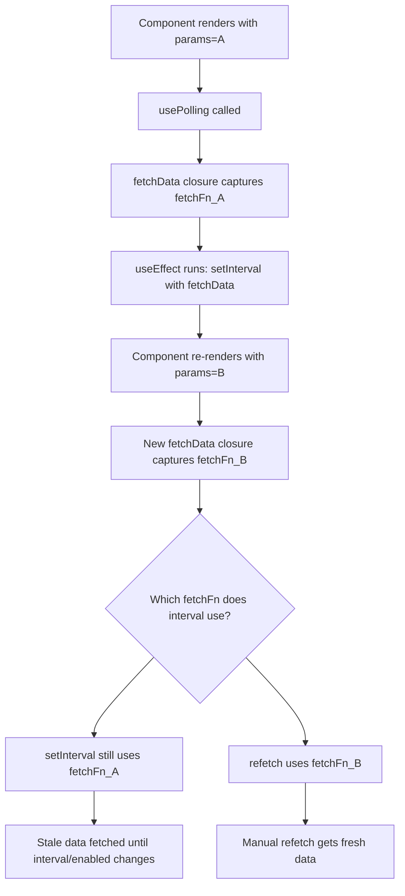

# Dashboard Frontend (React SPA)

## Overview

The MQTT Broadcast Dashboard is a React 19 Single Page Application that provides real-time monitoring of MQTT broker connections, message throughput, and failed jobs. It is served via a Blade template (`resources/views/dashboard.blade.php`), built with Vite and `laravel-vite-plugin`, and styled with Tailwind CSS. The frontend communicates exclusively with the REST API documented in [dashboard-monitoring.md](dashboard-monitoring.md).

The SPA uses a polling-based architecture (no WebSockets) to refresh data at a configurable interval, keeping the implementation simple and compatible with any hosting environment.

## Architecture

### Technology Stack

| Technology | Version | Purpose |
|---|---|---|
| React | 19.x | UI framework |
| TypeScript | 5.x | Type safety |
| Vite | 8.x | Build tooling |
| laravel-vite-plugin | 3.x | Laravel/Vite integration |
| Tailwind CSS | 3.x | Utility-first styling |
| Recharts | 2.x | Throughput chart visualization |
| Axios | 1.x | HTTP client for API calls |
| date-fns | 4.x | Date formatting |
| Lucide React | 0.468+ | Icon library |
| class-variance-authority | 0.7+ | Component variant styling (CVA) |

### Design Decisions

- **Polling over WebSockets**: simpler deployment, no persistent connection required, interval driven by `window.mqttBroadcast.refreshInterval` (default 5000ms).
- **No client-side router**: tab-based navigation managed via `useState<TabType>` in `Dashboard` component. Two tabs: `dashboard` and `failed-jobs`. The `TabType` union type is `'dashboard' | 'failed-jobs'`.
- **shadcn/ui pattern**: UI primitives (`Card`, `Badge`, `Button`) follow the shadcn/ui approach using `class-variance-authority` + `tailwind-merge` for variant-based styling, without importing the full shadcn library.
- **Dark/light theme**: CSS class-based (`html.dark` / `html.light`) with `localStorage` persistence under key `mqtt-dashboard-theme`. System preference detection via `prefers-color-scheme` media query.
- **Dead code: DocsPage**: `DocsPage.tsx` exists as a component file but is **not imported or rendered** by `Dashboard.tsx`. The `TabType` union does not include `'docs'`, and `Navigation.tsx` only renders two tab buttons (Dashboard, Failed Jobs). The component contains command reference, troubleshooting, and configuration checklist content that is currently unreachable.

## How It Works

### 1. Bootstrap

The Blade template `resources/views/dashboard.blade.php` injects runtime configuration into `window.mqttBroadcast`:

```javascript
window.mqttBroadcast = {
    basePath: '{{ config("mqtt-broadcast.path", "mqtt-broadcast") }}',
    apiUrl: '/{{ config("mqtt-broadcast.path", "mqtt-broadcast") }}/api',
    loggingEnabled: {{ config("mqtt-broadcast.logs.enable", false) ? "true" : "false" }},
    refreshInterval: 5000,
};
```

**TypeScript vs Blade mismatch**: The Blade template injects four properties (`basePath`, `apiUrl`, `loggingEnabled`, `refreshInterval`), but the TypeScript `Window` interface declaration in `lib/api.ts` only declares three: `apiUrl`, `loggingEnabled`, `refreshInterval`. The `basePath` property is injected but never consumed by any TypeScript code — `apiUrl` already incorporates the path prefix. Accessing `window.mqttBroadcast.basePath` in TypeScript would not produce a type error at runtime, but would not type-check without a cast.

The Blade template also includes:
- `<meta name="csrf-token">` — injected but not consumed by the Axios client (no CSRF header configuration in `lib/api.ts`). The API routes likely use the stateless middleware stack.
- `<noscript>` fallback — red-background message when JavaScript is disabled.
- `@vite` directive — references both `main.tsx` and `mqtt-dashboard.css` with `vendor/mqtt-broadcast` as the build directory.

The React app mounts into `<div id="mqtt-dashboard-root">` via `ReactDOM.createRoot` in `main.tsx`, wrapped in `React.StrictMode`. The `main.tsx` entry point also imports CSS via a relative path traversal: `import '../../../../resources/css/mqtt-dashboard.css'` — this path works during Vite dev but is resolved by the Vite build for production.

### 2. Data Fetching (Polling Layer)

All data fetching follows the same pattern: `usePolling<T>` hook wraps any async fetch function with `setInterval`-based polling.

```
usePolling(fetchFn, interval, enabled)
    |-- initial fetch on mount
    |-- setInterval(fetchFn, interval)
    |-- returns { data, error, loading, refetch }
    |-- cleanup: clearInterval on unmount
```

#### usePolling Internals

The hook uses `useRef` for the interval handle and `useState` for `data`, `error`, and `loading`. Key behavioral details:

- **Initial state**: `data = null`, `error = null`, `loading = true`.
- **Disabled mode**: when `enabled = false`, sets `loading = false` immediately and skips fetching entirely — no initial fetch, no interval.
- **Error preservation**: on a failed poll, `error` is set but `data` is NOT cleared. The component continues to display the last successful data.
- **Success clearing**: on a successful poll, `error` is cleared to `null`.
- **useEffect dependency array**: `[interval, enabled]` — notably, `fetchFn` is **not** in the dependency array. This means changing `fetchFn` (e.g., because params changed) will not restart the polling interval. The stale closure captured by `setInterval` will continue calling the original `fetchFn`. However, the `refetch` function returned by the hook IS the current `fetchData` closure defined at the component level, so calling `refetch()` manually will use the latest `fetchFn`.
- **No request deduplication**: if a fetch is still in flight when the interval fires again, a second concurrent request starts. There is no `AbortController` or in-flight tracking.

Domain-specific hooks in `useDashboard.ts` wrap `dashboardApi` methods:

| Hook | API Call | Notes |
|---|---|---|
| `useStats()` | `GET /stats` | Always active |
| `useBrokers()` | `GET /brokers` | Always active |
| `useMessages(params?)` | `GET /messages` | Disabled when `window.mqttBroadcast.loggingEnabled = false` |
| `useThroughput(period)` | `GET /metrics/throughput` | Period: `hour`, `day`, `week` |
| `useFailedJobs(params?)` | `GET /failed-jobs` | Always active |

All domain hooks read `window.mqttBroadcast.refreshInterval` for their polling interval. None of the hooks pass the `enabled` parameter except `useMessages`, which gates on `window.mqttBroadcast.loggingEnabled`.

### 3. API Client

`dashboardApi` in `lib/api.ts` creates an Axios instance with `baseURL` from `window.mqttBroadcast.apiUrl`. The instance sets both `Content-Type: application/json` and `Accept: application/json` headers. All responses follow the Laravel `{ data: T }` envelope pattern — each method unwraps `response.data.data` before returning.

**ID type distinction**: broker and message operations use `id: number` (auto-increment primary keys), while failed job operations use `id: string` (UUID via `HasExternalId` trait). This reflects the backend's dual identity strategy.

| Method | HTTP | Endpoint | ID Type | Return Type |
|---|---|---|---|---|
| `getStats()` | GET | `/stats` | — | `DashboardStats` |
| `getBrokers()` | GET | `/brokers` | — | `Broker[]` |
| `getBroker(id)` | GET | `/brokers/{id}` | `number` | `Broker` |
| `getMessages(params?)` | GET | `/messages` | — | `MessageLog[]` |
| `getMessage(id)` | GET | `/messages/{id}` | `number` | `MessageLog` |
| `getTopics()` | GET | `/topics` | — | `Topic[]` |
| `getThroughput(period)` | GET | `/metrics/throughput` | — | `ThroughputData[]` |
| `getMetricsSummary()` | GET | `/metrics/summary` | — | `MetricsSummary \| null` |
| `getFailedJobs(params?)` | GET | `/failed-jobs` | — | `FailedJob[]` |
| `retryFailedJob(id)` | POST | `/failed-jobs/{id}/retry` | `string` | `FailedJob` |
| `retryAllFailedJobs()` | POST | `/failed-jobs/retry-all` | — | `{ retried: number }` |
| `deleteFailedJob(id)` | DELETE | `/failed-jobs/{id}` | `string` | `void` |
| `flushFailedJobs()` | DELETE | `/failed-jobs` | — | `{ flushed: number }` |

**Unused methods**: `getBroker()`, `getMessage()`, `getTopics()`, and `getMetricsSummary()` are defined in the API client but not called by any component or hook. They exist for potential future detail views or for consumers extending the dashboard.

### 4. Component Tree & Rendering

```
Dashboard (root)
 +-- header: status Badge (running/stopped with animated ping dot), ThemeToggle
 +-- Navigation (tab bar: Dashboard | Failed Jobs)
 +-- main content (conditional on activeTab):
      |-- "failed-jobs":
      |    +-- FailedJobs (list with retry/delete per-job, bulk retry/flush)
      |-- default (dashboard view):
      |    +-- loading state: centered Loader2 spinner (400px height)
      |    +-- error state: AlertCircle icon + "Failed to load dashboard" message
      |    +-- data loaded:
      |         +-- StatsCard x5 (messages/min, brokers, memory, queue, failed)
      |         +-- ThroughputChart (Recharts LineChart, default period: "hour")
      |         +-- BrokerTable (tabular broker list with empty state)
      |         +-- MessageLog (only if stats.messages.logging_enabled is true)
 +-- footer: auto-refresh interval display (reads window.mqttBroadcast.refreshInterval)
```

#### Dual Logging Check

`MessageLog` visibility is gated by **two separate checks** at different levels:

1. **Dashboard.tsx** reads `stats.messages.logging_enabled` from the API response (server-side config state) to decide whether to render `<MessageLog />`.
2. **useMessages hook** reads `window.mqttBroadcast.loggingEnabled` from the Blade-injected config to set the `enabled` flag on `usePolling`.
3. **MessageLog component itself** also reads `window.mqttBroadcast.loggingEnabled` as a guard before rendering content.

These two sources (API response vs window config) should always agree since both read from `config('mqtt-broadcast.logs.enable')`, but they are technically independent checks. If they diverged (e.g., config changed between page load and first API response), the Dashboard-level check (API response) takes precedence for rendering, while the hook-level check (window config) controls whether data is fetched.

#### StatsCard Variant Mapping

The `StatsCard` component uses its own variant system (`default`, `success`, `warning`, `danger`) which maps to Tailwind color classes directly — this is **separate** from the Badge CVA variants. The Dashboard wires variant selection based on thresholds:

| Card | Variant Logic |
|---|---|
| Messages/Minute | Always `success` |
| Active Brokers | `success` if any active, `warning` if zero active |
| Memory Usage | `danger` if >100%, `warning` if >80%, else `default` |
| Queue Pending | `warning` if >100 pending, else `default` |
| Failed Jobs | `danger` if any failures, else `default` |

## Key Components

| File | Component | Responsibility |
|---|---|---|
| `main.tsx` | Entry point | `ReactDOM.createRoot`, `StrictMode` wrapper, CSS import via relative path traversal |
| `components/Dashboard.tsx` | `Dashboard` | Root component, two-tab state (`dashboard`/`failed-jobs`), stats loading, layout orchestration, status badge with animated ping indicator |
| `components/Navigation.tsx` | `Navigation`, `TabButton` | Two-tab bar with destructive-styled badge count for failed jobs |
| `components/StatsCard.tsx` | `StatsCard` | Metric card with own variant system (`default`/`success`/`warning`/`danger`), dark mode aware colors, optional `trend` prop (unused by Dashboard) |
| `components/ThroughputChart.tsx` | `ThroughputChart` | Recharts `LineChart` with `ResponsiveContainer` (300px height), HSL CSS variable theming for axes/tooltip/line |
| `components/BrokerTable.tsx` | `BrokerTable` | Table with status Badge mapping, empty state with `php artisan mqtt-broadcast` hint, `toLocaleString()` for message counts |
| `components/MessageLog.tsx` | `MessageLog` | Scrollable list (max-height 400px), `formatDistanceToNow` relative timestamps, dual logging-disabled check, limit=20 default |
| `components/FailedJobs.tsx` | `FailedJobs` | `Set<string>` per-job retry tracking (UUID-based), bulk retry/flush with shared `bulkLoading` state, `confirm()` dialog for flush, limit=50 default |
| `components/DocsPage.tsx` | `DocsPage` | **Dead code** — not imported by any component. Contains `CommandBlock`, `TroubleshootItem`, `ChecklistItem`, `ResourceCard` helper sub-components |
| `components/ThemeToggle.tsx` | `ThemeToggle` | Binary dark/light toggle only (no system option in UI despite `useTheme` supporting it), CSS transition animations on Sun/Moon icons |
| `components/ui/card.tsx` | `Card`, `CardHeader`, `CardTitle`, `CardContent`, `CardFooter`, `CardDescription` | shadcn/ui-style primitives using `React.forwardRef`, all accept `className` prop for composition |
| `components/ui/badge.tsx` | `Badge` | CVA variants: `default`, `secondary`, `destructive`, `outline`, `success`, `warning` |
| `components/ui/button.tsx` | `Button` | CVA variants (`default`, `destructive`, `outline`, `secondary`, `ghost`, `link`) × sizes (`default`, `sm`, `lg`, `icon`), `asChild` prop declared but unused (no Slot implementation) |
| `hooks/usePolling.ts` | `usePolling<T>` | Generic polling hook with stale closure caveat (see Data Fetching section) |
| `hooks/useDashboard.ts` | `useStats`, `useBrokers`, `useMessages`, `useThroughput`, `useFailedJobs` | Domain hooks wrapping `dashboardApi` with polling, all use `window.mqttBroadcast.refreshInterval` |
| `hooks/useTheme.ts` | `useTheme` | Theme state (`dark`/`light`/`system`), `localStorage` persistence, `classList` toggling (removes both then adds one), system preference detection via `matchMedia` |
| `lib/api.ts` | `dashboardApi`, `Window` interface | Axios client with `Content-Type`+`Accept` JSON headers, `Window` global type augmentation (missing `basePath`), dual ID typing (`number`/`string`) |
| `lib/utils.ts` | `cn()` | `clsx` + `tailwind-merge` utility |
| `types/index.ts` | Type definitions | `DashboardStats`, `Broker`, `MessageLog`, `Topic`, `ThroughputData`, `FailedJob`, `MetricsSummary` |

### Component Behavioral Details

#### BrokerTable Status Mapping

The component maps `connection_status` values to Badge variants and labels via static lookup objects:

| `connection_status` | Badge Variant | Display Label |
|---|---|---|
| `connected` | `success` | Connected |
| `idle` | `warning` | Idle |
| `reconnecting` | `warning` | Reconnecting |
| `disconnected` | `destructive` | Disconnected |

The component renders four distinct states: loading spinner, error message, empty state (with artisan command hint), and the data table.

#### FailedJobs State Management

The `FailedJobs` component maintains two independent loading states:

1. **`retrying: Set<string>`** — tracks per-job retry operations by UUID. When a retry is in progress, only that job's retry button shows a spinner. The Set is updated immutably (new Set on every add/remove).
2. **`bulkLoading: boolean`** — shared flag for both "Retry All" and "Flush All" operations. Both bulk buttons are disabled when either is in progress.

Error handling asymmetry:
- `handleRetry()` wraps the API call in try/finally — the `retrying` Set is always cleaned up.
- `handleDelete()` has **no try/catch** — if the API call fails, `refetch()` is never called and the UI becomes stale until the next polling cycle.
- Neither `handleRetryAll()` nor `handleFlush()` surface errors to the user.

#### ThemeToggle vs useTheme

`useTheme` supports three modes (`dark`, `light`, `system`), but `ThemeToggle` only toggles between `dark` and `light`. If `localStorage` contains `system` (e.g., set manually or from a previous version), the first toggle click will switch to `light`, and subsequent clicks alternate between `dark` and `light`. There is no UI to return to `system` mode.

The `useTheme` effect explicitly removes both `light` and `dark` classes before adding the resolved one, preventing CSS class accumulation.

#### ThroughputChart Theming

The chart uses HSL CSS custom properties for theme-aware styling:
- Axis stroke: `hsl(var(--muted-foreground))`
- Grid: `className="stroke-muted"` (Tailwind class)
- Tooltip background: `hsl(var(--card))`, border: `hsl(var(--border))`
- Line stroke: `hsl(var(--primary))`

This approach ensures the chart respects the dark/light theme toggle without separate color logic.

## Type System

All API response types are defined in `types/index.ts`. The `Window` global interface is augmented in `lib/api.ts`.

### Window Interface

```typescript
interface Window {
  mqttBroadcast: {
    apiUrl: string;
    loggingEnabled: boolean;
    refreshInterval: number;
  };
}
```

Note: `basePath` is injected by the Blade template but is NOT declared in the TypeScript interface.

### API Response Types

- **`DashboardStats`** — aggregate system status:
  - `status`: `'running' | 'stopped'` — used for header badge variant selection
  - `brokers`: `{ total, active, stale }` — all numbers
  - `messages`: `{ per_minute, last_hour, last_24h, logging_enabled }` — includes `logging_enabled: boolean` which controls MessageLog rendering at the Dashboard level
  - `queue`: `{ pending, name }` — pending count and queue name
  - `memory`: `{ current_mb, threshold_mb, usage_percent }` — all numbers
  - `failed_jobs`: `{ total, pending_retry }` — used for Navigation badge and StatsCard
  - `uptime_seconds`: number — not displayed in any component currently

- **`Broker`** — individual broker with dual status fields:
  - `status`: `'active' | 'stale'` — database-level status
  - `connection_status`: `'connected' | 'idle' | 'reconnecting' | 'disconnected'` — computed by the backend from heartbeat age thresholds
  - `working`: boolean — present in the type but not displayed in any component
  - `messages_24h`: number — displayed with `toLocaleString()` formatting
  - `uptime_human`: string — pre-formatted by the backend (e.g., "2h 15m")
  - `last_message_at`: `string | null` — nullable, present in the type but not displayed

- **`MessageLog`** — logged message:
  - `message_preview`: string — truncated message content (displayed in `<pre>` block)
  - `created_at`: string — ISO timestamp, converted to relative time via `formatDistanceToNow`
  - `created_at_human`: string — pre-formatted by backend, present but unused (the frontend formats its own)

- **`Topic`** — `{ topic: string, count: number }` — defined but unused (no component calls `getTopics()`)

- **`ThroughputData`** — `{ time: string, timestamp: string, count: number }` — `time` is the display label used as the XAxis dataKey, `count` is the Line dataKey

- **`FailedJob`** — DLQ entry:
  - `id`: `string` — UUID (not number), used for per-job retry tracking in the `retrying` Set
  - `message_preview`: `string | null` — nullable, conditionally rendered
  - `retry_count`: number — displayed with singular/plural ("1 retry" vs "2 retries")
  - `retried_at`: `string | null` — present in type but not displayed

- **`MetricsSummary`** — defined but unused (no component calls `getMetricsSummary()`)

## Configuration

The frontend reads all configuration from `window.mqttBroadcast`, injected by the Blade template at render time:

| Property | Blade Source | Default | TS Declared | Consumed By |
|---|---|---|---|---|
| `basePath` | `config('mqtt-broadcast.path')` | `mqtt-broadcast` | **No** | Nothing — dead property |
| `apiUrl` | Derived from `basePath` | `/{basePath}/api` | Yes | `lib/api.ts` Axios `baseURL` |
| `loggingEnabled` | `config('mqtt-broadcast.logs.enable')` | `false` | Yes | `useMessages` (enabled flag), `MessageLog` (render guard) |
| `refreshInterval` | Hardcoded | `5000` | Yes | All `useDashboard` hooks, footer display text |

### Client-Side Storage

| Key | Storage | Values | Purpose |
|---|---|---|---|
| `mqtt-dashboard-theme` | `localStorage` | `dark`, `light`, `system` | Theme persistence across sessions |

### Hardcoded Defaults

| Constant | Location | Value | Purpose |
|---|---|---|---|
| Message log limit | `MessageLog.tsx` | `20` | Max messages fetched per poll |
| Failed jobs limit | `FailedJobs.tsx` | `50` | Max failed jobs fetched per poll |
| Scrollable height (messages) | `MessageLog.tsx` | `max-h-[400px]` | Message list scroll container |
| Scrollable height (failed jobs) | `FailedJobs.tsx` | `max-h-[500px]` | Failed jobs scroll container |
| Chart height | `ThroughputChart.tsx` | `300px` | `ResponsiveContainer` height |
| Throughput period | `Dashboard.tsx` | `"hour"` | Default period passed to `ThroughputChart` |

## Error Handling

| Scenario | Behavior | Component |
|---|---|---|
| API unreachable (stats) | Centered `AlertCircle` icon + "Failed to load dashboard" + hint text, 400px height | `Dashboard` |
| API unreachable (other) | Each component renders its own "Failed to load X" message independently | `BrokerTable`, `MessageLog`, `ThroughputChart`, `FailedJobs` |
| Initial load | `loading = true` renders centered `Loader2` spinner, each component independently | All data components |
| Polling failure | Previous `data` preserved (not cleared), `error` state set | `usePolling` |
| Logging disabled (window) | "Message logging is disabled" + config path hint | `MessageLog` |
| Logging disabled (API) | `<MessageLog />` not rendered at all | `Dashboard` |
| No brokers found | `WifiOff` icon + "No brokers found" + `php artisan mqtt-broadcast` hint | `BrokerTable` |
| No messages found | "No messages yet" placeholder | `MessageLog` |
| No failed jobs | `AlertTriangle` icon + "No failed jobs" placeholder | `FailedJobs` |
| Failed job retry error | `retrying` Set cleaned up via `finally`, no error surfaced to user | `FailedJobs` |
| Failed job delete error | **No try/catch** — `refetch()` never called, UI stale until next poll | `FailedJobs` |
| Bulk retry/flush error | `bulkLoading` reset via `finally`, no error surfaced to user | `FailedJobs` |
| Flush confirmation | Browser `confirm()` dialog, operation skipped if denied | `FailedJobs` |
| Root element missing | `throw new Error('Root element not found')` — crashes before React mount | `main.tsx` |
| Concurrent poll requests | No deduplication — multiple in-flight requests possible if API is slow | `usePolling` |

## Mermaid Diagrams

### Data Flow: Polling Lifecycle



### Component Navigation Flow



### Theme Resolution



### FailedJobs Action Flow



### usePolling Stale Closure



## Build & Development

### Development

```bash
npm run dev    # Vite dev server with HMR
```

Vite serves assets via `laravel-vite-plugin` which creates a `public/hot` file to signal the dev server URL to the Blade `@vite` directive.

### Production Build

```bash
npm run build  # Output to public/vendor/mqtt-broadcast/
```

The build produces a `manifest.json` in `public/vendor/mqtt-broadcast/` that maps entry points to hashed filenames. The `@vite` Blade directive reads this manifest to inject `<script>` and `<link>` tags.

### Source Layout

```
resources/js/mqtt-dashboard/src/
  main.tsx                     Entry point
  components/
    Dashboard.tsx              Root component
    Navigation.tsx             Tab navigation
    StatsCard.tsx              Metric card
    ThroughputChart.tsx        Recharts line chart
    BrokerTable.tsx            Broker connection table
    MessageLog.tsx             Recent message feed
    FailedJobs.tsx             Failed job management
    DocsPage.tsx               In-app documentation (DEAD CODE — not imported)
    ThemeToggle.tsx            Dark/light toggle
    ui/
      card.tsx                 Card primitives
      badge.tsx                Badge variants
      button.tsx               Button variants
  hooks/
    usePolling.ts              Generic polling abstraction
    useDashboard.ts            Domain-specific data hooks
    useTheme.ts                Theme management
  lib/
    api.ts                     Axios API client
    utils.ts                   cn() class merge utility
  types/
    index.ts                   TypeScript interfaces
```
