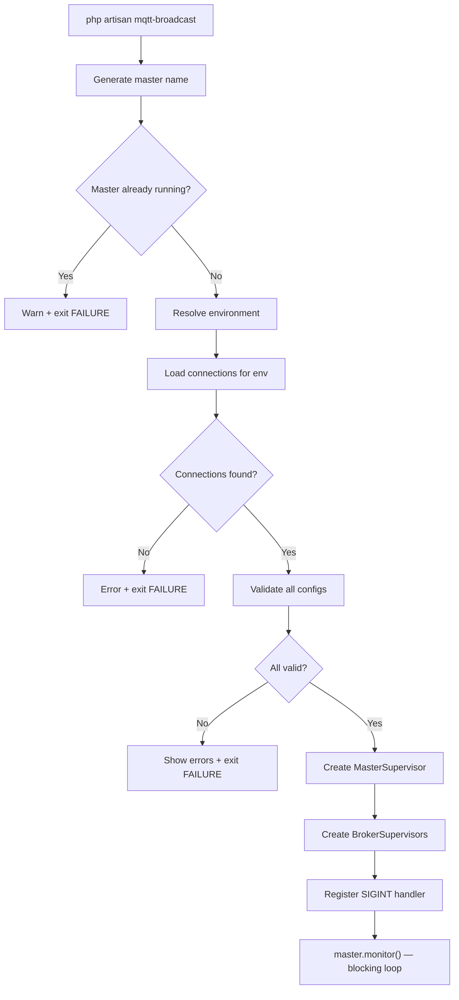
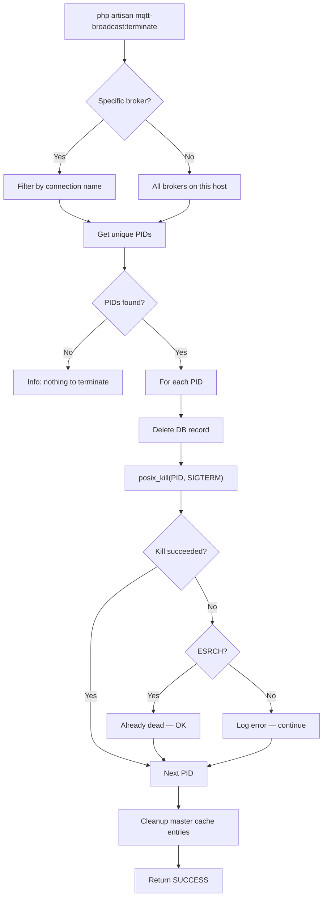
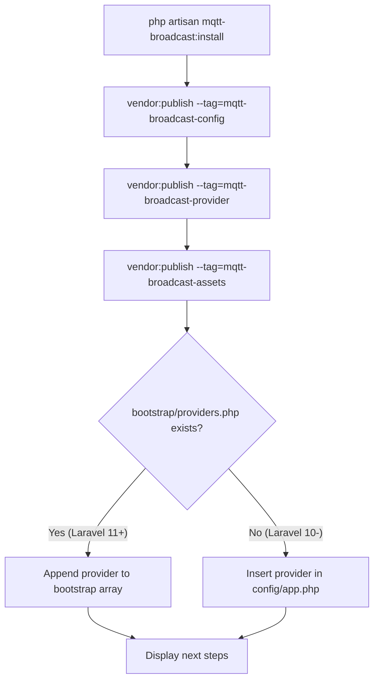

# Artisan Commands

## Overview

MQTT Broadcast provides four Artisan commands that manage the full lifecycle of the supervisor system: installation, startup, termination, and connectivity testing. These commands follow Laravel Horizon's CLI patterns — a blocking foreground process for the supervisor, signal-based termination, and a one-time installer that publishes config, service provider, and frontend assets.

All commands are registered conditionally via `MqttBroadcastServiceProvider::registerCommands()`, which guards registration behind `$this->app->runningInConsole()`.

## Architecture

The commands are intentionally thin — they delegate all heavy lifting to the supervisor and repository layers:

- **InstallCommand** — orchestrates `vendor:publish` for three tags and registers the service provider in the application bootstrap file.
- **MqttBroadcastCommand** — the main entry point. Creates `MasterSupervisor` + N `BrokerSupervisor` instances and enters a blocking monitor loop.
- **MqttBroadcastTerminateCommand** — sends `SIGTERM` to running supervisor processes and cleans up database/cache state.
- **MqttBroadcastTestCommand** — one-shot synchronous publish to verify broker connectivity.

Design decisions:
- **Fail-fast validation**: `MqttBroadcastCommand` validates all connection configs by calling `MqttClientFactory::create()` before creating any supervisors. Invalid configs abort startup entirely.
- **Duplicate prevention**: checks cache for an existing master supervisor with the same hostname-based name. Only one master per machine.
- **Best-effort terminate**: `MqttBroadcastTerminateCommand` always returns `SUCCESS` — cleanup is best-effort. Stale processes and cache entries are cleaned even if `posix_kill` fails.
- **Horizon-style environment resolution**: environment is resolved via CLI option > `mqtt-broadcast.env` config > `APP_ENV`, matching Horizon's precedence.

## How It Works

### mqtt-broadcast:install

Publishes all package resources and registers the service provider:

1. Calls `vendor:publish --force` for three tags sequentially:
   - `mqtt-broadcast-config` → copies `config/mqtt-broadcast.php` to the application config directory.
   - `mqtt-broadcast-provider` → copies `MqttBroadcastServiceProvider.stub` to `app/Providers/MqttBroadcastServiceProvider.php`.
   - `mqtt-broadcast-assets` → copies compiled React dashboard assets to `public/vendor/mqtt-broadcast/`.
2. Calls `registerMqttBroadcastServiceProvider()`:
   - Reads `config/app.php` to check if the provider is already registered.
   - If `bootstrap/providers.php` exists (Laravel 11+): appends the provider class to the return array.
   - Otherwise (Laravel 10 and below): inserts the provider after `RouteServiceProvider` in the `providers` array of `config/app.php`.
3. Displays next-step instructions (configure broker, update gate, run migrations, start supervisor).

### mqtt-broadcast

Starts the supervisor system as a blocking foreground process:

1. Generates a unique master name: `ProcessIdentifier::generateName('master')` → format `master-{hostname}-{4-char-token}`. The token is static per process (memoized via `static $token`).
2. Checks `MasterSupervisorRepository::find($masterName)` — if a master exists in cache, aborts with a warning.
3. Resolves environment: `--environment` option > `config('mqtt-broadcast.env')` > `config('app.env')`.
4. Reads connections from `config('mqtt-broadcast.environments.{env}')`. Empty array → error + exit.
5. **Validation pass**: iterates all connections, calls `MqttClientFactory::create()` on each. Collects all errors, displays them together, then aborts if any failed.
6. Creates `MasterSupervisor` with the generated name and repository.
7. Sets an output callback that pipes supervisor log lines to the Artisan command output.
8. For each connection: generates a broker name via `BrokerRepository::generateName()`, creates a `BrokerSupervisor`, adds it to the master.
9. Displays startup info: broker count, environment name, broker list.
10. Registers `SIGINT` handler via `pcntl_signal()` with `pcntl_async_signals(true)` — calls `$master->terminate()` on Ctrl+C.
11. Calls `MasterSupervisor::monitor()` — enters the infinite loop (1-second tick). This call never returns under normal operation.

### mqtt-broadcast:terminate

Gracefully terminates running supervisor processes:

1. Reads optional `{broker}` argument to target a specific connection.
2. Gets hostname via `ProcessIdentifier::hostname()`.
3. Loads all brokers from `BrokerRepository::all()`, filters to those whose `name` starts with the current hostname.
4. If a specific broker was requested, further filters by `connection` name.
5. Extracts unique PIDs from the filtered broker list.
6. For each PID:
   - Calls `BrokerRepository::deleteByPid($processId)` to clean the database record first (even if kill fails).
   - Calls `posix_kill($processId, SIGTERM)` to send the terminate signal.
   - On failure: checks `posix_get_last_error()`. ESRCH (errno 3, "No such process") is treated as success (process already dead). Other errors are reported but do not abort the command.
7. Safety net cleanup: loads all master supervisor names from cache, filters to current hostname, deletes matching cache entries via `MasterSupervisorRepository::forget()`.
8. Always returns `Command::SUCCESS`.

### mqtt-broadcast:test

Sends a single synchronous test message:

1. Takes three required arguments: `{broker}`, `{topic}`, `{message}`.
2. Calls `MqttBroadcast::publishSync($topic, $message, $broker)` — uses the facade directly, bypassing the queue.
3. Wraps the call in `$this->components->task()` for visual feedback.
4. Returns `Command::SUCCESS`.

## Key Components

| File | Class / Method | Responsibility |
|------|---------------|----------------|
| `src/Commands/InstallCommand.php` | `InstallCommand::handle()` | Publishes config, provider stub, and assets |
| `src/Commands/InstallCommand.php` | `InstallCommand::registerMqttBroadcastServiceProvider()` | Auto-registers provider in bootstrap or config |
| `src/Commands/InstallCommand.php` | `InstallCommand::registerInBootstrapProviders()` | Laravel 11+ provider registration |
| `src/Commands/InstallCommand.php` | `InstallCommand::registerInConfigApp()` | Laravel 10 and below provider registration |
| `src/Commands/MqttBroadcastCommand.php` | `MqttBroadcastCommand::handle()` | Creates supervisors, enters monitor loop |
| `src/Commands/MqttBroadcastCommand.php` | `MqttBroadcastCommand::getEnvironmentConnections()` | Reads environment-specific broker list from config |
| `src/Commands/MqttBroadcastTerminateCommand.php` | `MqttBroadcastTerminateCommand::handle()` | Sends SIGTERM, cleans DB and cache records |
| `src/Commands/MqttBroadcastTestCommand.php` | `MqttBroadcastTestCommand::handle()` | Synchronous publish via facade |
| `src/Support/ProcessIdentifier.php` | `ProcessIdentifier::generateName()` | Generates `{prefix}-{hostname}-{token}` names |
| `src/Support/ProcessIdentifier.php` | `ProcessIdentifier::hostname()` | Slugified machine hostname |
| `src/MqttBroadcastServiceProvider.php` | `registerCommands()` | Conditional command registration |

## Configuration

| Config Key / Option | Default | Description |
|---|---|---|
| `--environment` (CLI option) | — | Override environment for broker resolution |
| `mqtt-broadcast.env` | `null` | Config-level environment override |
| `mqtt-broadcast.environments.{env}` | `['default']` | Array of connection names per environment |
| `mqtt-broadcast.connections.{name}` | — | Broker connection settings (host, port, auth, TLS) |
| `mqtt-broadcast.master_supervisor.cache_driver` | `redis` | Cache driver for master supervisor state |
| `mqtt-broadcast.master_supervisor.cache_ttl` | `3600` | TTL for master supervisor cache entries |

Published assets (via `mqtt-broadcast:install`):

| Tag | Source | Destination |
|---|---|---|
| `mqtt-broadcast-config` | `config/mqtt-broadcast.php` | `config_path('mqtt-broadcast.php')` |
| `mqtt-broadcast-provider` | `stubs/MqttBroadcastServiceProvider.stub` | `app_path('Providers/MqttBroadcastServiceProvider.php')` |
| `mqtt-broadcast-assets` | `public/vendor/mqtt-broadcast/` | `public_path('vendor/mqtt-broadcast/')` |

## Error Handling

| Command | Error Scenario | Behavior |
|---|---|---|
| `mqtt-broadcast` | Master already running | Warns and exits with `FAILURE` |
| `mqtt-broadcast` | No connections for environment | Error message with config hint, exits with `FAILURE` |
| `mqtt-broadcast` | Connection config validation fails | Collects all errors, displays them, exits with `FAILURE` |
| `mqtt-broadcast:terminate` | No processes found for broker | Info message, returns `SUCCESS` |
| `mqtt-broadcast:terminate` | `posix_kill` fails with ESRCH | Treated as success (process already dead) |
| `mqtt-broadcast:terminate` | `posix_kill` fails with other error | Error logged, continues to next PID |
| `mqtt-broadcast:test` | Broker unreachable or invalid | Exception propagates from `publishSync()`, task shows failure |
| `mqtt-broadcast:install` | Provider already registered | Silently skips registration |

## Mermaid Diagrams

### Supervisor Startup Flow

### Terminate Flow

### Install Flow

