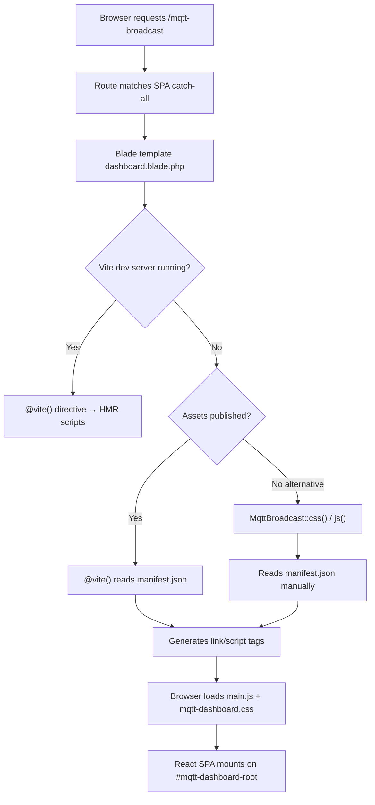
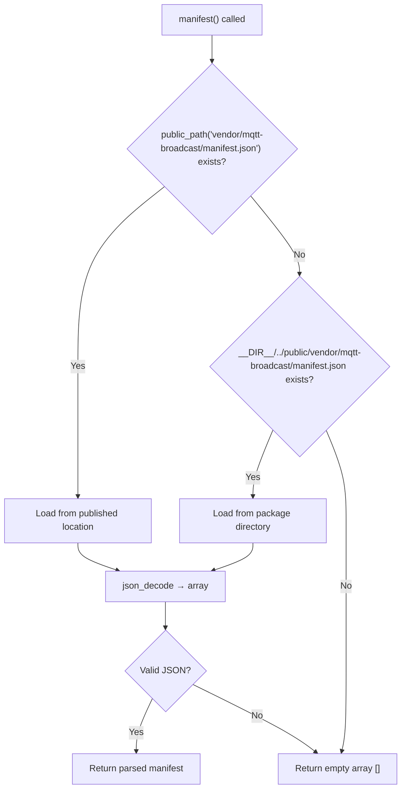

# Dashboard Asset Pipeline

## Overview

The MQTT Broadcast dashboard serves a React 19 SPA that needs CSS and JavaScript assets delivered to the browser. The asset pipeline handles building these assets with Vite, publishing them to the host application's `public/` directory, and injecting them into the Blade template. The package provides two asset-loading strategies: the `@vite()` directive (used in development) and the `MqttBroadcast::css()`/`MqttBroadcast::js()` static helpers (for production without Vite dev server).

## Architecture

### Build Toolchain

The asset pipeline is built on three layers:

1. **Vite** — bundles TypeScript/React/CSS into production-ready files with deterministic names (`main.js`, `mqtt-dashboard.css`)
2. **laravel-vite-plugin** — integrates Vite with Laravel's asset serving, directing output to `vendor/mqtt-broadcast/` instead of the default `build/` directory
3. **Manifest-based resolution** — a `manifest.json` file maps source entry points to built filenames, enabling the `css()`/`js()` helpers to locate assets without hardcoding paths

### Vite Configuration

```typescript
// vite.config.ts
export default defineConfig({
  plugins: [
    laravel({
      input: [
        'resources/js/mqtt-dashboard/src/main.tsx',
        'resources/css/mqtt-dashboard.css',
      ],
      refresh: true,
      buildDirectory: 'vendor/mqtt-broadcast',
    }),
    react(),
  ],
  build: {
    rollupOptions: {
      output: {
        entryFileNames: '[name].js',
        chunkFileNames: '[name].js',
        assetFileNames: '[name].[ext]',
      },
    },
  },
  resolve: {
    alias: {
      '@': path.resolve(__dirname, './resources/js/mqtt-dashboard/src'),
    },
  },
});
```

Key decisions:
- **`buildDirectory: 'vendor/mqtt-broadcast'`** — isolates package assets from the host application's own Vite build (`build/`)
- **Deterministic filenames** (`[name].js` instead of `[name]-[hash].js`) — simplifies manifest parsing and makes published assets predictable. Cache busting relies on the publish step rather than content hashing.
- **`@` path alias** — maps to `resources/js/mqtt-dashboard/src/` for clean imports within the SPA

### Entry Points

| Entry Point | Output File | Purpose |
|---|---|---|
| `resources/js/mqtt-dashboard/src/main.tsx` | `main.js` | React SPA bootstrap |
| `resources/css/mqtt-dashboard.css` | `mqtt-dashboard.css` | Tailwind CSS styles |

### Manifest Structure

After `npm run build`, Vite generates `public/vendor/mqtt-broadcast/manifest.json`:

```json
{
  "resources/css/mqtt-dashboard.css": {
    "file": "mqtt-dashboard.css",
    "src": "resources/css/mqtt-dashboard.css",
    "isEntry": true
  },
  "resources/js/mqtt-dashboard/src/main.tsx": {
    "file": "main.js",
    "src": "resources/js/mqtt-dashboard/src/main.tsx",
    "isEntry": true,
    "css": ["mqtt-dashboard.css"]
  }
}
```

Each entry contains:
- `file` — the built output filename
- `src` — the original source path (manifest key)
- `isEntry` — whether this is a top-level entry point (only entry points are loaded)
- `css` — (optional) CSS files that this JS entry depends on

## How It Works

### Asset Loading Flow



### Strategy 1: `@vite()` Directive (Default)

The Blade template uses the `@vite()` directive as the primary asset-loading mechanism:

```blade
@vite([
    'resources/js/mqtt-dashboard/src/main.tsx',
    'resources/css/mqtt-dashboard.css'
], 'vendor/mqtt-broadcast')
```

The second argument (`'vendor/mqtt-broadcast'`) tells `laravel-vite-plugin` to look for the manifest in `public/vendor/mqtt-broadcast/manifest.json` instead of the default `public/build/manifest.json`.

- **In development**: connects to Vite dev server for HMR (Hot Module Replacement)
- **In production**: reads the manifest and generates `<link>` and `<script>` tags pointing to built files

### Strategy 2: `MqttBroadcast::css()` / `MqttBroadcast::js()` Helpers

These static methods on `enzolarosa\MqttBroadcast\MqttBroadcast` provide an alternative manifest-based asset loading that does not depend on the `@vite()` directive.

#### `MqttBroadcast::css()`

```php
public static function css(): string
```

1. Calls `static::manifest()` to load the manifest array
2. Filters entries where `isEntry` is `true`
3. Collects all CSS files from both the `file` key and the `css` array
4. Deduplicates and filters to `.css` extensions only
5. Returns `<link rel="stylesheet">` tags using Laravel's `asset()` helper

Example output:
```html
<link rel="stylesheet" href="https://example.com/vendor/mqtt-broadcast/mqtt-dashboard.css">
```

#### `MqttBroadcast::js()`

```php
public static function js(): string
```

1. Calls `static::manifest()` to load the manifest array
2. Filters entries where `isEntry` is `true`
3. Extracts the `file` key from each entry
4. Filters to `.js` extensions only
5. Returns `<script type="module">` tags using Laravel's `asset()` helper

Example output:
```html
<script type="module" src="https://example.com/vendor/mqtt-broadcast/main.js"></script>
```

#### `MqttBroadcast::manifest()` (Protected)

```php
protected static function manifest(): array
```

Loads and parses `manifest.json` with a two-step resolution strategy:

1. **Published location**: `public_path('vendor/mqtt-broadcast/manifest.json')` — used when assets have been published to the host application
2. **Package location**: `__DIR__.'/../public/vendor/mqtt-broadcast/manifest.json'` — fallback for development when running directly from the package directory
3. **Empty fallback**: returns `[]` if neither path exists (no assets available)

### Blade Template Integration

```blade
<!-- resources/views/dashboard.blade.php -->
<head>
    <script>
        window.mqttBroadcast = {
            basePath: '{{ config('mqtt-broadcast.path', 'mqtt-broadcast') }}',
            apiUrl: '/{{ config('mqtt-broadcast.path', 'mqtt-broadcast') }}/api',
            loggingEnabled: {{ config('mqtt-broadcast.logs.enable', false) ? 'true' : 'false' }},
            refreshInterval: 5000,
        };
    </script>
    @vite([
        'resources/js/mqtt-dashboard/src/main.tsx',
        'resources/css/mqtt-dashboard.css'
    ], 'vendor/mqtt-broadcast')
</head>
<body>
    <div id="mqtt-dashboard-root"></div>
</body>
```

The template injects runtime configuration via `window.mqttBroadcast` before loading the SPA assets.

## Key Components

| File | Class/Method | Responsibility |
|---|---|---|
| `src/MqttBroadcast.php` | `MqttBroadcast::css()` | Generates `<link>` tags from manifest |
| `src/MqttBroadcast.php` | `MqttBroadcast::js()` | Generates `<script type="module">` tags from manifest |
| `src/MqttBroadcast.php` | `MqttBroadcast::manifest()` | Loads and parses `manifest.json` with fallback resolution |
| `src/MqttBroadcastServiceProvider.php` | `offerPublishing()` | Registers publishable assets with `mqtt-broadcast-assets` tag |
| `resources/views/dashboard.blade.php` | Blade template | Bootstraps SPA with config injection and `@vite()` directive |
| `vite.config.ts` | Vite config | Defines entry points, build directory, and output naming |
| `public/vendor/mqtt-broadcast/manifest.json` | Manifest | Maps source entry points to built output files |

## Configuration

### Asset Publishing

Assets are published via the ServiceProvider with two tags:

```php
$this->publishes([
    __DIR__.'/../public/vendor/mqtt-broadcast' => public_path('vendor/mqtt-broadcast'),
], ['mqtt-broadcast-assets', 'laravel-assets']);
```

| Tag | Usage |
|---|---|
| `mqtt-broadcast-assets` | `php artisan vendor:publish --tag=mqtt-broadcast-assets` — publishes only dashboard assets |
| `laravel-assets` | `php artisan vendor:publish --tag=laravel-assets` — included in Laravel 11+'s bulk asset publishing |

The `InstallCommand` publishes these assets automatically during `php artisan mqtt-broadcast:install`.

### Build Commands

| Command | Purpose |
|---|---|
| `npm run dev` | Starts Vite dev server with HMR for dashboard development |
| `npm run build` | Produces optimized production build in `public/vendor/mqtt-broadcast/` |

### Facade Docblock

The `css()` and `js()` methods are not currently listed in the Facade docblock (`src/Facades/MqttBroadcast.php`). They can be called directly on the concrete class:

```php
use enzolarosa\MqttBroadcast\MqttBroadcast;

MqttBroadcast::css(); // returns <link> tags
MqttBroadcast::js();  // returns <script> tags
```

## Error Handling

| Scenario | Behavior |
|---|---|
| `manifest.json` not found at published or package path | `manifest()` returns `[]`; `css()` and `js()` return empty strings — no tags injected, dashboard renders blank |
| `manifest.json` contains invalid JSON | `json_decode()` returns `null`, fallback to `[]` via null coalescing |
| Assets not published but `@vite()` used | Laravel's Vite integration throws `Vite manifest not found` exception in production mode |
| Vite dev server not running in development | `@vite()` generates tags pointing to dev server URLs that fail to load — browser console errors |

## Mermaid Diagrams

### Asset Build and Publish Flow

```mermaid
flowchart LR
    subgraph Development
        A[main.tsx + mqtt-dashboard.css] -->|npm run build| B[Vite]
        B --> C[public/vendor/mqtt-broadcast/main.js]
        B --> D[public/vendor/mqtt-broadcast/mqtt-dashboard.css]
        B --> E[public/vendor/mqtt-broadcast/manifest.json]
    end

    subgraph Publishing
        C & D & E -->|vendor:publish --tag=mqtt-broadcast-assets| F[Host app public/vendor/mqtt-broadcast/]
    end

    subgraph Runtime
        F --> G{Loading strategy}
        G -->|@vite directive| H[laravel-vite-plugin reads manifest]
        G -->|css/js helpers| I[MqttBroadcast reads manifest]
        H & I --> J[HTML link + script tags]
    end
```

### Manifest Resolution in `MqttBroadcast::manifest()`


