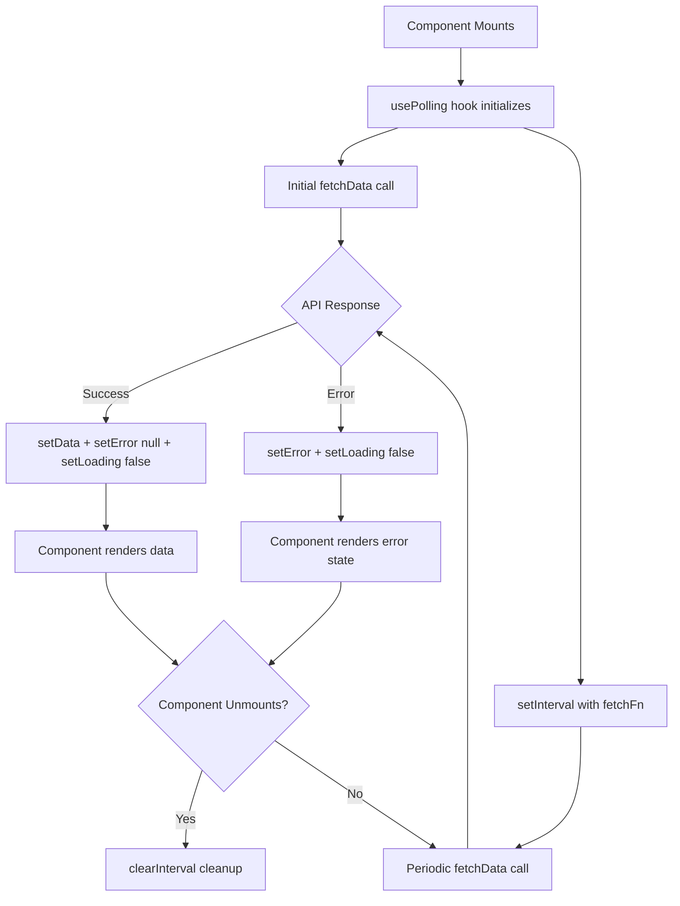
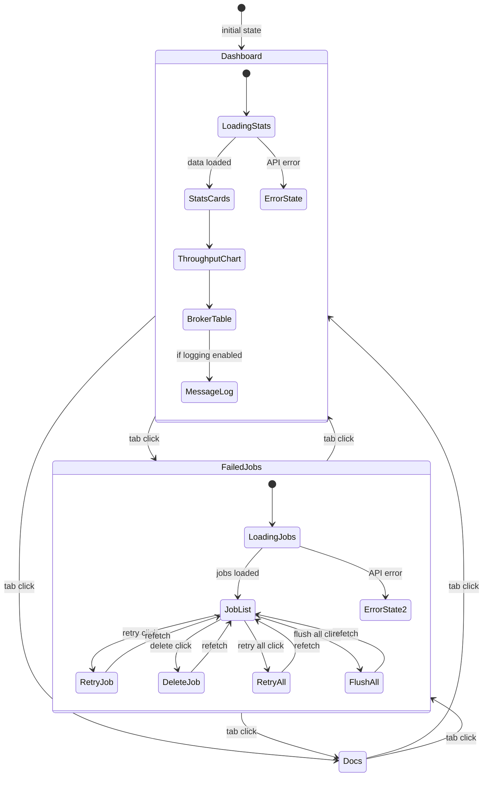
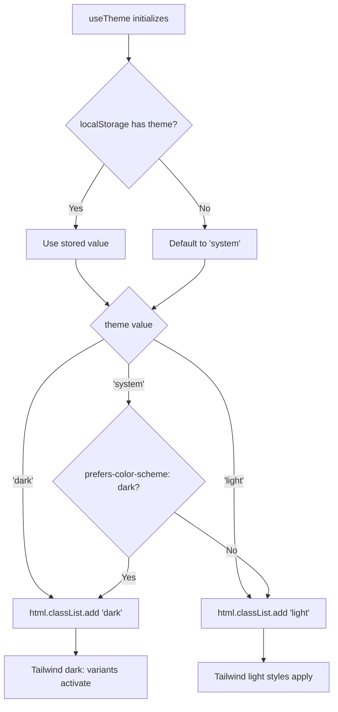

# Dashboard Frontend (React SPA)

## Overview

The MQTT Broadcast Dashboard is a React 19 Single Page Application that provides real-time monitoring of MQTT broker connections, message throughput, and failed jobs. It is served via a Blade template (`resources/views/dashboard.blade.php`), built with Vite and `laravel-vite-plugin`, and styled with Tailwind CSS. The frontend communicates exclusively with the REST API documented in [dashboard-monitoring.md](dashboard-monitoring.md).

The SPA uses a polling-based architecture (no WebSockets) to refresh data at a configurable interval, keeping the implementation simple and compatible with any hosting environment.

## Architecture

### Technology Stack

| Technology | Version | Purpose |
|---|---|---|
| React | 19.x | UI framework |
| TypeScript | 5.x | Type safety |
| Vite | 8.x | Build tooling |
| laravel-vite-plugin | 3.x | Laravel/Vite integration |
| Tailwind CSS | 3.x | Utility-first styling |
| Recharts | 2.x | Throughput chart visualization |
| Axios | 1.x | HTTP client for API calls |
| date-fns | 4.x | Date formatting |
| Lucide React | 0.468+ | Icon library |
| class-variance-authority | 0.7+ | Component variant styling (CVA) |

### Design Decisions

- **Polling over WebSockets**: simpler deployment, no persistent connection required, interval driven by `window.mqttBroadcast.refreshInterval` (default 5000ms).
- **No client-side router**: tab-based navigation managed via `useState<TabType>` in `Dashboard` component. Three tabs: `dashboard`, `failed-jobs`, `docs`.
- **shadcn/ui pattern**: UI primitives (`Card`, `Badge`, `Button`) follow the shadcn/ui approach using `class-variance-authority` + `tailwind-merge` for variant-based styling, without importing the full shadcn library.
- **Dark/light theme**: CSS class-based (`html.dark` / `html.light`) with `localStorage` persistence under key `mqtt-dashboard-theme`. System preference detection via `prefers-color-scheme` media query.

## How It Works

### 1. Bootstrap

The Blade template `resources/views/dashboard.blade.php` injects runtime configuration into `window.mqttBroadcast`:

```javascript
window.mqttBroadcast = {
    basePath: '{{ config("mqtt-broadcast.path", "mqtt-broadcast") }}',
    apiUrl: '/{{ config("mqtt-broadcast.path", "mqtt-broadcast") }}/api',
    loggingEnabled: {{ config("mqtt-broadcast.logs.enable", false) ? "true" : "false" }},
    refreshInterval: 5000,
};
```

The React app mounts into `<div id="mqtt-dashboard-root">` via `ReactDOM.createRoot` in `main.tsx`, wrapped in `React.StrictMode`.

### 2. Data Fetching (Polling Layer)

All data fetching follows the same pattern: `usePolling<T>` hook wraps any async fetch function with `setInterval`-based polling.

```
usePolling(fetchFn, interval, enabled)
    |-- initial fetch on mount
    |-- setInterval(fetchFn, interval)
    |-- returns { data, error, loading, refetch }
    |-- cleanup: clearInterval on unmount
```

Domain-specific hooks in `useDashboard.ts` wrap `dashboardApi` methods:

| Hook | API Call | Notes |
|---|---|---|
| `useStats()` | `GET /stats` | Always active |
| `useBrokers()` | `GET /brokers` | Always active |
| `useMessages(params?)` | `GET /messages` | Disabled when `loggingEnabled = false` |
| `useThroughput(period)` | `GET /metrics/throughput` | Period: `hour`, `day`, `week` |
| `useFailedJobs(params?)` | `GET /failed-jobs` | Always active |

### 3. API Client

`dashboardApi` in `lib/api.ts` creates an Axios instance with `baseURL` from `window.mqttBroadcast.apiUrl`. All responses follow the Laravel `{ data: T }` envelope pattern. Methods:

| Method | HTTP | Endpoint | Return Type |
|---|---|---|---|
| `getStats()` | GET | `/stats` | `DashboardStats` |
| `getBrokers()` | GET | `/brokers` | `Broker[]` |
| `getBroker(id)` | GET | `/brokers/{id}` | `Broker` |
| `getMessages(params?)` | GET | `/messages` | `MessageLog[]` |
| `getMessage(id)` | GET | `/messages/{id}` | `MessageLog` |
| `getTopics()` | GET | `/topics` | `Topic[]` |
| `getThroughput(period)` | GET | `/metrics/throughput` | `ThroughputData[]` |
| `getMetricsSummary()` | GET | `/metrics/summary` | `MetricsSummary \| null` |
| `getFailedJobs(params?)` | GET | `/failed-jobs` | `FailedJob[]` |
| `retryFailedJob(id)` | POST | `/failed-jobs/{id}/retry` | `FailedJob` |
| `retryAllFailedJobs()` | POST | `/failed-jobs/retry-all` | `{ retried: number }` |
| `deleteFailedJob(id)` | DELETE | `/failed-jobs/{id}` | `void` |
| `flushFailedJobs()` | DELETE | `/failed-jobs` | `{ flushed: number }` |

### 4. Component Tree & Rendering

```
Dashboard (root)
 +-- header: status Badge (running/stopped), ThemeToggle
 +-- Navigation (tab bar: Dashboard | Failed Jobs | Docs)
 +-- main content (conditional on activeTab):
      |-- "dashboard":
      |    +-- StatsCard x5 (messages/min, brokers, memory, queue, failed)
      |    +-- ThroughputChart (Recharts LineChart)
      |    +-- BrokerTable (tabular broker list)
      |    +-- MessageLog (if logging enabled)
      |-- "failed-jobs":
      |    +-- FailedJobs (list with retry/delete per-job, bulk retry/flush)
      |-- "docs":
           +-- DocsPage (command reference, troubleshooting, checklist, resources)
 +-- footer: auto-refresh interval display
```

## Key Components

| File | Component | Responsibility |
|---|---|---|
| `main.tsx` | Entry point | ReactDOM.createRoot, StrictMode wrapper |
| `components/Dashboard.tsx` | `Dashboard` | Root component, tab state, stats loading, layout orchestration |
| `components/Navigation.tsx` | `Navigation`, `TabButton` | Tab bar with badge count for failed jobs |
| `components/StatsCard.tsx` | `StatsCard` | Reusable metric card with icon, value, description, variant coloring, optional trend |
| `components/ThroughputChart.tsx` | `ThroughputChart` | Recharts `LineChart` with `ResponsiveContainer`, theme-aware axis/tooltip colors |
| `components/BrokerTable.tsx` | `BrokerTable` | Table of active brokers with connection status `Badge`, uptime, 24h message count |
| `components/MessageLog.tsx` | `MessageLog` | Scrollable list of recent messages, broker/topic tags, relative timestamps via `date-fns` |
| `components/FailedJobs.tsx` | `FailedJobs` | Failed job list with per-job retry/delete, bulk retry-all/flush-all, loading states per action |
| `components/DocsPage.tsx` | `DocsPage` | In-app reference: command blocks, troubleshooting items, config checklist, external resource links |
| `components/ThemeToggle.tsx` | `ThemeToggle` | Sun/Moon icon toggle, delegates to `useTheme` hook |
| `components/ui/card.tsx` | `Card`, `CardHeader`, `CardTitle`, `CardContent`, `CardFooter`, `CardDescription` | shadcn/ui-style card primitives using `React.forwardRef` |
| `components/ui/badge.tsx` | `Badge` | CVA-based badge with variants: default, secondary, destructive, outline, success, warning |
| `components/ui/button.tsx` | `Button` | CVA-based button with variants (default, destructive, outline, secondary, ghost, link) and sizes (default, sm, lg, icon) |
| `hooks/usePolling.ts` | `usePolling<T>` | Generic polling hook: `setInterval` + state management + cleanup |
| `hooks/useDashboard.ts` | `useStats`, `useBrokers`, `useMessages`, `useThroughput`, `useFailedJobs` | Domain hooks wrapping `dashboardApi` with polling |
| `hooks/useTheme.ts` | `useTheme` | Theme state (dark/light/system), `localStorage` persistence, `<html>` class toggling, system preference detection |
| `lib/api.ts` | `dashboardApi` | Axios-based API client, `window.mqttBroadcast` config, typed response unwrapping |
| `lib/utils.ts` | `cn()` | `clsx` + `tailwind-merge` utility for conditional class merging |
| `types/index.ts` | Type definitions | `DashboardStats`, `Broker`, `MessageLog`, `Topic`, `ThroughputData`, `FailedJob`, `MetricsSummary` |

## Type System

All API response types are defined in `types/index.ts`:

- **`DashboardStats`** — aggregate system status: `status` (running/stopped), broker counts (total/active/stale), message throughput (per_minute/last_hour/last_24h), queue info, memory usage (current_mb/threshold_mb/usage_percent), failed jobs count
- **`Broker`** — individual broker: `connection_status` state machine (connected/idle/reconnecting/disconnected), uptime, message count
- **`MessageLog`** — logged message with broker, topic, message preview, human-readable timestamp
- **`Topic`** — topic name + message count for analytics
- **`ThroughputData`** — time-series data point: time label, ISO timestamp, count
- **`FailedJob`** — DLQ entry: broker, topic, exception preview, QoS, retain flag, retry count, timestamps
- **`MetricsSummary`** — aggregated metrics: last hour/24h/7 days totals with averages, peak minute detection

## Configuration

The frontend reads all configuration from `window.mqttBroadcast`, injected by the Blade template at render time:

| Property | Source | Default | Purpose |
|---|---|---|---|
| `basePath` | `config('mqtt-broadcast.path')` | `mqtt-broadcast` | URL path prefix |
| `apiUrl` | Derived from `basePath` | `/{basePath}/api` | API base URL for Axios |
| `loggingEnabled` | `config('mqtt-broadcast.logs.enable')` | `false` | Controls whether `MessageLog` component and `useMessages` hook are active |
| `refreshInterval` | Hardcoded | `5000` | Polling interval in milliseconds |

Theme preference is stored in `localStorage` under key `mqtt-dashboard-theme` with values: `dark`, `light`, or `system`.

## Error Handling

| Scenario | Behavior |
|---|---|
| API unreachable | `usePolling` sets `error` state, component shows "Failed to load" message with `AlertCircle` icon |
| Initial load | `loading = true` renders `Loader2` spinner in each component independently |
| Polling failure | Previous `data` is preserved (not cleared on error), error state is set |
| Logging disabled | `MessageLog` renders disabled state with config hint; `useMessages` hook skips fetching (`enabled = false`) |
| Failed job retry error | Per-job loading state via `retrying` Set, no error toast (silent failure, refetch on next poll) |
| Flush confirmation | Browser `confirm()` dialog before destructive `flushFailedJobs()` call |

## Mermaid Diagrams

### Data Flow: Polling Lifecycle



### Component Navigation Flow



### Theme Resolution



## Build & Development

### Development

```bash
npm run dev    # Vite dev server with HMR
```

Vite serves assets via `laravel-vite-plugin` which creates a `public/hot` file to signal the dev server URL to the Blade `@vite` directive.

### Production Build

```bash
npm run build  # Output to public/vendor/mqtt-broadcast/
```

The build produces a `manifest.json` in `public/vendor/mqtt-broadcast/` that maps entry points to hashed filenames. The `@vite` Blade directive reads this manifest to inject `<script>` and `<link>` tags.

### Source Layout

```
resources/js/mqtt-dashboard/src/
  main.tsx                     Entry point
  components/
    Dashboard.tsx              Root component
    Navigation.tsx             Tab navigation
    StatsCard.tsx              Metric card
    ThroughputChart.tsx        Recharts line chart
    BrokerTable.tsx            Broker connection table
    MessageLog.tsx             Recent message feed
    FailedJobs.tsx             Failed job management
    DocsPage.tsx               In-app documentation
    ThemeToggle.tsx            Dark/light toggle
    ui/
      card.tsx                 Card primitives
      badge.tsx                Badge variants
      button.tsx               Button variants
  hooks/
    usePolling.ts              Generic polling abstraction
    useDashboard.ts            Domain-specific data hooks
    useTheme.ts                Theme management
  lib/
    api.ts                     Axios API client
    utils.ts                   cn() class merge utility
  types/
    index.ts                   TypeScript interfaces
```
