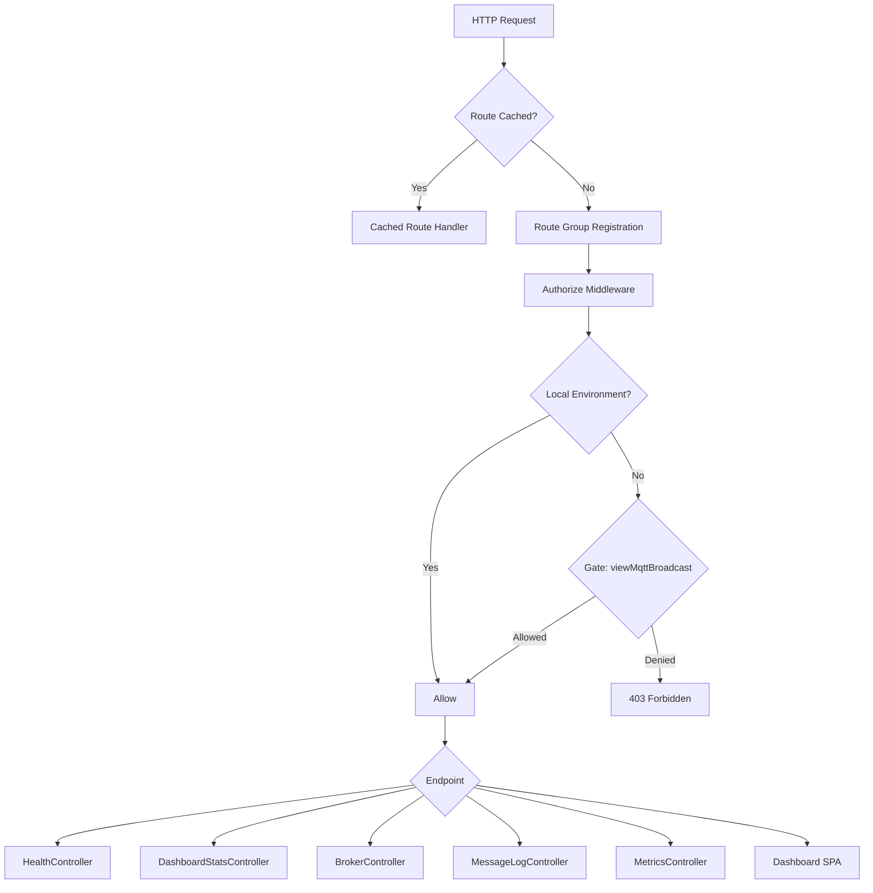
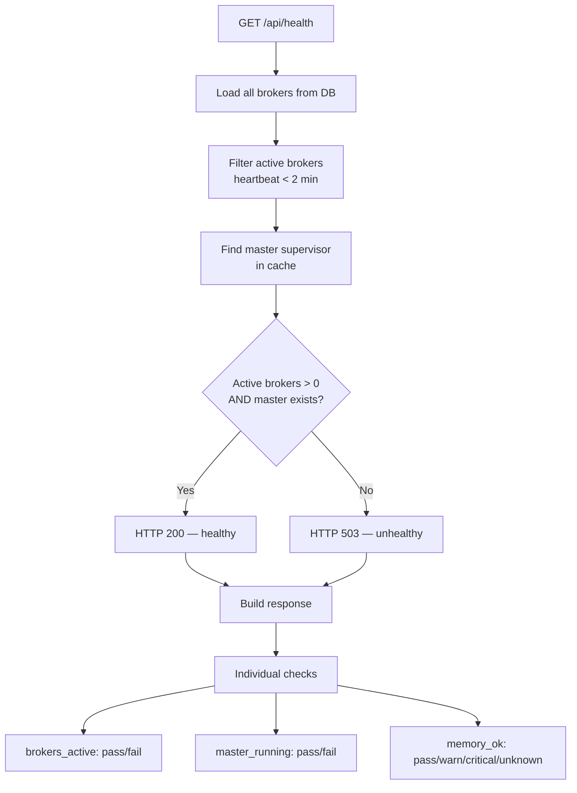
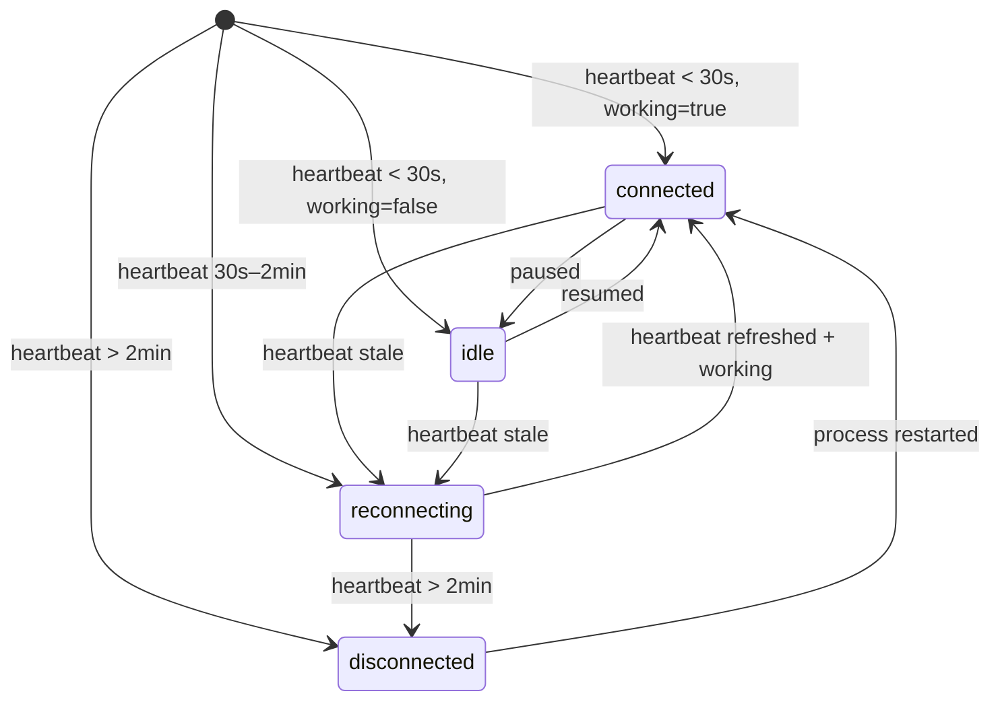

# Dashboard & Monitoring API

## Overview

The dashboard and monitoring API provides a complete REST API layer for observing and managing the MQTT Broadcast system at runtime. It exposes health checks, broker status, message logs, and throughput metrics — all behind an authorization middleware inspired by Laravel Horizon.

This feature solves the operational visibility problem: without it, operators would need to query the database and cache directly to understand system state. The API is designed for both the built-in React dashboard SPA and external monitoring tools (Kubernetes probes, Grafana, Datadog).

## Architecture

The API follows a standard Laravel controller architecture with a few notable design decisions:

- **Route grouping with configurable prefix** — all routes are mounted under a configurable path (default: `/mqtt-broadcast`) with domain and middleware support, following the Horizon pattern.
- **Authorize middleware** — gates access in non-local environments via a `viewMqttBroadcast` Gate, customizable through the published service provider stub.
- **Repository pattern** — controllers read broker and supervisor state through `BrokerRepository` (database-backed) and `MasterSupervisorRepository` (cache-backed), decoupling the API from storage details.
- **Conditional logging** — message log and metrics endpoints return empty results gracefully when logging is disabled (`mqtt-broadcast.logs.enable = false`), rather than failing.
- **Time-series gap filling** — `MetricsController` fills missing time buckets with zero-count entries so charts render without gaps.

## How It Works

### Route Registration

`MqttBroadcastServiceProvider::registerRoutes()` wraps all routes in a group with:

| Setting | Config Key | Default |
|---------|-----------|---------|
| Path prefix | `mqtt-broadcast.path` | `mqtt-broadcast` |
| Domain | `mqtt-broadcast.domain` | `null` |
| Middleware | `mqtt-broadcast.middleware` | `['web', Authorize::class]` |

Routes are loaded from `routes/web.php`. If the application routes are cached, registration is skipped.

### Authorization Flow

1. Request enters the `Authorize` middleware.
2. If `app()->environment('local')` → pass through immediately.
3. Otherwise, check `Gate::allows('viewMqttBroadcast', [$request->user()])`.
4. If the gate denies → return `403 Forbidden`.
5. Users customize access by defining the gate in their published `MqttBroadcastServiceProvider`:

```php
Gate::define('viewMqttBroadcast', function ($user) {
    return in_array($user->email, ['admin@example.com']);
});
```

### API Endpoints

All endpoints are prefixed with `{path}/api/`.

#### Health Check — `GET /api/health`

Returns system health status for monitoring tools and load balancers.

- HTTP 200 if healthy (at least one active broker + master supervisor running).
- HTTP 503 if unhealthy.

Response includes:
- Broker counts (total, active, stale)
- Master supervisor info (pid, uptime, memory, supervisors count)
- Queue pending count
- Individual health checks: `brokers_active`, `master_running`, `memory_ok`

Memory check thresholds:
- `pass`: usage < 80% of configured threshold
- `warn`: usage 80–99%
- `critical`: usage >= 100%

#### Dashboard Stats — `GET /api/stats`

Aggregated overview for the dashboard UI:
- Overall status (`running` / `stopped`)
- Broker counts (total, active, stale)
- Message throughput (per minute, last hour, last 24h) — only if logging enabled
- Queue pending count and queue name
- Memory (current MB, threshold MB, usage percent)
- Uptime in seconds

#### Brokers — `GET /api/brokers` and `GET /api/brokers/{id}`

**Index** returns all brokers with:
- Identity: id, name, connection, pid
- Status: `active` / `stale` (based on 2-minute heartbeat window)
- Connection status: `connected`, `idle`, `reconnecting`, `disconnected`
- Uptime (seconds + human-readable string)
- Message count in last 24h and last message timestamp (if logging enabled)

**Show** returns a single broker with the 10 most recent messages (topic, truncated message, timestamp).

Connection status logic:

| Heartbeat Age | Working | Status |
|---------------|---------|--------|
| < 30s | true | `connected` |
| < 30s | false | `idle` |
| 30s – 2min | any | `reconnecting` |
| > 2min | any | `disconnected` |

#### Message Logs — `GET /api/messages`, `GET /api/messages/{id}`, `GET /api/topics`

**Index** — paginated message list with filters:
- `broker` — exact match on connection name
- `topic` — partial match (SQL `LIKE`)
- `limit` — default 30, max 100

Returns message preview (first 100 chars), formatted message (pretty-printed JSON if valid), human-readable timestamps.

**Show** — full message detail including `is_json` flag and `message_parsed` (decoded JSON object or raw string).

**Topics** — top 20 unique topics in the last 24 hours with message counts, ordered by count descending.

All three endpoints return empty data with `logging_enabled: false` metadata when logging is disabled.

#### Metrics — `GET /api/metrics/throughput` and `GET /api/metrics/summary`

**Throughput** — time-series data for charting, controlled by `period` query parameter:

| Period | Grouping | Data Points | Time Range |
|--------|----------|-------------|------------|
| `hour` (default) | by minute | ~60 | last hour |
| `day` | by hour | ~24 | last 24h |
| `week` | by day | ~7 | last 7 days |

Gap filling ensures every time bucket has an entry (count = 0 if no messages).

**Summary** — aggregated performance metrics:
- Last hour: total + per-minute average
- Last 24h: total + per-hour average
- Last 7 days: total + per-day average
- Peak minute in last hour (time + count)

### Dashboard SPA

The catch-all route `GET /` renders `mqtt-broadcast::dashboard` — a Blade view that bootstraps the React single-page application. The React app consumes all the API endpoints above.

## Key Components

| File | Class/Method | Responsibility |
|------|-------------|----------------|
| `src/Http/Controllers/HealthController.php` | `HealthController::check()` | System health check (200/503) with individual check results |
| `src/Http/Controllers/DashboardStatsController.php` | `DashboardStatsController::index()` | Aggregated dashboard overview stats |
| `src/Http/Controllers/BrokerController.php` | `BrokerController::index()` | List all brokers with status and metrics |
| `src/Http/Controllers/BrokerController.php` | `BrokerController::show()` | Single broker detail with recent messages |
| `src/Http/Controllers/BrokerController.php` | `BrokerController::determineConnectionStatus()` | 4-level connection status from heartbeat age + working flag |
| `src/Http/Controllers/MessageLogController.php` | `MessageLogController::index()` | Filtered, paginated message log list |
| `src/Http/Controllers/MessageLogController.php` | `MessageLogController::show()` | Full message detail with JSON parsing |
| `src/Http/Controllers/MessageLogController.php` | `MessageLogController::topics()` | Top 20 topics by message count (last 24h) |
| `src/Http/Controllers/MetricsController.php` | `MetricsController::throughput()` | Time-series throughput data with gap filling |
| `src/Http/Controllers/MetricsController.php` | `MetricsController::summary()` | Aggregated performance summary + peak detection |
| `src/Http/Middleware/Authorize.php` | `Authorize::handle()` | Gate-based authorization (local bypass) |
| `src/Repositories/BrokerRepository.php` | `BrokerRepository` | Database CRUD for `mqtt_brokers` table |
| `src/Repositories/MasterSupervisorRepository.php` | `MasterSupervisorRepository` | Cache-based state for master supervisor |
| `routes/web.php` | — | Route definitions for all API endpoints + dashboard SPA |

## Database Schema

### `mqtt_brokers` table

| Column | Type | Description |
|--------|------|-------------|
| `id` | bigint (PK) | Auto-increment |
| `name` | string | Unique broker identifier (hostname-slug + random token) |
| `connection` | string | MQTT connection name from config |
| `pid` | integer | OS process ID |
| `started_at` | datetime | When the broker process started |
| `last_heartbeat_at` | datetime | Last heartbeat timestamp (staleness detection) |
| `working` | boolean | Whether the broker is actively processing |
| `created_at` | datetime | Eloquent timestamp |
| `updated_at` | datetime | Eloquent timestamp |

### `mqtt_loggers` table

| Column | Type | Description |
|--------|------|-------------|
| `id` | bigint (PK) | Auto-increment |
| `broker` | string | Connection name that received the message |
| `topic` | string | MQTT topic |
| `message` | json | Message payload (cast to JSON) |
| `created_at` | datetime | When the message was received |
| `updated_at` | datetime | Eloquent timestamp |

The `MqttLogger` model supports a custom database connection via `mqtt-broadcast.logs.connection` and a custom table name via `mqtt-broadcast.logs.table`.

### Master supervisor state (cache)

Stored in cache under key `mqtt-broadcast:master:{name}` with configurable TTL (`mqtt-broadcast.master_supervisor.cache_ttl`, default 3600s). Supports Redis, file, memcached, and array drivers.

Cache entry fields: `pid`, `memory`, `started_at`, `supervisors_count`, `updated_at`.

## Configuration

| Config Key | Env Var | Default | Description |
|-----------|---------|---------|-------------|
| `mqtt-broadcast.path` | `MQTT_BROADCAST_PATH` | `mqtt-broadcast` | URL prefix for all routes |
| `mqtt-broadcast.domain` | `MQTT_BROADCAST_DOMAIN` | `null` | Optional domain restriction |
| `mqtt-broadcast.middleware` | — | `['web', Authorize::class]` | Middleware stack for API routes |
| `mqtt-broadcast.logs.enable` | — | `false` | Enable/disable message logging (affects message & metrics endpoints) |
| `mqtt-broadcast.logs.connection` | — | `null` | Database connection for `mqtt_loggers` table |
| `mqtt-broadcast.logs.table` | — | `mqtt_loggers` | Table name for message logs |
| `mqtt-broadcast.queue.name` | — | `default` | Queue name (reported in stats) |
| `mqtt-broadcast.memory.threshold_mb` | — | `128` | Memory threshold for health check warnings |
| `mqtt-broadcast.master_supervisor.name` | — | `master` | Master supervisor cache key name |
| `mqtt-broadcast.master_supervisor.cache_ttl` | — | `3600` | Cache TTL in seconds for supervisor state |

## Error Handling

- **Broker not found** (`BrokerController::show`) — returns `404` with JSON error message.
- **Message not found** (`MessageLogController::show`) — returns `404`.
- **Logging disabled** — message and metrics endpoints return empty arrays with `logging_enabled: false` metadata; they never throw.
- **Master supervisor not in cache** — health check returns `unhealthy` (503); stats show zeroed memory/uptime; memory check returns `unknown` status.
- **Stale heartbeats** — brokers with `last_heartbeat_at` older than 2 minutes are classified as `stale` / `disconnected` but still returned in listings.
- **JSON parse failures** — `MessageLogController` falls back to raw string when `json_decode` fails (checked via `json_last_error()`).

## Mermaid Diagrams

### API Request Flow



### Health Check Logic



### Broker Connection Status State Machine



### Metrics Throughput Data Flow

```mermaid
flowchart TD
    A[GET /api/metrics/throughput<br/>?period=hour|day|week] --> B{Logging enabled?}
    B -->|No| C[Return empty + meta]
    B -->|Yes| D{Period?}
    D -->|hour| E[GROUP BY minute<br/>last 60 min]
    D -->|day| F[GROUP BY hour<br/>last 24h]
    D -->|week| G[GROUP BY day<br/>last 7 days]
    E --> H[Fill time gaps<br/>with count=0]
    F --> H
    G --> H
    H --> I[Return time-series<br/>data points]
```
