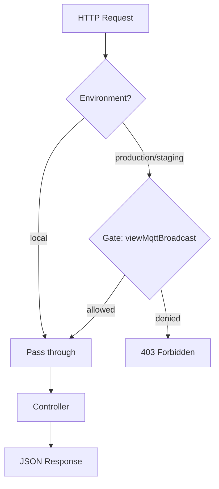
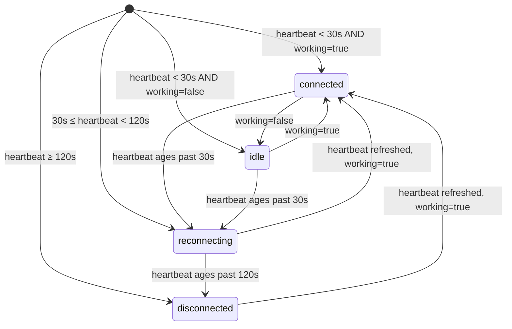
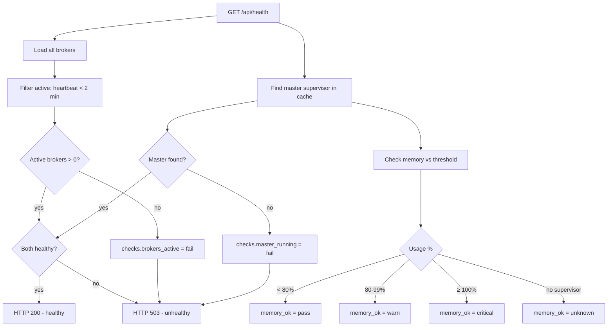
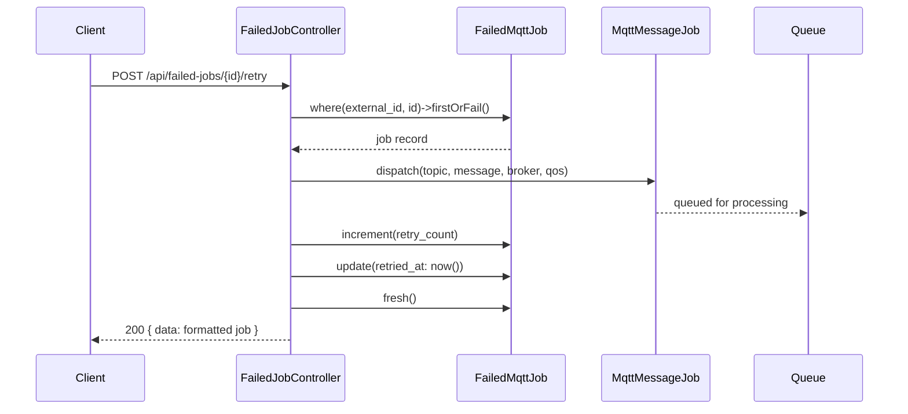

# HTTP API Reference

## Overview

The MQTT Broadcast dashboard exposes 15 JSON API endpoints under a configurable prefix (default `/mqtt-broadcast/api/`). These endpoints power the React SPA dashboard and can be consumed by external monitoring tools, scripts, or load balancer health checks.

All routes are registered by `MqttBroadcastServiceProvider::registerRoutes()` and protected by the `Authorize` middleware, which follows the Laravel Horizon authorization pattern: unrestricted in `local` environment, `viewMqttBroadcast` Gate check in all other environments.

## Architecture

The API layer follows a thin-controller pattern — each controller reads directly from repositories or Eloquent models with no dedicated request/resource classes. Response shapes are hand-crafted arrays, not API Resources.

**Key design decisions:**

- **No pagination** — all list endpoints use `limit` (max 100) instead of cursor/offset pagination, keeping the API simple for dashboard polling
- **Logging dependency** — message, topic, and metrics endpoints return empty/disabled responses when `mqtt-broadcast.logs.enable` is `false`, rather than erroring
- **Connection status is computed** — `BrokerController::determineConnectionStatus()` derives status from heartbeat age, not a stored field
- **Failed jobs use `external_id`** — UUID-based identification via the `HasExternalId` trait, not auto-increment `id`

## How It Works

All API requests follow this lifecycle:

1. Request hits the configurable route prefix (e.g. `GET /mqtt-broadcast/api/health`)
2. `web` middleware stack executes (session, CSRF for non-GET, etc.)
3. `Authorize` middleware checks access:
   - `local` env → pass through
   - Other envs → `Gate::allows('viewMqttBroadcast', [$request->user()])` → 403 if denied
4. Controller method executes, querying repositories/models
5. JSON response returned with appropriate HTTP status code

## Key Components

| File | Class / Method | Responsibility |
|------|---------------|----------------|
| `routes/web.php` | Route definitions | Registers all 15 API routes + SPA catch-all under `api/` prefix |
| `src/Http/Middleware/Authorize.php` | `Authorize::handle()` | Gate-based auth with local environment bypass |
| `src/Http/Controllers/HealthController.php` | `HealthController::check()` | System health check (200/503) |
| `src/Http/Controllers/DashboardStatsController.php` | `DashboardStatsController::index()` | Aggregated dashboard overview stats |
| `src/Http/Controllers/BrokerController.php` | `BrokerController::index()` / `show()` | Broker list and detail with connection status |
| `src/Http/Controllers/MessageLogController.php` | `MessageLogController::index()` / `show()` / `topics()` | Message logs with filtering, detail view, topic analytics |
| `src/Http/Controllers/MetricsController.php` | `MetricsController::throughput()` / `summary()` | Time-series throughput data and performance summary |
| `src/Http/Controllers/FailedJobController.php` | `FailedJobController` (6 methods) | DLQ CRUD: list, show, retry, retry-all, delete, flush |

## Authorization

### `Authorize` Middleware

```
src/Http/Middleware/Authorize.php
```

| Environment | Behavior |
|-------------|----------|
| `local` | Always allowed — no authentication required |
| All others | Checks `Gate::allows('viewMqttBroadcast', [$request->user()])` — returns 403 plain text `Forbidden` on denial |

Gate definition (in your `AppServiceProvider` or published `MqttBroadcastServiceProvider`):

```php
Gate::define('viewMqttBroadcast', function ($user) {
    return in_array($user->email, ['admin@example.com']);
});
```

## Endpoint Reference

### Health Check

#### `GET /api/health`

**Route name:** `mqtt-broadcast.health`
**Controller:** `HealthController::check()`

Returns system health status for monitoring tools and load balancers. Returns HTTP 200 when healthy, 503 when unhealthy.

**Health criteria:** at least one active broker AND master supervisor found in cache.

**Response (200):**

```json
{
  "status": "healthy",
  "timestamp": "2026-03-27T10:00:00+00:00",
  "data": {
    "brokers": {
      "total": 3,
      "active": 2,
      "stale": 1
    },
    "master_supervisor": {
      "pid": 12345,
      "uptime_seconds": 3600,
      "memory_mb": 45.23,
      "supervisors_count": 2
    },
    "queues": {
      "pending": 5
    }
  },
  "checks": {
    "brokers_active": {
      "status": "pass",
      "message": "2 active broker(s)"
    },
    "master_running": {
      "status": "pass",
      "message": "Master supervisor running"
    },
    "memory_ok": {
      "status": "pass",
      "message": "Memory usage at 35.3% of threshold"
    }
  }
}
```

**Memory check status values:**

| Status | Condition |
|--------|-----------|
| `pass` | Usage < 80% of `memory.threshold_mb` |
| `warn` | Usage >= 80% and < 100% |
| `critical` | Usage >= 100% |
| `unknown` | Master supervisor not running |

---

### Dashboard Stats

#### `GET /api/stats`

**Route name:** `mqtt-broadcast.stats`
**Controller:** `DashboardStatsController::index()`

Returns aggregated statistics for the dashboard overview cards. Message counts are only populated when `logs.enable` is `true`.

**Response (200):**

```json
{
  "data": {
    "status": "running",
    "brokers": {
      "total": 3,
      "active": 2,
      "stale": 1
    },
    "messages": {
      "per_minute": 12.5,
      "last_hour": 750,
      "last_24h": 18000,
      "logging_enabled": true
    },
    "queue": {
      "pending": 5,
      "name": "mqtt-broadcast"
    },
    "memory": {
      "current_mb": 45.23,
      "threshold_mb": 128,
      "usage_percent": 35.3
    },
    "failed_jobs": {
      "total": 12,
      "pending_retry": 8
    },
    "uptime_seconds": 3600
  }
}
```

**Notes:**
- `status` is `"running"` if any active broker exists, `"stopped"` otherwise
- `messages.*` are all `0` when `logs.enable` is `false`
- `per_minute` is calculated as `last_hour / 60`
- `failed_jobs.pending_retry` counts jobs where `retried_at IS NULL`

---

### Brokers

#### `GET /api/brokers`

**Route name:** `mqtt-broadcast.brokers.index`
**Controller:** `BrokerController::index()`

Returns all registered brokers with computed status fields.

**Response (200):**

```json
{
  "data": [
    {
      "id": 1,
      "name": "broker-hostname-abc123",
      "connection": "local",
      "pid": 12345,
      "status": "active",
      "connection_status": "connected",
      "working": true,
      "started_at": "2026-03-27T09:00:00+00:00",
      "last_heartbeat_at": "2026-03-27T10:00:00+00:00",
      "last_message_at": "2026-03-27T09:59:30+00:00",
      "uptime_seconds": 3600,
      "uptime_human": "1h 0m",
      "messages_24h": 450
    }
  ]
}
```

**`connection_status` state machine:**

| Status | Heartbeat age | `working` flag | Meaning |
|--------|--------------|----------------|---------|
| `connected` | < 30s | `true` | Active and processing messages |
| `idle` | < 30s | `false` | Active but paused |
| `reconnecting` | 30s – 120s | any | Heartbeat is stale, possibly reconnecting |
| `disconnected` | > 120s | any | No recent heartbeat |

**`status` field:** `active` if heartbeat within last 2 minutes, `stale` otherwise.

**`uptime_human` format:** `"45s"`, `"12m"`, `"3h 15m"`

---

#### `GET /api/brokers/{id}`

**Route name:** `mqtt-broadcast.brokers.show`
**Controller:** `BrokerController::show()`
**Path parameter:** `id` — broker auto-increment ID (integer)

Returns broker detail with last 10 messages (if logging enabled).

**Response (200):**

```json
{
  "data": {
    "id": 1,
    "name": "broker-hostname-abc123",
    "connection": "local",
    "pid": 12345,
    "status": "active",
    "working": true,
    "started_at": "2026-03-27T09:00:00+00:00",
    "last_heartbeat_at": "2026-03-27T10:00:00+00:00",
    "uptime_seconds": 3600,
    "uptime_human": "1h 0m",
    "recent_messages": [
      {
        "id": 100,
        "topic": "sensors/temperature",
        "message": "{\"value\":22.5,\"unit\":\"celsius\"}",
        "created_at": "2026-03-27T09:59:30+00:00"
      }
    ]
  }
}
```

**Error (404):**

```json
{ "error": "Broker not found" }
```

**Notes:**
- Messages are truncated to 100 characters in `recent_messages`
- `recent_messages` is empty array `[]` when logging is disabled

---

### Message Logs

#### `GET /api/messages`

**Route name:** `mqtt-broadcast.messages.index`
**Controller:** `MessageLogController::index()`

Returns recent messages with optional filtering. Requires `logs.enable: true`.

**Query parameters:**

| Parameter | Type | Default | Description |
|-----------|------|---------|-------------|
| `broker` | string | — | Exact match on broker connection name |
| `topic` | string | — | Partial match (`LIKE %topic%`) |
| `limit` | int | 30 | Max results (capped at 100) |

**Response (200) — logging enabled:**

```json
{
  "data": [
    {
      "id": 100,
      "broker": "local",
      "topic": "sensors/temperature",
      "message": "{\n  \"value\": 22.5\n}",
      "message_preview": "{\"value\":22.5,\"unit\":\"celsius\"}",
      "created_at": "2026-03-27T09:59:30+00:00",
      "created_at_human": "1 minute ago"
    }
  ],
  "meta": {
    "logging_enabled": true,
    "count": 30,
    "limit": 30,
    "filters": {
      "broker": null,
      "topic": null
    }
  }
}
```

**Response (200) — logging disabled:**

```json
{
  "data": [],
  "meta": {
    "logging_enabled": false,
    "message": "Message logging is disabled. Enable it in config/mqtt-broadcast.php"
  }
}
```

**Notes:**
- `message` is pretty-printed JSON (if valid JSON), raw string otherwise
- `message_preview` is compact JSON truncated to 100 characters

---

#### `GET /api/messages/{id}`

**Route name:** `mqtt-broadcast.messages.show`
**Controller:** `MessageLogController::show()`
**Path parameter:** `id` — message log auto-increment ID (integer)

Returns full message detail with parsed content.

**Response (200):**

```json
{
  "data": {
    "id": 100,
    "broker": "local",
    "topic": "sensors/temperature",
    "message": "{\"value\":22.5,\"unit\":\"celsius\"}",
    "is_json": true,
    "message_parsed": {
      "value": 22.5,
      "unit": "celsius"
    },
    "created_at": "2026-03-27T09:59:30+00:00",
    "created_at_human": "1 minute ago"
  }
}
```

**Error (404):**
- Logging disabled: `{ "error": "Message logging is disabled" }`
- Not found: `{ "error": "Message not found" }`

**Notes:**
- `message` is the full untruncated original string
- `is_json` indicates whether the message was valid JSON
- `message_parsed` is the decoded JSON object/array, or the raw string if not JSON

---

#### `GET /api/topics`

**Route name:** `mqtt-broadcast.topics`
**Controller:** `MessageLogController::topics()`

Returns top 20 topics from the last 24 hours by message count.

**Response (200):**

```json
{
  "data": [
    { "topic": "sensors/temperature", "count": 450 },
    { "topic": "sensors/humidity", "count": 320 },
    { "topic": "devices/status", "count": 100 }
  ]
}
```

**Notes:**
- Returns empty `data: []` when logging is disabled
- Limited to top 20 topics
- Only counts messages from the last 24 hours

---

### Metrics

#### `GET /api/metrics/throughput`

**Route name:** `mqtt-broadcast.metrics.throughput`
**Controller:** `MetricsController::throughput()`

Returns time-series message counts for charting. Gaps are filled with zero-count entries.

**Query parameters:**

| Parameter | Type | Default | Description |
|-----------|------|---------|-------------|
| `period` | string | `hour` | One of: `hour` (per-minute, 60 points), `day` (per-hour, 24 points), `week` (per-day, 7 points) |

**Response (200):**

```json
{
  "data": [
    { "time": "09:00", "timestamp": "2026-03-27T09:00:00+00:00", "count": 12 },
    { "time": "09:01", "timestamp": "2026-03-27T09:01:00+00:00", "count": 0 },
    { "time": "09:02", "timestamp": "2026-03-27T09:02:00+00:00", "count": 8 }
  ],
  "meta": {
    "logging_enabled": true,
    "period": "hour",
    "data_points": 61
  }
}
```

**`time` format by period:**

| Period | Format | Example |
|--------|--------|---------|
| `hour` | `H:i` | `"14:30"` |
| `day` | `H:00` | `"14:00"` |
| `week` | `M d` | `"Mar 27"` |

**Response (200) — logging disabled:**

```json
{
  "data": [],
  "meta": { "logging_enabled": false, "period": "hour" }
}
```

**Notes:**
- Uses `DATE_FORMAT()` SQL function (MySQL-specific)
- Gap-filling iterates from period start to current time, inserting `count: 0` for missing buckets

---

#### `GET /api/metrics/summary`

**Route name:** `mqtt-broadcast.metrics.summary`
**Controller:** `MetricsController::summary()`

Returns aggregated performance statistics across three time windows.

**Response (200):**

```json
{
  "data": {
    "last_hour": {
      "total": 750,
      "per_minute": 12.5
    },
    "last_24h": {
      "total": 18000,
      "per_hour": 750.0
    },
    "last_7days": {
      "total": 126000,
      "per_day": 18000.0
    },
    "peak_minute": {
      "time": "2026-03-27 09:45:00",
      "count": 42
    }
  }
}
```

**Response (200) — logging disabled:**

```json
{ "data": null }
```

**Notes:**
- `per_minute` = `total / 60`, `per_hour` = `total / 24`, `per_day` = `total / 7`
- `peak_minute` finds the minute with the highest count in the last hour
- `peak_minute.time` is in `Y-m-d H:i:00` format, `null` if no data

---

### Failed Jobs (DLQ)

#### `GET /api/failed-jobs`

**Route name:** `mqtt-broadcast.failed-jobs.index`
**Controller:** `FailedJobController::index()`

Returns failed MQTT jobs ordered by most recent failure.

**Query parameters:**

| Parameter | Type | Default | Description |
|-----------|------|---------|-------------|
| `broker` | string | — | Exact match on broker name |
| `topic` | string | — | Partial match (`LIKE %topic%`) |
| `limit` | int | 30 | Max results (capped at 100) |

**Response (200):**

```json
{
  "data": [
    {
      "id": "550e8400-e29b-41d4-a716-446655440000",
      "broker": "local",
      "topic": "sensors/temperature",
      "message_preview": "{\"value\":22.5,\"unit\":\"celsius\"}",
      "exception_preview": "enzolarosa\\MqttBroadcast\\Exceptions\\RateLimitExceededException: Rate limit exceeded",
      "qos": 1,
      "retain": false,
      "failed_at": "2026-03-27T09:30:00+00:00",
      "failed_at_human": "30 minutes ago",
      "retried_at": null,
      "retry_count": 0
    }
  ],
  "meta": {
    "count": 1,
    "total": 12,
    "limit": 30,
    "filters": {
      "broker": null,
      "topic": null
    }
  }
}
```

**Notes:**
- `id` is `external_id` (UUID), not the auto-increment primary key
- `message_preview` truncated to 100 characters
- `exception_preview` is the first line of the exception string
- `meta.total` is the global count (unfiltered)

---

#### `GET /api/failed-jobs/{id}`

**Route name:** `mqtt-broadcast.failed-jobs.show`
**Controller:** `FailedJobController::show()`
**Path parameter:** `id` — `external_id` UUID string

Returns full failed job detail including complete exception and message.

**Response (200):**

```json
{
  "data": {
    "id": "550e8400-e29b-41d4-a716-446655440000",
    "broker": "local",
    "topic": "sensors/temperature",
    "message_preview": "{\"value\":22.5}",
    "exception_preview": "RateLimitExceededException: Rate limit exceeded",
    "qos": 1,
    "retain": false,
    "failed_at": "2026-03-27T09:30:00+00:00",
    "failed_at_human": "30 minutes ago",
    "retried_at": null,
    "retry_count": 0,
    "exception": "enzolarosa\\MqttBroadcast\\Exceptions\\RateLimitExceededException: Rate limit exceeded\n#0 ...",
    "message": {"value": 22.5, "unit": "celsius"}
  }
}
```

**Error:** 404 via `firstOrFail()` (standard Laravel `ModelNotFoundException` → JSON 404).

---

#### `POST /api/failed-jobs/{id}/retry`

**Route name:** `mqtt-broadcast.failed-jobs.retry`
**Controller:** `FailedJobController::retry()`
**Path parameter:** `id` — `external_id` UUID string

Dispatches a new `MqttMessageJob` with the original payload, increments `retry_count`, sets `retried_at` to now.

**Response (200):**

```json
{
  "data": {
    "id": "550e8400-e29b-41d4-a716-446655440000",
    "broker": "local",
    "topic": "sensors/temperature",
    "message_preview": "{\"value\":22.5}",
    "exception_preview": "...",
    "qos": 1,
    "retain": false,
    "failed_at": "2026-03-27T09:30:00+00:00",
    "failed_at_human": "30 minutes ago",
    "retried_at": "2026-03-27T10:00:00+00:00",
    "retry_count": 1
  }
}
```

---

#### `POST /api/failed-jobs/retry-all`

**Route name:** `mqtt-broadcast.failed-jobs.retry-all`
**Controller:** `FailedJobController::retryAll()`

Retries all eligible failed jobs. A job is eligible if:
- `retried_at IS NULL` (never retried), OR
- `retried_at < now() - 1 minute` (cooldown expired)

This 1-minute cooldown prevents rapid repeated retries.

**Response (200):**

```json
{
  "data": { "retried": 8 }
}
```

---

#### `DELETE /api/failed-jobs/{id}`

**Route name:** `mqtt-broadcast.failed-jobs.destroy`
**Controller:** `FailedJobController::destroy()`
**Path parameter:** `id` — `external_id` UUID string

Deletes a single failed job.

**Response:** HTTP 204 (no body).

**Error:** 404 via `firstOrFail()`.

---

#### `DELETE /api/failed-jobs`

**Route name:** `mqtt-broadcast.failed-jobs.flush`
**Controller:** `FailedJobController::flush()`

Deletes ALL failed jobs by truncating the table.

**Response (200):**

```json
{
  "data": { "flushed": 12 }
}
```

---

### Dashboard SPA

#### `GET /`

**Route name:** `mqtt-broadcast.dashboard`

Serves the Blade view `mqtt-broadcast::dashboard` which bootstraps the React SPA. This is a catch-all for the dashboard UI — it does not return JSON.

## Configuration

| Config key | Default | Description |
|------------|---------|-------------|
| `mqtt-broadcast.dashboard.prefix` | `mqtt-broadcast` | URL prefix for all routes |
| `mqtt-broadcast.dashboard.domain` | `null` | Optional domain constraint |
| `mqtt-broadcast.dashboard.middleware` | `['web']` | Middleware stack (Authorize is always appended) |
| `mqtt-broadcast.logs.enable` | `false` | Enables message logging (required for messages, topics, metrics endpoints) |
| `mqtt-broadcast.queue.name` | `default` | Queue name checked by health endpoint |
| `mqtt-broadcast.memory.threshold_mb` | `128` | Memory threshold for health check status |
| `mqtt-broadcast.master_supervisor.name` | `master` | Cache key suffix for master supervisor lookup |

## Error Handling

| Scenario | Behavior |
|----------|----------|
| Logging disabled | Messages/topics/metrics return empty `data` with `logging_enabled: false` — no error |
| Broker not found | 404 with `{ "error": "Broker not found" }` |
| Message not found | 404 with `{ "error": "Message not found" }` |
| Failed job not found | 404 via Laravel `ModelNotFoundException` (standard JSON response) |
| Unauthorized | 403 plain text `Forbidden` from `Authorize` middleware |
| Master supervisor not found | Health returns 503; stats return zeros for memory/uptime |

## Mermaid Diagrams

### Request Authentication Flow



### Connection Status State Machine



### Health Check Decision Flow



### Failed Job Retry Flow


