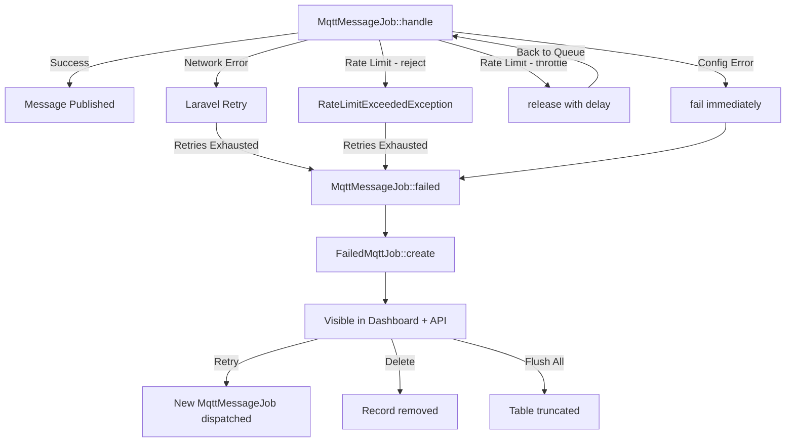
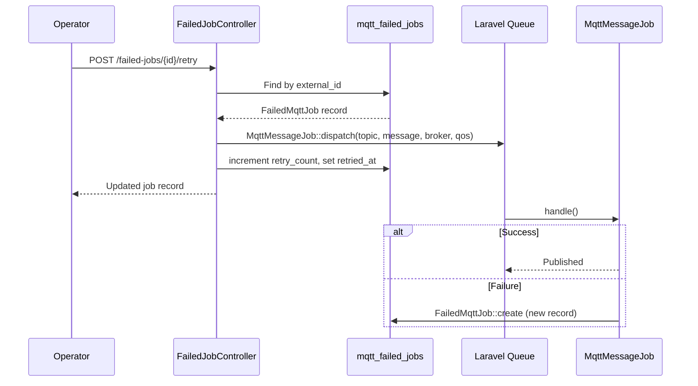

# Dead Letter Queue (Failed Jobs)

## Overview

The Dead Letter Queue (DLQ) captures MQTT publish jobs that fail after exhausting all retry attempts. When `MqttMessageJob` fails — whether due to broker unreachability, rate limit rejection, or configuration errors — the failure is persisted to the `mqtt_failed_jobs` table with full context (broker, topic, message payload, exception). Operators can inspect, retry, or purge failed jobs through the dashboard UI or REST API.

This system solves two problems:
1. **Message durability** — failed publishes are not silently lost; they remain recoverable.
2. **Operational visibility** — the dashboard surfaces failure patterns (by broker, by topic) so operators can diagnose systemic issues.

## Architecture

The DLQ is implemented as a database-backed queue with a REST API layer and React dashboard component.

**Design decisions:**
- **Separate table, not Laravel's `failed_jobs`** — MQTT failures carry domain-specific data (broker, topic, QoS, retain) that doesn't fit the generic `failed_jobs` schema. A dedicated table allows filtering, retry, and analytics by MQTT-specific fields.
- **UUID external IDs** — the `HasExternalId` trait auto-generates a UUID `external_id` used in API routes. Internal `id` (auto-increment) is never exposed.
- **Configurable database connection** — the `failed_jobs.connection` config key allows storing failures on a different database (e.g., for isolation or compliance).
- **No automatic retry** — retries are manual (single or bulk). This is intentional: failed jobs often indicate a systemic issue (broker down, misconfiguration) where automatic retry would just create noise.

## How It Works

### Failure Capture Flow

1. `MqttMessageJob::handle()` attempts to publish a message to the MQTT broker.
2. If the job fails (exhausts retries or is explicitly failed via `$this->fail()`), Laravel calls `MqttMessageJob::failed(\Throwable $exception)`.
3. `failed()` creates a `FailedMqttJob` record with the original payload, broker context, and stringified exception.
4. The job is now visible in the dashboard's "Failed Jobs" tab and via the REST API.

### Failure Triggers

| Trigger | Behavior | Retries? |
|---|---|---|
| Configuration error (`MqttBroadcastException`) | `$this->fail($e)` — immediate failure, no retry | No |
| Rate limit exceeded (`reject` strategy) | `RateLimitExceededException` thrown, job fails after max attempts | Yes (until exhausted) |
| Rate limit exceeded (`throttle` strategy) | `$this->release($delay)` — job requeued with delay | Requeued, not failed |
| Broker connection failure | Exception propagates, Laravel retries | Yes (until exhausted) |
| Data transfer error | Exception propagates, Laravel retries | Yes (until exhausted) |

### Retry Flow

1. Operator clicks "Retry" on a failed job (or "Retry All" for bulk).
2. `FailedJobController::retry()` dispatches a new `MqttMessageJob` with the original payload.
3. The `FailedMqttJob` record's `retry_count` is incremented and `retried_at` is set.
4. The record is **not deleted** — it persists as an audit trail. The operator must explicitly delete or flush it.

### Bulk Retry Protection

`retryAll()` only retries jobs where:
- `retried_at IS NULL` (never retried), OR
- `retried_at < now() - 1 minute` (cooldown period to prevent spam)

This prevents accidental double-dispatch when clicking "Retry All" rapidly.



## Key Components

| File | Class/Method | Responsibility |
|---|---|---|
| `src/Models/FailedMqttJob.php` | `FailedMqttJob` | Eloquent model; configurable table/connection, JSON message cast, UUID external IDs |
| `src/Models/Concerns/HasExternalId.php` | `HasExternalId` | Trait: auto-generates UUID `external_id` on creation, sets route key |
| `src/Jobs/MqttMessageJob.php` | `failed(\Throwable)` | Hook called by Laravel on job failure; persists to `mqtt_failed_jobs` |
| `src/Http/Controllers/FailedJobController.php` | `index()` | Lists failed jobs, filterable by `broker` and `topic`, paginated by `limit` (max 100) |
| `src/Http/Controllers/FailedJobController.php` | `show(string $id)` | Returns full job detail including complete `exception` and `message` |
| `src/Http/Controllers/FailedJobController.php` | `retry(string $id)` | Dispatches new `MqttMessageJob`, increments `retry_count`, sets `retried_at` |
| `src/Http/Controllers/FailedJobController.php` | `retryAll()` | Bulk retry with 1-minute cooldown protection |
| `src/Http/Controllers/FailedJobController.php` | `destroy(string $id)` | Deletes single failed job |
| `src/Http/Controllers/FailedJobController.php` | `flush()` | Truncates entire `mqtt_failed_jobs` table |
| `src/Http/Controllers/FailedJobController.php` | `formatJob()` | Formats job for API response: 100-char message preview, first-line exception preview |
| `src/Http/Controllers/DashboardStatsController.php` | `index()` | Includes `failed_jobs.total` and `failed_jobs.pending_retry` in dashboard stats |
| `resources/js/mqtt-dashboard/src/components/FailedJobs.tsx` | `FailedJobs` | React component: job list, retry/delete per-job, bulk retry/flush, loading states |
| `resources/js/mqtt-dashboard/src/lib/api.ts` | `dashboardApi.*` | API client methods: `getFailedJobs`, `retryFailedJob`, `retryAllFailedJobs`, `deleteFailedJob`, `flushFailedJobs` |
| `database/migrations/2025_03_27_000000_create_mqtt_failed_jobs_table.php` | Migration | Creates `mqtt_failed_jobs` table with configurable connection |

## Database Schema

### Table: `mqtt_failed_jobs`

| Column | Type | Default | Notes |
|---|---|---|---|
| `id` | `bigint` (PK) | auto-increment | Internal ID, never exposed via API |
| `external_id` | `uuid` | auto-generated | Unique; used in all API routes |
| `broker` | `string` | `'default'` | Indexed; broker connection name |
| `topic` | `string` | — | MQTT topic the message was destined for |
| `message` | `longText` | nullable | JSON-encoded message payload (cast to array by Eloquent) |
| `qos` | `tinyInteger` | `0` | MQTT Quality of Service level (0, 1, or 2) |
| `retain` | `boolean` | `false` | MQTT retain flag |
| `exception` | `text` | — | Full stringified exception (class + message + stack trace) |
| `failed_at` | `timestamp` | — | When the job failed |
| `retried_at` | `timestamp` | nullable | When last retry was dispatched |
| `retry_count` | `unsigned int` | `0` | Number of manual retries attempted |
| `created_at` | `timestamp` | — | Eloquent timestamp |
| `updated_at` | `timestamp` | — | Eloquent timestamp |

**Indexes:** `external_id` (unique), `broker` (index).

## Configuration

```php
// config/mqtt-broadcast.php

'failed_jobs' => [
    // Database connection for the mqtt_failed_jobs table.
    // null = use default Laravel connection.
    'connection' => env('MQTT_FAILED_JOBS_DB_CONNECTION'),

    // Table name (default: mqtt_failed_jobs)
    'table' => env('MQTT_FAILED_JOBS_TABLE', 'mqtt_failed_jobs'),
],
```

| Config Key | Env Var | Default | Description |
|---|---|---|---|
| `failed_jobs.connection` | `MQTT_FAILED_JOBS_DB_CONNECTION` | `null` (default) | Database connection for DLQ storage |
| `failed_jobs.table` | `MQTT_FAILED_JOBS_TABLE` | `mqtt_failed_jobs` | Table name |

The migration reads `failed_jobs.connection` at runtime via `Schema::connection()`, so the table is created on the configured connection.

## API Routes

All routes are prefixed with the configured dashboard path (default: `/mqtt-broadcast/api`).

| Method | Route | Controller Method | Description |
|---|---|---|---|
| `GET` | `/failed-jobs` | `index` | List failed jobs (filterable: `broker`, `topic`, `limit`) |
| `GET` | `/failed-jobs/{id}` | `show` | Get full job detail by `external_id` |
| `POST` | `/failed-jobs/{id}/retry` | `retry` | Retry single job |
| `POST` | `/failed-jobs/retry-all` | `retryAll` | Retry all eligible jobs |
| `DELETE` | `/failed-jobs/{id}` | `destroy` | Delete single job |
| `DELETE` | `/failed-jobs` | `flush` | Delete all failed jobs |

## Error Handling

- **Job failure capture is best-effort** — if `FailedMqttJob::create()` itself fails (e.g., database is down), the failure is lost. This is acceptable because the original exception is still logged by Laravel's standard failed job handling.
- **Retry dispatches a fresh job** — the retried job goes through the full `MqttMessageJob` lifecycle including rate limiting. If the underlying issue persists, the retry will also fail and create a new `FailedMqttJob` record.
- **`flush()` uses `TRUNCATE`** — this is a destructive operation that cannot be undone. The dashboard UI shows a confirmation dialog before executing.
- **`retryAll()` has no transaction** — each retry is independent. If one fails mid-batch, previously dispatched retries still proceed.


