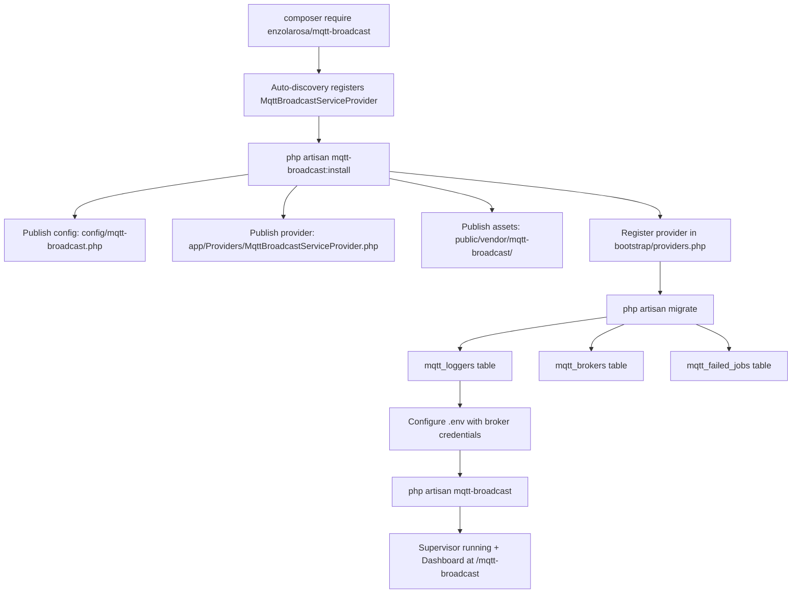
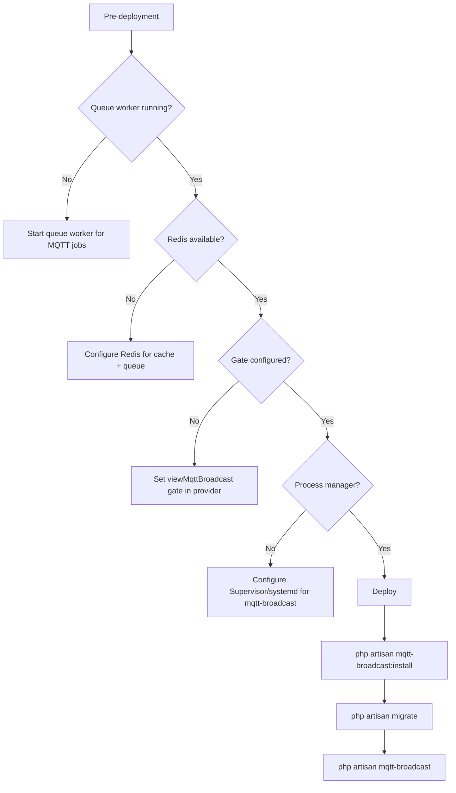

# Installation & Configuration

## Overview

`enzolarosa/mqtt-broadcast` is a Laravel package that provides MQTT integration with Horizon-style process supervision, multi-broker support, a Dead Letter Queue, and a React 19 monitoring dashboard. This guide covers the complete installation process, configuration options, and production deployment considerations.

The package requires PHP 8.3+, Laravel 11+, and the `pcntl` and `posix` PHP extensions for process management. It uses `php-mqtt/client` under the hood for MQTT protocol communication.

## Architecture

The installation follows the standard Laravel package pattern with auto-discovery, publishable assets, and auto-loaded migrations. The `InstallCommand` orchestrates the initial setup by publishing three asset groups and registering a local service provider for gate customization.



## How It Works

### Step 1: Install via Composer

```bash
composer require enzolarosa/mqtt-broadcast
```

Laravel's package auto-discovery reads `composer.json` `extra.laravel.providers` and automatically registers `MqttBroadcastServiceProvider`. The `MqttBroadcast` facade alias is also auto-registered.

### Step 2: Run the Install Command

```bash
php artisan mqtt-broadcast:install
```

The `InstallCommand` performs three sequential operations:

1. **Publishes config** (`mqtt-broadcast-config` tag) — copies `config/mqtt-broadcast.php` to the application's config directory.
2. **Publishes provider** (`mqtt-broadcast-provider` tag) — copies `stubs/MqttBroadcastServiceProvider.stub` to `app/Providers/MqttBroadcastServiceProvider.php`. This local provider extends the package provider and overrides `registerGate()` for dashboard access control.
3. **Publishes assets** (`mqtt-broadcast-assets` tag) — copies pre-built React dashboard files to `public/vendor/mqtt-broadcast/`.
4. **Registers provider** — appends `App\Providers\MqttBroadcastServiceProvider::class` to `bootstrap/providers.php` (Laravel 11+) or `config/app.php` (Laravel 10). Idempotent — skips if already present.

### Step 3: Run Migrations

```bash
php artisan migrate
```

Migrations are auto-loaded by the service provider via `loadMigrationsFrom()` (Horizon pattern). No publishing required. Three tables are created:

| Table | Migration | Purpose |
|-------|-----------|---------|
| `mqtt_loggers` | `2024_11_01_000000_create_mqtt_broadcast_table.php` | Stores received MQTT messages when logging is enabled |
| `mqtt_brokers` | `2024_11_01_000000_create_mqtt_brokers_table.php` | Tracks active broker supervisor processes |
| `mqtt_failed_jobs` | `2025_03_27_000000_create_mqtt_failed_jobs_table.php` | Dead Letter Queue for failed publish jobs |

An additional migration (`2024_11_02_000000`) adds a `last_heartbeat_at` column to `mqtt_brokers`, and another (`2024_11_03_000000`) adds a composite index to `mqtt_loggers`.

### Step 4: Configure the MQTT Broker

Add to `.env`:

```dotenv
# Required
MQTT_HOST=your-broker.example.com
MQTT_PORT=1883

# Optional: Authentication
MQTT_USERNAME=your-username
MQTT_PASSWORD=your-password

# Optional: Topic prefix for all messages
MQTT_PREFIX=myapp/

# Optional: TLS
MQTT_USE_TLS=false
```

### Step 5: Configure Dashboard Access

Edit `app/Providers/MqttBroadcastServiceProvider.php`:

```php
protected function registerGate(): void
{
    Gate::define('viewMqttBroadcast', function ($user) {
        return in_array($user->email, [
            'admin@example.com',
        ]);
    });
}
```

The `Authorize` middleware automatically allows all access in `local` environment. In all other environments, it checks the `viewMqttBroadcast` gate. The default gate denies all access — you must explicitly allow users.

### Step 6: Start the Supervisor

```bash
php artisan mqtt-broadcast
```

This starts the `MasterSupervisor`, which creates one `BrokerSupervisor` per connection defined in the active environment. The dashboard is accessible at `/{path}` (default: `/mqtt-broadcast`).

## Key Components

| File | Class/Method | Responsibility |
|------|-------------|----------------|
| `src/Commands/InstallCommand.php` | `InstallCommand::handle()` | Orchestrates installation: publish config, provider, assets; register provider |
| `src/Commands/InstallCommand.php` | `registerMqttBroadcastServiceProvider()` | Detects Laravel version, registers provider in `bootstrap/providers.php` or `config/app.php` |
| `src/MqttBroadcastServiceProvider.php` | `register()` | Merges config, binds services (singletons), loads migrations |
| `src/MqttBroadcastServiceProvider.php` | `boot()` | Registers events, routes, gate, views, publishable assets, commands |
| `src/MqttBroadcastServiceProvider.php` | `registerGate()` | Default gate: deny all in non-local environments |
| `stubs/MqttBroadcastServiceProvider.stub` | Published provider | User-editable gate override and config customization |
| `config/mqtt-broadcast.php` | — | All configuration with sensible defaults |
| `src/functions.php` | `mqttMessage()` / `mqttMessageSync()` | Global helper functions (auto-loaded via Composer) |

## Configuration

### Connections (Required)

```php
'connections' => [
    'default' => [
        'host' => env('MQTT_HOST', '127.0.0.1'),
        'port' => env('MQTT_PORT', 1883),
        'username' => env('MQTT_USERNAME'),
        'password' => env('MQTT_PASSWORD'),
        'prefix' => env('MQTT_PREFIX', ''),
        'use_tls' => env('MQTT_USE_TLS', false),
        'clientId' => env('MQTT_CLIENT_ID'),
    ],
],
```

Multiple connections are supported. Each connection maps to a separate `BrokerSupervisor` process:

```php
'connections' => [
    'default' => ['host' => env('MQTT_HOST'), 'port' => 1883],
    'backup'  => ['host' => env('MQTT_BACKUP_HOST'), 'port' => 1883],
],
```

### Environments

Maps `APP_ENV` to active connections:

```php
'environments' => [
    'production' => ['default', 'backup'],
    'staging'    => ['default'],
    'local'      => ['default'],
],
```

Only connections listed for the current environment are supervised.

### Dashboard

| Key | Env Var | Default | Description |
|-----|---------|---------|-------------|
| `path` | `MQTT_BROADCAST_PATH` | `mqtt-broadcast` | URL path prefix |
| `domain` | `MQTT_BROADCAST_DOMAIN` | `null` | Restrict dashboard to a specific domain |
| `middleware` | — | `['web', Authorize::class]` | Middleware stack |

### Message Logging

| Key | Env Var | Default | Description |
|-----|---------|---------|-------------|
| `logs.enable` | `MQTT_LOG_ENABLE` | `false` | Store all received messages in DB |
| `logs.queue` | `MQTT_LOG_JOB_QUEUE` | `default` | Queue for log jobs |
| `logs.connection` | `MQTT_LOG_CONNECTION` | `mysql` | Database connection for log table |
| `logs.table` | `MQTT_LOG_TABLE` | `mqtt_loggers` | Table name |

### Dead Letter Queue

| Key | Env Var | Default | Description |
|-----|---------|---------|-------------|
| `failed_jobs.connection` | `MQTT_FAILED_JOBS_DB_CONNECTION` | `null` (app default) | Database connection |
| `failed_jobs.table` | `MQTT_FAILED_JOBS_TABLE` | `mqtt_failed_jobs` | Table name |

### MQTT Protocol Defaults

| Key | Default | Description |
|-----|---------|-------------|
| `defaults.connection.qos` | `0` | Quality of Service: 0 (at most once), 1 (at least once), 2 (exactly once) |
| `defaults.connection.retain` | `false` | Broker retains last message per topic |
| `defaults.connection.clean_session` | `false` | Start with clean session on connect |
| `defaults.connection.alive_interval` | `60` | Keep-alive ping interval (seconds) |
| `defaults.connection.timeout` | `3` | Connection timeout (seconds) |
| `defaults.connection.self_signed_allowed` | `true` | Accept self-signed TLS certificates |
| `defaults.connection.max_retries` | `20` | Max reconnection attempts before circuit breaker |
| `defaults.connection.max_retry_delay` | `60` | Max delay between retries (exponential backoff cap) |
| `defaults.connection.max_failure_duration` | `3600` | Max total failure duration before giving up (seconds) |
| `defaults.connection.terminate_on_max_retries` | `false` | Terminate supervisor after max retries exhausted |

### Memory Management

| Key | Env Var | Default | Description |
|-----|---------|---------|-------------|
| `memory.gc_interval` | `MQTT_GC_INTERVAL` | `100` | Run garbage collection every N messages |
| `memory.threshold_mb` | `MQTT_MEMORY_THRESHOLD_MB` | `128` | Memory limit before auto-restart |
| `memory.auto_restart` | `MQTT_MEMORY_AUTO_RESTART` | `true` | Auto-restart supervisors on memory threshold |
| `memory.restart_delay_seconds` | `MQTT_RESTART_DELAY_SECONDS` | `10` | Delay before restart after memory threshold |

### Queue Configuration

| Key | Env Var | Default | Description |
|-----|---------|---------|-------------|
| `queue.name` | `MQTT_JOB_QUEUE` | `default` | Queue name for publish jobs |
| `queue.listener` | `MQTT_LISTENER_QUEUE` | `default` | Queue name for listener jobs |
| `queue.connection` | `MQTT_JOB_CONNECTION` | `redis` | Queue connection driver |

### Supervisor Configuration

| Key | Env Var | Default | Description |
|-----|---------|---------|-------------|
| `master_supervisor.name` | `MQTT_MASTER_NAME` | `master` | Master supervisor name prefix |
| `master_supervisor.cache_ttl` | `MQTT_MASTER_CACHE_TTL` | `3600` | Cache TTL for supervisor state (seconds) |
| `master_supervisor.cache_driver` | `MQTT_CACHE_DRIVER` | `redis` | Cache driver for supervisor state |
| `supervisor.heartbeat_interval` | `MQTT_HEARTBEAT_INTERVAL` | `1` | Heartbeat frequency (seconds) |

### Repository Settings

| Key | Env Var | Default | Description |
|-----|---------|---------|-------------|
| `repository.broker.heartbeat_column` | — | `last_heartbeat_at` | Column name for heartbeat tracking |
| `repository.broker.stale_threshold` | `MQTT_STALE_THRESHOLD` | `300` | Seconds before a broker is considered stale |

## Error Handling

### Installation Errors

- **Missing `pcntl`/`posix` extensions**: Composer will fail at install. These are required for process supervision (signal handling, PID management).
- **Provider already registered**: `InstallCommand` checks for existing provider registration and skips if found (idempotent).
- **Migration conflicts**: Migrations use timestamped filenames from the vendor directory. No name collision risk since they are not published.

### Configuration Errors

- **Invalid host/port**: `MqttConnectionConfig::fromConnection()` validates all config values at supervisor startup. Invalid config causes immediate failure with a descriptive exception.
- **Missing connection in environment**: If `environments.{env}` references a connection not defined in `connections`, the supervisor throws at startup.
- **Auth without credentials**: If `username` is set but `password` is null (or vice versa), connection will fail at the broker level.

### Runtime Errors

- **Broker unreachable**: Supervisor uses exponential backoff reconnection up to `max_retries`. Circuit breaker prevents infinite loops.
- **Memory exhaustion**: `MemoryManager` monitors usage and triggers graceful restart when `threshold_mb` is exceeded.
- **Failed publishes**: Jobs that exhaust retries are stored in the `mqtt_failed_jobs` table (DLQ) and can be retried from the dashboard.

## Production Deployment Checklist



### Required Steps

1. **Queue worker** — Ensure `php artisan queue:work` is running for the configured queue connection (`redis` by default). Needed for async message publishing and listener processing.
2. **Redis** — Required for both queue processing and master supervisor state caching (default `cache_driver`).
3. **Dashboard gate** — The default gate denies all access in non-local environments. Configure `viewMqttBroadcast` in your published provider.
4. **Process manager** — Use Supervisor (supervisord) or systemd to keep `php artisan mqtt-broadcast` running. Similar to how you'd manage Laravel Horizon.

### Recommended `.env` for Production

```dotenv
MQTT_HOST=mqtt.production.example.com
MQTT_PORT=8883
MQTT_USE_TLS=true
MQTT_USERNAME=prod-user
MQTT_PASSWORD=secure-password
MQTT_PREFIX=production/

MQTT_LOG_ENABLE=true
MQTT_MEMORY_THRESHOLD_MB=256
MQTT_MAX_RETRIES=50
MQTT_CACHE_DRIVER=redis
MQTT_JOB_CONNECTION=redis
```

### Supervisord Configuration Example

```ini
[program:mqtt-broadcast]
process_name=%(program_name)s
command=php /path/to/artisan mqtt-broadcast
autostart=true
autorestart=true
user=www-data
redirect_stderr=true
stdout_logfile=/path/to/storage/logs/mqtt-broadcast.log
stopwaitsecs=3600
```
