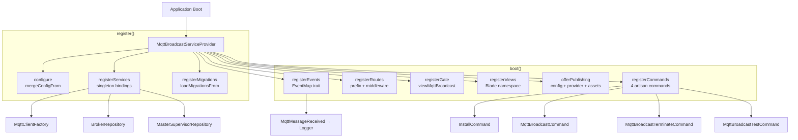
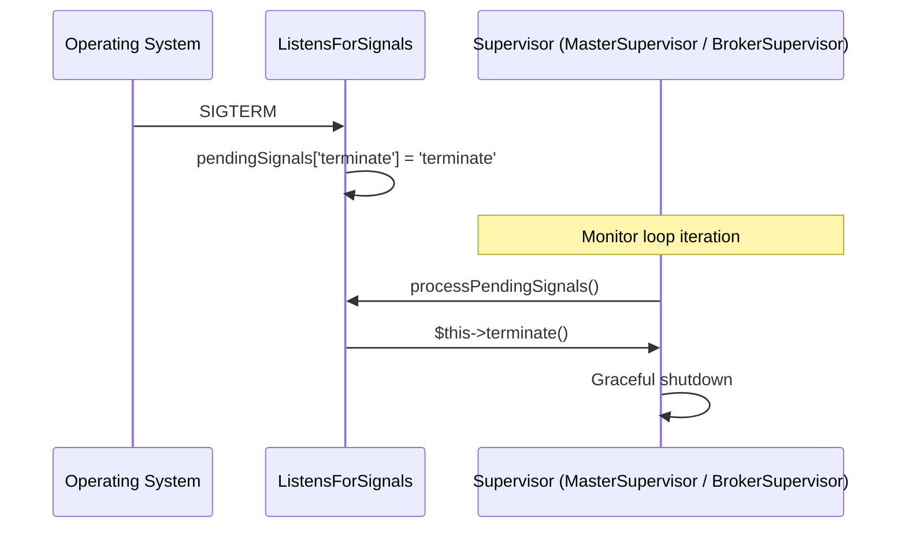
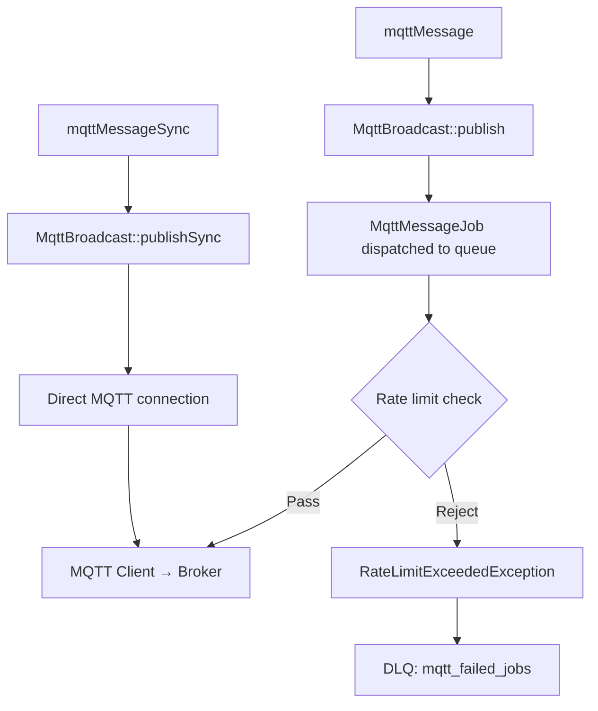

# Package Infrastructure

## Overview

`MqttBroadcastServiceProvider` is the central bootstrap class for the `enzolarosa/mqtt-broadcast` package. It wires together all package services — singleton bindings, event/listener registration, route loading, Blade views, artisan commands, authorization gates, migrations, and publishable assets. The design follows the same conventions as Laravel Horizon: auto-loaded migrations, a publishable provider stub for gate customisation, and a cache-route-aware route registration flow.

Supporting infrastructure includes four contracts (`Listener`, `Pausable`, `Restartable`, `Terminable`), a `ListensForSignals` trait for Unix process control, two custom exception classes, two global helper functions, and a comprehensive configuration file with environment-based broker selection.

## Architecture

The service provider uses two composition traits to keep concerns separated:

- **`ServiceBindings`** — declares the singleton array (`MqttClientFactory`, `BrokerRepository`, `MasterSupervisorRepository`).
- **`EventMap`** — declares the event → listener mappings (`MqttMessageReceived → Logger`).

The boot/register split follows Laravel conventions:

| Phase | Method | What it does |
|-------|--------|-------------|
| `register()` | `configure()` | Merges default config via `mergeConfigFrom()` |
| `register()` | `registerServices()` | Iterates `$serviceBindings` and registers singletons |
| `register()` | `registerMigrations()` | Loads migrations from `database/migrations/` (console only) |
| `boot()` | `registerEvents()` | Resolves `Dispatcher` and registers event/listener pairs from `$events` |
| `boot()` | `registerRoutes()` | Registers route group with configurable prefix/domain/middleware |
| `boot()` | `registerGate()` | Defines the `viewMqttBroadcast` gate (deny-all default) |
| `boot()` | `registerViews()` | Loads Blade views under `mqtt-broadcast` namespace |
| `boot()` | `offerPublishing()` | Registers publishable config, provider stub, and frontend assets |
| `boot()` | `registerCommands()` | Registers 4 artisan commands (console only) |



## How It Works

### Service Registration Flow

1. Laravel discovers the provider via `composer.json` auto-discovery or manual registration.
2. `register()` runs first:
   - `configure()` merges the package's `config/mqtt-broadcast.php` with the app's published copy (if any). The app's values take precedence.
   - `registerServices()` iterates `$serviceBindings`. Numeric keys register as `$this->app->singleton($class)` (self-binding); string keys register as `$this->app->singleton($key, $value)` (interface → implementation).
   - `registerMigrations()` calls `loadMigrationsFrom()` so migrations run directly from vendor — no publish step required.

3. `boot()` runs after all providers are registered:
   - `registerEvents()` resolves the `Dispatcher` contract and loops through the `$events` array (from `EventMap` trait), calling `$events->listen($event, $listener)` for each pair.
   - `registerRoutes()` checks `$this->app->routesAreCached()` first — if cached, route registration is skipped entirely. Otherwise, routes are loaded within a `Route::group()` using `config('mqtt-broadcast.domain')`, `config('mqtt-broadcast.path')` (default: `mqtt-broadcast`), and `config('mqtt-broadcast.middleware')` (default: `['web', Authorize::class]`).
   - `registerGate()` defines `viewMqttBroadcast` gate with a deny-all policy. Users override this in their published provider.
   - `registerViews()` loads Blade views from `resources/views` under the `mqtt-broadcast` namespace.
   - `offerPublishing()` registers three publish groups: `mqtt-broadcast-provider`, `mqtt-broadcast-config`, and `mqtt-broadcast-assets` (also tagged `laravel-assets`).
   - `registerCommands()` registers four artisan commands (console-only).

### Publishable Provider Stub

The file `stubs/MqttBroadcastServiceProvider.stub` is published to `app/Providers/MqttBroadcastServiceProvider.php`. It extends the base provider and overrides `registerGate()` to let users define their own authorization logic:

```php
Gate::define('viewMqttBroadcast', function ($user) {
    return in_array($user->email, [
        // 'admin@example.com',
    ]);
});
```

### Route Registration

Routes are defined in `routes/web.php` and grouped under the configurable path prefix. All API endpoints are nested under an `api` sub-prefix:

| Method | Path | Controller | Name |
|--------|------|-----------|------|
| GET | `/api/health` | `HealthController@check` | `mqtt-broadcast.health` |
| GET | `/api/stats` | `DashboardStatsController@index` | `mqtt-broadcast.stats` |
| GET | `/api/brokers` | `BrokerController@index` | `mqtt-broadcast.brokers.index` |
| GET | `/api/brokers/{id}` | `BrokerController@show` | `mqtt-broadcast.brokers.show` |
| GET | `/api/messages` | `MessageLogController@index` | `mqtt-broadcast.messages.index` |
| GET | `/api/messages/{id}` | `MessageLogController@show` | `mqtt-broadcast.messages.show` |
| GET | `/api/topics` | `MessageLogController@topics` | `mqtt-broadcast.topics` |
| GET | `/api/metrics/throughput` | `MetricsController@throughput` | `mqtt-broadcast.metrics.throughput` |
| GET | `/api/metrics/summary` | `MetricsController@summary` | `mqtt-broadcast.metrics.summary` |
| GET | `/api/failed-jobs` | `FailedJobController@index` | `mqtt-broadcast.failed-jobs.index` |
| GET | `/api/failed-jobs/{id}` | `FailedJobController@show` | `mqtt-broadcast.failed-jobs.show` |
| POST | `/api/failed-jobs/retry-all` | `FailedJobController@retryAll` | `mqtt-broadcast.failed-jobs.retry-all` |
| POST | `/api/failed-jobs/{id}/retry` | `FailedJobController@retry` | `mqtt-broadcast.failed-jobs.retry` |
| DELETE | `/api/failed-jobs` | `FailedJobController@flush` | `mqtt-broadcast.failed-jobs.flush` |
| DELETE | `/api/failed-jobs/{id}` | `FailedJobController@destroy` | `mqtt-broadcast.failed-jobs.destroy` |
| GET | `/` | Blade view (React SPA) | `mqtt-broadcast.dashboard` |

With default config, full URLs are: `https://app.example.com/mqtt-broadcast/api/health`, etc.

## Key Components

| File | Class/Method | Responsibility |
|------|-------------|---------------|
| `src/MqttBroadcastServiceProvider.php` | `MqttBroadcastServiceProvider` | Central bootstrap — wires all services, events, routes, views, commands, migrations |
| `src/ServiceBindings.php` | `ServiceBindings` (trait) | Declares singleton service bindings array |
| `src/EventMap.php` | `EventMap` (trait) | Declares event → listener mapping array |
| `src/ListensForSignals.php` | `ListensForSignals` (trait) | Handles SIGTERM/SIGUSR1/SIGUSR2/SIGCONT via async signal queue |
| `src/Contracts/Listener.php` | `Listener` (interface) | Contract for MQTT message listeners: `handle()` + `processMessage()` |
| `src/Contracts/Pausable.php` | `Pausable` (interface) | Contract for pausable processes: `pause()` + `continue()` |
| `src/Contracts/Restartable.php` | `Restartable` (interface) | Contract for restartable processes: `restart()` |
| `src/Contracts/Terminable.php` | `Terminable` (interface) | Contract for terminable processes: `terminate(int $status)` |
| `src/Exceptions/MqttBroadcastException.php` | `MqttBroadcastException` | Config errors with named constructors: `connectionNotConfigured()`, `brokerNotConfigured()`, `brokerMissingConfiguration()`, `connectionMissingConfiguration()` |
| `src/Exceptions/RateLimitExceededException.php` | `RateLimitExceededException` | Rate limit violations with `getConnection()`, `getLimit()`, `getWindow()`, `getRetryAfter()` accessors |
| `src/functions.php` | `mqttMessage()` | Global helper for async publishing (dispatches queue job) |
| `src/functions.php` | `mqttMessageSync()` | Global helper for synchronous publishing (direct MQTT connection) |
| `config/mqtt-broadcast.php` | — | Full configuration: connections, environments, dashboard, logging, DLQ, MQTT defaults, memory, queue, supervisor |
| `routes/web.php` | — | HTTP routes: 16 API endpoints + 1 SPA catch-all |
| `stubs/MqttBroadcastServiceProvider.stub` | — | Publishable provider stub with gate customisation scaffolding |

## Contracts & Interfaces

The package defines four contracts that the supervisor system implements:

### `Listener`

```php
interface Listener
{
    public function handle(MqttMessageReceived $event): void;
    public function processMessage(string $topic, object $obj): void;
}
```

Used by `MqttListener` (abstract base class) and any custom listener. `handle()` receives the event and performs filtering/decoding; `processMessage()` is the user-implemented business logic hook.

### `Pausable`

```php
interface Pausable
{
    public function pause(): void;
    public function continue(): void;
}
```

Implemented by `MasterSupervisor` and `BrokerSupervisor`. Pausing stops message processing without killing the process; `continue()` resumes.

### `Restartable`

```php
interface Restartable
{
    public function restart(): void;
}
```

Implemented by `BrokerSupervisor`. Tears down and re-establishes the MQTT client connection.

### `Terminable`

```php
interface Terminable
{
    public function terminate(int $status = 0): void;
}
```

Implemented by `MasterSupervisor` and `BrokerSupervisor`. Initiates graceful shutdown with the given exit status.

## Signal Handling — `ListensForSignals`

The `ListensForSignals` trait provides async Unix signal handling for long-running supervisor processes:

| Signal | Queued Action | Effect |
|--------|--------------|--------|
| `SIGTERM` | `terminate` | Graceful shutdown |
| `SIGUSR1` | `restart` | Reconnect MQTT client |
| `SIGUSR2` | `pause` | Pause message processing |
| `SIGCONT` | `continue` | Resume message processing |

Signals are not handled inline. Instead, `pcntl_async_signals(true)` enables async delivery, and each handler pushes a string key into `$pendingSignals`. The `processPendingSignals()` method drains the queue by calling `$this->{$signal}()` — relying on the consuming class implementing `terminate()`, `restart()`, `pause()`, and `continue()` methods.



## Database Schema

The package auto-loads 5 migrations (no publish required):

### `mqtt_loggers` (configurable connection)

| Column | Type | Notes |
|--------|------|-------|
| `id` | bigint PK | Auto-increment |
| `external_id` | uuid | Unique, route key |
| `broker` | string | Indexed (composite), default `'remote'` |
| `topic` | string | Nullable |
| `message` | longText | Nullable |
| `created_at` | timestamp | Part of composite index |
| `updated_at` | timestamp | — |

**Index:** `(broker, topic, created_at)` composite — optimises filtered + sorted queries.

### `mqtt_brokers`

| Column | Type | Notes |
|--------|------|-------|
| `id` | bigint PK | Auto-increment |
| `name` | string | Supervisor name |
| `connection` | string | Config connection name |
| `pid` | unsigned int | Nullable, OS process ID |
| `working` | boolean | Default `false` |
| `started_at` | datetimeTz | Nullable |
| `last_heartbeat_at` | timestamp | Nullable (added in subsequent migration) |
| `created_at` | timestamp | — |
| `updated_at` | timestamp | — |

### `mqtt_failed_jobs` (configurable connection)

| Column | Type | Notes |
|--------|------|-------|
| `id` | bigint PK | Auto-increment |
| `external_id` | uuid | Unique, route key |
| `connection` | string | Broker connection name |
| `topic` | string | MQTT topic |
| `message` | longText | Message payload |
| `exception` | longText | Full exception trace |
| `failed_at` | timestamp | — |
| `created_at` | timestamp | — |
| `updated_at` | timestamp | — |

## Configuration

The config file (`config/mqtt-broadcast.php`) is structured in sections:

### Connections

```php
'connections' => [
    'default' => [
        'host'      => env('MQTT_HOST', '127.0.0.1'),
        'port'      => env('MQTT_PORT', 1883),
        'username'  => env('MQTT_USERNAME'),
        'password'  => env('MQTT_PASSWORD'),
        'prefix'    => env('MQTT_PREFIX', ''),
        'use_tls'   => env('MQTT_USE_TLS', false),
        'clientId'  => env('MQTT_CLIENT_ID'),
    ],
],
```

Multiple connections supported. Each connection defines a separate MQTT broker.

### Environment Mapping

```php
'environments' => [
    'production' => ['default'],
    'local'      => ['default'],
],
```

Maps `APP_ENV` to an array of connection names. The supervisor starts a `BrokerSupervisor` for each connection listed under the current environment.

### Dashboard

| Key | Env Var | Default | Description |
|-----|---------|---------|-------------|
| `path` | `MQTT_BROADCAST_PATH` | `mqtt-broadcast` | URL path prefix |
| `domain` | `MQTT_BROADCAST_DOMAIN` | `null` | Optional subdomain constraint |
| `middleware` | — | `['web', Authorize::class]` | Route middleware stack |

### Message Logging

| Key | Env Var | Default | Description |
|-----|---------|---------|-------------|
| `logs.enable` | `MQTT_LOG_ENABLE` | `false` | Enable DB logging of received messages |
| `logs.queue` | `MQTT_LOG_JOB_QUEUE` | `default` | Queue name for log jobs |
| `logs.connection` | `MQTT_LOG_CONNECTION` | `mysql` | Database connection for `mqtt_loggers` |
| `logs.table` | `MQTT_LOG_TABLE` | `mqtt_loggers` | Table name |

### Failed Jobs (DLQ)

| Key | Env Var | Default | Description |
|-----|---------|---------|-------------|
| `failed_jobs.connection` | `MQTT_FAILED_JOBS_DB_CONNECTION` | `null` (app default) | Database connection |
| `failed_jobs.table` | `MQTT_FAILED_JOBS_TABLE` | `mqtt_failed_jobs` | Table name |

### MQTT Protocol Defaults

| Key | Env Var | Default | Description |
|-----|---------|---------|-------------|
| `defaults.connection.qos` | — | `0` | Quality of Service level |
| `defaults.connection.retain` | — | `false` | Retain flag |
| `defaults.connection.clean_session` | — | `false` | Clean session flag |
| `defaults.connection.alive_interval` | — | `60` | Keep-alive (seconds) |
| `defaults.connection.timeout` | — | `3` | Connection timeout (seconds) |
| `defaults.connection.self_signed_allowed` | — | `true` | Allow self-signed TLS certs |
| `defaults.connection.max_retries` | `MQTT_MAX_RETRIES` | `20` | Max reconnection attempts |
| `defaults.connection.max_retry_delay` | `MQTT_MAX_RETRY_DELAY` | `60` | Max delay between retries (seconds) |
| `defaults.connection.max_failure_duration` | `MQTT_MAX_FAILURE_DURATION` | `3600` | Max failure window before circuit break (seconds) |
| `defaults.connection.terminate_on_max_retries` | `MQTT_TERMINATE_ON_MAX_RETRIES` | `false` | Kill supervisor after max retries |

### Memory Management

| Key | Env Var | Default | Description |
|-----|---------|---------|-------------|
| `memory.gc_interval` | `MQTT_GC_INTERVAL` | `100` | Force GC every N messages |
| `memory.threshold_mb` | `MQTT_MEMORY_THRESHOLD_MB` | `128` | Memory limit before auto-restart |
| `memory.auto_restart` | `MQTT_MEMORY_AUTO_RESTART` | `true` | Enable memory-based restart |
| `memory.restart_delay_seconds` | `MQTT_RESTART_DELAY_SECONDS` | `10` | Delay before restart |

### Queue

| Key | Env Var | Default | Description |
|-----|---------|---------|-------------|
| `queue.name` | `MQTT_JOB_QUEUE` | `default` | Queue for publish jobs |
| `queue.listener` | `MQTT_LISTENER_QUEUE` | `default` | Queue for listener jobs |
| `queue.connection` | `MQTT_JOB_CONNECTION` | `redis` | Queue connection driver |

### Supervisor

| Key | Env Var | Default | Description |
|-----|---------|---------|-------------|
| `master_supervisor.name` | `MQTT_MASTER_NAME` | `master` | Master supervisor name prefix |
| `master_supervisor.cache_ttl` | `MQTT_MASTER_CACHE_TTL` | `3600` | Cache TTL for supervisor state |
| `master_supervisor.cache_driver` | `MQTT_CACHE_DRIVER` | `redis` | Cache driver |
| `supervisor.heartbeat_interval` | `MQTT_HEARTBEAT_INTERVAL` | `1` | Heartbeat frequency (seconds) |

### Repository

| Key | Env Var | Default | Description |
|-----|---------|---------|-------------|
| `repository.broker.heartbeat_column` | — | `last_heartbeat_at` | Column name for heartbeat |
| `repository.broker.stale_threshold` | `MQTT_STALE_THRESHOLD` | `300` | Seconds before a broker is considered stale |

## Error Handling

### `MqttBroadcastException`

Thrown for configuration errors. Uses static factory methods for clear, actionable messages:

| Factory Method | When Thrown |
|---------------|-------------|
| `connectionNotConfigured($connection)` | Connection name not found in `config('mqtt-broadcast.connections')` |
| `brokerNotConfigured($broker)` | Broker name not in environment mapping |
| `brokerMissingConfiguration($broker, $key)` | Required key (e.g., `host`) missing from broker config |
| `connectionMissingConfiguration($connection, $key)` | Required key missing from connection config |

All messages reference `config/mqtt-broadcast.php` to guide the developer.

### `RateLimitExceededException`

Extends `RuntimeException`. Thrown by `RateLimitService` when publishing rate limits are exceeded. Carries structured context:

- `getConnection()` — which broker connection hit the limit
- `getLimit()` — the threshold (e.g., 100)
- `getWindow()` — the time window (`'second'` or `'minute'`)
- `getRetryAfter()` — seconds until the limit resets

This exception is caught by `MqttMessageJob` and triggers DLQ persistence when the strategy is `'reject'`.

### Global Helper Functions

Two convenience functions in `src/functions.php` (autoloaded via Composer):

```php
mqttMessage(string $topic, mixed $message, string $broker = 'local', int $qos = 0): void
```
Dispatches an async `MqttMessageJob` via the `MqttBroadcast` facade.

```php
mqttMessageSync(string $topic, mixed $message, string $broker = 'local', int $qos = 0): void
```
Publishes synchronously via `MqttBroadcast::publishSync()`.

Both are wrapped in `function_exists()` guards to allow user overrides.


