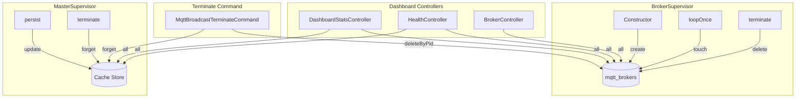
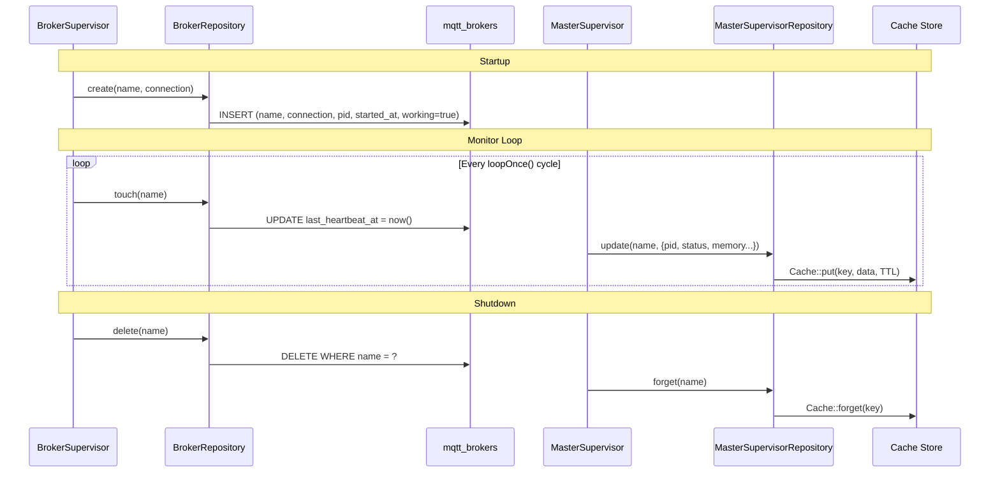

# Repository Pattern

## Overview

The package uses a dual-repository pattern inspired by Laravel Horizon to separate broker process persistence (database) from master supervisor state persistence (cache). `BrokerRepository` manages MQTT broker process records in the `mqtt_brokers` table, while `MasterSupervisorRepository` stores ephemeral supervisor state in the configured cache driver. Both are registered as singletons via the `ServiceBindings` trait and injected into supervisors, controllers, and Artisan commands.

## Architecture

Two persistence strategies serve different data lifecycle requirements:

| Concern | Repository | Storage | Why |
|---|---|---|---|
| Broker processes | `BrokerRepository` | Database (`mqtt_brokers`) | Durable records survive process restarts; queryable by controllers |
| Master supervisor state | `MasterSupervisorRepository` | Cache (Redis/File/Array) | Ephemeral state with TTL; no migrations needed; fast reads |

Both repositories follow the **silent-fail pattern** from Horizon: operations on non-existent records complete without throwing exceptions. This simplifies cleanup logic in terminate commands and shutdown hooks where partial state is expected.

Both are registered in the service container as singletons via the `ServiceBindings` trait in `MqttBroadcastServiceProvider`:

```php
// src/ServiceBindings.php
public $serviceBindings = [
    MqttClientFactory::class,
    BrokerRepository::class,
    MasterSupervisorRepository::class,
];
```

## How It Works

### BrokerRepository Lifecycle

1. **Create** -- `BrokerSupervisor::__construct()` calls `$repository->create($name, $connection)`, recording the process PID, start time, and initial heartbeat timestamp.
2. **Heartbeat** -- On each `loopOnce()` cycle, `BrokerSupervisor` calls `$repository->touch($name)` to update `last_heartbeat_at`. Controllers use this timestamp to determine connection status (active if heartbeat < 2 minutes ago).
3. **Terminate** -- `BrokerSupervisor::terminate()` calls `$repository->delete($name)`. The terminate command also uses `deleteByPid()` for PID-based cleanup.

### MasterSupervisorRepository Lifecycle

1. **Update** -- `MasterSupervisor::persist()` calls `$repository->update($name, $attributes)` on each monitor loop iteration, storing PID, status, supervisor count, memory usage, and an auto-appended `updated_at` timestamp.
2. **Read** -- `DashboardStatsController` and `HealthController` call `$repository->all()` and `$repository->find()` to display supervisor state in the dashboard.
3. **Forget** -- `MasterSupervisor::terminate()` calls `$repository->forget($name)` to remove state before exiting.

### Cache Key Listing (Multi-Driver)

`MasterSupervisorRepository::names()` needs to discover all active supervisors by scanning cache keys with the `mqtt-broadcast:master:` prefix. Since Laravel's Cache facade does not provide a `keys()` method, the repository implements per-driver key listing:

| Driver | Strategy | Limitation |
|---|---|---|
| `redis` | `$connection->keys($prefix . '*')` via Redis KEYS command | Full support; strips store prefix from returned keys |
| `file` | `glob($directory . '/*')` + deserialize each file to extract key | Reads and parses every cache file; O(n) on total cache size |
| `memcached` | Returns `[]` | Memcached protocol does not support key enumeration |
| `array` | Reflection on `$store->storage` property | Testing only; uses `ReflectionClass` to access private property |
| Other | Returns `[]` | Unsupported drivers silently return empty |

For the file driver, `getKeyFromFile()` reads each file, skips the 10-byte expiration prefix, then unserializes the payload to extract the `key` field. Corrupted files are logged as warnings and skipped.

## Key Components

| File | Class/Method | Responsibility |
|---|---|---|
| `src/Repositories/BrokerRepository.php` | `BrokerRepository::create()` | Insert broker record with current PID and timestamps |
| | `BrokerRepository::find()` | Lookup broker by name |
| | `BrokerRepository::all()` | Return all broker records as Collection |
| | `BrokerRepository::touch()` | Update `last_heartbeat_at` (silent fail) |
| | `BrokerRepository::delete()` | Delete by name (silent fail) |
| | `BrokerRepository::deleteByPid()` | Delete all records matching a PID (silent fail) |
| | `BrokerRepository::generateName()` | Generate `{hostname-slug}-{random4}` identifier |
| `src/Repositories/MasterSupervisorRepository.php` | `MasterSupervisorRepository::update()` | Store/overwrite supervisor state with auto `updated_at` |
| | `MasterSupervisorRepository::find()` | Retrieve state by supervisor name |
| | `MasterSupervisorRepository::forget()` | Remove state from cache (silent fail) |
| | `MasterSupervisorRepository::all()` | Discover and return all supervisor states |
| | `MasterSupervisorRepository::names()` | List active supervisor names via driver-specific key scan |
| | `MasterSupervisorRepository::getCacheKeys()` | Dispatch to driver-specific key listing strategy |
| `src/Models/BrokerProcess.php` | `BrokerProcess` | Eloquent model for `mqtt_brokers` table |
| `src/ServiceBindings.php` | `ServiceBindings` | Registers both repositories as singletons |

## Database Schema

### `mqtt_brokers` table

| Column | Type | Notes |
|---|---|---|
| `id` | `bigint` (PK) | Auto-increment |
| `name` | `string` | Unique broker identifier (e.g. `johns-macbook-a3f2`) |
| `connection` | `string` | MQTT connection name from config |
| `pid` | `unsigned int` (nullable) | OS process ID |
| `working` | `boolean` | Default `false`; set `true` on create |
| `started_at` | `datetimetz` (nullable) | Process start timestamp |
| `last_heartbeat_at` | `timestamp` (nullable) | Updated on each `touch()` call |
| `created_at` / `updated_at` | `timestamp` | Eloquent timestamps |

### Cache state structure (MasterSupervisorRepository)

Cache key format: `mqtt-broadcast:master:{name}`

```php
[
    'pid'          => 12345,
    'status'       => 'running',    // running | paused
    'supervisors'  => 2,
    'memory'       => 45.2,         // MB
    'started_at'   => '2026-01-26 10:00:00',
    'updated_at'   => '2026-01-26 10:05:00', // auto-appended
]
```

## Configuration

| Config Key | Env Var | Default | Description |
|---|---|---|---|
| `master_supervisor.cache_ttl` | `MQTT_MASTER_CACHE_TTL` | `3600` | Cache TTL in seconds for supervisor state |
| `master_supervisor.cache_driver` | `MQTT_CACHE_DRIVER` | `redis` | Cache driver used by `MasterSupervisorRepository` |
| `repository.broker.heartbeat_column` | -- | `last_heartbeat_at` | Column name for heartbeat timestamps |
| `repository.broker.stale_threshold` | `MQTT_STALE_THRESHOLD` | `300` | Seconds after which a broker is considered stale |

## Error Handling

**BrokerRepository** -- All operations use the silent-fail pattern. `touch()`, `delete()`, and `deleteByPid()` on non-existent records complete silently (no exceptions). This is intentional: during termination, broker records may already be cleaned up by another process.

**MasterSupervisorRepository** -- `forget()` on a non-existent key is a no-op (Laravel Cache behavior). The `getKeyFromFile()` method catches `Throwable` during deserialization, logs a warning, and returns `null` -- corrupted cache files do not block supervisor discovery. Reflection failures in the array driver are caught via `ReflectionException`.

**Memcached limitation** -- The Memcached driver cannot enumerate keys. `MasterSupervisorRepository::all()` and `names()` will return empty results. This is documented but not worked around; Redis is the recommended production driver.




