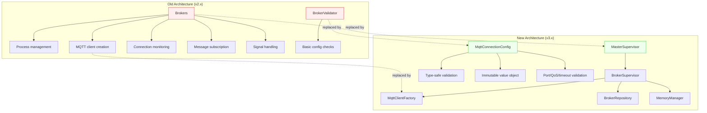

# Deprecations & Migration Guide

## Overview

Version 2.5.0 introduced a Horizon-inspired supervisor architecture that replaces the original monolithic `Brokers` class. Version 3.0 further replaced the basic `BrokerValidator` with the type-safe `MqttConnectionConfig` value object. This guide documents the deprecated classes, their replacements, and the migration path.

## Deprecated Classes

### `Brokers` (deprecated since 2.5.0, removal in 3.0)

**File:** `src/Brokers.php`

The original `Brokers` class was a monolithic component that handled broker process management, MQTT client creation, connection monitoring, message subscription, and signal handling — all in a single class.

**Problems with the old approach:**

- Single Responsibility violation: process management, MQTT client creation, subscription, and signal handling all merged together
- Direct `config()` calls for client construction — no validation, no type safety
- Hardcoded `while (true)` monitor loop with no memory management or circuit breaker
- No reconnection strategy — if the connection dropped, the process died
- `exit()` calls in the class body made it untestable

### `BrokerValidator` (deprecated since 3.0, removal in 4.0)

**File:** `src/Support/BrokerValidator.php`

A basic static validator that checked for the presence of `host`, `port`, and credentials in broker configuration. It relied on a now-removed `InvalidBrokerException` class.

**Problems with the old approach:**

- No port range validation (accepted `0` or `99999`)
- No QoS value validation
- No timeout/interval validation
- `throw_unless` with static exception factories — error messages lacked structured context
- The `InvalidBrokerException` class it depended on has been removed from the codebase

## Replacement Architecture



## Migration: `Brokers` to Supervisor Architecture

### Process creation & management

**Before (v2.x):**
```php
$broker = new Brokers();
$broker->make('default');  // Creates BrokerProcess + starts monitoring
$broker->monitor();        // Blocks forever
```

**After (v3.x):**
```php
// Process creation is handled by MasterSupervisor
// which spawns BrokerSupervisor instances per configured connection.
// You no longer create broker processes manually.

// Start via Artisan:
// php artisan mqtt-broadcast

// Internally:
$master = new MasterSupervisor($name, $environment);
$master->monitor();  // Creates BrokerSupervisors with memory management,
                     // reconnection, circuit breaker, graceful shutdown
```

### MQTT client creation

**Before (v2.x):**
```php
$broker = new Brokers();
$client = $broker->client('broker-name', randomId: true);
// Client is already connected — no control over when connection happens
// No validation of config values
```

**After (v3.x):**
```php
// Via factory (IoC-resolved singleton):
$factory = app(MqttClientFactory::class);
$client = $factory->create('default', clientId: 'custom-id');
// Client is NOT connected — caller decides when to connect()
// Config is validated through MqttConnectionConfig

// Or with validated config object directly:
$config = MqttConnectionConfig::fromConnection('default');
$client = $factory->createFromConfig($config);

// Get connection settings for manual connect:
$settings = $factory->getConnectionSettings('default');
$client->connect($settings['settings'], $settings['cleanSession']);
```

### Process lookup & termination

**Before (v2.x):**
```php
$broker = new Brokers();
$process = $broker->find('broker-name');
$all = $broker->all();
Brokers::terminateByPid($pid);  // Direct DB delete
```

**After (v3.x):**
```php
// Via BrokerRepository (IoC-resolved singleton):
$repo = app(BrokerRepository::class);
$broker = $repo->find($name);
$brokers = $repo->all();

// Termination via Artisan command with proper cleanup:
// php artisan mqtt-broadcast:terminate
// Sends SIGTERM, cleans DB + cache, handles ESRCH
```

### Signal handling

**Before (v2.x):**
```php
// Brokers used ListensForSignals directly
// Only SIGTERM basic handling, no SIGUSR1/SIGUSR2/SIGCONT
$broker->listenForSignals();
$broker->processPendingSignals();
```

**After (v3.x):**
```php
// BrokerSupervisor extends the signal handling with:
// - SIGTERM  → graceful shutdown (disconnect, cleanup, exit)
// - SIGUSR1  → restart (reconnect to broker)
// - SIGUSR2  → pause (stop processing, keep connection)
// - SIGCONT  → resume (continue processing)
// All managed by MasterSupervisor orchestration
```

## Migration: `BrokerValidator` to `MqttConnectionConfig`

**Before (v3.x with deprecated class):**
```php
use enzolarosa\MqttBroadcast\Support\BrokerValidator;

BrokerValidator::validate('default');
// Throws InvalidBrokerException (class now removed) if host/port missing
// No further validation of config values
```

**After (v3.x with new class):**
```php
use enzolarosa\MqttBroadcast\Support\MqttConnectionConfig;

$config = MqttConnectionConfig::fromConnection('default');
// Throws MqttBroadcastException with structured context if:
// - Connection not configured
// - Host missing
// - Port missing or out of range (1-65535)
// - QoS invalid (not 0, 1, or 2)
// - Timeout/interval negative
// - Auth enabled but credentials missing

// Access validated values as typed properties:
$config->host();           // string
$config->port();           // int (validated range)
$config->qos();            // int (0, 1, or 2)
$config->requiresAuth();   // bool
$config->prefix();         // string
$config->useTls();         // bool
```

## Key Components

| File | Class/Method | Responsibility |
|------|-------------|----------------|
| `src/Brokers.php` | `Brokers` | **Deprecated.** Monolithic broker process manager (v2.x) |
| `src/Brokers.php` | `Brokers::make()` | **Deprecated.** Creates BrokerProcess + triggers deprecation notice |
| `src/Brokers.php` | `Brokers::client()` | **Deprecated.** Creates connected MQTT client from config |
| `src/Brokers.php` | `Brokers::monitor()` | **Deprecated.** Blocking subscription loop |
| `src/Support/BrokerValidator.php` | `BrokerValidator::validate()` | **Deprecated.** Basic config presence check |
| `src/Supervisors/MasterSupervisor.php` | `MasterSupervisor` | **Replacement.** Orchestrates BrokerSupervisors |
| `src/Supervisors/BrokerSupervisor.php` | `BrokerSupervisor` | **Replacement.** Per-broker process with reconnection + circuit breaker |
| `src/Factories/MqttClientFactory.php` | `MqttClientFactory::create()` | **Replacement.** Creates uncoupled, testable MQTT clients |
| `src/Support/MqttConnectionConfig.php` | `MqttConnectionConfig::fromConnection()` | **Replacement.** Type-safe validated config value object |
| `src/Repositories/BrokerRepository.php` | `BrokerRepository` | **Replacement.** Broker process CRUD operations |

## Deprecation Notices at Runtime

Both deprecated classes emit `trigger_deprecation()` notices when used:

```
// Brokers::make() triggers:
// "The enzolarosa\MqttBroadcast\Brokers class is deprecated,
//  use enzolarosa\MqttBroadcast\Supervisors\BrokerSupervisor instead."

// BrokerValidator::validate() triggers:
// "BrokerValidator::validate() is deprecated,
//  use MqttConnectionConfig::fromConnection() instead."
```

These notices appear in logs (if `E_USER_DEPRECATED` is enabled) and can be caught by error tracking tools like Sentry or Flare.

## Removal Timeline

| Class | Deprecated In | Removed In | Replacement |
|-------|--------------|------------|-------------|
| `Brokers` | v2.5.0 | v3.0 | `MasterSupervisor` + `BrokerSupervisor` + `MqttClientFactory` |
| `BrokerValidator` | v3.0 | v4.0 | `MqttConnectionConfig::fromConnection()` |
| `InvalidBrokerException` | v3.0 | v3.0 (already removed) | `MqttBroadcastException` static factories |
