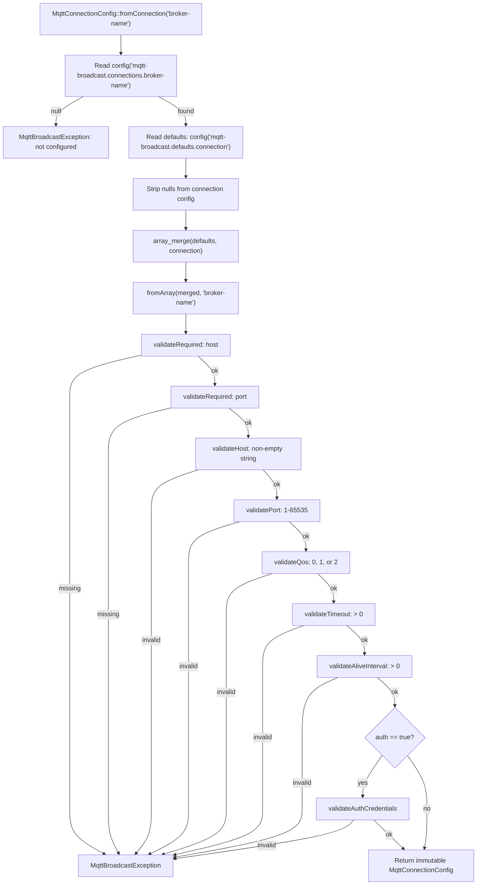
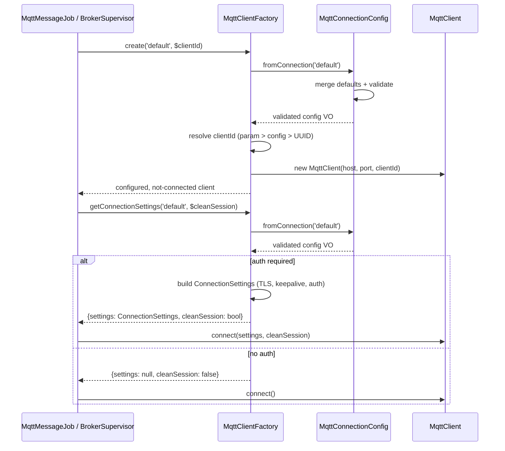
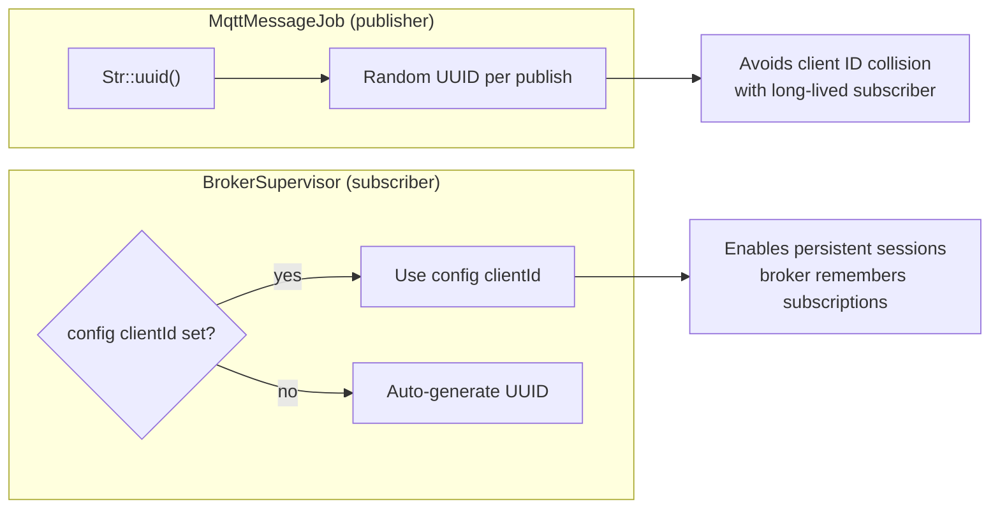

# Connection Management

## Overview

Connection management is the foundational layer that all MQTT operations depend on — publishing, subscribing, and supervision. It solves three problems:

1. **Configuration validation**: catching invalid broker settings at construction time rather than at runtime deep in a queue worker.
2. **Client creation**: providing a consistent factory interface that handles client ID assignment, TLS, authentication, and clean session negotiation.
3. **Default merging**: allowing per-connection overrides while inheriting sensible global defaults.

The two key classes are `MqttConnectionConfig` (immutable validated value object) and `MqttClientFactory` (client instantiation and connection settings builder).

## Architecture

The design follows two patterns:

- **Value Object** (`MqttConnectionConfig`): immutable, validated at construction, fail-fast on invalid config. Created via named constructors (`fromConnection`, `fromArray`). Cannot be modified after creation.
- **Factory** (`MqttClientFactory`): creates `PhpMqtt\Client\MqttClient` instances from validated config. Returns configured-but-not-connected clients so callers control the connection lifecycle.

The factory delegates all validation to `MqttConnectionConfig`, which means any `MqttBroadcastException` thrown during client creation is always a config error (fail-fast, no retry).

## How It Works

### MqttConnectionConfig Lifecycle

1. **Entry point**: `MqttConnectionConfig::fromConnection('default')` reads `config('mqtt-broadcast.connections.default')`.
2. **Default merging**: merges with `config('mqtt-broadcast.defaults.connection')` — connection values take precedence over defaults, but `null` values are stripped before merging so defaults apply.
3. **Validation chain**: validates each field in order:
   - `host` — required, non-empty string
   - `port` — required, integer 1–65535
   - `qos` — integer 0, 1, or 2
   - `timeout` — positive integer
   - `alive_interval` — positive integer
   - `auth` credentials — if `auth` is `true`, both `username` and `password` must be non-empty strings
4. **Construction**: the private constructor is called with all validated values. The object is now immutable.

Any validation failure throws `MqttBroadcastException` with a message identifying the connection name and the invalid field.

### MqttClientFactory Lifecycle

1. **`create($connection, $clientId)`**: resolves config via `MqttConnectionConfig::fromConnection()`, then delegates to `createFromConfig()`.
2. **Client ID resolution** (three-tier fallback):
   - Explicit `$clientId` parameter (used by `MqttMessageJob` — random UUID per publish to avoid collisions)
   - `clientId` from connection config (used by `BrokerSupervisor` — fixed ID for persistent subscriptions)
   - Auto-generated UUID (fallback)
3. **Client instantiation**: creates `new MqttClient($host, $port, $clientId)` — configured but **not connected**.
4. **`getConnectionSettings($connection, $cleanSession)`**: builds `PhpMqtt\Client\ConnectionSettings` with TLS, keep-alive, timeout, and auth credentials. Returns `null` settings when `auth` is `false` (no auth needed).

### Integration Points

- **`MqttMessageJob::mqtt()`** calls `$factory->create($broker, $uuid)` + `$factory->getConnectionSettings($broker, true)` — ephemeral publisher with random ID.
- **`BrokerSupervisor`** calls `$factory->create($broker)` — long-lived subscriber with config-defined or auto-generated ID.
- **`MqttBroadcastCommand`** validates config existence via `MqttConnectionConfig::fromConnection()` during startup.

## Key Components

| File | Class/Method | Responsibility |
|------|-------------|----------------|
| `src/Support/MqttConnectionConfig.php` | `MqttConnectionConfig` | Immutable validated connection config value object |
| `src/Support/MqttConnectionConfig.php` | `::fromConnection($name)` | Named constructor: reads config, merges defaults, validates |
| `src/Support/MqttConnectionConfig.php` | `::fromArray($config)` | Named constructor: validates raw array (for testing/custom use) |
| `src/Support/MqttConnectionConfig.php` | `->toArray()` | Serialization for backward compatibility |
| `src/Support/MqttConnectionConfig.php` | `validateHost()` | Non-empty string check |
| `src/Support/MqttConnectionConfig.php` | `validatePort()` | Integer 1–65535 range check |
| `src/Support/MqttConnectionConfig.php` | `validateQos()` | Integer 0, 1, or 2 |
| `src/Support/MqttConnectionConfig.php` | `validateTimeout()` | Positive integer check |
| `src/Support/MqttConnectionConfig.php` | `validateAliveInterval()` | Positive integer check |
| `src/Support/MqttConnectionConfig.php` | `validateAuthCredentials()` | Username + password required when `auth=true` |
| `src/Factories/MqttClientFactory.php` | `MqttClientFactory` | Creates configured-but-not-connected MQTT clients |
| `src/Factories/MqttClientFactory.php` | `create($connection, $clientId)` | Config-name-based client creation |
| `src/Factories/MqttClientFactory.php` | `createFromConfig($config, $clientId)` | Type-safe creation from validated VO |
| `src/Factories/MqttClientFactory.php` | `getConnectionSettings($connection)` | Builds `ConnectionSettings` with auth/TLS |
| `src/Factories/MqttClientFactory.php` | `getConnectionSettingsFromConfig($config)` | Type-safe settings from validated VO |

## Configuration

All connection config lives under `mqtt-broadcast.connections.{name}`:

| Key | Type | Default | Description |
|-----|------|---------|-------------|
| `host` | `string` | `127.0.0.1` | MQTT broker hostname (required) |
| `port` | `int` | `1883` | MQTT broker port (required, 1–65535) |
| `username` | `string\|null` | `null` | Auth username |
| `password` | `string\|null` | `null` | Auth password |
| `prefix` | `string` | `''` | Topic prefix prepended to all topics |
| `use_tls` | `bool` | `false` | Enable TLS/SSL encryption |
| `clientId` | `string\|null` | `null` | Fixed client ID (null = auto-generate UUID) |

Global defaults under `mqtt-broadcast.defaults.connection`:

| Key | Type | Default | Description |
|-----|------|---------|-------------|
| `qos` | `int` | `0` | Quality of Service (0=at most once, 1=at least once, 2=exactly once) |
| `retain` | `bool` | `false` | Retain messages on broker |
| `clean_session` | `bool` | `false` | Request clean session on connect |
| `alive_interval` | `int` | `60` | Keep-alive interval in seconds |
| `timeout` | `int` | `3` | Connection timeout in seconds |
| `self_signed_allowed` | `bool` | `true` | Allow self-signed TLS certificates |
| `max_retries` | `int` | `20` | Reconnection max attempts |
| `max_retry_delay` | `int` | `60` | Max seconds between reconnection attempts |
| `max_failure_duration` | `int` | `3600` | Max seconds of continuous failure before giving up |
| `terminate_on_max_retries` | `bool` | `false` | Kill process after max retries exhausted |

### Default Merging Logic

```php
$defaults = config('mqtt-broadcast.defaults.connection', []);
$config = array_merge($defaults, array_filter($config, fn ($value) => $value !== null));
```

Connection-level values override defaults. `null` values in the connection config are stripped before merging, so the default applies. This means setting a connection key to `null` explicitly will fall through to the default — there is no way to "unset" a default.

## Error Handling

All validation errors throw `MqttBroadcastException` with descriptive messages:

| Scenario | Exception Message Pattern | Recovery |
|----------|--------------------------|----------|
| Connection not in config | `Connection "{name}" is not configured` | Add connection to `config/mqtt-broadcast.php` |
| Missing `host` | `Connection "{name}" is missing required configuration: host` | Set `host` in connection config |
| Missing `port` | `Connection "{name}" is missing required configuration: port` | Set `port` in connection config |
| Invalid host type | `Connection "{name}" has invalid host: must be non-empty string, got: {type}` | Fix host value |
| Port out of range | `Connection "{name}" has invalid port: must be between 1 and 65535, got: {value}` | Fix port value |
| Invalid QoS | `Connection "{name}" has invalid qos: must be 0, 1, or 2, got: {value}` | Use 0, 1, or 2 |
| Non-positive timeout | `Connection "{name}" has invalid timeout: must be greater than 0, got: {value}` | Use positive integer |
| Non-positive alive_interval | `Connection "{name}" has invalid alive_interval: must be greater than 0, got: {value}` | Use positive integer |
| Auth enabled, missing username | `Connection "{name}" has auth enabled but missing or invalid username` | Set username or disable auth |
| Auth enabled, missing password | `Connection "{name}" has auth enabled but missing or invalid password` | Set password or disable auth |

In `MqttMessageJob`, config errors are caught and the job is **failed immediately** (`$this->fail($e)`) without retry — config errors won't fix themselves between retries. Network errors are left to Laravel's standard retry mechanism.

## Mermaid Diagrams

### Config Resolution Flow



### Client Creation & Connection Flow



### Client ID Strategy


