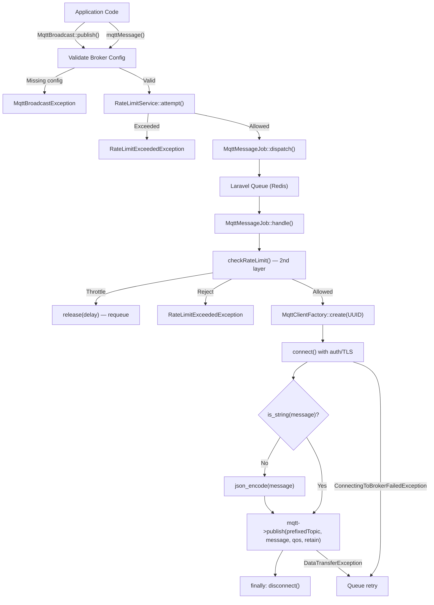
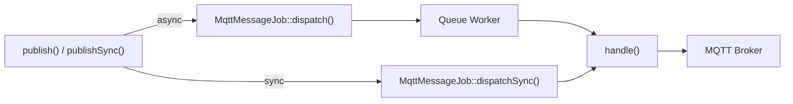
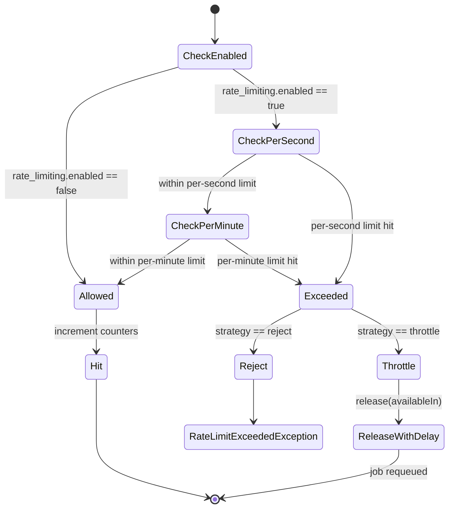
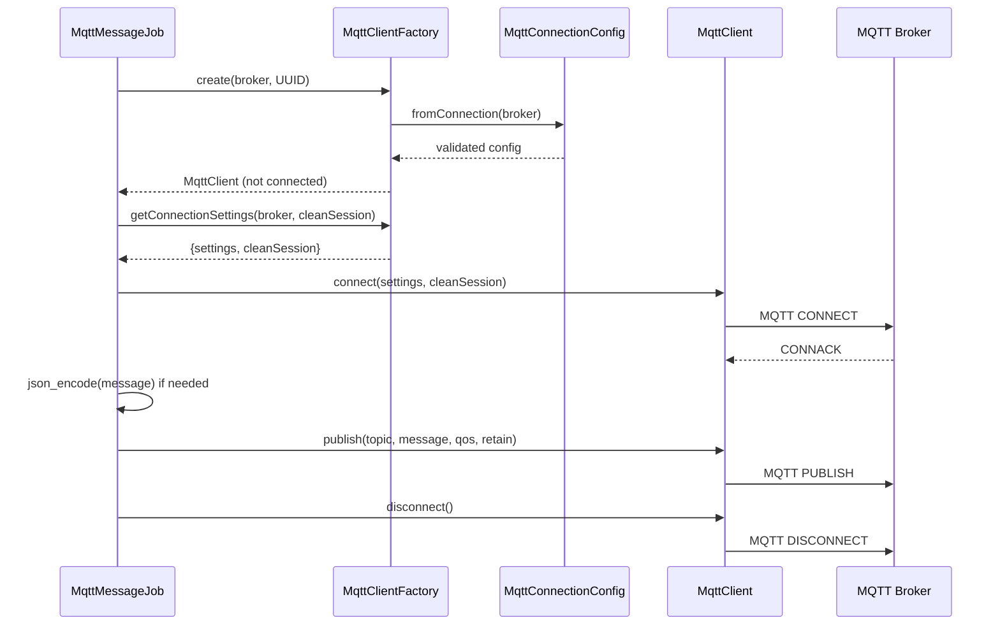

# Message Publishing

## Overview

Message publishing is the core outbound feature of MQTT Broadcast. It allows Laravel applications to send messages to any MQTT broker through a clean facade API, with support for both asynchronous (queued) and synchronous dispatch. The system enforces two-layer rate limiting, automatic JSON serialization for non-string payloads, topic prefixing, and a fail-fast strategy for configuration errors vs. retryable network errors.

Publishing is exposed through three interfaces:
- **`MqttBroadcast` facade** — primary API (`publish()`, `publishSync()`)
- **Helper functions** — `mqttMessage()` and `mqttMessageSync()` for quick one-liners
- **`MqttMessageJob`** — the queueable job that performs the actual MQTT publish

## Architecture

The publishing pipeline follows a **facade -> validation -> rate limit -> job dispatch -> MQTT client** pattern:

1. The facade validates broker configuration and enforces the first rate limit check.
2. A `MqttMessageJob` is dispatched (async or sync depending on the method called).
3. The job performs a second rate limit check, creates an ephemeral MQTT client via `MqttClientFactory`, connects, publishes, and disconnects.

Key design decisions:
- **Two-layer rate limiting**: the facade checks rate limits _before_ enqueueing to avoid flooding the queue with messages that will be rejected. The job checks again _before_ publishing to catch bursts that slip through during queue processing.
- **Ephemeral connections**: each publish creates a fresh MQTT client with a random UUID as client ID, avoiding conflicts with the long-lived subscriber client IDs. The connection is always torn down in a `finally` block.
- **Fail-fast for config errors**: `MqttBroadcastException` (missing broker, missing host/port) causes immediate job failure without retry. Network errors (`ConnectingToBrokerFailedException`, `DataTransferException`) propagate to the queue worker for standard retry handling.
- **Automatic JSON serialization**: non-string payloads are encoded via `json_encode(..., JSON_THROW_ON_ERROR)` inside the job, keeping the facade API flexible.

## How It Works

### Async Publishing (`publish`)

1. Caller invokes `MqttBroadcast::publish($topic, $message, $broker, $qos)` or `mqttMessage(...)`.
2. `validateBrokerConfiguration()` checks that the broker key exists in config and has `host` + `port`. Throws `MqttBroadcastException` on failure.
3. `RateLimitService::attempt()` checks per-second and per-minute counters. If the limit is exceeded and strategy is `reject`, throws `RateLimitExceededException`. If strategy is `throttle`, returns the retry delay (but at the facade level, `attempt()` always throws on excess — throttle delay is handled in the job).
4. `MqttMessageJob::dispatch($topic, $message, $broker, $qos)` enqueues the job.
5. The job constructor caches QoS and retain values from config, and sets the queue name and connection from `mqtt-broadcast.queue.*`.
6. When the queue worker picks up the job, `handle()` runs:
   - `checkRateLimit()` — second layer. If `allows()` returns false:
     - Strategy `throttle`: `$this->release($delay)` requeues the job with a delay.
     - Strategy `reject`: `$rateLimiter->attempt()` throws `RateLimitExceededException`.
   - If allowed: `hit()` increments the counters.
   - `mqtt()` creates an MQTT client via `MqttClientFactory::create()` with a random UUID client ID, then calls `getConnectionSettings()` to get auth/TLS settings, and connects.
   - The message is JSON-encoded if not already a string.
   - `$mqtt->publish()` sends the message with the prefixed topic, QoS, and retain flag.
   - `finally` block disconnects the client.

### DLQ Integration (`failed` Hook)

When `MqttMessageJob` exhausts all retries or is explicitly failed via `$this->fail($e)`, Laravel invokes the `failed(\Throwable $exception)` method. This persists the failure to the `mqtt_failed_jobs` table:

- `broker` — the target broker (falls back to `'default'` if null)
- `topic` — the original topic string (without prefix)
- `message` — the original message payload
- `qos` — cached QoS level from constructor
- `retain` — cached retain flag from constructor
- `exception` — stringified exception (full stack trace)
- `failed_at` — current timestamp via `now()`

This creates a Dead Letter Queue entry that can be retried or inspected via the dashboard's Failed Jobs tab or the `FailedJobController` API.

### Sync Publishing (`publishSync`)

Identical flow, except:
- `MqttMessageJob::dispatchSync()` is used — the job executes immediately in the current process.
- The `$message` parameter accepts `mixed` (string, array, object).
- Useful when the caller needs confirmation that the message was published before continuing.

### Topic Prefixing

`MqttBroadcast::getTopic($topic, $broker)` prepends the connection's `prefix` config value to the topic string. This is called inside `MqttMessageJob::handle()` before publishing, ensuring all messages go to the correct namespaced topic.

Note: `getTopic()` internally calls `validateBrokerConfiguration()`, so calling it with an unconfigured broker will throw `MqttBroadcastException`. This is usually not an issue since `publish()`/`publishSync()` validate before the job is dispatched, and `getTopic()` in the job uses the same broker name.

### Rate Limiting Strategy

The `RateLimitService` uses Laravel's `RateLimiter` backed by the configured cache driver (default: Redis). It supports two granularities:

- **Per-second**: cache key `mqtt_rate_limit:{connection}:second` with 1-second TTL
- **Per-minute**: cache key `mqtt_rate_limit:{connection}:minute` with 60-second TTL

When `by_connection` is `true` (default), each broker connection has independent counters. When `false`, a single `mqtt_rate_limit:global` key is shared.

Two strategies handle limit exceeded:
- **`reject`**: throws `RateLimitExceededException` with connection name, limit, window, and retry-after seconds.
- **`throttle`**: in the job, calls `$this->release($delay)` to put the job back on the queue after the cooldown period.

### API Surface Inconsistencies

There are intentional differences between the three publishing interfaces:

| Interface | `$message` type | Default `$broker` | Notes |
|-----------|----------------|-------------------|-------|
| `MqttBroadcast::publish()` | `string` | `'default'` | Facade method — strict string type |
| `MqttBroadcast::publishSync()` | `mixed` | `'default'` | Accepts arrays/objects for convenience |
| `mqttMessage()` | `mixed` | `'local'` | Helper function — different default broker |
| `mqttMessageSync()` | `mixed` | `'local'` | Helper function — different default broker |

The helper functions default to `'local'` while the facade defaults to `'default'`. This means calling `mqttMessage('topic', 'msg')` targets the `local` connection, while `MqttBroadcast::publish('topic', 'msg')` targets the `default` connection. This is by design — helpers are intended for local development quick-sends.

The `publish()` facade method accepts `string` only, but `mqttMessage()` accepts `mixed` and passes it through. Since `json_encode()` happens inside the job (not the facade), non-string payloads dispatched via the helper will be serialized in the job's `handle()` method. However, PHPStan will flag direct calls to `MqttBroadcast::publish()` with non-string arguments.

### Constructor Config Caching

The `MqttMessageJob` constructor reads and caches two config values at **dispatch time**, not execution time:

```php
$this->cachedQos = $this->qos ?? config('mqtt-broadcast.connections.'.$this->broker.'.qos', 0);
$this->cachedRetain = config('mqtt-broadcast.connections.'.$this->broker.'.retain', false);
```

Key detail: these read from the **per-connection** config (`connections.{broker}.qos` and `connections.{broker}.retain`), NOT from `defaults.connection.qos`/`defaults.connection.retain`. If the connection doesn't define `qos` or `retain`, the fallback is `0` and `false` respectively — the global defaults in `defaults.connection.*` are not consulted.

The `$qos` constructor parameter can override the per-connection QoS (passed from `publish()` or `publishSync()`), but there is no parameter to override retain — it always reads from connection config.

### `$cleanSession` Parameter

The `MqttMessageJob` constructor accepts `$cleanSession = true`, but this parameter is **not exposed** through the facade's `publish()` or `publishSync()` methods. It defaults to `true` for all publisher connections, meaning publishers always start with a clean MQTT session (no persistent subscriptions or queued messages from previous sessions).

This contrasts with subscribers (`BrokerSupervisor`), which use the `clean_session` value from config — typically `false` to maintain persistent subscriptions.

### Connection Logic in `mqtt()` Method

The private `mqtt()` method has a conditional connection pattern:

1. Creates a client via `MqttClientFactory::create($broker, $publisherClientId)` — this may throw `MqttBroadcastException` if config is invalid.
2. Calls `MqttClientFactory::getConnectionSettings($broker, $cleanSession)` to get auth/TLS settings.
3. **Only connects if `$connectionInfo['settings']` is non-null**. If no authentication or TLS is configured, the client is returned unconnected.

Then in `handle()`, there's an `if (!$mqtt->isConnected())` guard before calling `$mqtt->connect()`. This handles the case where `mqtt()` returned an unconnected client (no auth settings). The double-check pattern ensures the client is always connected before publishing, regardless of whether auth is required.

## Key Components

| File | Class/Method | Responsibility |
|------|-------------|----------------|
| `src/MqttBroadcast.php` | `MqttBroadcast::publish()` | Async entry point: validate config, check rate limit, dispatch job |
| `src/MqttBroadcast.php` | `MqttBroadcast::publishSync()` | Sync entry point: same validation, dispatches job synchronously |
| `src/MqttBroadcast.php` | `MqttBroadcast::getTopic()` | Applies connection prefix to topic string |
| `src/MqttBroadcast.php` | `MqttBroadcast::validateBrokerConfiguration()` | Checks broker config exists with host + port |
| `src/Facades/MqttBroadcast.php` | `MqttBroadcast` (Facade) | Laravel facade providing static access |
| `src/Jobs/MqttMessageJob.php` | `MqttMessageJob` | Queueable job: rate limit, create client, encode, publish, disconnect |
| `src/Jobs/MqttMessageJob.php` | `MqttMessageJob::checkRateLimit()` | Second-layer rate limit with throttle/reject strategies |
| `src/Jobs/MqttMessageJob.php` | `MqttMessageJob::mqtt()` | Creates MQTT client via factory, connects with auth settings |
| `src/Jobs/MqttMessageJob.php` | `MqttMessageJob::failed()` | DLQ persistence — writes to `mqtt_failed_jobs` on permanent failure |
| `src/Models/FailedMqttJob.php` | `FailedMqttJob` | Eloquent model for Dead Letter Queue entries |
| `src/Support/RateLimitService.php` | `RateLimitService` | Per-second/per-minute rate limit enforcement using Laravel RateLimiter |
| `src/Support/RateLimitService.php` | `RateLimitService::attempt()` | Check + hit in one call; throws on exceed |
| `src/Support/RateLimitService.php` | `RateLimitService::allows()` | Read-only check without incrementing |
| `src/Support/RateLimitService.php` | `RateLimitService::hit()` | Increments counters for both time windows |
| `src/Support/MqttConnectionConfig.php` | `MqttConnectionConfig` | Immutable value object with validated connection settings |
| `src/Factories/MqttClientFactory.php` | `MqttClientFactory::create()` | Creates unconfigured MQTT client; caller connects |
| `src/Factories/MqttClientFactory.php` | `MqttClientFactory::getConnectionSettings()` | Returns auth/TLS settings for manual connect |
| `src/Exceptions/MqttBroadcastException.php` | `MqttBroadcastException` | Config validation errors (broker not found, missing key) |
| `src/Exceptions/RateLimitExceededException.php` | `RateLimitExceededException` | Rate limit exceeded with connection, limit, window, retry-after |
| `src/functions.php` | `mqttMessage()` | Helper: shorthand for `MqttBroadcast::publish()` |
| `src/functions.php` | `mqttMessageSync()` | Helper: shorthand for `MqttBroadcast::publishSync()` |

## Database Schema

Message publishing does not write to the database directly. However, published messages may be **logged** to the `mqtt_loggers` table when logging is enabled:

### `mqtt_loggers` table

| Column | Type | Description |
|--------|------|-------------|
| `id` | bigint (PK) | Auto-increment primary key |
| `external_id` | uuid (unique) | Unique message identifier |
| `broker` | string (indexed) | Broker connection name |
| `topic` | string (nullable) | MQTT topic the message was published/received on |
| `message` | longText (nullable) | Full message payload |
| `created_at` | timestamp | When the message was logged |
| `updated_at` | timestamp | Laravel timestamp |

**Indexes**: composite index on `(broker, topic, created_at)` for efficient dashboard queries.

Logging is controlled by:
- `mqtt-broadcast.logs.enable` — master toggle
- `mqtt-broadcast.logs.queue` — queue name for the logging job
- `mqtt-broadcast.logs.connection` — database connection (default: `mysql`)
- `mqtt-broadcast.logs.table` — table name (default: `mqtt_loggers`)

## Configuration

### Publishing-related configuration

| Config Key | Env Variable | Default | Description |
|------------|-------------|---------|-------------|
| `connections.{name}.host` | `MQTT_HOST` | `127.0.0.1` | Broker hostname (required) |
| `connections.{name}.port` | `MQTT_PORT` | `1883` | Broker port (required) |
| `connections.{name}.username` | `MQTT_USERNAME` | `null` | Auth username |
| `connections.{name}.password` | `MQTT_PASSWORD` | `null` | Auth password |
| `connections.{name}.prefix` | `MQTT_PREFIX` | `''` | Topic prefix for all messages |
| `connections.{name}.use_tls` | `MQTT_USE_TLS` | `false` | Enable TLS/SSL |
| `connections.{name}.clientId` | `MQTT_CLIENT_ID` | `null` | Custom client ID (publishers use random UUID) |
| `defaults.connection.qos` | — | `0` | Default QoS level (0, 1, or 2) |
| `defaults.connection.retain` | — | `false` | Default retain flag |
| `defaults.connection.clean_session` | — | `false` | Default clean session flag |
| `defaults.connection.alive_interval` | — | `60` | Keep-alive interval (seconds) |
| `defaults.connection.timeout` | — | `3` | Connection timeout (seconds) |
| `defaults.connection.self_signed_allowed` | — | `true` | Allow self-signed TLS certs |
| `queue.name` | `MQTT_JOB_QUEUE` | `default` | Queue name for publish jobs |
| `queue.connection` | `MQTT_JOB_CONNECTION` | `redis` | Queue connection driver |
| `rate_limiting.enabled` | — | `true` | Enable rate limiting |
| `rate_limiting.strategy` | — | `reject` | `reject` or `throttle` |
| `rate_limiting.by_connection` | — | `true` | Per-connection or global limits |
| `rate_limiting.cache_driver` | — | `redis` | Cache driver for rate limit counters |
| `defaults.connection.rate_limiting.max_per_minute` | — | `1000` | Messages per minute limit |
| `defaults.connection.rate_limiting.max_per_second` | — | `null` | Messages per second limit (optional) |

Per-connection rate limit overrides can be set inside individual connection blocks:

```php
'connections' => [
    'high-throughput' => [
        'host' => env('MQTT_HT_HOST'),
        'port' => env('MQTT_HT_PORT', 1883),
        'rate_limiting' => [
            'max_per_minute' => 5000,
            'max_per_second' => 100,
        ],
    ],
],
```

## Error Handling

| Failure Scenario | Where Caught | Handling |
|-----------------|-------------|----------|
| Broker not configured (missing config key) | `MqttBroadcast::validateBrokerConfiguration()` | Throws `MqttBroadcastException` — prevents dispatch |
| Missing host or port | `MqttBroadcast::validateBrokerConfiguration()` | Throws `MqttBroadcastException` — prevents dispatch |
| Rate limit exceeded (reject strategy) | `RateLimitService::attempt()` | Throws `RateLimitExceededException` with retry-after |
| Rate limit exceeded (throttle strategy, in job) | `MqttMessageJob::checkRateLimit()` | Calls `$this->release($delay)` — job requeued with delay |
| Invalid connection config (host/port/QoS validation) | `MqttMessageJob::handle()` via `MqttClientFactory` | `$this->fail($e)` — permanent failure, no retry |
| MQTT broker unreachable | `MqttMessageJob::handle()` | `ConnectingToBrokerFailedException` propagates — queue retries |
| Connection lost during publish | `MqttMessageJob::handle()` | `DataTransferException` propagates — queue retries |
| JSON encoding failure | `MqttMessageJob::handle()` | `JsonException` (JSON_THROW_ON_ERROR) propagates — queue retries |
| Any error during publish | `MqttMessageJob::handle()` finally block | MQTT client disconnected regardless of outcome |
| Job permanently failed (all retries exhausted or `$this->fail()`) | `MqttMessageJob::failed()` | Persists to `mqtt_failed_jobs` table for DLQ tracking and dashboard visibility |

## Mermaid Diagrams

### Async Publishing Flow



### Sync vs Async Decision



### Rate Limiting State Machine



### MQTT Client Lifecycle (per publish)


