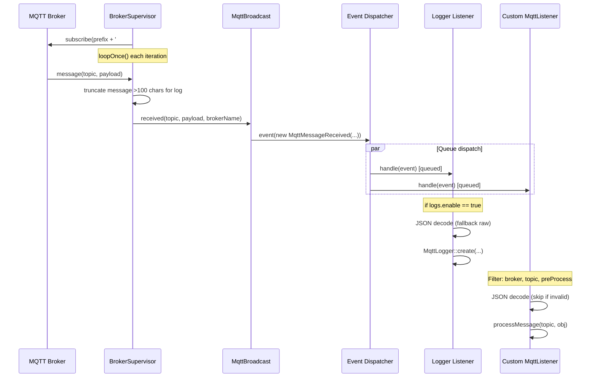
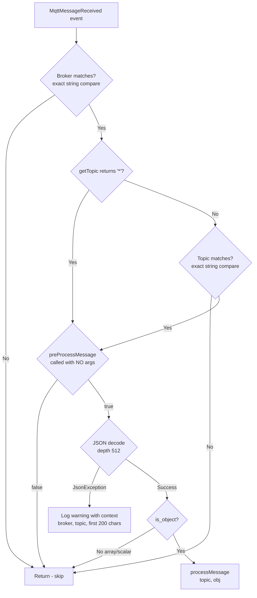
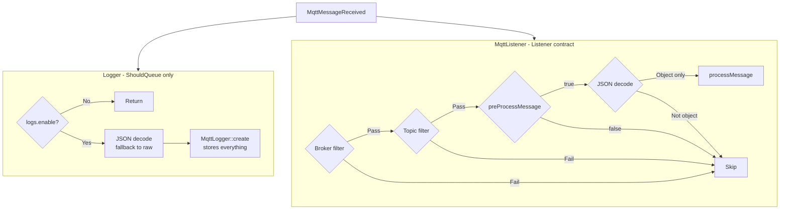
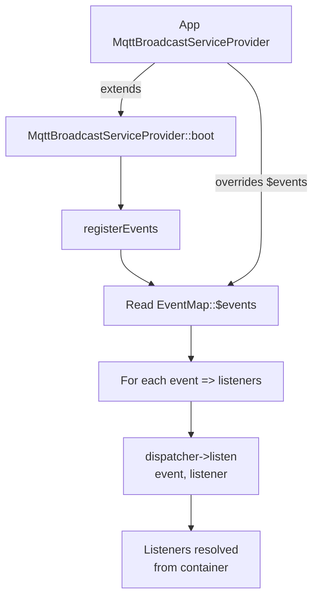

# Message Subscription & Events

## Overview

Message subscription is the inbound counterpart to [message publishing](../publishing/message-publishing.md). It allows the application to receive MQTT messages from one or more brokers and route them through Laravel's event system to application-defined listeners.

The subscription pipeline runs inside the long-lived supervisor process (`mqtt:broadcast`). Each `BrokerSupervisor` maintains a persistent MQTT connection, subscribes to a wildcard topic pattern, and dispatches an `MqttMessageReceived` event for every incoming message. Listeners registered through the `EventMap` trait react to these events — either the built-in `Logger` or custom listeners extending `MqttListener`.

Key design decisions:

- **Event-driven decoupling**: the supervisor process knows nothing about what happens after dispatch. All business logic lives in listeners, which are resolved from the container and processed via the queue.
- **JSON-first with escape hatch**: the abstract `MqttListener` base class assumes JSON payloads and provides topic/broker filtering. For non-JSON messages or custom filtering, listeners can subscribe directly to `MqttMessageReceived`.
- **Queue-based processing**: all listeners implement `ShouldQueue`, so message handling never blocks the supervisor's MQTT loop.
- **Wildcard subscription**: each broker subscribes to `prefix#` (or `#` if no prefix), capturing all topics under the configured prefix.
- **Two listener architectures**: `Logger` implements `ShouldQueue` directly (no filtering, captures everything), while `MqttListener` implements the `Listener` contract (strict JSON-object filtering). This distinction is intentional — the logger is an audit tool, custom listeners are business logic handlers.

## Architecture

```
BrokerSupervisor          MqttBroadcast facade          Laravel Event Dispatcher
     |                           |                              |
     |  client->loopOnce()       |                              |
     |  --> message arrives      |                              |
     |                           |                              |
     |  handleMessage()  -->  received()  -->  event(MqttMessageReceived)
     |                           |                              |
     |                           |                     +--------+--------+
     |                           |                     |                 |
     |                           |               Logger           MqttListener
     |                           |          (ShouldQueue only)    (Listener contract)
     |                           |          no filtering          broker/topic/JSON filter
     |                           |                |                     |
     |                           |           DB insert            processMessage()
```

The flow is intentionally one-directional: the supervisor dispatches and moves on. Listeners process asynchronously on the queue, ensuring the MQTT loop is never blocked by slow handlers.

## How It Works

### 1. Subscription Setup

When `BrokerSupervisor::connect()` establishes a connection, it subscribes to a wildcard topic:

```php
$topic = $prefix === '' ? '#' : $prefix . '#';
$this->client->subscribe($topic, function (string $topic, string $message) {
    $this->handleMessage($topic, $message);
}, $qos);
```

- The `prefix` comes from `config('mqtt-broadcast.connections.{broker}.prefix')`.
- `#` is the MQTT multi-level wildcard — it matches all topics under the prefix.
- `$qos` is the subscription QoS level from the connection config.

### 2. Message Reception

On each iteration of the supervisor loop, `BrokerSupervisor::monitor()` calls `$this->client->loopOnce()`. When the MQTT client has a pending message, it invokes the subscription callback, which calls `handleMessage()`:

```php
protected function handleMessage(string $topic, string $message): void
{
    // Truncate long messages (>100 chars) for display
    $displayMessage = strlen($message) > 100
        ? substr($message, 0, 100) . '...'
        : $message;

    $this->output('info', sprintf('Message received on topic [%s]: %s', $topic, $displayMessage));

    try {
        MqttBroadcast::received($topic, $message, $this->brokerName);
    } catch (Throwable $e) {
        $this->output('error', $e->getMessage());
    }
}
```

Exceptions from event dispatch are caught and logged — they never crash the supervisor or break the MQTT connection.

### 3. Event Dispatch

`MqttBroadcast::received()` wraps a single line:

```php
public static function received(string $topic, string $message, string $broker = 'default'): void
{
    event(new MqttMessageReceived($topic, $message, $broker));
}
```

This fires Laravel's event dispatcher, which routes the event to all registered listeners. Note that `received()` does not pass a PID — the `MqttMessageReceived::$pid` constructor parameter exists for internal/testing use but is never populated in the standard subscription flow.

### 4. Event Registration

The `EventMap` trait, used by `MqttBroadcastServiceProvider`, defines the default listener mapping:

```php
protected array $events = [
    MqttMessageReceived::class => [
        Logger::class,
    ],
];
```

During `boot()`, the service provider iterates `$events` and calls `$dispatcher->listen($event, $listener)` for each pair. The application's published `MqttBroadcastServiceProvider` can override `$events` to add custom listeners.

### 5. Logger Listener (Built-in)

The `Logger` listener stores every received message in the database. Unlike custom listeners, `Logger` does **not** extend `MqttListener` or implement the `Listener` contract — it implements `ShouldQueue` directly with its own `handle()` method. This means it bypasses all the broker/topic/JSON filtering that `MqttListener` enforces.

```php
class Logger implements ShouldQueue
{
    use InteractsWithQueue, Queueable, SerializesModels;

    public function viaQueue(): string
    {
        return config('mqtt-broadcast.logs.queue');
    }

    public function handle(MqttMessageReceived $event): void
    {
        if (! config('mqtt-broadcast.logs.enable')) {
            return;
        }

        // JSON decode with fallback to raw string
        try {
            $message = json_decode($rawMessage, false, 512, JSON_THROW_ON_ERROR);
        } catch (\JsonException $e) {
            $message = $rawMessage;
        }

        MqttLogger::query()->create([
            'topic' => $topic,
            'message' => $message,
            'broker' => $broker,
        ]);
    }
}
```

- Disabled by default — enable with `MQTT_LOG_ENABLE=true`.
- Runs on its own queue via `viaQueue()`: `config('mqtt-broadcast.logs.queue')`.
- Accepts **all** messages (JSON and non-JSON, objects and arrays) — no filtering.
- Writes to a configurable database connection: `MqttLogger::getConnectionName()` reads `config('mqtt-broadcast.logs.connection')`.
- Table name is also configurable: `MqttLogger::getTable()` reads `config('mqtt-broadcast.logs.table', 'mqtt_loggers')`.
- The `MqttLogger` model uses the `HasExternalId` trait, which auto-generates a UUID `external_id` on creation and uses it as the route key for API access.
- The `message` column has a `json` cast — Eloquent handles serialization automatically, so both decoded JSON objects and raw strings are stored correctly.

### 6. Custom Listeners (MqttListener)

Custom listeners extend `MqttListener` and implement `processMessage()`:

```php
class TemperatureSensorListener extends MqttListener
{
    protected string $handleBroker = 'local';
    protected string $topic = 'sensors/temperature';

    public function processMessage(string $topic, object $obj): void
    {
        // $obj is the decoded JSON payload
        SensorReading::create(['value' => $obj->value]);
    }
}
```

`MqttListener` uses three queue traits — `InteractsWithQueue`, `Queueable`, `SerializesModels` — giving subclasses access to queue features like `$this->release($delay)` for re-queuing and `$this->delete()` for manual removal.

**Default property values:**

| Property | Default | Description |
|----------|---------|-------------|
| `$handleBroker` | `'local'` | Broker connection name to filter on |
| `$topic` | `'*'` | Topic to match (wildcard `*` matches all) |

Queue routing is handled by `viaQueue()`, which returns `config('mqtt-broadcast.queue.listener')`.

**The filtering pipeline in `handle()`:**

The `handle()` method applies three filters before calling `processMessage()`:

1. **Broker filter**: `$event->getBroker() !== $this->handleBroker` — skips messages from other brokers. This is an exact string comparison.
2. **Topic filter**: `$event->getTopic() !== $this->getTopic()` — skips non-matching topics. The check is inverted when `$this->getTopic()` returns `'*'`. **Important**: this is exact string matching, not MQTT wildcard matching. The `+` and `#` MQTT wildcards are not supported in listener-level topic filtering — only the literal `*` value (meaning "match all") is handled as a special case.
3. **Pre-process hook**: `preProcessMessage()` — returns `false` to skip. Default is `true`.

After filtering, it JSON-decodes the message:

- Invalid JSON: logs a warning with context (broker, topic, first 200 chars of message, error) and returns.
- Valid JSON but not an object (e.g., array, scalar): silently returns.
- Valid JSON object: passed to `processMessage()`.

Topic matching uses the prefixed topic via `MqttBroadcast::getTopic()`, so `$topic = 'sensors/temperature'` with prefix `home/` matches `home/sensors/temperature`.

### preProcessMessage() Signature

```php
public function preProcessMessage(?string $topic = null, ?object $obj = null): bool
{
    return true;
}
```

The method signature accepts optional `$topic` and `$obj` parameters, but **the base `handle()` method calls it with no arguments**: `$this->preProcessMessage()`. This call happens _before_ JSON decoding, so the decoded object is not yet available. The parameters exist for subclass flexibility — a custom listener can override `preProcessMessage()` to accept these parameters from other call sites, or simply ignore them:

```php
class FilteredListener extends MqttListener
{
    protected string $handleBroker = 'local';
    protected string $topic = 'sensors/temperature';

    // Called with no args from handle() — use for pre-decode gating logic
    public function preProcessMessage(?string $topic = null, ?object $obj = null): bool
    {
        // Example: skip processing during maintenance windows
        return ! app()->isDownForMaintenance();
    }

    public function processMessage(string $topic, object $obj): void
    {
        SensorReading::create(['value' => $obj->value]);
    }
}
```

### Logger vs MqttListener Contract Distinction

The `Listener` contract (`src/Contracts/Listener.php`) requires both `handle()` and `processMessage()`:

```php
interface Listener
{
    public function handle(MqttMessageReceived $event): void;
    public function processMessage(string $topic, object $obj): void;
}
```

`MqttListener` implements this contract — it enforces the JSON-object-only filtering pipeline. `Logger` does **not** implement `Listener` — it subscribes to the same event but processes all message formats without filtering. This is intentional: the logger should capture everything, while custom listeners should only process structured JSON objects.

## Key Components

| File | Class/Method | Responsibility |
|------|-------------|----------------|
| `src/Events/MqttMessageReceived.php` | `MqttMessageReceived` | Immutable event VO carrying topic, message, broker, and optional PID |
| `src/Events/MqttMessageReceived.php` | `getPid()` | Returns the optional process ID (not populated by `received()` — reserved for internal/testing use) |
| `src/Contracts/Listener.php` | `Listener` | Interface requiring `handle()` and `processMessage()` — implemented by `MqttListener`, NOT by `Logger` |
| `src/Listeners/MqttListener.php` | `MqttListener` | Abstract base for JSON listeners with broker/topic filtering and queue support. Uses `InteractsWithQueue`, `Queueable`, `SerializesModels` traits |
| `src/Listeners/MqttListener.php` | `handle()` | Applies broker, topic, and pre-process filters; decodes JSON; delegates to `processMessage()` |
| `src/Listeners/MqttListener.php` | `preProcessMessage(?string, ?object): bool` | Hook for custom validation before JSON decoding. Called with no args from `handle()`. Default: `true` |
| `src/Listeners/MqttListener.php` | `viaQueue()` | Queue routing — returns `config('mqtt-broadcast.queue.listener')` |
| `src/Listeners/MqttListener.php` | `getTopic()` | Returns prefixed topic via `MqttBroadcast::getTopic($this->topic, $this->handleBroker)` |
| `src/Listeners/Logger.php` | `Logger` | Built-in listener (implements `ShouldQueue` directly, no `Listener` contract). Stores all messages in `mqtt_loggers` |
| `src/Listeners/Logger.php` | `viaQueue()` | Queue routing — returns `config('mqtt-broadcast.logs.queue')` |
| `src/Models/MqttLogger.php` | `MqttLogger` | Model with `HasExternalId` (UUID), configurable connection/table, `json` cast on `message` |
| `src/EventMap.php` | `EventMap` | Trait defining the `MqttMessageReceived -> [listeners]` mapping |
| `src/MqttBroadcast.php` | `received()` | Static method that fires `MqttMessageReceived` (does not pass PID) |
| `src/MqttBroadcastServiceProvider.php` | `registerEvents()` | Iterates `EventMap::$events` and registers listeners with the dispatcher |
| `src/Supervisors/BrokerSupervisor.php` | `connect()` | Subscribes to MQTT wildcard topic with message callback |
| `src/Supervisors/BrokerSupervisor.php` | `handleMessage()` | Truncates message to 100 chars for logging, calls `MqttBroadcast::received()` with error isolation |
| `stubs/MqttBroadcastServiceProvider.stub` | Published provider | Stub for app-level provider where users add custom listeners |

## Configuration

| Key | Env Var | Default | Description |
|-----|---------|---------|-------------|
| `connections.{broker}.prefix` | `MQTT_PREFIX` | `''` | Topic prefix for subscription wildcard and listener matching |
| `connections.{broker}.qos` | — | `0` | QoS level for the subscription |
| `logs.enable` | `MQTT_LOG_ENABLE` | `false` | Enable the built-in Logger listener |
| `logs.queue` | `MQTT_LOG_JOB_QUEUE` | `'default'` | Queue name for Logger jobs |
| `logs.connection` | `MQTT_LOG_CONNECTION` | `'mysql'` | Database connection for `mqtt_loggers` table |
| `logs.table` | `MQTT_LOG_TABLE` | `'mqtt_loggers'` | Table name for message logs |
| `queue.listener` | `MQTT_LISTENER_QUEUE` | `'default'` | Queue name for custom `MqttListener` jobs |
| `queue.connection` | `MQTT_JOB_CONNECTION` | `'redis'` | Queue connection for all listener jobs |

## Database Schema

The `Logger` listener writes to the `mqtt_loggers` table via the `MqttLogger` model. The model uses two configurable overrides:

- `getConnectionName()` returns `config('mqtt-broadcast.logs.connection')` — falls back to Laravel's default connection if not set.
- `getTable()` returns `config('mqtt-broadcast.logs.table', 'mqtt_loggers')`.

| Column | Type | Description |
|--------|------|-------------|
| `id` | `bigint` | Primary key |
| `external_id` | `uuid` | Auto-generated UUID via `HasExternalId` trait — used as route key for API endpoints |
| `broker` | `string` | Broker connection name |
| `topic` | `string` | Full MQTT topic (with prefix) |
| `message` | `json` | Payload — JSON object or raw string (Eloquent `json` cast handles serialization) |
| `created_at` | `timestamp` | When the message was received |
| `updated_at` | `timestamp` | Standard Laravel timestamp |

The `HasExternalId` trait provides:
- Auto UUID generation on model `creating` event via `Str::uuid()`
- `getRouteKeyName()` returns `'external_id'` — route model binding uses the UUID instead of the database ID

## Error Handling

| Scenario | Behavior |
|----------|----------|
| MQTT message triggers exception in `handleMessage()` | Caught, logged to output; supervisor continues |
| Invalid JSON in `MqttListener::handle()` | Warning logged with context (broker, topic, first 200 chars, error message); listener returns without processing |
| Valid JSON but not an object (array, scalar) | Silently skipped — no warning, no error |
| Listener job fails on the queue | Standard Laravel queue retry/failure handling applies |
| Logger disabled but event still fires | `Logger::handle()` returns immediately; no DB write |
| Broker mismatch in listener | Listener returns immediately; no processing |
| Topic mismatch in listener | Listener returns immediately; no processing |
| `preProcessMessage()` returns false | Listener returns immediately; no warning logged |

## Mermaid Diagrams

### Message Reception Flow



### Listener Filtering Pipeline



### Logger vs MqttListener Architecture



### Event Registration Flow


