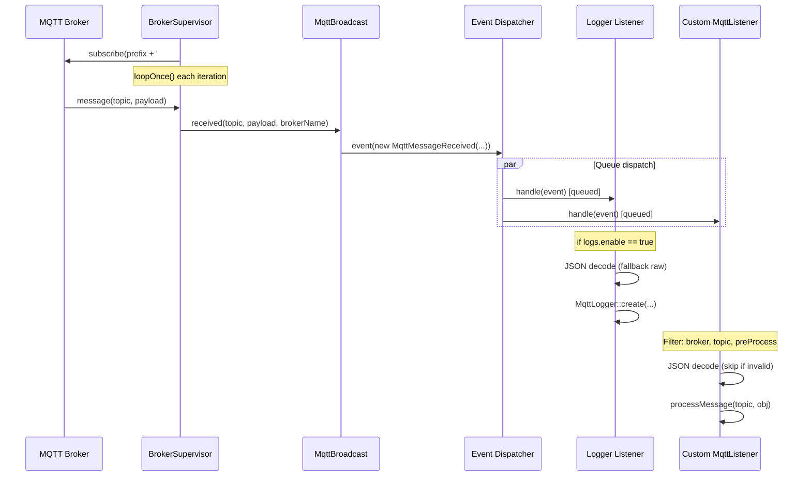
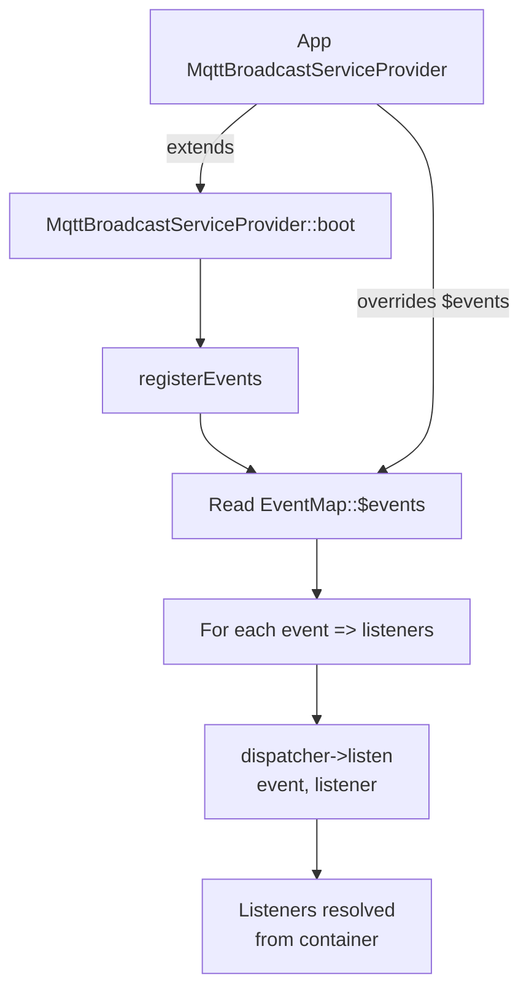

# Message Subscription & Events

## Overview

Message subscription is the inbound counterpart to [message publishing](../publishing/message-publishing.md). It allows the application to receive MQTT messages from one or more brokers and route them through Laravel's event system to application-defined listeners.

The subscription pipeline runs inside the long-lived supervisor process (`mqtt:broadcast`). Each `BrokerSupervisor` maintains a persistent MQTT connection, subscribes to a wildcard topic pattern, and dispatches an `MqttMessageReceived` event for every incoming message. Listeners registered through the `EventMap` trait react to these events — either the built-in `Logger` or custom listeners extending `MqttListener`.

Key design decisions:

- **Event-driven decoupling**: the supervisor process knows nothing about what happens after dispatch. All business logic lives in listeners, which are resolved from the container and processed via the queue.
- **JSON-first with escape hatch**: the abstract `MqttListener` base class assumes JSON payloads and provides topic/broker filtering. For non-JSON messages or custom filtering, listeners can subscribe directly to `MqttMessageReceived`.
- **Queue-based processing**: all listeners implement `ShouldQueue`, so message handling never blocks the supervisor's MQTT loop.
- **Wildcard subscription**: each broker subscribes to `prefix#` (or `#` if no prefix), capturing all topics under the configured prefix.

## Architecture

```
BrokerSupervisor          MqttBroadcast facade          Laravel Event Dispatcher
     │                           │                              │
     │  client->loopOnce()       │                              │
     │  ──> message arrives      │                              │
     │                           │                              │
     │  handleMessage()  ──>  received()  ──>  event(MqttMessageReceived)
     │                           │                              │
     │                           │                     ┌────────┴────────┐
     │                           │                     │                 │
     │                           │               Logger           MqttListener
     │                           │            (built-in)          (custom, abstract)
     │                           │                │                     │
     │                           │           DB insert            processMessage()
```

The flow is intentionally one-directional: the supervisor dispatches and moves on. Listeners process asynchronously on the queue, ensuring the MQTT loop is never blocked by slow handlers.

## How It Works

### 1. Subscription Setup

When `BrokerSupervisor::connect()` establishes a connection, it subscribes to a wildcard topic:

```php
$topic = $prefix === '' ? '#' : $prefix . '#';
$this->client->subscribe($topic, function (string $topic, string $message) {
    $this->handleMessage($topic, $message);
}, $qos);
```

- The `prefix` comes from `config('mqtt-broadcast.connections.{broker}.prefix')`.
- `#` is the MQTT multi-level wildcard — it matches all topics under the prefix.
- `$qos` is the subscription QoS level from the connection config.

### 2. Message Reception

On each iteration of the supervisor loop, `BrokerSupervisor::monitor()` calls `$this->client->loopOnce()`. When the MQTT client has a pending message, it invokes the subscription callback, which calls `handleMessage()`:

```php
protected function handleMessage(string $topic, string $message): void
{
    // Log truncated message for debugging
    $this->output('info', sprintf('Message received on topic [%s]: %s', $topic, $displayMessage));

    try {
        MqttBroadcast::received($topic, $message, $this->brokerName);
    } catch (Throwable $e) {
        $this->output('error', $e->getMessage());
    }
}
```

Exceptions from event dispatch are caught and logged — they never crash the supervisor or break the MQTT connection.

### 3. Event Dispatch

`MqttBroadcast::received()` wraps a single line:

```php
public static function received(string $topic, string $message, string $broker = 'default'): void
{
    event(new MqttMessageReceived($topic, $message, $broker));
}
```

This fires Laravel's event dispatcher, which routes the event to all registered listeners.

### 4. Event Registration

The `EventMap` trait, used by `MqttBroadcastServiceProvider`, defines the default listener mapping:

```php
protected array $events = [
    MqttMessageReceived::class => [
        Logger::class,
    ],
];
```

During `boot()`, the service provider iterates `$events` and calls `$dispatcher->listen($event, $listener)` for each pair. The application's published `MqttBroadcastServiceProvider` can override `$events` to add custom listeners.

### 5. Logger Listener (Built-in)

The `Logger` listener stores every received message in the database:

```php
public function handle(MqttMessageReceived $event): void
{
    if (! config('mqtt-broadcast.logs.enable')) {
        return;
    }

    // JSON decode with fallback to raw string
    try {
        $message = json_decode($rawMessage, false, 512, JSON_THROW_ON_ERROR);
    } catch (\JsonException $e) {
        $message = $rawMessage;
    }

    MqttLogger::query()->create([
        'topic' => $topic,
        'message' => $message,
        'broker' => $broker,
    ]);
}
```

- Disabled by default — enable with `MQTT_LOG_ENABLE=true`.
- Runs on its own queue: `config('mqtt-broadcast.logs.queue')`.
- Accepts both JSON and non-JSON messages.

### 6. Custom Listeners (MqttListener)

Custom listeners extend `MqttListener` and implement `processMessage()`:

```php
class TemperatureSensorListener extends MqttListener
{
    protected string $handleBroker = 'local';
    protected string $topic = 'sensors/temperature';

    public function processMessage(string $topic, object $obj): void
    {
        // $obj is the decoded JSON payload
        SensorReading::create(['value' => $obj->value]);
    }
}
```

The `handle()` method in `MqttListener` applies three filters before calling `processMessage()`:

1. **Broker filter**: `$event->getBroker() !== $this->handleBroker` — skips messages from other brokers.
2. **Topic filter**: `$event->getTopic() !== $this->getTopic()` — skips non-matching topics (unless `$topic = '*'`).
3. **Pre-process hook**: `preProcessMessage()` — returns `false` to skip. Default is `true`.

After filtering, it JSON-decodes the message:

- Invalid JSON: logs a warning and returns (no exception).
- Valid JSON but not an object (e.g., array, scalar): silently returns.
- Valid JSON object: passed to `processMessage()`.

Topic matching uses the prefixed topic via `MqttBroadcast::getTopic()`, so `$topic = 'sensors/temperature'` with prefix `home/` matches `home/sensors/temperature`.

## Key Components

| File | Class/Method | Responsibility |
|------|-------------|----------------|
| `src/Events/MqttMessageReceived.php` | `MqttMessageReceived` | Immutable event VO carrying topic, message, broker, and optional PID |
| `src/Contracts/Listener.php` | `Listener` | Interface requiring `handle()` and `processMessage()` |
| `src/Listeners/MqttListener.php` | `MqttListener` | Abstract base for JSON listeners with broker/topic filtering and queue support |
| `src/Listeners/MqttListener.php` | `handle()` | Applies broker, topic, and pre-process filters; decodes JSON; delegates to `processMessage()` |
| `src/Listeners/MqttListener.php` | `preProcessMessage()` | Hook for custom validation before processing (default: `true`) |
| `src/Listeners/MqttListener.php` | `getTopic()` | Returns prefixed topic via `MqttBroadcast::getTopic()` |
| `src/Listeners/Logger.php` | `Logger` | Built-in listener that stores messages in `mqtt_loggers` table |
| `src/EventMap.php` | `EventMap` | Trait defining the `MqttMessageReceived -> [listeners]` mapping |
| `src/MqttBroadcast.php` | `received()` | Static method that fires the `MqttMessageReceived` event |
| `src/MqttBroadcastServiceProvider.php` | `registerEvents()` | Iterates `EventMap::$events` and registers listeners with the dispatcher |
| `src/Supervisors/BrokerSupervisor.php` | `connect()` | Subscribes to MQTT wildcard topic with message callback |
| `src/Supervisors/BrokerSupervisor.php` | `handleMessage()` | Calls `MqttBroadcast::received()` with error isolation |
| `stubs/MqttBroadcastServiceProvider.stub` | Published provider | Stub for app-level provider where users add custom listeners |

## Configuration

| Key | Env Var | Default | Description |
|-----|---------|---------|-------------|
| `connections.{broker}.prefix` | `MQTT_PREFIX` | `''` | Topic prefix for subscription wildcard and listener matching |
| `connections.{broker}.qos` | — | `0` | QoS level for the subscription |
| `logs.enable` | `MQTT_LOG_ENABLE` | `false` | Enable the built-in Logger listener |
| `logs.queue` | `MQTT_LOG_JOB_QUEUE` | `'default'` | Queue name for Logger jobs |
| `logs.connection` | `MQTT_LOG_CONNECTION` | `'mysql'` | Database connection for `mqtt_loggers` table |
| `logs.table` | `MQTT_LOG_TABLE` | `'mqtt_loggers'` | Table name for message logs |
| `queue.listener` | `MQTT_LISTENER_QUEUE` | `'default'` | Queue name for custom `MqttListener` jobs |
| `queue.connection` | `MQTT_JOB_CONNECTION` | `'redis'` | Queue connection for all listener jobs |

## Database Schema

The `Logger` listener writes to the `mqtt_loggers` table (covered in the [message publishing docs](../publishing/message-publishing.md#database-schema)).

| Column | Type | Description |
|--------|------|-------------|
| `id` | `bigint` | Primary key |
| `broker` | `string` | Broker connection name |
| `topic` | `string` | Full MQTT topic (with prefix) |
| `message` | `json` | Payload — JSON object or raw string |
| `created_at` | `timestamp` | When the message was received |
| `updated_at` | `timestamp` | Standard Laravel timestamp |

## Error Handling

| Scenario | Behavior |
|----------|----------|
| MQTT message triggers exception in `handleMessage()` | Caught, logged to output; supervisor continues |
| Invalid JSON in `MqttListener::handle()` | Warning logged with truncated message (first 200 chars); listener returns without processing |
| Valid JSON but not an object (array, scalar) | Silently skipped |
| Listener job fails on the queue | Standard Laravel queue retry/failure handling applies |
| Logger disabled but event still fires | `Logger::handle()` returns immediately; no DB write |
| Broker mismatch in listener | Listener returns immediately; no processing |
| Topic mismatch in listener | Listener returns immediately; no processing |

## Mermaid Diagrams

### Message Reception Flow



### Listener Filtering Pipeline

```mermaid
flowchart TD
    A[MqttMessageReceived event] --> B{Broker matches?}
    B -->|No| Z[Return - skip]
    B -->|Yes| C{Topic matches<br/>or topic == '*'?}
    C -->|No| Z
    C -->|Yes| D{preProcessMessage()?}
    D -->|false| Z
    D -->|true| E{JSON decode}
    E -->|JsonException| F[Log warning, return]
    E -->|Success| G{Is object?}
    G -->|No| Z
    G -->|Yes| H[processMessage<br/>topic, obj]
```

### Event Registration Flow


