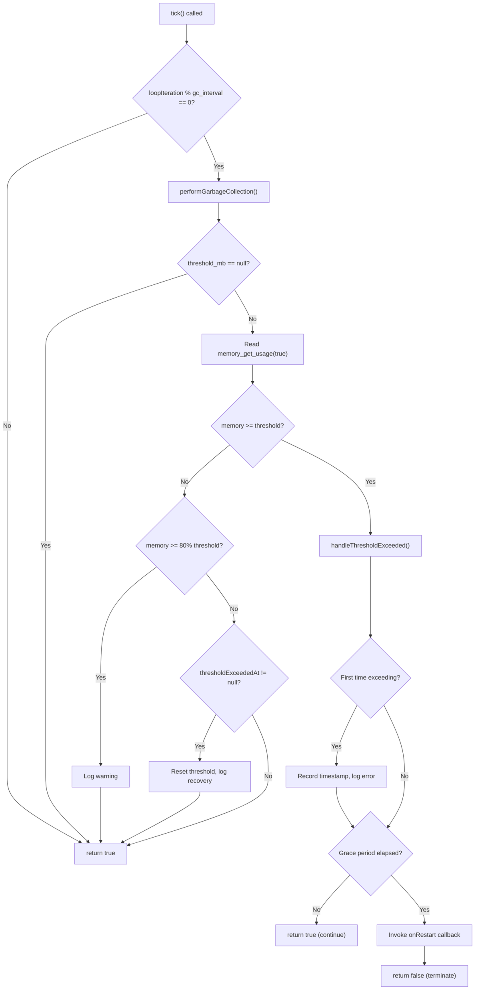
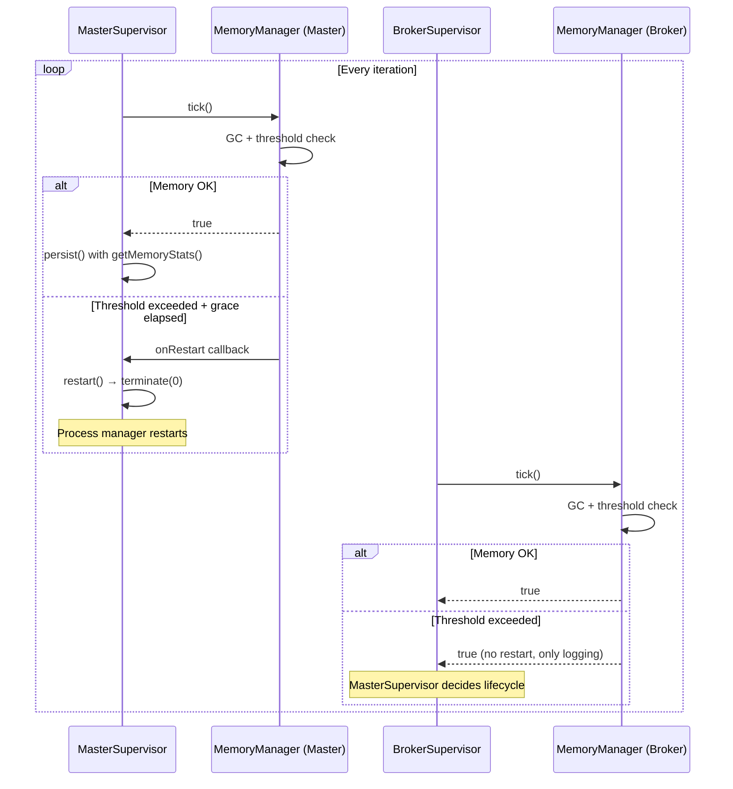
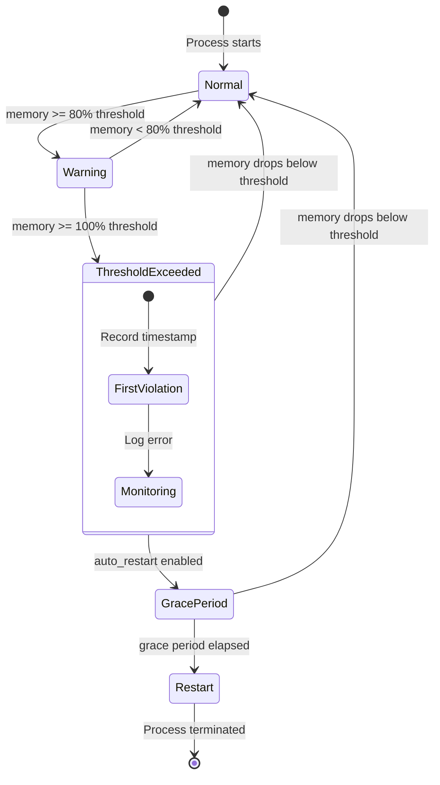

# Memory Management

## Overview

The `MemoryManager` class prevents unbounded memory growth in long-running MQTT supervisor processes. It provides periodic garbage collection, a three-tier memory warning system, and auto-restart capability when configurable thresholds are exceeded.

Long-running PHP processes — especially those holding persistent MQTT connections — accumulate circular references from client internal queues and signal handlers. Without active memory management, these processes eventually exhaust available memory and crash unpredictably. `MemoryManager` makes this failure mode controlled and observable.

## Architecture

`MemoryManager` follows a **tick-based monitoring pattern**: the supervisor calls `tick()` on every loop iteration, and the manager decides when to perform GC and check thresholds based on a configurable interval.

Key design decisions:
- **Separation of concern**: `MemoryManager` handles memory; supervisors handle process lifecycle
- **Callback-based restart**: the manager doesn't terminate processes directly — it invokes an `onRestart` closure provided by the caller
- **Grace period**: threshold violations don't trigger immediate restarts; a configurable delay allows in-progress operations (message publish, heartbeat update) to complete
- **Opt-in monitoring**: setting `threshold_mb` to `null` disables all threshold checks while keeping GC active

## How It Works

### Tick Lifecycle

Every supervisor loop iteration calls `MemoryManager::tick()`:

1. Increment internal `loopIteration` counter
2. If `loopIteration % gc_interval === 0`:
   a. Run `gc_collect_cycles()` to free circular references
   b. Log freed memory only if cycles were actually collected (avoids noise)
   c. Check memory against configured threshold
3. If not a GC tick: return `true` immediately (no-op)

### Three-Tier Warning System

When `threshold_mb` is set, `checkMemoryThreshold()` implements escalating alerts:

| Tier | Trigger | Action |
|------|---------|--------|
| **Warning** | Memory ≥ 80% of threshold | Log warning with usage percentage, current MB, and peak MB |
| **Error** | Memory ≥ 100% of threshold | Log error, start grace period countdown |
| **Restart** | Threshold exceeded for `restart_delay_seconds` | Invoke `onRestart` callback, return `false` to signal termination |

The threshold resets automatically if memory drops below the limit during the grace period (e.g., after a successful GC cycle).

### Auto-Restart Flow

When auto-restart is enabled and the grace period elapses:

1. `handleThresholdExceeded()` calls the `onRestart` closure
2. Returns `false` — the supervisor's monitor loop checks this return value
3. In `MasterSupervisor`: `onRestart` calls `restart()` → `terminate(0)`, exiting the process cleanly
4. The external process manager (systemd, supervisord) restarts the entire process tree

In `BrokerSupervisor`: `onRestart` is `null` — broker supervisors only log, they don't self-restart. The `MasterSupervisor` owns lifecycle decisions for its child supervisors.

## Key Components

| File | Class/Method | Responsibility |
|------|-------------|----------------|
| `src/Support/MemoryManager.php` | `MemoryManager` | Core memory monitoring service |
| `src/Support/MemoryManager.php` | `tick()` | Entry point: GC + threshold check on interval |
| `src/Support/MemoryManager.php` | `performGarbageCollection()` | Runs `gc_collect_cycles()`, logs freed memory |
| `src/Support/MemoryManager.php` | `checkMemoryThreshold()` | Three-tier warning/error/restart logic |
| `src/Support/MemoryManager.php` | `handleThresholdExceeded()` | Grace period tracking + restart trigger |
| `src/Support/MemoryManager.php` | `getMemoryStats()` | Returns current/peak memory in MB and bytes |
| `src/Support/MemoryManager.php` | `reset()` | Resets iteration counter, peak tracking, threshold state |
| `src/Supervisors/MasterSupervisor.php` | `__construct()` | Creates `MemoryManager` with output + restart callbacks |
| `src/Supervisors/MasterSupervisor.php` | `monitor()` | Calls `tick()` each iteration; exits loop if `false` |
| `src/Supervisors/MasterSupervisor.php` | `persist()` | Includes `getMemoryStats()` in cache state |
| `src/Supervisors/BrokerSupervisor.php` | `__construct()` | Creates `MemoryManager` with output only (no restart) |
| `src/Supervisors/BrokerSupervisor.php` | `monitor()` | Calls `tick()` each iteration (return value ignored) |

## Configuration

All settings live under `config('mqtt-broadcast.memory')`:

| Key | Env Var | Default | Description |
|-----|---------|---------|-------------|
| `gc_interval` | `MQTT_GC_INTERVAL` | `100` | Run GC every N loop iterations |
| `threshold_mb` | `MQTT_MEMORY_THRESHOLD_MB` | `128` | Memory limit in MB; `null` disables monitoring |
| `auto_restart` | `MQTT_MEMORY_AUTO_RESTART` | `true` | Whether to trigger restart on threshold breach |
| `restart_delay_seconds` | `MQTT_RESTART_DELAY_SECONDS` | `10` | Grace period before restart after threshold exceeded |

### Tuning Guidelines

- **`gc_interval`**: Lower values (e.g., 10) increase CPU overhead from frequent GC but catch memory issues faster. Higher values (e.g., 500) reduce overhead but delay detection. Default of 100 is a good balance for most workloads.
- **`threshold_mb`**: Set based on your server's available memory. For containers, set to ~75% of the container memory limit to leave room for peak allocations.
- **`restart_delay_seconds`**: Must be long enough for in-flight MQTT publishes and heartbeat writes to complete. Default of 10s is conservative; reduce to 3-5s if your operations are fast.

## Error Handling

| Scenario | Behavior |
|----------|----------|
| `threshold_mb` is `null` | All threshold checks skipped; GC still runs |
| `auto_restart` is `false` | Warnings and errors are logged but process continues indefinitely |
| Memory drops below threshold during grace period | Grace period resets, "back below threshold" logged |
| No `onRestart` callback provided | `handleThresholdExceeded()` returns `false` but no callback is invoked |
| `gc_collect_cycles()` returns 0 | No log output (avoids noise when no garbage is present) |

## Mermaid Diagrams

### Tick Decision Flow

### Integration with Supervisor Hierarchy

### Memory State Machine

