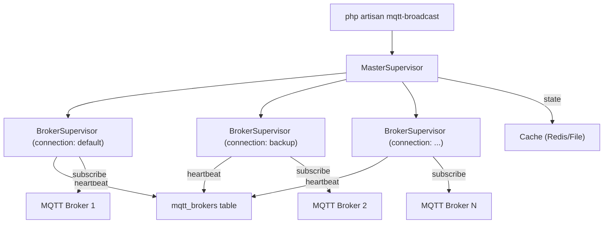
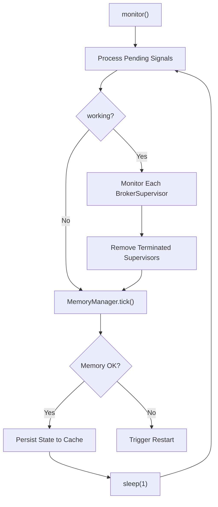
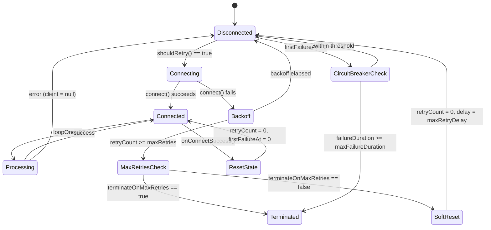
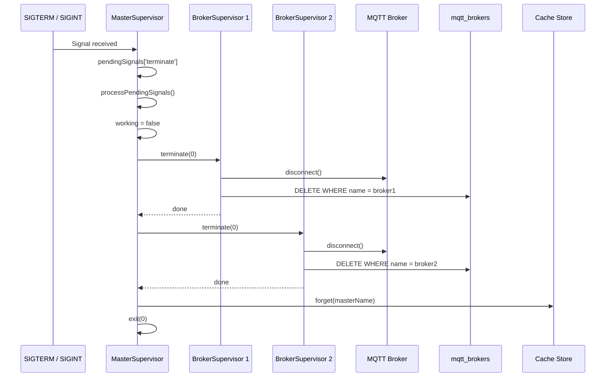

# Process Supervision Architecture

## Overview

MQTT Broadcast uses a two-tier supervisor architecture inspired by Laravel Horizon to manage long-running MQTT broker connections. A single **MasterSupervisor** orchestrates multiple **BrokerSupervisor** instances — one per configured MQTT connection. This design provides automatic reconnection with exponential backoff, graceful shutdown via UNIX signals, memory management with auto-restart, and heartbeat-based health monitoring.

The system is started via `php artisan mqtt-broadcast` and runs as a blocking foreground process, designed to be managed by a process supervisor like systemd or Supervisor.

## Architecture

The architecture follows a **parent-child supervisor tree**:

- **MasterSupervisor** — single process per machine, runs the main event loop (1-second tick), dispatches UNIX signals, persists state to cache (Redis/file), manages the pool of BrokerSupervisors.
- **BrokerSupervisor** — one per MQTT connection, manages the MQTT client lifecycle (connect, subscribe, reconnect), handles message ingestion, updates heartbeat timestamps in the database.
- **MemoryManager** — embedded in both tiers, triggers periodic GC, monitors memory thresholds, triggers auto-restart when limits are breached.

Key design decisions:
- **Horizon-style signal handling**: signals are queued as pending and processed at the top of each loop iteration, preventing race conditions.
- **Cache for master state, DB for broker state**: MasterSupervisor state is ephemeral (cache with TTL), while BrokerSupervisor state is persisted to `mqtt_brokers` table for dashboard queries.
- **Restart = terminate + process manager restart**: following Horizon's approach, restart means exiting the process and relying on systemd/Supervisor to bring it back, ensuring a clean slate.

## How It Works

### Startup Sequence

1. `MqttBroadcastCommand::handle()` generates a unique master name via `ProcessIdentifier::generateName('master')` (format: `master-{hostname}-{token}`).
2. Checks cache for an existing master with the same name — prevents duplicate instances on the same machine.
3. Reads the environment (CLI option > `mqtt-broadcast.env` config > `APP_ENV`) and loads connections from `mqtt-broadcast.environments.{env}`.
4. Validates all connection configurations by calling `MqttClientFactory::create()` for each — fails fast with descriptive errors.
5. Creates one `BrokerSupervisor` per connection. Each supervisor self-registers in `mqtt_brokers` table on construction.
6. Registers `SIGINT` handler for Ctrl+C graceful shutdown.
7. Calls `MasterSupervisor::monitor()` — enters the blocking infinite loop.

### Main Loop (every 1 second)

1. `processPendingSignals()` — drains the signal queue: SIGTERM -> `terminate()`, SIGUSR1 -> `restart()`, SIGUSR2 -> `pause()`, SIGCONT -> `continue()`.
2. If `working == true`, calls `monitor()` on each BrokerSupervisor, then filters out terminated supervisors.
3. `MemoryManager::tick()` — increments loop counter; every `gc_interval` iterations runs GC and checks memory thresholds.
4. `persist()` — writes current state (PID, status, supervisor count, memory stats) to cache.

### BrokerSupervisor Monitor Cycle

Each call to `BrokerSupervisor::monitor()`:

1. Calls `MemoryManager::tick()` for per-broker memory tracking.
2. If disconnected, checks `shouldRetry()` — respects exponential backoff timing and circuit breaker duration.
3. On retry: calls `connect()` -> creates MQTT client via factory -> connects with auth/TLS settings -> subscribes to `{prefix}#` topic.
4. On success: resets retry state (`retryCount`, `retryDelay`, `firstFailureAt`).
5. On failure: increments `retryCount`, applies exponential backoff (1s, 2s, 4s, 8s... up to `max_retry_delay`), tracks `firstFailureAt` for circuit breaker.
6. If connected: calls `$client->loopOnce()` to process pending MQTT messages, then `repository->touch()` to update heartbeat.

### Reconnection Strategy

The reconnection logic implements a dual-protection mechanism:

- **Exponential backoff**: delay doubles on each failure (1s -> 2s -> 4s -> ... -> `max_retry_delay`), capped at `max_retry_delay` (default: 60s).
- **Max retries gate**: after `max_retries` (default: 20) consecutive failures:
  - If `terminate_on_max_retries == true`: supervisor terminates (hard fail).
  - If `terminate_on_max_retries == false` (default): retry counter resets with a long pause (`max_retry_delay`), effectively creating infinite-retry cycles.
- **Circuit breaker**: if total continuous failure duration exceeds `max_failure_duration` (default: 3600s / 1 hour), supervisor terminates regardless of retry count.

### Signal Handling

Signals are captured asynchronously via `pcntl_async_signals(true)` and queued in `$pendingSignals`. They are processed synchronously at the start of each loop iteration:

| Signal | Action | Effect |
|--------|--------|--------|
| `SIGTERM` | `terminate()` | Graceful shutdown: disconnect all brokers, clean DB/cache, exit |
| `SIGUSR1` | `restart()` | Calls `terminate(0)` — process manager should restart |
| `SIGUSR2` | `pause()` | Stops monitoring but keeps loop alive; brokers paused |
| `SIGCONT` | `continue()` | Resumes monitoring after pause |
| `SIGINT` | (via command) | Same as SIGTERM — Ctrl+C handler |

### Graceful Shutdown

When `MasterSupervisor::terminate()` is called:

1. Sets `working = false` to stop the loop.
2. Iterates each BrokerSupervisor and calls `terminate()`:
   - Disconnects MQTT client (swallows disconnect errors).
   - Deletes broker record from `mqtt_brokers` table.
   - Errors on individual supervisors are caught — ensures all supervisors are cleaned up.
3. Removes master state from cache via `repository->forget()`.
4. Calls `exit($status)`.

### Memory Management

`MemoryManager` implements a three-tier alert system:

1. **Periodic GC**: every `gc_interval` loop iterations (default: 100), calls `gc_collect_cycles()`. Logs freed memory only when cycles were collected.
2. **80% warning**: early alert when memory usage hits 80% of `threshold_mb`.
3. **100% threshold + grace period**: when exceeded, starts a countdown (`restart_delay_seconds`, default: 10s). If memory stays above threshold after grace period and `auto_restart == true`, triggers the restart callback.

In MasterSupervisor, the restart callback calls `restart()` (which terminates the process). In BrokerSupervisor, no restart callback is configured — memory is only monitored and logged.

## Key Components

| File | Class/Method | Responsibility |
|------|-------------|----------------|
| `src/Supervisors/MasterSupervisor.php` | `MasterSupervisor` | Orchestrates broker supervisors, runs main loop, handles signals, persists state to cache |
| `src/Supervisors/BrokerSupervisor.php` | `BrokerSupervisor` | Manages single MQTT connection, handles reconnection with exponential backoff, processes messages |
| `src/Commands/MqttBroadcastCommand.php` | `MqttBroadcastCommand` | Artisan entry point — validates config, creates supervisors, starts monitoring |
| `src/Commands/MqttBroadcastTerminateCommand.php` | `MqttBroadcastTerminateCommand` | Sends SIGTERM to running supervisors, cleans up DB/cache records |
| `src/Support/MemoryManager.php` | `MemoryManager` | Periodic GC, memory threshold monitoring, auto-restart triggering |
| `src/Support/ProcessIdentifier.php` | `ProcessIdentifier` | Generates unique process names using hostname + random token |
| `src/ListensForSignals.php` | `ListensForSignals` (trait) | Registers UNIX signal handlers, queues and processes pending signals |
| `src/Repositories/MasterSupervisorRepository.php` | `MasterSupervisorRepository` | Cache-based CRUD for master supervisor state (supports Redis, file, array drivers) |
| `src/Repositories/BrokerRepository.php` | `BrokerRepository` | Database CRUD for broker process records, heartbeat updates, name generation |
| `src/Contracts/Terminable.php` | `Terminable` | Interface: `terminate(int $status)` |
| `src/Contracts/Pausable.php` | `Pausable` | Interface: `pause()`, `continue()` |
| `src/Contracts/Restartable.php` | `Restartable` | Interface: `restart()` |

## Database Schema

### `mqtt_brokers` table

| Column | Type | Description |
|--------|------|-------------|
| `id` | bigint (PK) | Auto-increment primary key |
| `name` | string | Unique broker identifier (format: `{hostname}-{token}`) |
| `connection` | string | MQTT connection name from config |
| `pid` | integer | OS process ID of the supervisor |
| `working` | boolean | Whether the supervisor is active |
| `started_at` | datetime | When the supervisor was started |
| `last_heartbeat_at` | datetime | Last heartbeat timestamp (updated every loop iteration) |
| `created_at` | timestamp | Laravel timestamp |
| `updated_at` | timestamp | Laravel timestamp |

**Indexes**: composite index on `(broker, topic, created_at)` on the related `mqtt_loggers` table.

### Master Supervisor Cache

State is stored in cache under key `mqtt-broadcast:master:{name}` with configurable TTL (default: 3600s).

Cached fields: `pid`, `status` (running/paused), `supervisors` (count), `memory_mb`, `peak_memory_mb`, `updated_at`.

## Configuration

All supervisor-related configuration lives in `config/mqtt-broadcast.php`:

| Config Key | Env Variable | Default | Description |
|------------|-------------|---------|-------------|
| `defaults.connection.max_retries` | `MQTT_MAX_RETRIES` | `20` | Max consecutive connection failures before action |
| `defaults.connection.max_retry_delay` | `MQTT_MAX_RETRY_DELAY` | `60` | Max backoff delay in seconds |
| `defaults.connection.max_failure_duration` | `MQTT_MAX_FAILURE_DURATION` | `3600` | Circuit breaker timeout in seconds |
| `defaults.connection.terminate_on_max_retries` | `MQTT_TERMINATE_ON_MAX_RETRIES` | `false` | Hard-terminate or soft-reset on max retries |
| `memory.gc_interval` | `MQTT_GC_INTERVAL` | `100` | Loop iterations between GC runs |
| `memory.threshold_mb` | `MQTT_MEMORY_THRESHOLD_MB` | `128` | Memory threshold in MB |
| `memory.auto_restart` | `MQTT_MEMORY_AUTO_RESTART` | `true` | Auto-restart on memory threshold breach |
| `memory.restart_delay_seconds` | `MQTT_RESTART_DELAY_SECONDS` | `10` | Grace period before auto-restart |
| `master_supervisor.cache_ttl` | `MQTT_MASTER_CACHE_TTL` | `3600` | Cache TTL for master state (seconds) |
| `supervisor.heartbeat_interval` | `MQTT_HEARTBEAT_INTERVAL` | `1` | Heartbeat update interval (seconds) |
| `repository.broker.stale_threshold` | `MQTT_STALE_THRESHOLD` | `300` | Seconds before a broker is considered stale |

Per-connection overrides for `max_retries`, `max_retry_delay`, `max_failure_duration`, and `terminate_on_max_retries` can be set inside individual connection blocks.

## Error Handling

| Failure Scenario | Handling |
|-----------------|----------|
| MQTT connection refused | Exponential backoff retry (1s -> 2s -> 4s -> ... -> 60s) |
| Max retries exceeded (soft mode) | Counter resets, pauses for `max_retry_delay`, retries indefinitely |
| Max retries exceeded (hard mode) | Supervisor terminates with exit code 1 |
| Circuit breaker tripped | Supervisor terminates after `max_failure_duration` of continuous failure |
| Message processing error | Caught and logged; supervisor continues operating |
| `loopOnce()` error | Client set to null to trigger reconnection on next iteration |
| Supervisor termination error | Caught and logged; other supervisors still terminated |
| Memory threshold exceeded | Grace period -> auto-restart (process exit for process manager to restart) |
| Master loop exception | Caught and logged via output callback; loop continues |
| Duplicate master instance | Command refuses to start with warning message |
| Invalid connection config | Command fails fast before starting any supervisor |

## Mermaid Diagrams

### Supervisor Tree

### Main Loop Lifecycle

### Reconnection State Machine

### Graceful Shutdown Sequence

