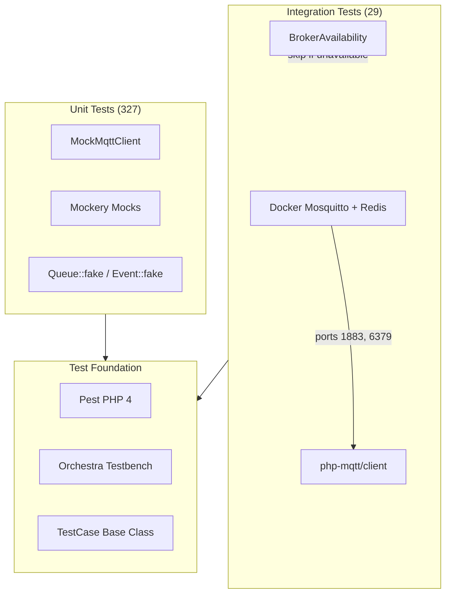

# Testing Infrastructure

## Overview

`mqtt-broadcast` ships a comprehensive test suite built on **Pest PHP 4** with **Orchestra Testbench** for Laravel bootstrapping. The suite is split into **unit tests** (327, no broker required) and **integration tests** (29, real MQTT broker via Docker). A `MockMqttClient` helper enables deterministic MQTT testing without network dependencies.

The testing infrastructure solves three problems:
1. Testing MQTT publish/subscribe logic without a running broker
2. Bootstrapping a full Laravel environment for a standalone package
3. Verifying real broker interactions (connection lifecycle, multi-broker, cache cleanup) in CI

## Architecture

The test suite uses a layered approach:

- **Pest PHP** as the test runner with the Laravel plugin for `Queue::fake()`, `Event::fake()`, HTTP testing
- **Orchestra Testbench** provides a minimal Laravel app (routes, config, migrations, service providers)
- **MockMqttClient** replaces the real `php-mqtt/client` in unit tests
- **BrokerAvailability** gates integration tests — they skip gracefully when no broker is running
- **Mockery** for fine-grained mock expectations on factories, repositories, and services



## How It Works

### Test Bootstrap (`tests/Pest.php`)

Every test inherits from the custom `TestCase` via Pest's `uses()` directive. Mockery cleanup runs after each test automatically.

```php
uses(TestCase::class)->in(__DIR__);

afterEach(function () {
    Mockery::close();
});
```

### Base TestCase (`tests/TestCase.php`)

Extends `Orchestra\Testbench\TestCase` and handles:

1. **Service provider registration** — loads `MqttBroadcastServiceProvider` so all bindings, routes, and migrations are available
2. **Migration loading** — runs all package migrations against an in-memory SQLite database
3. **Config defaults** — sets up a complete `mqtt-broadcast` config tree (connections, rate limiting, queue, cache, failed jobs, environments)
4. **Factory namespace guessing** — maps model classes to `Database\Factories\` for Eloquent factory support

Key configuration choices:
- **Database**: SQLite `:memory:` (fast, disposable)
- **Cache**: `array` driver (no Redis dependency in unit tests)
- **Queue**: `sync` driver (jobs execute immediately, no jobs table needed)
- **Rate limiting**: enabled with `reject` strategy and `array` cache driver

#### Helper Methods

| Method | Purpose |
|--------|---------|
| `setMqttConfig(string $broker, array $config)` | Override connection config for a specific broker per test |
| `getProtectedProperty(object $object, string $property)` | Access private/protected properties via reflection (useful for asserting job internals) |
| `brokerAvailable()` | Check if a real MQTT broker is reachable |
| `requiresBroker()` | Skip test with message if broker is unavailable |

### MockMqttClient (`tests/Helpers/MockMqttClient.php`)

A drop-in replacement for `PhpMqtt\Client\MqttClient` that records all publish/subscribe calls in memory. It enforces connection state — publishing or subscribing while disconnected throws `RuntimeException`.

#### API

| Method | Description |
|--------|-------------|
| `connect($settings, bool $cleanSession)` | Sets connected state to `true` |
| `disconnect()` | Sets connected state to `false` |
| `isConnected()` | Returns connection state |
| `publish(string $topic, string $message, int $qos, bool $retain)` | Records message to `publishedMessages` array |
| `subscribe(string $topic, callable $callback, int $qos)` | Records subscription to `subscribedTopics` array |
| `loopOnce(int $timeout)` | No-op for testing |
| `assertPublished(string $topic, ?string $message, ?int $qos)` | Asserts a message was published (optional message/QoS matching) |
| `assertNotPublished(string $topic)` | Asserts no message was published to topic |
| `getPublishedMessage(int $index)` | Get published message by index |
| `getLastPublishedMessage()` | Get the most recent published message |
| `clearPublished()` | Reset published messages array |
| `getPublishedCount()` | Count of published messages |

Each recorded message is an array:
```php
[
    'topic' => 'sensors/temperature',
    'message' => '{"value": 25.5}',
    'qos' => 0,
    'retain' => false,
    'timestamp' => 1711497600,
]
```

### BrokerAvailability (`tests/Support/BrokerAvailability.php`)

Gates integration tests behind a real broker connection check. The result is cached statically per test run for performance.

Detection order:
1. **Environment variable** `MQTT_BROKER_AVAILABLE` — CI can set this to `true`/`false` to skip the connection check entirely
2. **Live connection attempt** — creates a temporary `MqttClient`, connects with 2-second timeout, disconnects
3. **Diagnostic fallback** — if connection fails, `getUnavailableReason()` tries a raw socket to distinguish "port closed" from "MQTT handshake failed"

```mermaid
flowchart TD
    Start[requiresBroker] --> EnvCheck{MQTT_BROKER_AVAILABLE<br>env var set?}
    EnvCheck -->|yes| EnvValue{Value truthy?}
    EnvValue -->|yes| Run[Run test]
    EnvValue -->|no| Skip[markTestSkipped]
    EnvCheck -->|no| TryConnect[Connect to 127.0.0.1:1883<br>timeout=2s]
    TryConnect -->|success| CacheTrue[Cache: available=true]
    TryConnect -->|exception| CacheFalse[Cache: available=false]
    CacheTrue --> Run
    CacheFalse --> Diagnose[getUnavailableReason]
    Diagnose --> Skip
```



## Key Components

| File | Class/Method | Responsibility |
|------|-------------|----------------|
| `tests/Pest.php` | — | Pest bootstrap: binds `TestCase`, auto-closes Mockery |
| `tests/TestCase.php` | `TestCase` | Orchestra Testbench base: migrations, config, provider registration |
| `tests/TestCase.php` | `setMqttConfig()` | Per-test broker config override |
| `tests/TestCase.php` | `getProtectedProperty()` | Reflection-based access to private properties |
| `tests/TestCase.php` | `requiresBroker()` | Skip guard for integration tests |
| `tests/Helpers/MockMqttClient.php` | `MockMqttClient` | In-memory MQTT client double with assertion methods |
| `tests/Support/BrokerAvailability.php` | `BrokerAvailability` | Cached broker reachability check with diagnostics |
| `composer.json` | `scripts.test` | `vendor/bin/pest` |
| `composer.json` | `scripts.test-coverage` | `vendor/bin/pest --coverage` |

## Configuration

### Composer Scripts

| Script | Command | Purpose |
|--------|---------|---------|
| `composer test` | `vendor/bin/pest` | Run full suite (unit + integration if broker available) |
| `composer test-coverage` | `vendor/bin/pest --coverage` | Run with code coverage |
| `composer pint` | `vendor/bin/pint` | Code style (run before committing) |
| `composer analyse` | `vendor/bin/phpstan analyse` | Static analysis level 7 |

### Running Tests

```bash
# Unit tests only (no broker needed)
vendor/bin/pest --exclude-group=integration

# Full suite with integration tests
docker compose -f docker-compose.test.yml up -d
vendor/bin/pest
docker compose -f docker-compose.test.yml down
```

### Dev Dependencies

| Package | Version | Role |
|---------|---------|------|
| `pestphp/pest` | ^4.0 | Test runner |
| `pestphp/pest-plugin-laravel` | ^4.0 | Laravel-specific assertions and helpers |
| `orchestra/testbench` | ^9.0\|^10.0 | Laravel app bootstrapping for packages |
| `phpunit/phpunit` | ^10.5\|^11.0\|^12.0 | Underlying test engine |
| `nunomaduro/collision` | ^7.0\|^8.0 | Better error output |
| `nunomaduro/larastan` | ^2.0.1 | PHPStan Laravel rules |
| `phpstan/phpstan-deprecation-rules` | ^1.0 | Deprecation detection |
| `phpstan/phpstan-phpunit` | ^1.0 | PHPUnit-aware analysis |
| `spatie/laravel-ray` | ^1.26 | Debug tool |

## Test Patterns

### Unit Test: Mocking the MQTT Client Factory

```php
beforeEach(function () {
    $this->mockFactory = Mockery::mock(MqttClientFactory::class);
    $this->mockClient = Mockery::mock(MqttClient::class);
    $this->app->instance(MqttClientFactory::class, $this->mockFactory);
});

it('publishes message via factory', function () {
    $this->mockFactory->shouldReceive('create')
        ->once()
        ->andReturn($this->mockClient);

    $this->mockClient->shouldReceive('connect')->once();
    $this->mockClient->shouldReceive('publish')
        ->with('test/topic', '{"key":"value"}', 0, false)
        ->once();
    $this->mockClient->shouldReceive('disconnect')->once();

    // ... trigger the code under test
});
```

### Unit Test: Queue Faking with Protected Property Assertion

```php
it('dispatches MqttMessageJob with correct parameters', function () {
    Queue::fake();

    MqttBroadcast::publish('sensors/temperature', '{"value": 25.5}');

    Queue::assertPushed(MqttMessageJob::class, function ($job) {
        return $this->getProtectedProperty($job, 'topic') === 'sensors/temperature'
            && $this->getProtectedProperty($job, 'message') === '{"value": 25.5}';
    });
});
```

### Unit Test: HTTP Controller with Database

```php
it('returns healthy status when brokers are active', function () {
    BrokerProcess::factory()->create([
        'broker_name' => 'default',
        'connection_status' => 'connected',
        'last_heartbeat_at' => now(),
    ]);

    $response = $this->getJson('/mqtt-broadcast/api/health');

    $response->assertStatus(200)
        ->assertJson([
            'status' => 'healthy',
            'data' => [
                'brokers' => ['total' => 1, 'active' => 1, 'stale' => 0],
            ],
        ]);
});
```

### Unit Test: BrokerSupervisor with Mockery `andReturnUsing`

```php
// Return real model instances from mocked repository
$this->repository->shouldReceive('create')
    ->byDefault()
    ->andReturnUsing(function ($name, $masterName, $pid) {
        $broker = new BrokerProcess();
        $broker->broker_name = $name;
        $broker->master_name = $masterName;
        $broker->pid = $pid;
        $broker->exists = true;
        return $broker;
    });
```

### Integration Test: Real Process Lifecycle

```php
beforeEach(function () {
    $this->requiresBroker();
    // Start a real mqtt-broadcast process
    $this->processHandle = proc_open(
        'exec php testbench mqtt-broadcast',
        $descriptors,
        $pipes,
        getcwd()
    );
});

afterEach(function () {
    if ($this->processHandle) {
        proc_terminate($this->processHandle, SIGTERM);
        proc_close($this->processHandle);
    }
});
```

## Error Handling

| Scenario | Behavior |
|----------|----------|
| No broker available for integration test | `markTestSkipped()` with diagnostic reason |
| `MockMqttClient::publish()` while disconnected | Throws `RuntimeException('Not connected to MQTT broker')` |
| `MockMqttClient::assertPublished()` fails | Throws `RuntimeException("Message not published to topic: {$topic}")` |
| SQLite migration failure | Test suite aborts — check migration syntax for SQLite compatibility |
| Mockery expectation not met | `Mockery::close()` in `afterEach` triggers assertion failure |

```mermaid
stateDiagram-v2
    [*] --> Setup: Pest runs test
    Setup --> UnitPath: No broker needed
    Setup --> IntegrationPath: requiresBroker()

    UnitPath --> MockSetup: beforeEach
    MockSetup --> Execute: Run test body
    Execute --> Assert: Assertions
    Assert --> Cleanup: afterEach (Mockery::close)
    Cleanup --> [*]: Pass/Fail

    IntegrationPath --> BrokerCheck: BrokerAvailability::isAvailable()
    BrokerCheck --> Skipped: Not available
    BrokerCheck --> DockerSetup: Available
    DockerSetup --> Execute
    Skipped --> [*]: markTestSkipped
```
