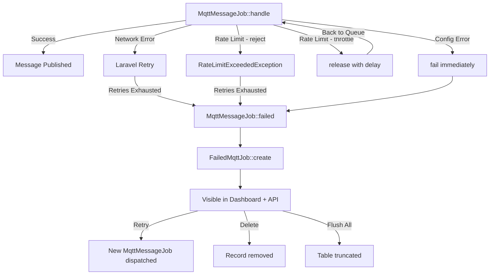
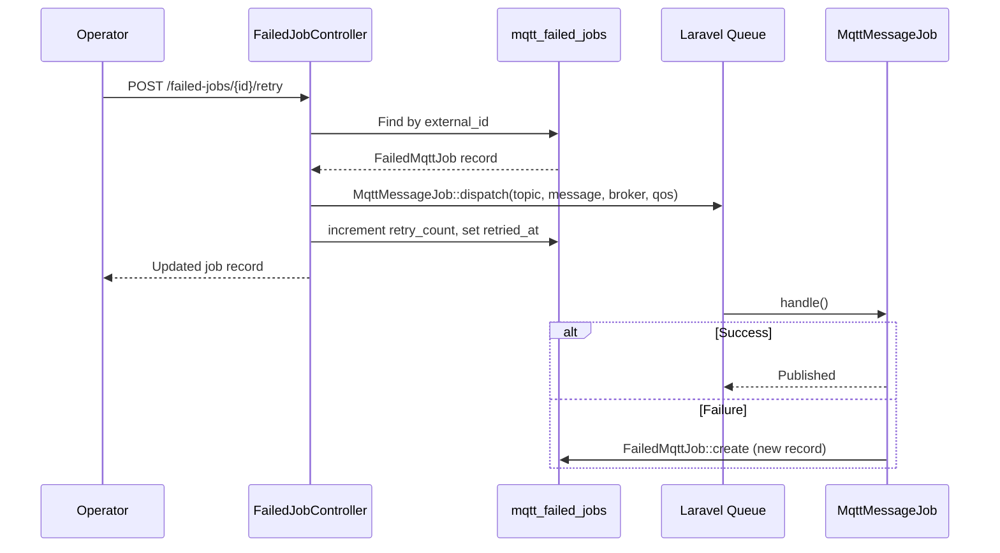
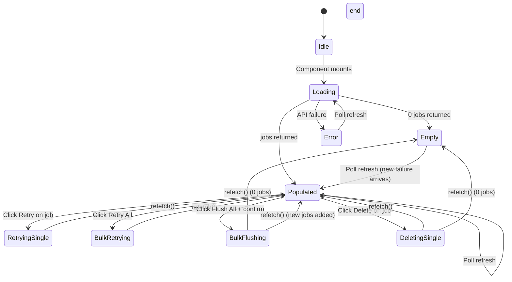
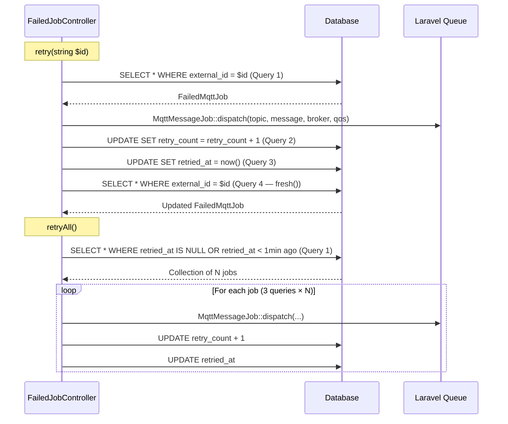

# Dead Letter Queue (Failed Jobs)

## Overview

The Dead Letter Queue (DLQ) captures MQTT publish jobs that fail after exhausting all retry attempts. When `MqttMessageJob` fails — whether due to broker unreachability, rate limit rejection, or configuration errors — the failure is persisted to the `mqtt_failed_jobs` table with full context (broker, topic, message payload, exception). Operators can inspect, retry, or purge failed jobs through the dashboard UI or REST API.

This system solves two problems:
1. **Message durability** — failed publishes are not silently lost; they remain recoverable.
2. **Operational visibility** — the dashboard surfaces failure patterns (by broker, by topic) so operators can diagnose systemic issues.

## Architecture

The DLQ is implemented as a database-backed queue with a REST API layer and React dashboard component.

**Design decisions:**
- **Separate table, not Laravel's `failed_jobs`** — MQTT failures carry domain-specific data (broker, topic, QoS, retain) that doesn't fit the generic `failed_jobs` schema. A dedicated table allows filtering, retry, and analytics by MQTT-specific fields.
- **UUID external IDs** — the `HasExternalId` trait auto-generates a UUID `external_id` used in API routes. Internal `id` (auto-increment) is never exposed.
- **Configurable database connection** — the `failed_jobs.connection` config key allows storing failures on a different database (e.g., for isolation or compliance).
- **No automatic retry** — retries are manual (single or bulk). This is intentional: failed jobs often indicate a systemic issue (broker down, misconfiguration) where automatic retry would just create noise.

## How It Works

### Failure Capture Flow

1. `MqttMessageJob::handle()` attempts to publish a message to the MQTT broker.
2. If the job fails (exhausts retries or is explicitly failed via `$this->fail()`), Laravel calls `MqttMessageJob::failed(\Throwable $exception)`.
3. `failed()` creates a `FailedMqttJob` record with the original payload, broker context, and stringified exception.
4. The job is now visible in the dashboard's "Failed Jobs" tab and via the REST API.

### Failure Triggers

| Trigger | Behavior | Retries? |
|---|---|---|
| Configuration error (`MqttBroadcastException`) | `$this->fail($e)` — immediate failure, no retry | No |
| Rate limit exceeded (`reject` strategy) | `RateLimitExceededException` thrown, job fails after max attempts | Yes (until exhausted) |
| Rate limit exceeded (`throttle` strategy) | `$this->release($delay)` — job requeued with delay | Requeued, not failed |
| Broker connection failure | Exception propagates, Laravel retries | Yes (until exhausted) |
| Data transfer error | Exception propagates, Laravel retries | Yes (until exhausted) |

### Retry Flow

1. Operator clicks "Retry" on a failed job (or "Retry All" for bulk).
2. `FailedJobController::retry()` dispatches a new `MqttMessageJob` with the original payload.
3. The `FailedMqttJob` record's `retry_count` is incremented and `retried_at` is set.
4. The record is **not deleted** — it persists as an audit trail. The operator must explicitly delete or flush it.

### Bulk Retry Protection

`retryAll()` only retries jobs where:
- `retried_at IS NULL` (never retried), OR
- `retried_at < now() - 1 minute` (cooldown period to prevent spam)

This prevents accidental double-dispatch when clicking "Retry All" rapidly.



## Key Components

| File | Class/Method | Responsibility |
|---|---|---|
| `src/Models/FailedMqttJob.php` | `FailedMqttJob` | Eloquent model; configurable table/connection, JSON message cast, UUID external IDs |
| `src/Models/FailedMqttJob.php` | `getConnectionName()` | Returns `config('mqtt-broadcast.failed_jobs.connection')` or falls back to parent (default) connection |
| `src/Models/FailedMqttJob.php` | `getTable()` | Returns `config('mqtt-broadcast.failed_jobs.table', 'mqtt_failed_jobs')` — read at runtime, not cached |
| `src/Models/Concerns/HasExternalId.php` | `HasExternalId` | Trait: auto-generates UUID `external_id` on creation, sets route key |
| `src/Models/Concerns/HasExternalId.php` | `booted()` | Static override — auto-fills `external_id` with `Str::uuid()` on `creating` event via null coalesce (`??=`) |
| `src/Jobs/MqttMessageJob.php` | `failed(\Throwable)` | Hook called by Laravel on job failure; persists to `mqtt_failed_jobs` |
| `src/Http/Controllers/FailedJobController.php` | `index()` | Lists failed jobs, filterable by `broker` and `topic`, paginated by `limit` (max 100) |
| `src/Http/Controllers/FailedJobController.php` | `show(string $id)` | Returns full job detail including complete `exception` and `message` |
| `src/Http/Controllers/FailedJobController.php` | `retry(string $id)` | Dispatches new `MqttMessageJob`, increments `retry_count`, sets `retried_at` |
| `src/Http/Controllers/FailedJobController.php` | `retryAll()` | Bulk retry with 1-minute cooldown protection; loads all eligible jobs into memory |
| `src/Http/Controllers/FailedJobController.php` | `destroy(string $id)` | Deletes single failed job |
| `src/Http/Controllers/FailedJobController.php` | `flush()` | Truncates entire `mqtt_failed_jobs` table |
| `src/Http/Controllers/FailedJobController.php` | `formatJob()` | Formats job for API response: 100-char message preview (byte-length truncation), first-line exception preview |
| `src/Http/Controllers/DashboardStatsController.php` | `index()` | Includes `failed_jobs.total` and `failed_jobs.pending_retry` in dashboard stats |
| `resources/js/mqtt-dashboard/src/components/FailedJobs.tsx` | `FailedJobs` | React component: job list, retry/delete per-job, bulk retry/flush, loading states |
| `resources/js/mqtt-dashboard/src/lib/api.ts` | `dashboardApi.*` | API client methods: `getFailedJobs`, `retryFailedJob`, `retryAllFailedJobs`, `deleteFailedJob`, `flushFailedJobs` |
| `resources/js/mqtt-dashboard/src/types/index.ts` | `FailedJob` | TypeScript interface: `id`, `broker`, `topic`, `message_preview`, `exception_preview`, `qos`, `retain`, `failed_at`, `failed_at_human`, `retried_at`, `retry_count` |
| `resources/js/mqtt-dashboard/src/hooks/useDashboard.ts` | `useFailedJobs()` | Polling hook; accepts optional `broker`, `topic`, `limit` params; wraps `dashboardApi.getFailedJobs` |
| `database/migrations/2025_03_27_000000_create_mqtt_failed_jobs_table.php` | Migration | Creates `mqtt_failed_jobs` table with configurable connection |

## Database Schema

### Table: `mqtt_failed_jobs`

| Column | Type | Default | Notes |
|---|---|---|---|
| `id` | `bigint` (PK) | auto-increment | Internal ID, never exposed via API |
| `external_id` | `uuid` | auto-generated | Unique; used in all API routes |
| `broker` | `string` | `'default'` | Indexed; broker connection name |
| `topic` | `string` | — | MQTT topic the message was destined for |
| `message` | `longText` | nullable | JSON-encoded message payload (cast to array by Eloquent) |
| `qos` | `tinyInteger` | `0` | MQTT Quality of Service level (0, 1, or 2) |
| `retain` | `boolean` | `false` | MQTT retain flag |
| `exception` | `text` | — | Full stringified exception (class + message + stack trace) |
| `failed_at` | `timestamp` | — | When the job failed |
| `retried_at` | `timestamp` | nullable | When last retry was dispatched |
| `retry_count` | `unsigned int` | `0` | Number of manual retries attempted |
| `created_at` | `timestamp` | — | Eloquent timestamp |
| `updated_at` | `timestamp` | — | Eloquent timestamp |

**Indexes:** `external_id` (unique), `broker` (index).

## Configuration

```php
// config/mqtt-broadcast.php

'failed_jobs' => [
    // Database connection for the mqtt_failed_jobs table.
    // null = use default Laravel connection.
    'connection' => env('MQTT_FAILED_JOBS_DB_CONNECTION'),

    // Table name (default: mqtt_failed_jobs)
    'table' => env('MQTT_FAILED_JOBS_TABLE', 'mqtt_failed_jobs'),
],
```

| Config Key | Env Var | Default | Description |
|---|---|---|---|
| `failed_jobs.connection` | `MQTT_FAILED_JOBS_DB_CONNECTION` | `null` (default) | Database connection for DLQ storage |
| `failed_jobs.table` | `MQTT_FAILED_JOBS_TABLE` | `mqtt_failed_jobs` | Table name |

The migration reads `failed_jobs.connection` at runtime via `Schema::connection()`, so the table is created on the configured connection.

## API Routes

All routes are prefixed with the configured dashboard path (default: `/mqtt-broadcast/api`).

| Method | Route | Controller Method | Description |
|---|---|---|---|
| `GET` | `/failed-jobs` | `index` | List failed jobs (filterable: `broker`, `topic`, `limit`) |
| `GET` | `/failed-jobs/{id}` | `show` | Get full job detail by `external_id` |
| `POST` | `/failed-jobs/{id}/retry` | `retry` | Retry single job |
| `POST` | `/failed-jobs/retry-all` | `retryAll` | Retry all eligible jobs |
| `DELETE` | `/failed-jobs/{id}` | `destroy` | Delete single job |
| `DELETE` | `/failed-jobs` | `flush` | Delete all failed jobs |

## Error Handling

- **Job failure capture is best-effort** — if `FailedMqttJob::create()` itself fails (e.g., database is down), the failure is lost. This is acceptable because the original exception is still logged by Laravel's standard failed job handling.
- **Retry dispatches a fresh job** — the retried job goes through the full `MqttMessageJob` lifecycle including rate limiting. If the underlying issue persists, the retry will also fail and create a new `FailedMqttJob` record.
- **`flush()` uses `TRUNCATE`** — this is a destructive operation that cannot be undone. The dashboard UI shows a confirmation dialog before executing.
- **`retryAll()` has no transaction** — each retry is independent. If one fails mid-batch, previously dispatched retries still proceed.



## Behavioral Details and Edge Cases

### Retain and Clean Session Lost on Retry

`FailedJobController::retry()` (and `retryAll()`) dispatches a new `MqttMessageJob` with `topic`, `message`, `broker`, and `qos`, but **does not pass `retain` or `cleanSession`**:

```php
MqttMessageJob::dispatch(
    topic: $job->topic,
    message: $job->message,
    broker: $job->broker,
    qos: $job->qos,
    // retain is NOT passed — defaults to config value
);
```

Two parameters are not preserved on retry:

- **`retain`** — the retried job uses whatever `retain` value is configured in `connections.{broker}.retain` (default `false`), not the original job's retain flag. If the original message had `retain: true` and the config default is `false`, the retried message will be published without the retain flag.
- **`cleanSession`** — the `MqttMessageJob` constructor defaults `cleanSession` to `true`. Since `retry()` does not pass it, the retried job always uses `cleanSession: true`. This is the correct behavior for publishers (they should always use clean sessions), but it means the retry dispatch signature diverges from the original if the original was dispatched with a custom `cleanSession` value.

Both `retry()` and `retryAll()` use identical dispatch signatures, so these omissions apply to both single and bulk retry operations.

### Message Format Depends on Failure Point

The `failed()` hook stores `$this->message` as-is. In `handle()`, the message is JSON-encoded before publishing:

```php
if (!is_string($this->message)) {
    $this->message = json_encode($this->message, JSON_THROW_ON_ERROR);
}
```

This means the stored message format varies depending on **where** the failure occurred:

| Failure Point | `$this->message` State | Stored As |
|---|---|---|
| Rate limit check (before `mqtt()`) | Original mixed type | JSON cast by Eloquent (array → JSON string) |
| `mqtt()` — config error (`$this->fail()`) | Original mixed type | JSON cast by Eloquent |
| After `json_encode` but before `publish()` | Already a string | Stored as string (Eloquent JSON cast wraps in quotes) |
| During `publish()` — connection/transfer error | Already a string | Stored as string |

When retrying, `$job->message` is the Eloquent-decoded value (array or string depending on what was stored). The `MqttMessageJob` constructor accepts `mixed $message` so both work, but the encoding path may differ from the original dispatch.

### Filter Behavior Asymmetry in `index()`

The `index()` endpoint uses different matching strategies for its two filters:

- **`broker`** — exact match: `where('broker', $broker)`
- **`topic`** — partial match with wildcards: `where('topic', 'like', "%{$topic}%")`

The topic filter is a substring search, not an MQTT wildcard match. Searching for `sensors` will match `home/sensors/temp`, `sensors/humidity`, and `my-sensors`. The `topic` column has no database index, so `LIKE '%…%'` performs a full table scan.

### `show()` Response Merging

The `show()` endpoint uses the spread operator to merge `formatJob()` output with full-detail fields:

```php
return [
    ...$this->formatJob($job),       // includes message_preview, exception_preview
    'exception' => $job->exception,   // overrides nothing (new key vs exception_preview)
    'message' => $job->message,       // adds full message alongside message_preview
];
```

The response contains **both** `message_preview` (100-char truncated) and `message` (full payload), and **both** `exception_preview` (first line) and `exception` (full stack trace). This is intentional — clients can display the preview in a summary area and the full content in a detail panel.

### `destroy()` HTTP 204 with JSON Body

`destroy()` returns `response()->json(status: 204)`. HTTP 204 No Content should conventionally have no body. Some HTTP clients (notably older Axios versions) may throw on 204 responses with a body. The dashboard's `deleteFailedJob()` API method does not read the response body — it uses `await api.delete(...)` without destructuring.

### `flush()` Race Condition

`flush()` reads the count before truncating:

```php
$count = FailedMqttJob::count();  // Step 1: read count
FailedMqttJob::truncate();        // Step 2: truncate
```

There is no transaction wrapping these two operations. If a new `FailedMqttJob` is created between the `count()` and `truncate()` calls, it will be deleted but not counted in the response. This is a minor cosmetic issue — the returned `flushed` count may be lower than the actual number of deleted records.

### `pending_retry` Semantics in Dashboard Stats

`DashboardStatsController` calculates `pending_retry` as:

```php
'pending_retry' => FailedMqttJob::whereNull('retried_at')->count(),
```

This counts only jobs that have **never** been retried. Once a job is retried (even if the retry fails and creates a *new* failure record), the original record's `retried_at` is set and it exits the `pending_retry` count. The new failure record starts with `retried_at = null`, so it enters the count independently. The `pending_retry` metric therefore represents "new failures not yet acted upon," not "failures still unresolved."

### `HasExternalId::booted()` Static Override

The `HasExternalId` trait defines a `public static function booted()` method that registers the `creating` event listener:

```php
public static function booted(): void
{
    static::creating(function ($model) {
        $model->external_id ??= Str::uuid();
    });
}
```

This overrides the parent `Model::booted()` method. Since `FailedMqttJob` also uses the `HasFactory` trait (which does not define `booted()`), there is no conflict in the current implementation. However, if a custom subclass or additional trait also defines `booted()`, only one will execute — PHP resolves this via trait precedence rules or `insteadof` declarations.

The null coalesce assignment (`??=`) means that if `external_id` is explicitly set before creation (e.g., in `FailedMqttJob::create(['external_id' => '...']))`), the pre-set value is preserved. This is useful for testing or data migration scenarios.

### `retry()` Three-Query Pattern

A single `retry()` call executes three separate database queries:

```php
// Query 1: find the job
$job = FailedMqttJob::where('external_id', $id)->firstOrFail();

// ... dispatch happens here (no DB query, just queue push) ...

// Query 2: increment retry_count (UPDATE ... SET retry_count = retry_count + 1)
$job->increment('retry_count');

// Query 3: update retried_at (UPDATE ... SET retried_at = ...)
$job->update(['retried_at' => now()]);

// Query 4: re-read for response (SELECT * WHERE external_id = ...)
return response()->json(['data' => $this->formatJob($job->fresh())]);
```

This is actually **four queries** per retry: `SELECT` + `UPDATE` (increment) + `UPDATE` (retried_at) + `SELECT` (fresh). The two updates are not batched. `increment()` executes an immediate `UPDATE` query and updates the in-memory model attribute. The subsequent `update()` is a separate `UPDATE`. Finally, `$job->fresh()` re-reads the full model from the database for the response.

### `retryAll()` Memory and Query Scaling

`retryAll()` loads **all** eligible jobs into memory at once with `->get()`:

```php
$jobs = FailedMqttJob::query()
    ->where(function ($q) {
        $q->whereNull('retried_at')
            ->orWhere('retried_at', '<', now()->subMinute());
    })
    ->get();  // ← Loads entire result set into a Collection
```

There is no chunking or cursor iteration. For each job, three queries are executed:
1. `MqttMessageJob::dispatch(...)` — queue insert
2. `$job->increment('retry_count')` — UPDATE
3. `$job->update(['retried_at' => now()])` — UPDATE

For **N** eligible failed jobs, `retryAll()` executes **1 + 3N queries** (1 SELECT + 3 per job). With 100 failed jobs, that's 301 queries. Combined with the full collection in memory, large backlogs may cause timeouts or memory exhaustion during the HTTP request.

### `index()` Extra Count Query

The `index()` endpoint always executes an additional `FailedMqttJob::count()` query for `meta.total`, regardless of whether any filters are applied:

```php
'meta' => [
    'count' => $jobs->count(),           // In-memory count of filtered results
    'total' => FailedMqttJob::count(),   // ← Additional SELECT COUNT(*) on entire table
    'limit' => $limit,
    'filters' => [...],
],
```

`$jobs->count()` is a Collection method (no query), but `FailedMqttJob::count()` runs a separate `SELECT COUNT(*) FROM mqtt_failed_jobs` query. This means every `index()` call is at minimum two database queries: the filtered select + the unfiltered count.

### `formatJob()` Byte-Length Truncation

The 100-character preview uses `strlen()` and `substr()`, which operate on **bytes**, not characters:

```php
if (strlen($preview) > 100) {
    $preview = substr($preview, 0, 100).'...';
}
```

For ASCII-only messages this is fine. For multibyte UTF-8 content (e.g., `{"name":"München"}`), `substr()` could cut in the middle of a multibyte character sequence, producing an invalid UTF-8 string. The JSON encoding in `json_encode($message, JSON_UNESCAPED_SLASHES)` does not use `JSON_UNESCAPED_UNICODE`, so non-ASCII characters are escaped to `\uXXXX` sequences (which are ASCII-safe). However, if the stored message was already a pre-encoded string containing raw UTF-8, the truncation could produce invalid output.

### Frontend Error Handling Asymmetry

The `FailedJobs` React component handles errors differently per action:

| Action | Error Handling | UI Effect on Failure |
|---|---|---|
| `handleRetry()` | `try/finally` — no catch | Exception propagates silently; `retrying` set is cleaned up; `refetch()` still called |
| `handleDelete()` | No try/catch at all | Exception propagates unhandled; `refetch()` never called |
| `handleRetryAll()` | `try/finally` — no catch | Exception propagates silently; `bulkLoading` reset to false; `refetch()` still called |
| `handleFlush()` | `try/finally` — no catch | Exception propagates silently; `bulkLoading` reset to false; `refetch()` still called |

If `deleteFailedJob()` throws (e.g., network error, 404 for already-deleted job), the UI will not update because `refetch()` is unreachable. The other handlers at least clean up their loading state via `finally` blocks.

### Frontend Auto-Refresh

The `useFailedJobs` hook uses `usePolling` with `window.mqttBroadcast.refreshInterval` (configurable, default typically 5 seconds). This means the failed jobs list auto-refreshes in the background. However, after explicit user actions (retry, delete, flush), `refetch?.()` is called to immediately update the list rather than waiting for the next poll cycle.

The `FailedJobs` component tracks per-job retry loading state via a `Set<string>` (`retrying`), and bulk operation loading via a single `bulkLoading` boolean. During bulk operations, both "Retry All" and "Flush All" buttons are disabled to prevent concurrent bulk actions.



### `FailedMqttJob` Model Runtime Config Resolution

Both `getConnectionName()` and `getTable()` read from config **at call time**, not during construction or boot:

```php
public function getConnectionName(): ?string
{
    return config('mqtt-broadcast.failed_jobs.connection')
        ?? parent::getConnectionName();
}

public function getTable(): string
{
    return config('mqtt-broadcast.failed_jobs.table', 'mqtt_failed_jobs');
}
```

This means:
- If `config('mqtt-broadcast.failed_jobs.connection')` is `null`, the model falls back to Laravel's default connection via `parent::getConnectionName()`.
- The table name is resolved on every query. If config is changed mid-request (unusual but possible in tests), subsequent queries will use the new table name.
- The `$fillable` array includes all DLQ-specific columns. There is no `$guarded` override, so only listed fields are mass-assignable.
- The `$casts` array casts `message` to `json` (Eloquent auto-encodes arrays to JSON on write, decodes on read), `failed_at` and `retried_at` to `datetime` (Carbon instances), and `retain` to `boolean`.


