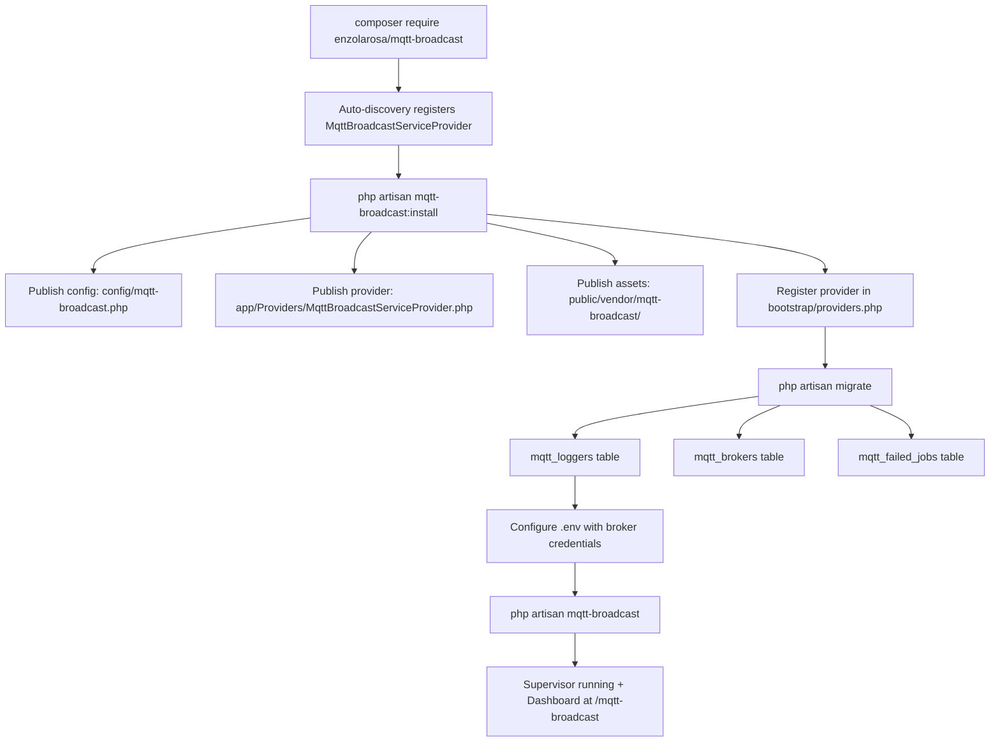
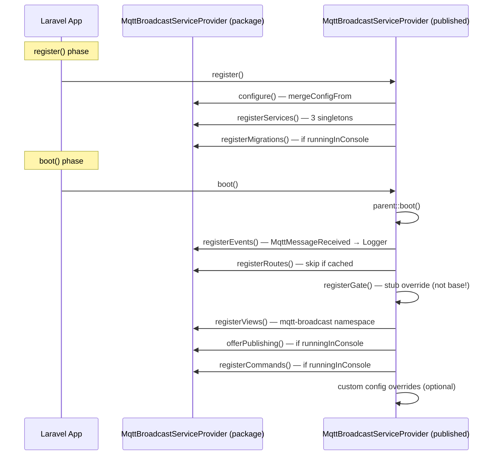
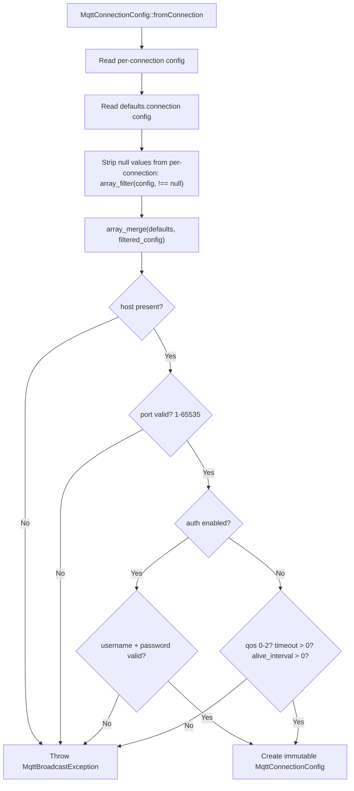
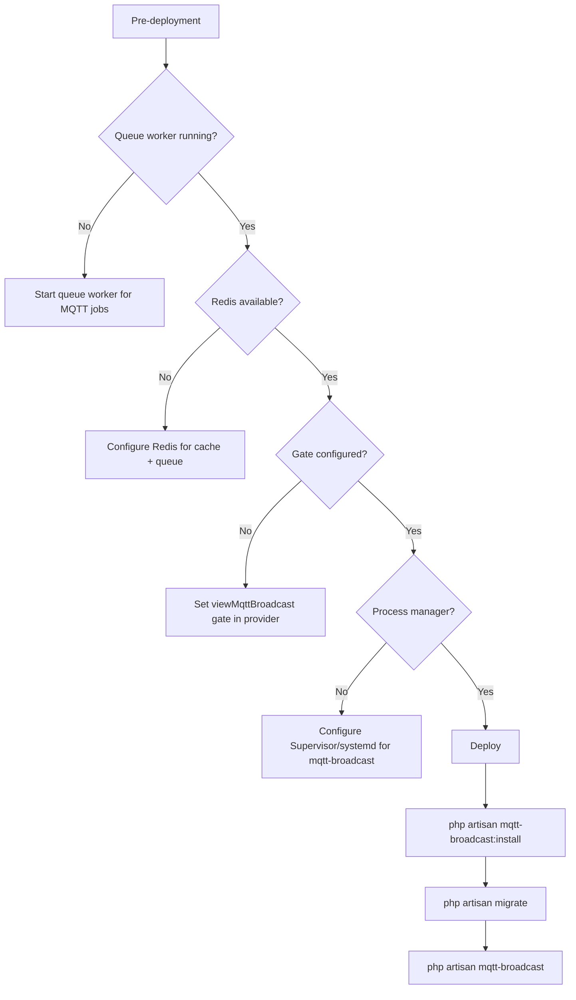

# Installation & Configuration

## Overview

`enzolarosa/mqtt-broadcast` is a Laravel package that provides MQTT integration with Horizon-style process supervision, multi-broker support, a Dead Letter Queue, and a React 19 monitoring dashboard. This guide covers the complete installation process, configuration options, and production deployment considerations.

The package requires PHP 8.3+, Laravel 11+, and the `pcntl` and `posix` PHP extensions for process management. It uses `php-mqtt/client` under the hood for MQTT protocol communication.

## Architecture

The installation follows the standard Laravel package pattern with auto-discovery, publishable assets, and auto-loaded migrations. The `InstallCommand` orchestrates the initial setup by publishing three asset groups and registering a local service provider for gate customization.



## How It Works

### Step 1: Install via Composer

```bash
composer require enzolarosa/mqtt-broadcast
```

Laravel's package auto-discovery reads `composer.json` `extra.laravel.providers` and automatically registers `MqttBroadcastServiceProvider`. The `MqttBroadcast` facade alias is also auto-registered.

### Step 2: Run the Install Command

```bash
php artisan mqtt-broadcast:install
```

The `InstallCommand` performs three sequential operations:

1. **Publishes config** (`mqtt-broadcast-config` tag) — copies `config/mqtt-broadcast.php` to the application's config directory.
2. **Publishes provider** (`mqtt-broadcast-provider` tag) — copies `stubs/MqttBroadcastServiceProvider.stub` to `app/Providers/MqttBroadcastServiceProvider.php`. This local provider extends the package provider and overrides `registerGate()` for dashboard access control.
3. **Publishes assets** (`mqtt-broadcast-assets` tag, also tagged as `laravel-assets`) — copies pre-built React dashboard files to `public/vendor/mqtt-broadcast/`.
4. **Registers provider** — appends `App\Providers\MqttBroadcastServiceProvider::class` to `bootstrap/providers.php` (Laravel 11+) or `config/app.php` (Laravel 10). Idempotent — skips if already present.

All three publish calls use `--force`, so re-running the install command overwrites existing files.

#### Provider Registration Idempotency

Provider registration has a **two-layer idempotency check** with a subtle ordering quirk:

1. `registerMqttBroadcastServiceProvider()` first reads `config/app.php` and checks if the provider class string exists. If found, it returns early — regardless of the Laravel version.
2. If not found in `config/app.php`, it checks for `bootstrap/providers.php` (Laravel 11+). The `registerInBootstrapProviders()` method performs a **second** `Str::contains()` check on the bootstrap file content.

This means on Laravel 11+, the first check always reads `config/app.php` (which won't contain the provider in Laravel 11+ apps) before falling through to the bootstrap file check. The double-check is redundant but harmless.

#### `registerInConfigApp()` Identical Branches

The `registerInConfigApp()` method has an if/else branch checking for the `defaultProviders()->merge()` format vs. the older format. Both branches execute the **exact same** `str_replace()` call — the branch condition has no effect on behavior.

#### Published Stub Boot Ordering

The published provider stub calls `parent::boot()` at the start of its `boot()` method:

```php
public function boot(): void
{
    parent::boot(); // Registers routes, events, gate, views, assets, commands
    // Your customizations here...
}
```

This means the **base provider's `registerGate()`** (deny-all) runs first during `parent::boot()`, then the stub's overridden `registerGate()` is **not** called again — the override works because `registerGate()` is called inside `boot()`, and the published provider's `boot()` replaces the base `boot()`. The method resolution order ensures the stub's `registerGate()` definition is used when the base `boot()` calls `$this->registerGate()`.

### Step 3: Run Migrations

```bash
php artisan migrate
```

Migrations are auto-loaded by the service provider via `loadMigrationsFrom()` (Horizon pattern). No publishing required.

**Note:** `registerMigrations()` is gated by `$this->app->runningInConsole()` — migrations are only registered during Artisan commands. This is intentional: HTTP requests never need migration discovery, so this avoids unnecessary filesystem scans during web requests.

Three tables are created:

| Table | Migration | Purpose |
|-------|-----------|---------|
| `mqtt_loggers` | `2024_11_01_000000_create_mqtt_broadcast_table.php` | Stores received MQTT messages when logging is enabled |
| `mqtt_brokers` | `2024_11_01_000000_create_mqtt_brokers_table.php` | Tracks active broker supervisor processes |
| `mqtt_failed_jobs` | `2025_03_27_000000_create_mqtt_failed_jobs_table.php` | Dead Letter Queue for failed publish jobs |

An additional migration (`2024_11_02_000000`) adds a `last_heartbeat_at` column to `mqtt_brokers`, and another (`2024_11_03_000000`) adds a composite index to `mqtt_loggers`.

### Step 4: Configure the MQTT Broker

Add to `.env`:

```dotenv
# Required
MQTT_HOST=your-broker.example.com
MQTT_PORT=1883

# Optional: Authentication
MQTT_USERNAME=your-username
MQTT_PASSWORD=your-password

# Optional: Topic prefix for all messages
MQTT_PREFIX=myapp/

# Optional: TLS
MQTT_USE_TLS=false
```

### Step 5: Configure Dashboard Access

Edit `app/Providers/MqttBroadcastServiceProvider.php`:

```php
protected function registerGate(): void
{
    Gate::define('viewMqttBroadcast', function ($user) {
        return in_array($user->email, [
            'admin@example.com',
        ]);
    });
}
```

The `Authorize` middleware automatically allows all access in `local` environment. In all other environments, it checks the `viewMqttBroadcast` gate. The default gate denies all access — you must explicitly allow users.

**Authorize middleware internals:** The middleware calls `Gate::allows('viewMqttBroadcast', [$request->user()])`, passing the user as an explicit argument. However, Laravel's Gate automatically injects the authenticated user as the first parameter of the gate callback. This means the user is effectively available twice — once auto-injected as `$user`, and once in the `$arguments` array. The gate callback's `$user` parameter receives the auto-injected user, not the explicit argument. The explicit argument is ignored but harmless.

**Unauthorized response:** Returns a plain `response('Forbidden', 403)` — not JSON. API consumers that expect JSON error responses will receive plain text.

### Step 6: Start the Supervisor

```bash
php artisan mqtt-broadcast
```

This starts the `MasterSupervisor`, which creates one `BrokerSupervisor` per connection defined in the active environment. The dashboard is accessible at `/{path}` (default: `/mqtt-broadcast`).

**Route caching:** `registerRoutes()` checks `$this->app->routesAreCached()` and returns early if cached. If you change the dashboard `path` or `domain` config, you must clear the route cache with `php artisan route:clear` for changes to take effect.

## Key Components

| File | Class/Method | Responsibility |
|------|-------------|----------------|
| `src/Commands/InstallCommand.php` | `InstallCommand::handle()` | Orchestrates installation: publish config, provider, assets; register provider |
| `src/Commands/InstallCommand.php` | `registerMqttBroadcastServiceProvider()` | Reads `config/app.php` first, then checks `bootstrap/providers.php` for Laravel 11+. Two-layer idempotency |
| `src/Commands/InstallCommand.php` | `registerInBootstrapProviders()` | Appends provider to `bootstrap/providers.php` via `Str::replaceLast('];', ...)` |
| `src/Commands/InstallCommand.php` | `registerInConfigApp()` | Appends provider after `RouteServiceProvider` in `config/app.php`. Identical if/else branches |
| `src/MqttBroadcastServiceProvider.php` | `register()` | Merges config (`mergeConfigFrom`), binds services (singletons), loads migrations |
| `src/MqttBroadcastServiceProvider.php` | `boot()` | Registers events, routes, gate, views, publishable assets, commands — in this exact order |
| `src/MqttBroadcastServiceProvider.php` | `registerGate()` | Default gate: `return false` — deny all. Uses `app(Gate::class)` (not facade) |
| `src/MqttBroadcastServiceProvider.php` | `registerRoutes()` | Skips if routes are cached. Configurable prefix/domain/middleware |
| `src/MqttBroadcastServiceProvider.php` | `registerMigrations()` | `loadMigrationsFrom()` gated by `runningInConsole()` |
| `src/MqttBroadcastServiceProvider.php` | `offerPublishing()` | Three publish tags: config, provider, assets. Assets dual-tagged as `laravel-assets` |
| `src/Http/Middleware/Authorize.php` | `handle()` | Local bypass, Gate check with redundant user argument, plain 403 response |
| `src/Support/MqttConnectionConfig.php` | `fromConnection()` | Null-stripping merge with defaults, full validation chain |
| `stubs/MqttBroadcastServiceProvider.stub` | Published provider | Extends base provider, overrides `registerGate()`, calls `parent::boot()` |
| `config/mqtt-broadcast.php` | — | All configuration with sensible defaults. Legacy `password` key at bottom |
| `src/functions.php` | `mqttMessage()` / `mqttMessageSync()` | Global helpers. Default broker is `'local'` (not `'default'` — differs from facade) |

## Service Provider Lifecycle



When the published provider exists, Laravel resolves it (not the base) because auto-discovery registers the base, but the published provider is added to `bootstrap/providers.php` and extends the base. Laravel's service container registers the last provider, and the stub's `boot()` calls `parent::boot()`, which dispatches to the **stub's** method implementations via polymorphism (e.g., `$this->registerGate()` resolves to the stub's override).

## Configuration

### Connections (Required)

```php
'connections' => [
    'default' => [
        'host' => env('MQTT_HOST', '127.0.0.1'),
        'port' => env('MQTT_PORT', 1883),
        'username' => env('MQTT_USERNAME'),
        'password' => env('MQTT_PASSWORD'),
        'prefix' => env('MQTT_PREFIX', ''),
        'use_tls' => env('MQTT_USE_TLS', false),
        'clientId' => env('MQTT_CLIENT_ID'),
    ],
],
```

#### All Per-Connection Keys

| Key | Type | Default | Description |
|-----|------|---------|-------------|
| `host` | string | `127.0.0.1` | **Required.** MQTT broker hostname or IP |
| `port` | int | `1883` | **Required.** MQTT broker port (1–65535) |
| `username` | string\|null | `null` | Broker username (only validated if `auth` is true) |
| `password` | string\|null | `null` | Broker password (only validated if `auth` is true) |
| `prefix` | string | `''` | Topic prefix prepended to all published/subscribed topics |
| `use_tls` | bool | `false` | Enable TLS/SSL encryption |
| `clientId` | string\|null | `null` | MQTT client ID. Auto-generated UUID if not set |
| `auth` | bool | `false` | Enable authentication. When true, `username` and `password` are required and validated |
| `qos` | int | `0` | Per-connection QoS override (0, 1, or 2) |
| `retain` | bool | `false` | Per-connection retain flag override |
| `clean_session` | bool | `false` | Per-connection clean session override |
| `rate_limiting` | array | `[]` | Per-connection rate limit overrides (`max_per_minute`, `max_per_second`) |

#### Config Merge Behavior

When `MqttConnectionConfig::fromConnection()` resolves a connection, it merges per-connection config with global defaults:

```php
$defaults = config('mqtt-broadcast.defaults.connection', []);
$config = array_merge($defaults, array_filter($config, fn ($value) => $value !== null));
```

The `array_filter` strips **null values** from the per-connection config before merging. This means:
- If a per-connection key is explicitly set to `null` (e.g., `'clientId' => null`), the default value is used instead.
- If a per-connection key is set to `false` or `0` or `''`, it takes precedence over the default.
- Keys that exist in per-connection config but not in defaults are preserved (e.g., `username`, `password`, `prefix`).

Multiple connections are supported. Each connection maps to a separate `BrokerSupervisor` process:

```php
'connections' => [
    'default' => ['host' => env('MQTT_HOST'), 'port' => 1883],
    'backup'  => ['host' => env('MQTT_BACKUP_HOST'), 'port' => 1883],
],
```

### Environments

Maps `APP_ENV` to active connections:

```php
'environments' => [
    'production' => ['default', 'backup'],
    'staging'    => ['default'],
    'local'      => ['default'],
],
```

Only connections listed for the current environment are supervised.

### Dashboard

| Key | Env Var | Default | Description |
|-----|---------|---------|-------------|
| `path` | `MQTT_BROADCAST_PATH` | `mqtt-broadcast` | URL path prefix |
| `domain` | `MQTT_BROADCAST_DOMAIN` | `null` | Restrict dashboard to a specific domain |
| `middleware` | — | `['web', Authorize::class]` | Middleware stack |

### Message Logging

| Key | Env Var | Default | Description |
|-----|---------|---------|-------------|
| `logs.enable` | `MQTT_LOG_ENABLE` | `false` | Store all received messages in DB |
| `logs.queue` | `MQTT_LOG_JOB_QUEUE` | `default` | Queue for log jobs |
| `logs.connection` | `MQTT_LOG_CONNECTION` | `mysql` | Database connection for log table |
| `logs.table` | `MQTT_LOG_TABLE` | `mqtt_loggers` | Table name |

### Dead Letter Queue

| Key | Env Var | Default | Description |
|-----|---------|---------|-------------|
| `failed_jobs.connection` | `MQTT_FAILED_JOBS_DB_CONNECTION` | `null` (app default) | Database connection |
| `failed_jobs.table` | `MQTT_FAILED_JOBS_TABLE` | `mqtt_failed_jobs` | Table name |

### MQTT Protocol Defaults

| Key | Default | Description |
|-----|---------|-------------|
| `defaults.connection.qos` | `0` | Quality of Service: 0 (at most once), 1 (at least once), 2 (exactly once) |
| `defaults.connection.retain` | `false` | Broker retains last message per topic |
| `defaults.connection.clean_session` | `false` | Start with clean session on connect |
| `defaults.connection.alive_interval` | `60` | Keep-alive ping interval (seconds) |
| `defaults.connection.timeout` | `3` | Connection timeout (seconds) |
| `defaults.connection.self_signed_allowed` | `true` | Accept self-signed TLS certificates |
| `defaults.connection.max_retries` | `20` | Max reconnection attempts before circuit breaker |
| `defaults.connection.max_retry_delay` | `60` | Max delay between retries (exponential backoff cap) |
| `defaults.connection.max_failure_duration` | `3600` | Max total failure duration before giving up (seconds) |
| `defaults.connection.terminate_on_max_retries` | `false` | Terminate supervisor after max retries exhausted |

### Memory Management

| Key | Env Var | Default | Description |
|-----|---------|---------|-------------|
| `memory.gc_interval` | `MQTT_GC_INTERVAL` | `100` | Run garbage collection every N messages |
| `memory.threshold_mb` | `MQTT_MEMORY_THRESHOLD_MB` | `128` | Memory limit before auto-restart |
| `memory.auto_restart` | `MQTT_MEMORY_AUTO_RESTART` | `true` | Auto-restart supervisors on memory threshold |
| `memory.restart_delay_seconds` | `MQTT_RESTART_DELAY_SECONDS` | `10` | Delay before restart after memory threshold |

### Queue Configuration

| Key | Env Var | Default | Description |
|-----|---------|---------|-------------|
| `queue.name` | `MQTT_JOB_QUEUE` | `default` | Queue name for publish jobs |
| `queue.listener` | `MQTT_LISTENER_QUEUE` | `default` | Queue name for listener jobs |
| `queue.connection` | `MQTT_JOB_CONNECTION` | `redis` | Queue connection driver |

### Supervisor Configuration

| Key | Env Var | Default | Description |
|-----|---------|---------|-------------|
| `master_supervisor.name` | `MQTT_MASTER_NAME` | `master` | Master supervisor name prefix |
| `master_supervisor.cache_ttl` | `MQTT_MASTER_CACHE_TTL` | `3600` | Cache TTL for supervisor state (seconds) |
| `master_supervisor.cache_driver` | `MQTT_CACHE_DRIVER` | `redis` | Cache driver for supervisor state |
| `supervisor.heartbeat_interval` | `MQTT_HEARTBEAT_INTERVAL` | `1` | Heartbeat frequency (seconds) |

### Rate Limiting

Rate limiting config keys are read by `RateLimitService` but are **not present** in the published config file. They must be added manually if rate limiting is desired.

| Key | Default | Description |
|-----|---------|-------------|
| `rate_limiting.enabled` | `true` | Master switch for rate limiting. When `true` but no limits are configured, rate limiting is effectively a no-op (null limits = unlimited) |
| `rate_limiting.strategy` | `reject` | How to handle exceeded limits: `reject` throws `RateLimitExceededException`, `throttle` returns a delay in seconds |
| `rate_limiting.by_connection` | `true` | If true, rate limits apply per-connection (`mqtt_rate_limit:{connection}:{window}`). If false, global key `mqtt_rate_limit:global:{window}` |
| `rate_limiting.cache_driver` | `null` (app default) | Cache driver for rate limit counters. Falls back to the app's default cache store |
| `defaults.connection.rate_limiting.max_per_minute` | `null` | Global default max messages per minute. `null` = unlimited |
| `defaults.connection.rate_limiting.max_per_second` | `null` | Global default max messages per second. `null` = unlimited |

Per-connection overrides can be set within each connection config:

```php
'connections' => [
    'default' => [
        'host' => env('MQTT_HOST'),
        'port' => 1883,
        'rate_limiting' => [
            'max_per_minute' => 100,
            'max_per_second' => 10,
        ],
    ],
],
```

**Important:** `rate_limiting.enabled` defaults to `true`, but with no limit values configured anywhere, `allows()` always returns `true` because both `max_per_second` and `max_per_minute` resolve to `null`, and null limits skip the `tooManyAttempts` check entirely. Rate limiting only has effect when at least one limit value is explicitly set.

### Repository Settings

| Key | Env Var | Default | Description |
|-----|---------|---------|-------------|
| `repository.broker.heartbeat_column` | — | `last_heartbeat_at` | Column name for heartbeat tracking |
| `repository.broker.stale_threshold` | `MQTT_STALE_THRESHOLD` | `300` | Seconds before a broker is considered stale |

### Legacy Config Keys

| Key | Env Var | Default | Description |
|-----|---------|---------|-------------|
| `password` | `MQTT_MASTER_PASS` | `Str::random(32)` | Legacy master password. **Generates a new random 32-char string on every request** via `Str::random(32)` in the config file. Not referenced by any code path — exists only for backward compatibility. Can be safely removed. |

## Config Resolution Flow



## Validation Two-Tier Architecture

Config validation happens at **two different levels** with different scopes:

1. **`MqttBroadcast::validateBrokerConfiguration()`** (facade-level) — only checks that the connection exists and has `host` and `port` keys. Called on every `publish()`/`publishSync()` call. Minimal check for fast rejection.

2. **`MqttConnectionConfig::fromConnection()`** (supervisor-level) — full validation of all fields: host type, port range, QoS range, timeout/alive_interval positivity, auth credentials if enabled. Called at supervisor startup. Fail-fast with descriptive exceptions.

This means a broker config with `'port' => 99999` will pass the facade-level check (`isset` only) and fail at job execution time when `MqttConnectionConfig` performs range validation.

## Error Handling

### Installation Errors

- **Missing `pcntl`/`posix` extensions**: Composer will fail at install. These are required for process supervision (signal handling, PID management).
- **Provider already registered**: `InstallCommand` checks for existing provider registration and skips if found (idempotent).
- **Migration conflicts**: Migrations use timestamped filenames from the vendor directory. No name collision risk since they are not published.
- **`config/app.php` unreadable**: `registerMqttBroadcastServiceProvider()` calls `file_get_contents(config_path('app.php'))` unconditionally — if `config/app.php` doesn't exist (not standard), this will emit a PHP warning and `$appConfig` will be `false`, causing `Str::contains()` to return `false` and proceeding to the bootstrap check.

### Configuration Errors

- **Invalid host/port**: `MqttConnectionConfig::fromConnection()` validates all config values at supervisor startup. Invalid config causes immediate failure with a descriptive exception.
- **Missing connection in environment**: If `environments.{env}` references a connection not defined in `connections`, the supervisor throws at startup.
- **Auth without credentials**: Only validated when `auth` key is explicitly `true`. If `auth` is `false` (default) or absent, `username`/`password` are passed through without validation — they may be used by `MqttClientFactory::getConnectionSettings()` if present, but won't cause a validation error.
- **Port out of range**: `MqttConnectionConfig` validates port is between 1 and 65535. Numeric strings are accepted and cast to int.
- **QoS out of range**: Must be 0, 1, or 2. Non-integer types throw `MqttBroadcastException`.
- **Zero or negative timeout/alive_interval**: Must be positive integers. Zero triggers validation exception.

### Runtime Errors

- **Broker unreachable**: Supervisor uses exponential backoff reconnection up to `max_retries`. Circuit breaker prevents infinite loops.
- **Memory exhaustion**: `MemoryManager` monitors usage and triggers graceful restart when `threshold_mb` is exceeded.
- **Failed publishes**: Jobs that exhaust retries are stored in the `mqtt_failed_jobs` table (DLQ) and can be retried from the dashboard.
- **Rate limit exceeded**: If `rate_limiting.strategy` is `reject`, publishes throw `RateLimitExceededException`. If `throttle`, the job's `checkRateLimit()` sleeps for the returned delay before proceeding.

## Production Deployment Checklist



### Required Steps

1. **Queue worker** — Ensure `php artisan queue:work` is running for the configured queue connection (`redis` by default). Needed for async message publishing and listener processing.
2. **Redis** — Required for both queue processing and master supervisor state caching (default `cache_driver`).
3. **Dashboard gate** — The default gate denies all access in non-local environments. Configure `viewMqttBroadcast` in your published provider.
4. **Process manager** — Use Supervisor (supervisord) or systemd to keep `php artisan mqtt-broadcast` running. Similar to how you'd manage Laravel Horizon.

### Recommended `.env` for Production

```dotenv
MQTT_HOST=mqtt.production.example.com
MQTT_PORT=8883
MQTT_USE_TLS=true
MQTT_USERNAME=prod-user
MQTT_PASSWORD=secure-password
MQTT_PREFIX=production/

MQTT_LOG_ENABLE=true
MQTT_MEMORY_THRESHOLD_MB=256
MQTT_MAX_RETRIES=50
MQTT_CACHE_DRIVER=redis
MQTT_JOB_CONNECTION=redis
```

### Supervisord Configuration Example

```ini
[program:mqtt-broadcast]
process_name=%(program_name)s
command=php /path/to/artisan mqtt-broadcast
autostart=true
autorestart=true
user=www-data
redirect_stderr=true
stdout_logfile=/path/to/storage/logs/mqtt-broadcast.log
stopwaitsecs=3600
```
