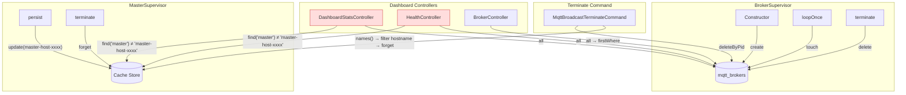
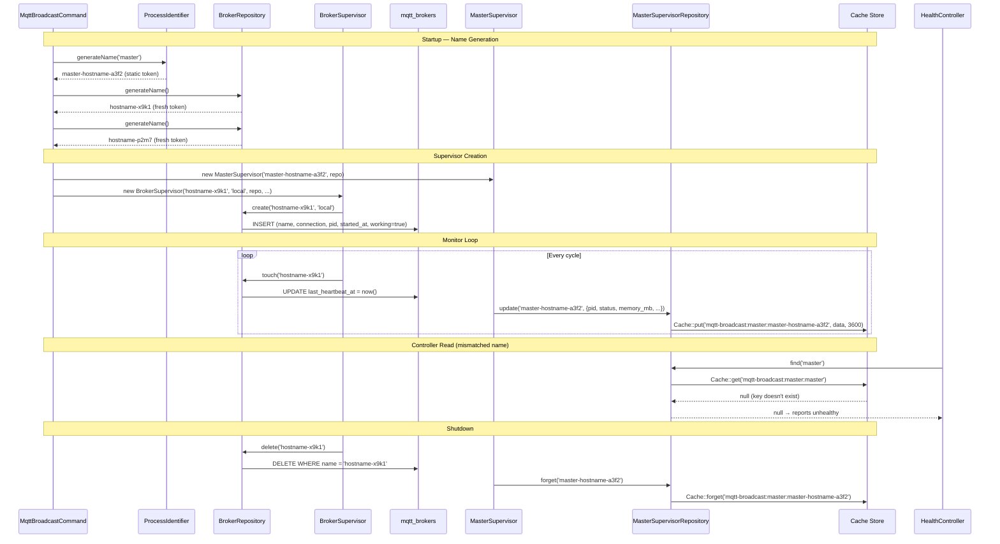
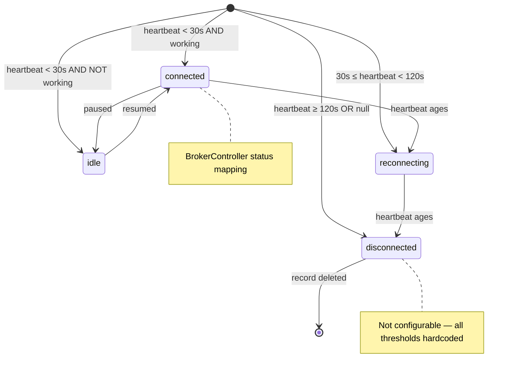

# Repository Pattern

## Overview

The package uses a dual-repository pattern inspired by Laravel Horizon to separate broker process persistence (database) from master supervisor state persistence (cache). `BrokerRepository` manages MQTT broker process records in the `mqtt_brokers` table, while `MasterSupervisorRepository` stores ephemeral supervisor state in the configured cache driver. Both are registered as singletons via the `ServiceBindings` trait and injected into supervisors, controllers, and Artisan commands.

## Architecture

Two persistence strategies serve different data lifecycle requirements:

| Concern | Repository | Storage | Why |
|---|---|---|---|
| Broker processes | `BrokerRepository` | Database (`mqtt_brokers`) | Durable records survive process restarts; queryable by controllers |
| Master supervisor state | `MasterSupervisorRepository` | Cache (Redis/File/Array) | Ephemeral state with TTL; no migrations needed; fast reads |

Both repositories follow the **silent-fail pattern** from Horizon: operations on non-existent records complete without throwing exceptions. This simplifies cleanup logic in terminate commands and shutdown hooks where partial state is expected.

Both are registered in the service container as singletons via the `ServiceBindings` trait in `MqttBroadcastServiceProvider`:

```php
// src/ServiceBindings.php
public $serviceBindings = [
    MqttClientFactory::class,
    BrokerRepository::class,
    MasterSupervisorRepository::class,
];
```

Note: `ServiceBindings` uses self-binding (all numeric keys) — it registers concrete classes as singletons, not interface→implementation bindings. This means repositories cannot be swapped via the container without extending the service provider.

## How It Works

### BrokerRepository Lifecycle

1. **Create** — `MqttBroadcastCommand` calls `$brokerRepository->generateName()` for each connection, then passes the name to `BrokerSupervisor`'s constructor. The constructor calls `$repository->create($name, $connection)`, recording the process PID (`getmypid()`), start time, and initial heartbeat timestamp.
2. **Heartbeat** — On each `loopOnce()` cycle, `BrokerSupervisor` calls `$repository->touch($name)` to update `last_heartbeat_at`. Controllers use this timestamp to determine connection status (active if heartbeat < 2 minutes ago).
3. **Terminate** — `BrokerSupervisor::terminate()` calls `$repository->delete($name)`. The terminate command also uses `deleteByPid()` for PID-based cleanup.

### MasterSupervisorRepository Lifecycle

1. **Update** — `MasterSupervisor::persist()` calls `$repository->update($name, $attributes)` on each monitor loop iteration, storing PID, status, supervisor count, memory usage (in MB), and peak memory. The repository auto-appends an `updated_at` timestamp.
2. **Read** — `DashboardStatsController` and `HealthController` call `$repository->find()` to display supervisor state in the dashboard. The terminate command uses `$repository->names()` to discover all supervisors.
3. **Forget** — `MasterSupervisor::terminate()` calls `$repository->forget($name)` to remove state before exiting.

### Name Generation: Two Implementations

The package has **two separate name generators** that produce names in different formats:

| Generator | Used By | Format | Token Behavior |
|---|---|---|---|
| `BrokerRepository::generateName()` | `MqttBroadcastCommand` (for broker names) | `{hostname}-{random4}` | Fresh `Str::random(4)` on each call |
| `ProcessIdentifier::generateName()` | `MqttBroadcastCommand` (for master name) | `{prefix}-{hostname}-{random4}` | Static `$token` — memoized per PHP process |

`ProcessIdentifier::generateName('master')` produces names like `master-johns-macbook-a3f2`, while `BrokerRepository::generateName()` produces `johns-macbook-x9k1`. The key difference: `ProcessIdentifier` memoizes its random token in a `static $token` variable, so all calls within the same PHP process return the same token. `BrokerRepository` generates a new random token on every call, so each broker on the same host gets a unique name.

Neither generator checks for uniqueness against existing records. `Str::random(4)` produces a 4-character alphanumeric string — collision probability is low (~1 in 1.6M per pair) but non-zero, especially in long-running deployments with frequent restarts.

### Master Supervisor Name Mismatch

There is a naming discrepancy between how the master supervisor persists its state and how controllers look it up:

- **MasterSupervisor** persists with name = `ProcessIdentifier::generateName('master')` → cache key `mqtt-broadcast:master:master-hostname-xxxx`
- **HealthController** and **DashboardStatsController** look up with `config('mqtt-broadcast.master_supervisor.name', 'master')` → cache key `mqtt-broadcast:master:master`

These are different cache keys. As a result, `find('master')` will never match the key `master-hostname-xxxx` stored by the running supervisor. The controllers will always see `$masterSupervisor = null`, causing:
- HealthController always reports `unhealthy` status (HTTP 503)
- DashboardStatsController always reports `memory.current_mb = 0`, `uptime_seconds = 0`, and `status = stopped` (when no brokers are active)

The terminate command avoids this issue by using `$masterRepository->names()` which scans all cache keys with the `mqtt-broadcast:master:` prefix and then filters by hostname.

### Cache State Key Mismatch

Even if the name mismatch were resolved, there is a secondary key mismatch between what `MasterSupervisor::persist()` stores and what controllers read:

| Stored Key (persist) | Read Key (controllers) | Effect |
|---|---|---|
| `memory_mb` | `memory` | Controllers read `null`, fall back to `0` |
| `peak_memory_mb` | not read | Unused by controllers |
| `supervisors` | `supervisors_count` (HealthController) | HealthController reads `null`, falls back to `0` |

Additionally, HealthController and DashboardStatsController apply `$memory / 1024 / 1024` (bytes-to-MB conversion) to the `memory` value, but `persist()` stores the value already in MB (from `MemoryManager::getMemoryStats()['current_mb']`). Even if the key name matched, the displayed memory would be off by a factor of ~1,000,000.

### Duplicate Master Detection

`MqttBroadcastCommand` checks for an existing master supervisor before starting:

```php
$masterName = ProcessIdentifier::generateName('master');
if ($masterRepository->find($masterName)) {
    // warn and exit
}
```

Since `ProcessIdentifier::generateName()` generates a new random token per process (memoized via `static $token`, but unique per PHP invocation), `$masterName` will be different in every artisan invocation. The `find()` call will never match an existing supervisor's cache entry because it checks for its own name, not the running supervisor's name. The duplicate detection is effectively a no-op.

### Cache Key Listing (Multi-Driver)

`MasterSupervisorRepository::names()` needs to discover all active supervisors by scanning cache keys with the `mqtt-broadcast:master:` prefix. Since Laravel's Cache facade does not provide a `keys()` method, the repository implements per-driver key listing:

| Driver | Strategy | Status |
|---|---|---|
| `redis` | `$connection->keys($prefix . '*')` via Redis KEYS command | Working — strips store prefix from returned keys |
| `file` | `glob($directory . '/*')` + deserialize each file to extract key | **Broken** — see below |
| `memcached` | Returns `[]` | Memcached protocol does not support key enumeration |
| `array` | Reflection on `$store->storage` property | Testing only; uses `ReflectionClass` to access private property |
| Other | Returns `[]` | Unsupported drivers silently return empty |

**File driver is broken for two reasons:**

1. **Flat glob** — `glob($directory . '/*')` only scans the top-level directory. Laravel's `FileStore` uses a SHA-256-based nested directory structure (e.g., `ab/cd/abcdef1234...`). Cache files are never stored at the top level, so glob returns no matches.

2. **Missing 'key' field** — `getKeyFromFile()` unserializes the file payload and reads `$data['key']`. Laravel's `FileStore` does not store a `key` field — it stores only the value. The `$data['key'] ?? null` will always return `null`, even if the file were found.

**Redis KEYS command caveat** — `getRedisKeys()` uses `$connection->keys($fullPrefix . '*')` which runs the Redis KEYS command. Redis documentation warns that KEYS should not be used in production on large datasets as it scans the entire keyspace and blocks the server. For this use case (typically few supervisors) the impact is negligible, but it could be a concern if the Redis instance has millions of keys.

**Array driver reflection** — `getArrayKeys()` uses `ReflectionClass` to access the private `$storage` property of `ArrayStore`. This works for testing but is fragile — the property name or visibility could change across Laravel versions without notice.

### Stale Threshold Configuration vs Hardcoded Values

The config file defines `repository.broker.stale_threshold` (default 300 seconds / 5 minutes), but no code reads this config key. All three consumers hardcode their own threshold:

| Consumer | Threshold | Code |
|---|---|---|
| `HealthController::check()` | 2 minutes | `$broker->last_heartbeat_at > now()->subMinutes(2)` |
| `DashboardStatsController::index()` | 2 minutes | `$broker->last_heartbeat_at > now()->subMinutes(2)` |
| `BrokerController::index()` | 2 minutes | `$broker->last_heartbeat_at > now()->subMinutes(2)` |

The config default of 300 seconds (5 minutes) does not match the hardcoded 120-second threshold. Similarly, the `repository.broker.heartbeat_column` config key (`last_heartbeat_at`) is defined but never read — the column name is hardcoded in `BrokerRepository::touch()` and in the model's `$fillable` array.

### BrokerController Bypasses Repository

`BrokerController::show()` does not use `BrokerRepository::find()`. Instead, it loads all brokers via `$brokerRepository->all()` and filters in memory:

```php
$broker = $brokerRepository->all()->firstWhere('id', $id);
```

This loads every record from `mqtt_brokers` to find a single broker by ID. The repository has `find($name)` (by name) but no `findById($id)` method. The controller receives an `int $id` from the route but has no efficient way to query by ID through the repository.

`BrokerController::index()` also loads all brokers and applies stale-check + message counting in a map closure. When logging is enabled, it executes **two queries per broker** against `mqtt_loggers` (count + latest), making it O(n) on broker count.

### MasterSupervisorRepository::all() Sequential Reads

`all()` calls `names()` then maps each name to a `find()` call:

```php
return collect($names)->map(function (string $name) {
    return $this->find($name);
})->filter();
```

Each `find()` is a separate `Cache::get()` call. With Redis this means one round-trip per supervisor. For the typical case of 1–3 supervisors this is fine, but there is no batching via `Cache::many()`.

### Cache Driver Configuration Disconnect

The config file defines `master_supervisor.cache_driver` (default `'redis'`), but `MasterSupervisorRepository` does not read this key. It uses the **default Laravel cache driver** in two ways:

1. `Cache::put()` / `Cache::get()` / `Cache::forget()` — all use the default cache store (`config('cache.default')`)
2. `getCacheKeys()` dispatches on `config('cache.default')`, not `config('mqtt-broadcast.master_supervisor.cache_driver')`

Setting `MQTT_CACHE_DRIVER=file` in `.env` has no effect on the repository — it will continue using whatever `CACHE_DRIVER` is set to. The `master_supervisor.cache_driver` config key is defined but never consumed.

### TTL Constructor Caching

`MasterSupervisorRepository` reads `cache_ttl` once in the constructor:

```php
public function __construct()
{
    $this->ttl = config('mqtt-broadcast.master_supervisor.cache_ttl', 3600);
}
```

Since the repository is a singleton, this value is frozen for the lifetime of the application. Runtime changes to the config (e.g., via `Config::set()`) after the singleton is resolved will not affect the TTL.

## Key Components

| File | Class/Method | Responsibility |
|---|---|---|
| `src/Repositories/BrokerRepository.php` | `BrokerRepository::create()` | Insert broker record with `getmypid()`, `now()` timestamps, `working=true` |
| | `BrokerRepository::find()` | Lookup broker by name (returns `?BrokerProcess`) |
| | `BrokerRepository::all()` | Return all broker records via `BrokerProcess::all()` (no filtering) |
| | `BrokerRepository::touch()` | `UPDATE last_heartbeat_at = now()` (silent fail via `update()` returning 0) |
| | `BrokerRepository::delete()` | `DELETE WHERE name = ?` (silent fail) |
| | `BrokerRepository::deleteByPid()` | `DELETE WHERE pid = ?` — may delete multiple records (silent fail) |
| | `BrokerRepository::generateName()` | `Str::slug(gethostname()) . '-' . Str::lower(Str::random(4))` — fresh token each call |
| `src/Repositories/MasterSupervisorRepository.php` | `MasterSupervisorRepository::__construct()` | Reads and caches `cache_ttl` config as `$this->ttl` |
| | `MasterSupervisorRepository::update()` | `Cache::put(key, data + updated_at, ttl)` — full overwrite, not merge |
| | `MasterSupervisorRepository::find()` | `Cache::get(key)` — returns raw array or null |
| | `MasterSupervisorRepository::forget()` | `Cache::forget(key)` — no-op if key missing |
| | `MasterSupervisorRepository::all()` | `names()` → sequential `find()` per name → `filter()` nulls |
| | `MasterSupervisorRepository::names()` | Discover names via `getCacheKeys()`, strip prefix |
| | `MasterSupervisorRepository::getCacheKeys()` | `match` on `config('cache.default')` → driver-specific method |
| | `MasterSupervisorRepository::getRedisKeys()` | Redis KEYS command with store prefix stripping |
| | `MasterSupervisorRepository::getFileKeys()` | Flat glob + deserialization (broken — see analysis above) |
| | `MasterSupervisorRepository::getArrayKeys()` | Reflection on `$store->storage` private property |
| | `MasterSupervisorRepository::getKeyFromFile()` | 10-byte offset + unserialize + `$data['key']` extraction (key field missing in Laravel) |
| `src/Support/ProcessIdentifier.php` | `ProcessIdentifier::generateName()` | `{prefix}-{hostname}-{token}` with memoized static `$token` |
| | `ProcessIdentifier::hostname()` | `Str::slug(gethostname())` |
| `src/Models/BrokerProcess.php` | `BrokerProcess` | Eloquent model — `$table = 'mqtt_brokers'`, casts `pid` to integer, `working` to boolean, `started_at`/`last_heartbeat_at` to datetime |
| `src/ServiceBindings.php` | `ServiceBindings` | Registers both repositories + `MqttClientFactory` as singletons (self-binding, numeric keys) |
| `src/Http/Controllers/BrokerController.php` | `BrokerController::show()` | Loads `all()` then `firstWhere('id', $id)` — no dedicated `findById()` |
| | `BrokerController::determineConnectionStatus()` | 4-tier status: connected (<30s+working), idle (<30s+!working), reconnecting (<120s), disconnected (>120s) |

## Database Schema

### `mqtt_brokers` table

| Column | Type | Notes |
|---|---|---|
| `id` | `bigint` (PK) | Auto-increment |
| `name` | `string` | Unique broker identifier (e.g. `johns-macbook-a3f2`) |
| `connection` | `string` | MQTT connection name from config |
| `pid` | `unsigned int` (nullable) | OS process ID; cast to `integer` by model |
| `working` | `boolean` | Set `true` on create; cast to boolean by model |
| `started_at` | `datetimetz` (nullable) | Process start timestamp; cast to `datetime` by model |
| `last_heartbeat_at` | `timestamp` (nullable) | Updated on each `touch()` call; cast to `datetime` by model |
| `created_at` / `updated_at` | `timestamp` | Eloquent timestamps |

Note: `BrokerProcess` does not override `getConnectionName()`, so it uses the application's default database connection. The table name is hardcoded as `'mqtt_brokers'` in the model.

### Cache state structure (MasterSupervisorRepository)

Cache key format: `mqtt-broadcast:master:{name}`

What `MasterSupervisor::persist()` actually stores:

```php
[
    'pid'             => 12345,
    'status'          => 'running',    // 'running' | 'paused'
    'supervisors'     => 2,            // count of active BrokerSupervisors
    'memory_mb'       => 45.2,         // current memory in MB (from MemoryManager)
    'peak_memory_mb'  => 52.1,         // peak memory in MB
    'updated_at'      => '2026-01-26 10:05:00', // auto-appended by repository
]
```

Note: the key names differ from what controllers expect (`memory` vs `memory_mb`, `supervisors_count` vs `supervisors`). There is no `started_at` field in the persisted data — the doc previously showed one, but `MasterSupervisor::persist()` does not include it. Uptime calculation in `DashboardStatsController::calculateUptime()` reads `$masterData['started_at']` which will always be `null`.

## Configuration

| Config Key | Env Var | Default | Actually Used By |
|---|---|---|---|
| `master_supervisor.name` | `MQTT_MASTER_NAME` | `'master'` | `HealthController`, `DashboardStatsController` (for `find()`) — but not by `MasterSupervisor` which uses `ProcessIdentifier::generateName()` instead |
| `master_supervisor.cache_ttl` | `MQTT_MASTER_CACHE_TTL` | `3600` | `MasterSupervisorRepository::__construct()` — cached at singleton resolution time |
| `master_supervisor.cache_driver` | `MQTT_CACHE_DRIVER` | `'redis'` | **Not used** — repository uses `Cache` facade (app default driver) and `config('cache.default')` for key listing dispatch |
| `repository.broker.heartbeat_column` | — | `'last_heartbeat_at'` | **Not used** — column name hardcoded in `BrokerRepository::touch()` and model `$fillable` |
| `repository.broker.stale_threshold` | `MQTT_STALE_THRESHOLD` | `300` | **Not used** — all consumers hardcode `now()->subMinutes(2)` (120 seconds) |
| `memory.threshold_mb` | — | `128` | `HealthController::checkMemoryStatus()`, `DashboardStatsController::calculateMemoryUsagePercent()` |

## Error Handling

**BrokerRepository** — All operations use the silent-fail pattern. `touch()`, `delete()`, and `deleteByPid()` on non-existent records complete silently (no exceptions). This is intentional: during termination, broker records may already be cleaned up by another process. `create()` does NOT silent-fail — it uses `BrokerProcess::create()` which throws on constraint violations (e.g., if `name` had a unique index, though none is defined in the schema).

**MasterSupervisorRepository** — `forget()` on a non-existent key is a no-op (Laravel Cache behavior). The `getKeyFromFile()` method catches `Throwable` during deserialization, logs a warning, and returns `null` — corrupted cache files do not block supervisor discovery. Reflection failures in the array driver are caught via `ReflectionException`. The `getRedisKeys()` and `getFileKeys()` methods check `method_exists()` before accessing driver-specific methods, silently returning `[]` if the expected method is absent.

**Memcached limitation** — The Memcached driver cannot enumerate keys. `MasterSupervisorRepository::all()` and `names()` will return empty results. This is documented in code but not worked around; Redis is the recommended (and only fully functional) production driver.

**BrokerController** — `show()` returns HTTP 404 JSON if the broker is not found. `index()` and `show()` handle null `started_at` and `last_heartbeat_at` with null-safe operators (`?->`) and fallback to `PHP_INT_MAX` for heartbeat age when null.

**Terminate command** — Best-effort cleanup: `posix_kill()` failures are caught and logged. ESRCH (errno 3, "No such process") is treated as success (process already terminated). DB cleanup (`deleteByPid`) happens before `posix_kill`, so broker records are removed even if the signal fails.






