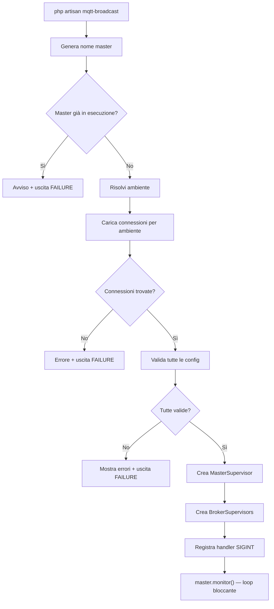
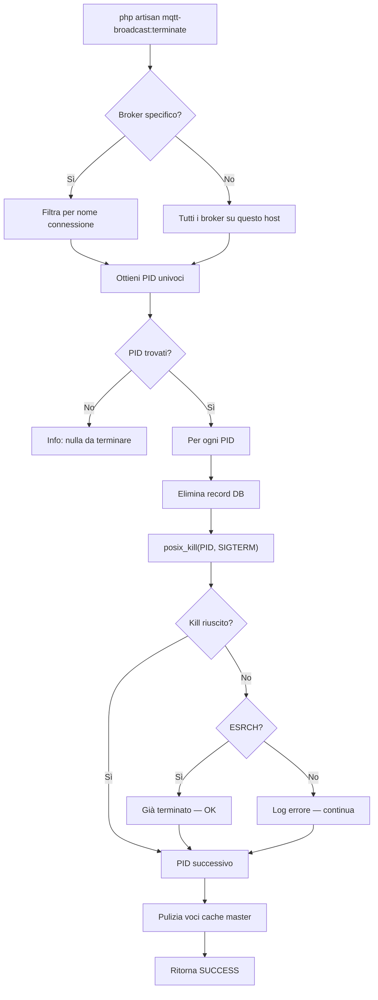
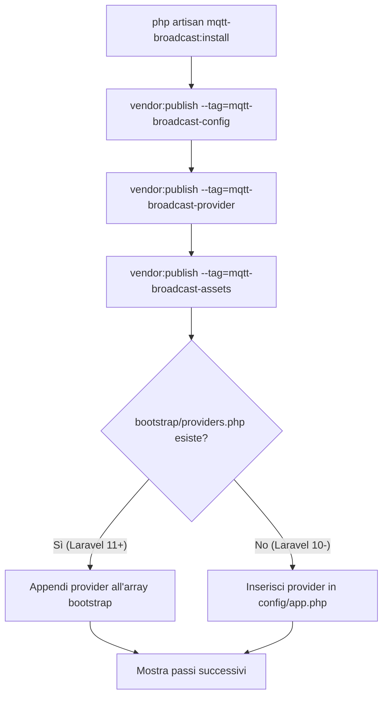

# Comandi Artisan

## Panoramica

MQTT Broadcast fornisce quattro comandi Artisan che gestiscono l'intero ciclo di vita del sistema di supervisione: installazione, avvio, terminazione e test di connettività. Questi comandi seguono i pattern CLI di Laravel Horizon — un processo foreground bloccante per il supervisor, terminazione basata su segnali e un installer one-time che pubblica configurazione, service provider e asset frontend.

Tutti i comandi sono registrati condizionalmente tramite `MqttBroadcastServiceProvider::registerCommands()`, che limita la registrazione ai contesti console con `$this->app->runningInConsole()`.

## Architettura

I comandi sono intenzionalmente minimali — delegano tutta la logica pesante ai layer supervisor e repository:

- **InstallCommand** — orchestra `vendor:publish` per tre tag e registra il service provider nel file di bootstrap dell'applicazione.
- **MqttBroadcastCommand** — punto di ingresso principale. Crea `MasterSupervisor` + N istanze `BrokerSupervisor` ed entra in un loop di monitoraggio bloccante.
- **MqttBroadcastTerminateCommand** — invia `SIGTERM` ai processi supervisor attivi e ripulisce lo stato nel database e nella cache.
- **MqttBroadcastTestCommand** — pubblicazione sincrona one-shot per verificare la connettività al broker.

Decisioni architetturali:
- **Validazione fail-fast**: `MqttBroadcastCommand` valida tutte le configurazioni delle connessioni chiamando `MqttClientFactory::create()` prima di creare qualsiasi supervisor. Configurazioni non valide interrompono immediatamente l'avvio.
- **Prevenzione duplicati**: controlla la cache per un master supervisor esistente con lo stesso nome basato sull'hostname. Un solo master per macchina.
- **Terminate best-effort**: `MqttBroadcastTerminateCommand` ritorna sempre `SUCCESS` — la pulizia è best-effort. Processi stale e voci cache vengono ripuliti anche se `posix_kill` fallisce.
- **Risoluzione ambiente stile Horizon**: l'ambiente viene risolto tramite opzione CLI > config `mqtt-broadcast.env` > `APP_ENV`, replicando la precedenza di Horizon.

## Come Funziona

### mqtt-broadcast:install

Pubblica tutte le risorse del pacchetto e registra il service provider:

1. Chiama `vendor:publish --force` per tre tag in sequenza:
   - `mqtt-broadcast-config` → copia `config/mqtt-broadcast.php` nella directory config dell'applicazione.
   - `mqtt-broadcast-provider` → copia `MqttBroadcastServiceProvider.stub` in `app/Providers/MqttBroadcastServiceProvider.php`.
   - `mqtt-broadcast-assets` → copia gli asset compilati della dashboard React in `public/vendor/mqtt-broadcast/`.
2. Chiama `registerMqttBroadcastServiceProvider()`:
   - Legge `config/app.php` per verificare se il provider è già registrato.
   - Se `bootstrap/providers.php` esiste (Laravel 11+): appende la classe del provider all'array di ritorno.
   - Altrimenti (Laravel 10 e precedenti): inserisce il provider dopo `RouteServiceProvider` nell'array `providers` di `config/app.php`.
3. Mostra le istruzioni per i passi successivi (configurare il broker, aggiornare il gate, eseguire le migrazioni, avviare il supervisor).

### mqtt-broadcast

Avvia il sistema di supervisione come processo foreground bloccante:

1. Genera un nome master univoco: `ProcessIdentifier::generateName('master')` → formato `master-{hostname}-{token-4-char}`. Il token è statico per processo (memoizzato via `static $token`).
2. Controlla `MasterSupervisorRepository::find($masterName)` — se un master esiste in cache, interrompe con un avviso.
3. Risolve l'ambiente: opzione `--environment` > `config('mqtt-broadcast.env')` > `config('app.env')`.
4. Legge le connessioni da `config('mqtt-broadcast.environments.{env}')`. Array vuoto → errore + uscita.
5. **Passo di validazione**: itera tutte le connessioni, chiama `MqttClientFactory::create()` su ciascuna. Raccoglie tutti gli errori, li mostra insieme, poi interrompe se qualcuno è fallito.
6. Crea `MasterSupervisor` con il nome generato e il repository.
7. Imposta un callback di output che reindirizza le righe di log del supervisor all'output del comando Artisan.
8. Per ogni connessione: genera un nome broker tramite `BrokerRepository::generateName()`, crea un `BrokerSupervisor`, lo aggiunge al master.
9. Mostra informazioni di avvio: numero di broker, nome dell'ambiente, lista broker.
10. Registra l'handler `SIGINT` via `pcntl_signal()` con `pcntl_async_signals(true)` — chiama `$master->terminate()` su Ctrl+C.
11. Chiama `MasterSupervisor::monitor()` — entra nel loop infinito (tick da 1 secondo). Questa chiamata non ritorna mai in condizioni normali.

### mqtt-broadcast:terminate

Termina i processi supervisor attivi in modo graceful:

1. Legge l'argomento opzionale `{broker}` per filtrare una connessione specifica.
2. Ottiene l'hostname tramite `ProcessIdentifier::hostname()`.
3. Carica tutti i broker da `BrokerRepository::all()`, filtra quelli il cui `name` inizia con l'hostname corrente.
4. Se è stato richiesto un broker specifico, filtra ulteriormente per nome `connection`.
5. Estrae i PID univoci dalla lista di broker filtrata.
6. Per ogni PID:
   - Chiama `BrokerRepository::deleteByPid($processId)` per pulire il record nel database prima (anche se il kill fallisce).
   - Chiama `posix_kill($processId, SIGTERM)` per inviare il segnale di terminazione.
   - In caso di fallimento: controlla `posix_get_last_error()`. ESRCH (errno 3, "No such process") viene trattato come successo (processo già terminato). Altri errori vengono riportati ma non interrompono il comando.
7. Pulizia di sicurezza: carica tutti i nomi dei master supervisor dalla cache, filtra per hostname corrente, elimina le voci cache corrispondenti tramite `MasterSupervisorRepository::forget()`.
8. Ritorna sempre `Command::SUCCESS`.

### mqtt-broadcast:test

Invia un singolo messaggio di test sincrono:

1. Prende tre argomenti obbligatori: `{broker}`, `{topic}`, `{message}`.
2. Chiama `MqttBroadcast::publishSync($topic, $message, $broker)` — usa direttamente la facade, bypassando la coda.
3. Avvolge la chiamata in `$this->components->task()` per feedback visivo.
4. Ritorna `Command::SUCCESS`.

## Componenti Principali

| File | Classe / Metodo | Responsabilità |
|------|----------------|----------------|
| `src/Commands/InstallCommand.php` | `InstallCommand::handle()` | Pubblica config, stub provider e asset |
| `src/Commands/InstallCommand.php` | `InstallCommand::registerMqttBroadcastServiceProvider()` | Auto-registrazione del provider nel bootstrap o config |
| `src/Commands/InstallCommand.php` | `InstallCommand::registerInBootstrapProviders()` | Registrazione provider per Laravel 11+ |
| `src/Commands/InstallCommand.php` | `InstallCommand::registerInConfigApp()` | Registrazione provider per Laravel 10 e precedenti |
| `src/Commands/MqttBroadcastCommand.php` | `MqttBroadcastCommand::handle()` | Crea i supervisor, entra nel loop di monitoraggio |
| `src/Commands/MqttBroadcastCommand.php` | `MqttBroadcastCommand::getEnvironmentConnections()` | Legge la lista broker specifica per ambiente dalla config |
| `src/Commands/MqttBroadcastTerminateCommand.php` | `MqttBroadcastTerminateCommand::handle()` | Invia SIGTERM, pulisce record DB e cache |
| `src/Commands/MqttBroadcastTestCommand.php` | `MqttBroadcastTestCommand::handle()` | Pubblicazione sincrona tramite facade |
| `src/Support/ProcessIdentifier.php` | `ProcessIdentifier::generateName()` | Genera nomi `{prefix}-{hostname}-{token}` |
| `src/Support/ProcessIdentifier.php` | `ProcessIdentifier::hostname()` | Hostname slugificato della macchina |
| `src/MqttBroadcastServiceProvider.php` | `registerCommands()` | Registrazione condizionale dei comandi |

## Configurazione

| Chiave Config / Opzione | Default | Descrizione |
|---|---|---|
| `--environment` (opzione CLI) | — | Sovrascrive l'ambiente per la risoluzione dei broker |
| `mqtt-broadcast.env` | `null` | Sovrascrittura ambiente a livello config |
| `mqtt-broadcast.environments.{env}` | `['default']` | Array di nomi connessione per ambiente |
| `mqtt-broadcast.connections.{name}` | — | Impostazioni connessione broker (host, porta, auth, TLS) |
| `mqtt-broadcast.master_supervisor.cache_driver` | `redis` | Driver cache per lo stato del master supervisor |
| `mqtt-broadcast.master_supervisor.cache_ttl` | `3600` | TTL per le voci cache del master supervisor |

Asset pubblicati (tramite `mqtt-broadcast:install`):

| Tag | Sorgente | Destinazione |
|---|---|---|
| `mqtt-broadcast-config` | `config/mqtt-broadcast.php` | `config_path('mqtt-broadcast.php')` |
| `mqtt-broadcast-provider` | `stubs/MqttBroadcastServiceProvider.stub` | `app_path('Providers/MqttBroadcastServiceProvider.php')` |
| `mqtt-broadcast-assets` | `public/vendor/mqtt-broadcast/` | `public_path('vendor/mqtt-broadcast/')` |

## Gestione Errori

| Comando | Scenario di Errore | Comportamento |
|---|---|---|
| `mqtt-broadcast` | Master già in esecuzione | Avviso e uscita con `FAILURE` |
| `mqtt-broadcast` | Nessuna connessione per l'ambiente | Messaggio di errore con suggerimento config, uscita con `FAILURE` |
| `mqtt-broadcast` | Validazione config connessione fallita | Raccoglie tutti gli errori, li mostra, uscita con `FAILURE` |
| `mqtt-broadcast:terminate` | Nessun processo trovato per il broker | Messaggio informativo, ritorna `SUCCESS` |
| `mqtt-broadcast:terminate` | `posix_kill` fallisce con ESRCH | Trattato come successo (processo già terminato) |
| `mqtt-broadcast:terminate` | `posix_kill` fallisce con altro errore | Errore riportato, prosegue al PID successivo |
| `mqtt-broadcast:test` | Broker irraggiungibile o non valido | Eccezione propagata da `publishSync()`, il task mostra il fallimento |
| `mqtt-broadcast:install` | Provider già registrato | Salta silenziosamente la registrazione |

## Diagrammi Mermaid

### Flusso di Avvio del Supervisor

### Flusso di Terminazione

### Flusso di Installazione

