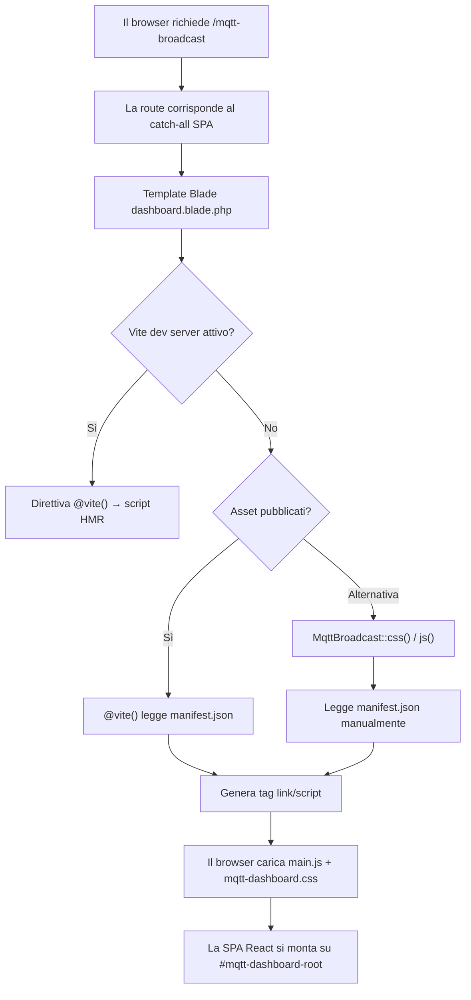
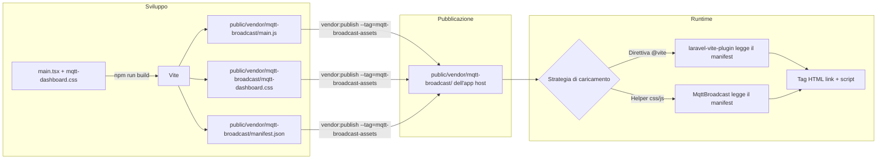
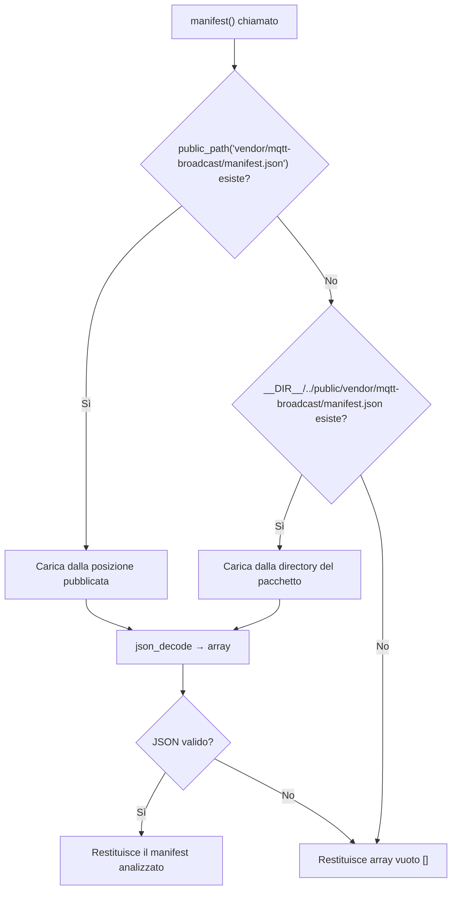

# Pipeline degli Asset della Dashboard

## Panoramica

La dashboard di MQTT Broadcast è una SPA React 19 che necessita di file CSS e JavaScript per funzionare nel browser. La pipeline degli asset gestisce la compilazione di questi file con Vite, la loro pubblicazione nella directory `public/` dell'applicazione host e l'iniezione nel template Blade. Il pacchetto offre due strategie di caricamento: la direttiva `@vite()` (usata in sviluppo) e gli helper statici `MqttBroadcast::css()`/`MqttBroadcast::js()` (per la produzione senza Vite dev server).

## Architettura

### Toolchain di Build

La pipeline si basa su tre livelli:

1. **Vite** — compila TypeScript/React/CSS in file ottimizzati per la produzione con nomi deterministici (`main.js`, `mqtt-dashboard.css`)
2. **laravel-vite-plugin** — integra Vite con il sistema di asset serving di Laravel, indirizzando l'output in `vendor/mqtt-broadcast/` invece della directory `build/` predefinita
3. **Risoluzione basata su manifest** — un file `manifest.json` mappa gli entry point sorgente ai nomi dei file compilati, permettendo agli helper `css()`/`js()` di localizzare gli asset senza percorsi hardcoded

### Configurazione Vite

```typescript
// vite.config.ts
export default defineConfig({
  plugins: [
    laravel({
      input: [
        'resources/js/mqtt-dashboard/src/main.tsx',
        'resources/css/mqtt-dashboard.css',
      ],
      refresh: true,
      buildDirectory: 'vendor/mqtt-broadcast',
    }),
    react(),
  ],
  build: {
    rollupOptions: {
      output: {
        entryFileNames: '[name].js',
        chunkFileNames: '[name].js',
        assetFileNames: '[name].[ext]',
      },
    },
  },
  resolve: {
    alias: {
      '@': path.resolve(__dirname, './resources/js/mqtt-dashboard/src'),
    },
  },
});
```

Decisioni chiave:
- **`buildDirectory: 'vendor/mqtt-broadcast'`** — isola gli asset del pacchetto dalla build Vite dell'applicazione host (`build/`)
- **Nomi file deterministici** (`[name].js` anziché `[name]-[hash].js`) — semplifica il parsing del manifest e rende gli asset pubblicati prevedibili. L'invalidazione della cache si basa sullo step di pubblicazione anziché sull'hashing del contenuto.
- **Alias `@`** — mappa a `resources/js/mqtt-dashboard/src/` per import puliti all'interno della SPA

### Entry Point

| Entry Point | File di Output | Scopo |
|---|---|---|
| `resources/js/mqtt-dashboard/src/main.tsx` | `main.js` | Bootstrap della SPA React |
| `resources/css/mqtt-dashboard.css` | `mqtt-dashboard.css` | Stili Tailwind CSS |

### Struttura del Manifest

Dopo `npm run build`, Vite genera `public/vendor/mqtt-broadcast/manifest.json`:

```json
{
  "resources/css/mqtt-dashboard.css": {
    "file": "mqtt-dashboard.css",
    "src": "resources/css/mqtt-dashboard.css",
    "isEntry": true
  },
  "resources/js/mqtt-dashboard/src/main.tsx": {
    "file": "main.js",
    "src": "resources/js/mqtt-dashboard/src/main.tsx",
    "isEntry": true,
    "css": ["mqtt-dashboard.css"]
  }
}
```

Ogni voce contiene:
- `file` — il nome del file compilato
- `src` — il percorso sorgente originale (chiave del manifest)
- `isEntry` — se è un entry point di primo livello (solo gli entry point vengono caricati)
- `css` — (opzionale) file CSS da cui questo entry JS dipende

## Come Funziona

### Flusso di Caricamento degli Asset



### Strategia 1: Direttiva `@vite()` (Predefinita)

Il template Blade usa la direttiva `@vite()` come meccanismo primario di caricamento degli asset:

```blade
@vite([
    'resources/js/mqtt-dashboard/src/main.tsx',
    'resources/css/mqtt-dashboard.css'
], 'vendor/mqtt-broadcast')
```

Il secondo argomento (`'vendor/mqtt-broadcast'`) indica a `laravel-vite-plugin` di cercare il manifest in `public/vendor/mqtt-broadcast/manifest.json` anziché nel percorso predefinito `public/build/manifest.json`.

- **In sviluppo**: si connette al Vite dev server per HMR (Hot Module Replacement)
- **In produzione**: legge il manifest e genera tag `<link>` e `<script>` che puntano ai file compilati

### Strategia 2: Helper `MqttBroadcast::css()` / `MqttBroadcast::js()`

Questi metodi statici su `enzolarosa\MqttBroadcast\MqttBroadcast` forniscono un caricamento alternativo basato su manifest che non dipende dalla direttiva `@vite()`.

#### `MqttBroadcast::css()`

```php
public static function css(): string
```

1. Chiama `static::manifest()` per caricare l'array del manifest
2. Filtra le voci dove `isEntry` è `true`
3. Raccoglie tutti i file CSS sia dalla chiave `file` che dall'array `css`
4. Deduplica e filtra solo le estensioni `.css`
5. Restituisce tag `<link rel="stylesheet">` usando l'helper `asset()` di Laravel

Output di esempio:
```html
<link rel="stylesheet" href="https://example.com/vendor/mqtt-broadcast/mqtt-dashboard.css">
```

#### `MqttBroadcast::js()`

```php
public static function js(): string
```

1. Chiama `static::manifest()` per caricare l'array del manifest
2. Filtra le voci dove `isEntry` è `true`
3. Estrae la chiave `file` da ogni voce
4. Filtra solo le estensioni `.js`
5. Restituisce tag `<script type="module">` usando l'helper `asset()` di Laravel

Output di esempio:
```html
<script type="module" src="https://example.com/vendor/mqtt-broadcast/main.js"></script>
```

#### `MqttBroadcast::manifest()` (Protetto)

```php
protected static function manifest(): array
```

Carica e analizza `manifest.json` con una strategia di risoluzione a due step:

1. **Posizione pubblicata**: `public_path('vendor/mqtt-broadcast/manifest.json')` — usata quando gli asset sono stati pubblicati nell'applicazione host
2. **Posizione del pacchetto**: `__DIR__.'/../public/vendor/mqtt-broadcast/manifest.json'` — fallback per lo sviluppo quando si esegue direttamente dalla directory del pacchetto
3. **Fallback vuoto**: restituisce `[]` se nessun percorso esiste (nessun asset disponibile)

### Integrazione con il Template Blade

```blade
<!-- resources/views/dashboard.blade.php -->
<head>
    <script>
        window.mqttBroadcast = {
            basePath: '{{ config('mqtt-broadcast.path', 'mqtt-broadcast') }}',
            apiUrl: '/{{ config('mqtt-broadcast.path', 'mqtt-broadcast') }}/api',
            loggingEnabled: {{ config('mqtt-broadcast.logs.enable', false) ? 'true' : 'false' }},
            refreshInterval: 5000,
        };
    </script>
    @vite([
        'resources/js/mqtt-dashboard/src/main.tsx',
        'resources/css/mqtt-dashboard.css'
    ], 'vendor/mqtt-broadcast')
</head>
<body>
    <div id="mqtt-dashboard-root"></div>
</body>
```

Il template inietta la configurazione runtime tramite `window.mqttBroadcast` prima di caricare gli asset della SPA.

## Componenti Chiave

| File | Classe/Metodo | Responsabilità |
|---|---|---|
| `src/MqttBroadcast.php` | `MqttBroadcast::css()` | Genera tag `<link>` dal manifest |
| `src/MqttBroadcast.php` | `MqttBroadcast::js()` | Genera tag `<script type="module">` dal manifest |
| `src/MqttBroadcast.php` | `MqttBroadcast::manifest()` | Carica e analizza `manifest.json` con risoluzione fallback |
| `src/MqttBroadcastServiceProvider.php` | `offerPublishing()` | Registra gli asset pubblicabili con il tag `mqtt-broadcast-assets` |
| `resources/views/dashboard.blade.php` | Template Blade | Avvia la SPA con iniezione di configurazione e direttiva `@vite()` |
| `vite.config.ts` | Configurazione Vite | Definisce entry point, directory di build e naming dell'output |
| `public/vendor/mqtt-broadcast/manifest.json` | Manifest | Mappa gli entry point sorgente ai file di output compilati |

## Configurazione

### Pubblicazione degli Asset

Gli asset vengono pubblicati tramite il ServiceProvider con due tag:

```php
$this->publishes([
    __DIR__.'/../public/vendor/mqtt-broadcast' => public_path('vendor/mqtt-broadcast'),
], ['mqtt-broadcast-assets', 'laravel-assets']);
```

| Tag | Utilizzo |
|---|---|
| `mqtt-broadcast-assets` | `php artisan vendor:publish --tag=mqtt-broadcast-assets` — pubblica solo gli asset della dashboard |
| `laravel-assets` | `php artisan vendor:publish --tag=laravel-assets` — incluso nella pubblicazione bulk di Laravel 11+ |

Il comando `InstallCommand` pubblica automaticamente questi asset durante `php artisan mqtt-broadcast:install`.

### Comandi di Build

| Comando | Scopo |
|---|---|
| `npm run dev` | Avvia il Vite dev server con HMR per lo sviluppo della dashboard |
| `npm run build` | Produce la build ottimizzata per la produzione in `public/vendor/mqtt-broadcast/` |

### Docblock del Facade

I metodi `css()` e `js()` non sono attualmente elencati nel docblock del Facade (`src/Facades/MqttBroadcast.php`). Possono essere chiamati direttamente sulla classe concreta:

```php
use enzolarosa\MqttBroadcast\MqttBroadcast;

MqttBroadcast::css(); // restituisce tag <link>
MqttBroadcast::js();  // restituisce tag <script>
```

## Gestione degli Errori

| Scenario | Comportamento |
|---|---|
| `manifest.json` non trovato né nella posizione pubblicata né in quella del pacchetto | `manifest()` restituisce `[]`; `css()` e `js()` restituiscono stringhe vuote — nessun tag iniettato, la dashboard appare vuota |
| `manifest.json` contiene JSON non valido | `json_decode()` restituisce `null`, fallback a `[]` tramite null coalescing |
| Asset non pubblicati ma `@vite()` usato | L'integrazione Vite di Laravel lancia un'eccezione `Vite manifest not found` in modalità produzione |
| Vite dev server non attivo in sviluppo | `@vite()` genera tag che puntano a URL del dev server che non rispondono — errori nella console del browser |

## Diagrammi Mermaid

### Flusso di Build e Pubblicazione degli Asset



### Risoluzione del Manifest in `MqttBroadcast::manifest()`


