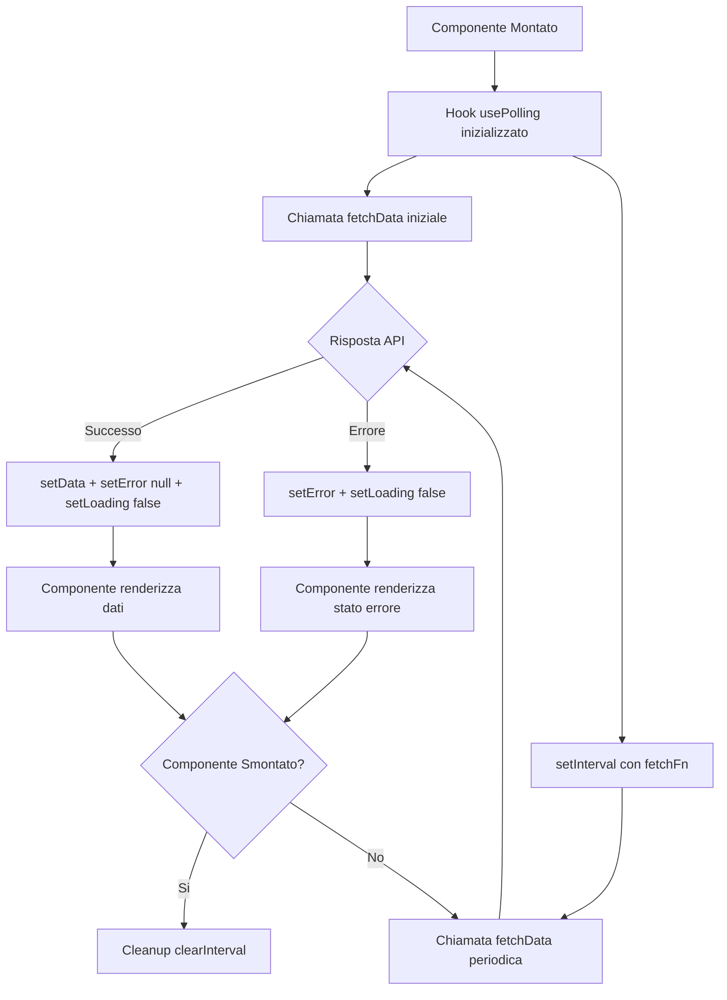
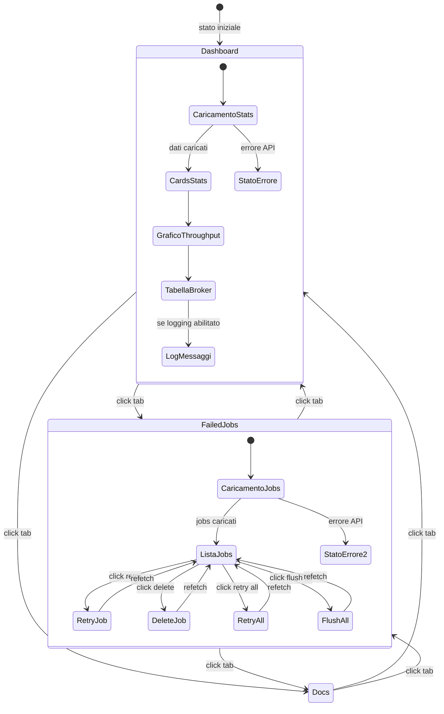
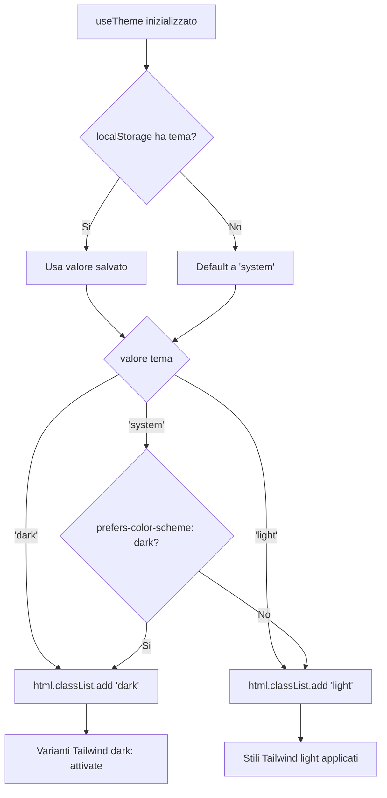

# Frontend Dashboard (React SPA)

## Panoramica

La Dashboard MQTT Broadcast e una Single Page Application React 19 che fornisce monitoraggio in tempo reale delle connessioni ai broker MQTT, throughput dei messaggi e job falliti. Viene servita tramite un template Blade (`resources/views/dashboard.blade.php`), compilata con Vite e `laravel-vite-plugin`, e stilizzata con Tailwind CSS. Il frontend comunica esclusivamente con l'API REST documentata in [dashboard-monitoring.md](dashboard-monitoring.md).

La SPA utilizza un'architettura basata su polling (senza WebSocket) per aggiornare i dati a un intervallo configurabile, mantenendo l'implementazione semplice e compatibile con qualsiasi ambiente di hosting.

## Architettura

### Stack Tecnologico

| Tecnologia | Versione | Scopo |
|---|---|---|
| React | 19.x | Framework UI |
| TypeScript | 5.x | Type safety |
| Vite | 8.x | Build tooling |
| laravel-vite-plugin | 3.x | Integrazione Laravel/Vite |
| Tailwind CSS | 3.x | Styling utility-first |
| Recharts | 2.x | Visualizzazione grafico throughput |
| Axios | 1.x | Client HTTP per chiamate API |
| date-fns | 4.x | Formattazione date |
| Lucide React | 0.468+ | Libreria icone |
| class-variance-authority | 0.7+ | Styling varianti componenti (CVA) |

### Decisioni di Design

- **Polling invece di WebSocket**: deployment piu semplice, nessuna connessione persistente richiesta, intervallo guidato da `window.mqttBroadcast.refreshInterval` (default 5000ms).
- **Nessun router client-side**: navigazione a tab gestita tramite `useState<TabType>` nel componente `Dashboard`. Tre tab: `dashboard`, `failed-jobs`, `docs`.
- **Pattern shadcn/ui**: primitive UI (`Card`, `Badge`, `Button`) seguono l'approccio shadcn/ui usando `class-variance-authority` + `tailwind-merge` per styling basato su varianti, senza importare la libreria shadcn completa.
- **Tema dark/light**: basato su classi CSS (`html.dark` / `html.light`) con persistenza `localStorage` sotto la chiave `mqtt-dashboard-theme`. Rilevamento preferenza di sistema tramite media query `prefers-color-scheme`.

## Come Funziona

### 1. Bootstrap

Il template Blade `resources/views/dashboard.blade.php` inietta la configurazione runtime in `window.mqttBroadcast`:

```javascript
window.mqttBroadcast = {
    basePath: '{{ config("mqtt-broadcast.path", "mqtt-broadcast") }}',
    apiUrl: '/{{ config("mqtt-broadcast.path", "mqtt-broadcast") }}/api',
    loggingEnabled: {{ config("mqtt-broadcast.logs.enable", false) ? "true" : "false" }},
    refreshInterval: 5000,
};
```

L'app React viene montata in `<div id="mqtt-dashboard-root">` tramite `ReactDOM.createRoot` in `main.tsx`, avvolta in `React.StrictMode`.

### 2. Data Fetching (Layer di Polling)

Tutto il data fetching segue lo stesso pattern: l'hook `usePolling<T>` avvolge qualsiasi funzione fetch asincrona con polling basato su `setInterval`.

```
usePolling(fetchFn, interval, enabled)
    |-- fetch iniziale al mount
    |-- setInterval(fetchFn, interval)
    |-- ritorna { data, error, loading, refetch }
    |-- cleanup: clearInterval all'unmount
```

Gli hook specifici del dominio in `useDashboard.ts` wrappano i metodi di `dashboardApi`:

| Hook | Chiamata API | Note |
|---|---|---|
| `useStats()` | `GET /stats` | Sempre attivo |
| `useBrokers()` | `GET /brokers` | Sempre attivo |
| `useMessages(params?)` | `GET /messages` | Disattivato quando `loggingEnabled = false` |
| `useThroughput(period)` | `GET /metrics/throughput` | Periodo: `hour`, `day`, `week` |
| `useFailedJobs(params?)` | `GET /failed-jobs` | Sempre attivo |

### 3. Client API

`dashboardApi` in `lib/api.ts` crea un'istanza Axios con `baseURL` da `window.mqttBroadcast.apiUrl`. Tutte le risposte seguono il pattern envelope Laravel `{ data: T }`. Metodi:

| Metodo | HTTP | Endpoint | Tipo Ritorno |
|---|---|---|---|
| `getStats()` | GET | `/stats` | `DashboardStats` |
| `getBrokers()` | GET | `/brokers` | `Broker[]` |
| `getBroker(id)` | GET | `/brokers/{id}` | `Broker` |
| `getMessages(params?)` | GET | `/messages` | `MessageLog[]` |
| `getMessage(id)` | GET | `/messages/{id}` | `MessageLog` |
| `getTopics()` | GET | `/topics` | `Topic[]` |
| `getThroughput(period)` | GET | `/metrics/throughput` | `ThroughputData[]` |
| `getMetricsSummary()` | GET | `/metrics/summary` | `MetricsSummary \| null` |
| `getFailedJobs(params?)` | GET | `/failed-jobs` | `FailedJob[]` |
| `retryFailedJob(id)` | POST | `/failed-jobs/{id}/retry` | `FailedJob` |
| `retryAllFailedJobs()` | POST | `/failed-jobs/retry-all` | `{ retried: number }` |
| `deleteFailedJob(id)` | DELETE | `/failed-jobs/{id}` | `void` |
| `flushFailedJobs()` | DELETE | `/failed-jobs` | `{ flushed: number }` |

### 4. Albero dei Componenti e Rendering

```
Dashboard (root)
 +-- header: Badge di stato (running/stopped), ThemeToggle
 +-- Navigation (barra tab: Dashboard | Failed Jobs | Docs)
 +-- contenuto principale (condizionale su activeTab):
      |-- "dashboard":
      |    +-- StatsCard x5 (msg/min, broker, memoria, coda, falliti)
      |    +-- ThroughputChart (LineChart Recharts)
      |    +-- BrokerTable (tabella broker)
      |    +-- MessageLog (se logging abilitato)
      |-- "failed-jobs":
      |    +-- FailedJobs (lista con retry/delete per-job, bulk retry/flush)
      |-- "docs":
           +-- DocsPage (riferimento comandi, troubleshooting, checklist, risorse)
 +-- footer: visualizzazione intervallo auto-refresh
```

## Componenti Chiave

| File | Componente | Responsabilita |
|---|---|---|
| `main.tsx` | Entry point | ReactDOM.createRoot, wrapper StrictMode |
| `components/Dashboard.tsx` | `Dashboard` | Componente root, stato tab, caricamento stats, orchestrazione layout |
| `components/Navigation.tsx` | `Navigation`, `TabButton` | Barra tab con badge conteggio per job falliti |
| `components/StatsCard.tsx` | `StatsCard` | Card metrica riutilizzabile con icona, valore, descrizione, colorazione variante, trend opzionale |
| `components/ThroughputChart.tsx` | `ThroughputChart` | `LineChart` Recharts con `ResponsiveContainer`, colori assi/tooltip adattati al tema |
| `components/BrokerTable.tsx` | `BrokerTable` | Tabella broker attivi con `Badge` stato connessione, uptime, conteggio messaggi 24h |
| `components/MessageLog.tsx` | `MessageLog` | Lista scrollabile messaggi recenti, tag broker/topic, timestamp relativi via `date-fns` |
| `components/FailedJobs.tsx` | `FailedJobs` | Lista job falliti con retry/delete per-job, bulk retry-all/flush-all, stati di caricamento per azione |
| `components/DocsPage.tsx` | `DocsPage` | Riferimento in-app: blocchi comando, item troubleshooting, checklist configurazione, link risorse esterne |
| `components/ThemeToggle.tsx` | `ThemeToggle` | Toggle icona Sole/Luna, delega all'hook `useTheme` |
| `components/ui/card.tsx` | `Card`, `CardHeader`, `CardTitle`, `CardContent`, `CardFooter`, `CardDescription` | Primitive card stile shadcn/ui con `React.forwardRef` |
| `components/ui/badge.tsx` | `Badge` | Badge basato su CVA con varianti: default, secondary, destructive, outline, success, warning |
| `components/ui/button.tsx` | `Button` | Bottone basato su CVA con varianti (default, destructive, outline, secondary, ghost, link) e dimensioni (default, sm, lg, icon) |
| `hooks/usePolling.ts` | `usePolling<T>` | Hook polling generico: `setInterval` + gestione stato + cleanup |
| `hooks/useDashboard.ts` | `useStats`, `useBrokers`, `useMessages`, `useThroughput`, `useFailedJobs` | Hook dominio che wrappano `dashboardApi` con polling |
| `hooks/useTheme.ts` | `useTheme` | Stato tema (dark/light/system), persistenza `localStorage`, toggle classi `<html>`, rilevamento preferenza sistema |
| `lib/api.ts` | `dashboardApi` | Client API basato su Axios, config `window.mqttBroadcast`, unwrapping risposte tipizzate |
| `lib/utils.ts` | `cn()` | Utilita `clsx` + `tailwind-merge` per merge condizionale classi |
| `types/index.ts` | Definizioni di tipo | `DashboardStats`, `Broker`, `MessageLog`, `Topic`, `ThroughputData`, `FailedJob`, `MetricsSummary` |

## Sistema dei Tipi

Tutti i tipi di risposta API sono definiti in `types/index.ts`:

- **`DashboardStats`** — stato aggregato del sistema: `status` (running/stopped), conteggi broker (total/active/stale), throughput messaggi (per_minute/last_hour/last_24h), info coda, uso memoria (current_mb/threshold_mb/usage_percent), conteggio job falliti
- **`Broker`** — broker individuale: macchina a stati `connection_status` (connected/idle/reconnecting/disconnected), uptime, conteggio messaggi
- **`MessageLog`** — messaggio loggato con broker, topic, anteprima messaggio, timestamp leggibile
- **`Topic`** — nome topic + conteggio messaggi per analytics
- **`ThroughputData`** — punto dati time-series: etichetta tempo, timestamp ISO, conteggio
- **`FailedJob`** — entry DLQ: broker, topic, anteprima eccezione, QoS, flag retain, conteggio retry, timestamp
- **`MetricsSummary`** — metriche aggregate: totali ultima ora/24h/7 giorni con medie, rilevamento picco al minuto

## Configurazione

Il frontend legge tutta la configurazione da `window.mqttBroadcast`, iniettata dal template Blade al momento del rendering:

| Proprieta | Sorgente | Default | Scopo |
|---|---|---|---|
| `basePath` | `config('mqtt-broadcast.path')` | `mqtt-broadcast` | Prefisso percorso URL |
| `apiUrl` | Derivato da `basePath` | `/{basePath}/api` | URL base API per Axios |
| `loggingEnabled` | `config('mqtt-broadcast.logs.enable')` | `false` | Controlla se il componente `MessageLog` e l'hook `useMessages` sono attivi |
| `refreshInterval` | Hardcoded | `5000` | Intervallo polling in millisecondi |

La preferenza tema viene salvata in `localStorage` sotto la chiave `mqtt-dashboard-theme` con valori: `dark`, `light` o `system`.

## Gestione Errori

| Scenario | Comportamento |
|---|---|
| API irraggiungibile | `usePolling` imposta stato `error`, il componente mostra messaggio "Failed to load" con icona `AlertCircle` |
| Caricamento iniziale | `loading = true` renderizza spinner `Loader2` in ogni componente indipendentemente |
| Fallimento polling | I `data` precedenti vengono preservati (non cancellati in caso di errore), lo stato errore viene impostato |
| Logging disabilitato | `MessageLog` renderizza stato disabilitato con suggerimento config; l'hook `useMessages` salta il fetching (`enabled = false`) |
| Errore retry job fallito | Stato di caricamento per-job tramite Set `retrying`, nessun toast di errore (fallimento silenzioso, refetch al prossimo poll) |
| Conferma flush | Dialog `confirm()` del browser prima della chiamata distruttiva `flushFailedJobs()` |

## Diagrammi Mermaid

### Flusso Dati: Ciclo di Vita del Polling



### Flusso Navigazione Componenti



### Risoluzione Tema



## Build e Sviluppo

### Sviluppo

```bash
npm run dev    # Server dev Vite con HMR
```

Vite serve gli asset tramite `laravel-vite-plugin` che crea un file `public/hot` per segnalare l'URL del dev server alla direttiva Blade `@vite`.

### Build di Produzione

```bash
npm run build  # Output in public/vendor/mqtt-broadcast/
```

Il build produce un `manifest.json` in `public/vendor/mqtt-broadcast/` che mappa gli entry point ai nomi file con hash. La direttiva Blade `@vite` legge questo manifest per iniettare i tag `<script>` e `<link>`.

### Layout Sorgenti

```
resources/js/mqtt-dashboard/src/
  main.tsx                     Entry point
  components/
    Dashboard.tsx              Componente root
    Navigation.tsx             Navigazione tab
    StatsCard.tsx              Card metrica
    ThroughputChart.tsx        Grafico a linee Recharts
    BrokerTable.tsx            Tabella connessioni broker
    MessageLog.tsx             Feed messaggi recenti
    FailedJobs.tsx             Gestione job falliti
    DocsPage.tsx               Documentazione in-app
    ThemeToggle.tsx            Toggle dark/light
    ui/
      card.tsx                 Primitive Card
      badge.tsx                Varianti Badge
      button.tsx               Varianti Button
  hooks/
    usePolling.ts              Astrazione polling generica
    useDashboard.ts            Hook dati dominio-specifici
    useTheme.ts                Gestione tema
  lib/
    api.ts                     Client API Axios
    utils.ts                   Utilita cn() merge classi
  types/
    index.ts                   Interfacce TypeScript
```
