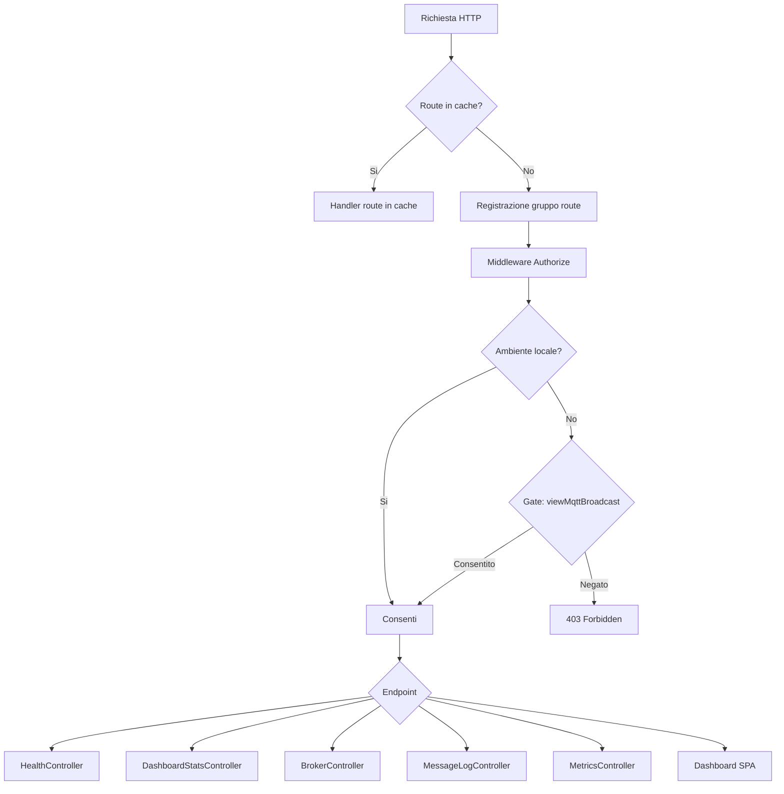
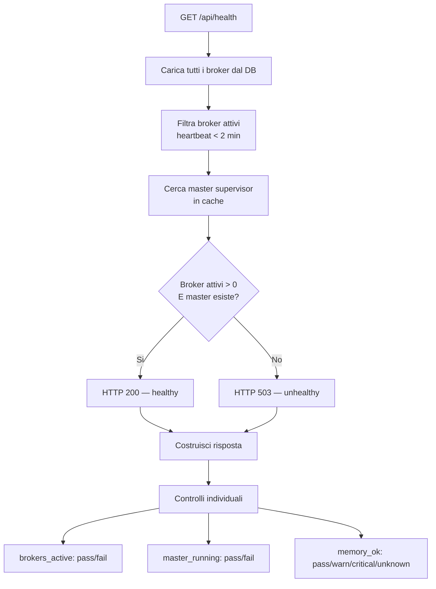
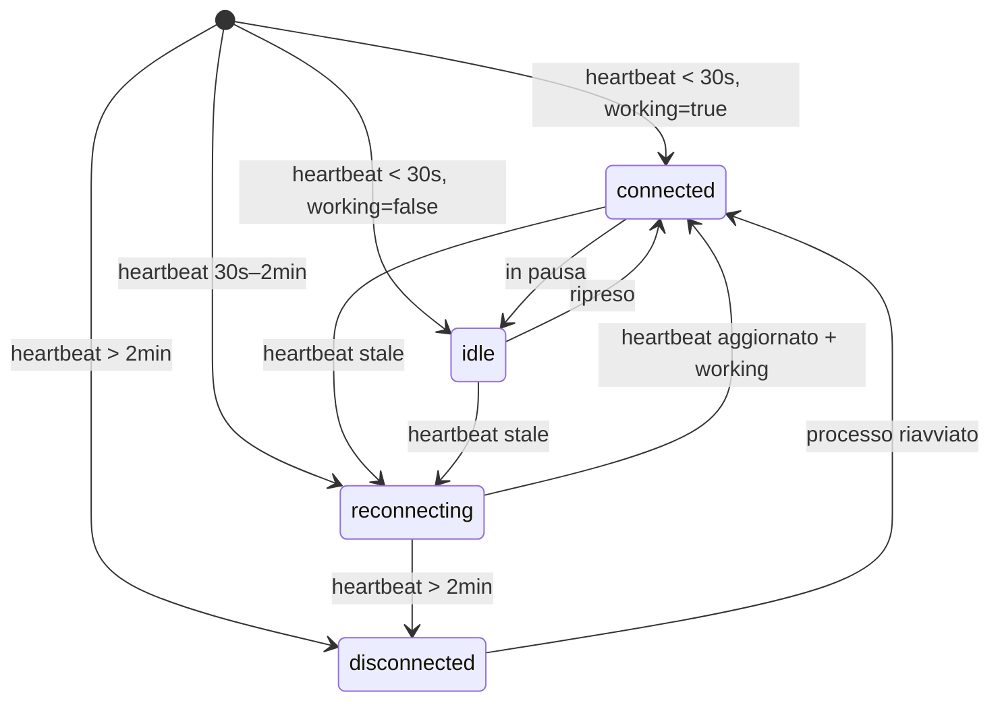
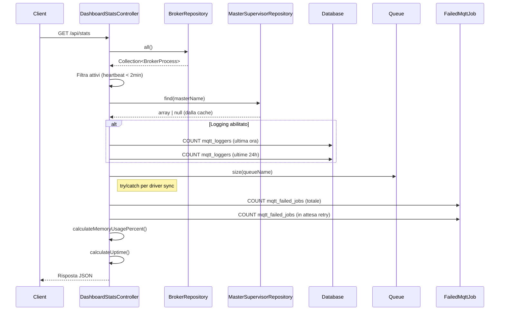

# Dashboard e API di Monitoraggio

## Panoramica

L'API di dashboard e monitoraggio fornisce un livello REST completo per osservare e gestire il sistema MQTT Broadcast a runtime. Espone health check, stato dei broker, log dei messaggi e metriche di throughput — il tutto protetto da un middleware di autorizzazione ispirato a Laravel Horizon.

Questa funzionalita risolve il problema della visibilita operativa: senza di essa, gli operatori dovrebbero interrogare direttamente il database e la cache per comprendere lo stato del sistema. L'API e progettata sia per la dashboard React SPA integrata sia per strumenti di monitoraggio esterni (probe Kubernetes, Grafana, Datadog).

## Architettura

L'API segue un'architettura standard a controller Laravel con alcune scelte progettuali rilevanti:

- **Raggruppamento route con prefisso configurabile** — tutte le route sono montate sotto un percorso configurabile (default: `/mqtt-broadcast`) con supporto per dominio e middleware, seguendo il pattern di Horizon.
- **Middleware Authorize** — controlla l'accesso in ambienti non locali tramite un Gate `viewMqttBroadcast`, personalizzabile attraverso lo stub del service provider pubblicato.
- **Pattern Repository** — i controller leggono lo stato dei broker e del supervisor attraverso `BrokerRepository` (database) e `MasterSupervisorRepository` (cache), disaccoppiando l'API dai dettagli di storage.
- **Logging condizionale** — gli endpoint di log messaggi e metriche restituiscono risultati vuoti in modo graceful quando il logging e disabilitato (`mqtt-broadcast.logs.enable = false`), invece di generare errori.
- **Riempimento gap nelle serie temporali** — `MetricsController` riempie i bucket temporali mancanti con entry a conteggio zero per rendere i grafici senza interruzioni.

## Come Funziona

### Registrazione delle Route

`MqttBroadcastServiceProvider::registerRoutes()` avvolge tutte le route in un gruppo con:

| Impostazione | Chiave Config | Default |
|-------------|--------------|---------|
| Prefisso percorso | `mqtt-broadcast.path` | `mqtt-broadcast` |
| Dominio | `mqtt-broadcast.domain` | `null` |
| Middleware | `mqtt-broadcast.middleware` | `['web', Authorize::class]` |

Le route vengono caricate da `routes/web.php`. Se le route dell'applicazione sono in cache, la registrazione viene saltata.

### Flusso di Autorizzazione

1. La richiesta entra nel middleware `Authorize`.
2. Se `app()->environment('local')` → passa direttamente.
3. Altrimenti, controlla `Gate::allows('viewMqttBroadcast', [$request->user()])`.
4. Se il gate nega → restituisce `403 Forbidden`.
5. Gli utenti personalizzano l'accesso definendo il gate nel proprio `MqttBroadcastServiceProvider` pubblicato:

```php
Gate::define('viewMqttBroadcast', function ($user) {
    return in_array($user->email, ['admin@example.com']);
});
```

### Endpoint API

Tutti gli endpoint sono prefissati con `{path}/api/`.

#### Health Check — `GET /api/health`

Restituisce lo stato di salute del sistema per strumenti di monitoraggio e load balancer.

- HTTP 200 se il sistema e sano (almeno un broker attivo + master supervisor in esecuzione).
- HTTP 503 se non sano.

La risposta include:
- Conteggi broker (totali, attivi, stale)
- Info master supervisor (pid, uptime, memoria, conteggio supervisori)
- Job in coda pendenti
- Controlli individuali: `brokers_active`, `master_running`, `memory_ok`

Soglie del controllo memoria:
- `pass`: utilizzo < 80% della soglia configurata
- `warn`: utilizzo 80–99%
- `critical`: utilizzo >= 100%

#### Statistiche Dashboard — `GET /api/stats`

Panoramica aggregata per l'interfaccia dashboard:
- Stato generale (`running` / `stopped`)
- Conteggi broker (totali, attivi, stale)
- Throughput messaggi (per minuto, ultima ora, ultime 24h) — solo se il logging e abilitato
- Job in coda pendenti e nome della coda
- Memoria (MB attuali, soglia MB, percentuale utilizzo)
- Uptime in secondi

#### Broker — `GET /api/brokers` e `GET /api/brokers/{id}`

**Index** restituisce tutti i broker con:
- Identita: id, name, connection, pid
- Stato: `active` / `stale` (basato su finestra heartbeat di 2 minuti)
- Stato connessione: `connected`, `idle`, `reconnecting`, `disconnected`
- Uptime (secondi + stringa leggibile)
- Conteggio messaggi nelle ultime 24h e timestamp ultimo messaggio (se logging abilitato)

**Show** restituisce un singolo broker con i 10 messaggi piu recenti (topic, messaggio troncato, timestamp).

Logica dello stato di connessione:

| Eta Heartbeat | Working | Stato |
|---------------|---------|-------|
| < 30s | true | `connected` |
| < 30s | false | `idle` |
| 30s – 2min | qualsiasi | `reconnecting` |
| > 2min | qualsiasi | `disconnected` |

#### Log Messaggi — `GET /api/messages`, `GET /api/messages/{id}`, `GET /api/topics`

**Index** — lista messaggi paginata con filtri:
- `broker` — corrispondenza esatta sul nome connessione
- `topic` — corrispondenza parziale (SQL `LIKE`)
- `limit` — default 30, massimo 100

Restituisce anteprima messaggio (primi 100 caratteri), messaggio formattato (JSON pretty-printed se valido), timestamp leggibili.

**Show** — dettaglio messaggio completo con flag `is_json` e `message_parsed` (oggetto JSON decodificato o stringa raw).

**Topics** — top 20 topic unici nelle ultime 24 ore con conteggi messaggi, ordinati per conteggio decrescente.

Tutti e tre gli endpoint restituiscono dati vuoti con metadato `logging_enabled: false` quando il logging e disabilitato.

#### Metriche — `GET /api/metrics/throughput` e `GET /api/metrics/summary`

**Throughput** — dati serie temporale per grafici, controllati dal parametro query `period`:

| Periodo | Raggruppamento | Data Point | Intervallo |
|---------|---------------|------------|------------|
| `hour` (default) | per minuto | ~60 | ultima ora |
| `day` | per ora | ~24 | ultime 24h |
| `week` | per giorno | ~7 | ultimi 7 giorni |

Il riempimento gap assicura che ogni bucket temporale abbia un'entry (count = 0 se nessun messaggio).

**Avviso compatibilita database**: `MetricsController` utilizza `DATE_FORMAT()` specifico di MySQL per il bucketing temporale in `getThroughputByMinute()` e `getThroughputByHour()`, e `DATE()` in `getThroughputByDay()`. Queste funzioni non esistono in SQLite o PostgreSQL:

| Metodo | Espressione MySQL | Equivalente SQLite | Equivalente PostgreSQL |
|--------|------------------|-------------------|----------------------|
| `getThroughputByMinute()` | `DATE_FORMAT(created_at, "%Y-%m-%d %H:%i:00")` | `strftime('%Y-%m-%d %H:%M:00', created_at)` | `to_char(created_at, 'YYYY-MM-DD HH24:MI:00')` |
| `getThroughputByHour()` | `DATE_FORMAT(created_at, "%Y-%m-%d %H:00:00")` | `strftime('%Y-%m-%d %H:00:00', created_at)` | `to_char(created_at, 'YYYY-MM-DD HH24:00:00')` |
| `getThroughputByDay()` | `DATE(created_at)` | `date(created_at)` | `created_at::date` |

Anche il metodo `summary()` usa `DATE_FORMAT()` per la query del minuto di picco. Questo significa che **gli endpoint metriche funzionano solo su MySQL/MariaDB**. Il gap non influisce sugli unit test (che non testano MetricsController direttamente contro un database) ma causerebbe errori SQL se il pacchetto viene usato con SQLite o PostgreSQL in produzione.

Nota: `MessageLogController::topics()` usa `selectRaw('topic, COUNT(*) as count')` che e compatibile cross-database — solo `MetricsController` ha questa limitazione.

**Summary** — metriche di performance aggregate:
- Ultima ora: totale + media per minuto
- Ultime 24h: totale + media per ora
- Ultimi 7 giorni: totale + media per giorno
- Minuto di picco nell'ultima ora (orario + conteggio)

### Dashboard SPA

La route catch-all `GET /` renderizza `mqtt-broadcast::dashboard` — una vista Blade che avvia l'applicazione React single-page. L'app React consuma tutti gli endpoint API sopra descritti.

### Internals di DashboardStatsController

`DashboardStatsController::index()` aggrega dati da fonti multiple in una singola richiesta:

1. **Conteggi broker** — carica tutti i broker da `BrokerRepository::all()`, filtra quelli attivi per finestra heartbeat di 2 minuti.
2. **Master supervisor** — cerca l'entry in cache tramite `MasterSupervisorRepository::find()` usando il nome configurato.
3. **Statistiche messaggi** — tre query COUNT su `mqtt_loggers` (condizionali su `logs.enable`).
4. **Dimensione coda** — `Queue::size()` racchiuso in try/catch perche alcuni driver di coda (es. `sync`) non supportano `size()` e lanciano eccezione.
5. **Job falliti** — due query COUNT su `mqtt_failed_jobs` (totale + in attesa di retry).
6. **Memoria/uptime** — derivati dai dati cache del master supervisor tramite metodi helper.

**`calculateMemoryUsagePercent()`** — calcola `(memory_bytes / (threshold_mb * 1024 * 1024)) * 100`, arrotondato a 1 decimale. Restituisce 0 se la soglia e zero o negativa (protezione divisione per zero).

**`calculateUptime()`** — effettua il parse di `started_at` dalla cache via `Carbon::parse()`, calcola `now()->diffInSeconds()` con flag `false` per valore assoluto. Restituisce 0 se `started_at` e null.

**Inconsistenza Queue::size()**: `DashboardStatsController` racchiude `Queue::size()` in un blocco try/catch, con fallback a 0. `HealthController::check()` chiama `Queue::size()` direttamente senza gestione errori — questo significa che l'endpoint di salute potrebbe lanciare un'eccezione non gestita quando si usa il driver di coda `sync`.

### Pattern Query N+1

**BrokerController::index()** — per ogni broker, esegue 2 query aggiuntive quando il logging e abilitato:
- `MqttLogger::where('broker', $broker->connection)->where('created_at', '>', now()->subDay())->count()` — conteggio messaggi 24h
- `MqttLogger::where('broker', $broker->connection)->orderBy('created_at', 'desc')->first()` — timestamp ultimo messaggio

Con N broker e logging abilitato, produce 2N+1 query totali. Accettabile per conteggi broker bassi (tipicamente 1–5) ma scala linearmente.

**BrokerController::show()** — carica tutti i broker via `$brokerRepository->all()` poi filtra con `->firstWhere('id', $id)`. Questo e un filtro in memoria, non una clausola WHERE — tutte le righe broker vengono caricate dal database anche se ne serve solo una.

### Metodi Helper di HealthController

**`getMasterSupervisorData()`** — gestisce sia il formato array che oggetto dal livello cache (`MasterSupervisorRepository` puo restituire entrambi a seconda della serializzazione del driver cache). Normalizza ad array tramite cast `(array)`. Estrae `pid`, `started_at`, `memory`, `supervisors_count` con default null-safe.

**`checkMemoryStatus()`** — determinazione stato a tre livelli usando lo stesso calcolo bytes-to-threshold di `DashboardStatsController`. Lo stato `unknown` e unico di questo metodo — appare solo quando il master supervisor non e in cache.

## Componenti Chiave

| File | Classe/Metodo | Responsabilita |
|------|--------------|----------------|
| `src/Http/Controllers/HealthController.php` | `HealthController::check()` | Health check di sistema (200/503) con risultati controlli individuali |
| `src/Http/Controllers/HealthController.php` | `HealthController::getMasterSupervisorData()` | Normalizza dati cache array/oggetto in formato risposta |
| `src/Http/Controllers/HealthController.php` | `HealthController::checkMemoryStatus()` | Stato memoria a tre livelli (pass/warn/critical/unknown) |
| `src/Http/Controllers/DashboardStatsController.php` | `DashboardStatsController::index()` | Statistiche panoramica dashboard aggregate |
| `src/Http/Controllers/DashboardStatsController.php` | `DashboardStatsController::calculateMemoryUsagePercent()` | Byte memoria → percentuale soglia |
| `src/Http/Controllers/DashboardStatsController.php` | `DashboardStatsController::calculateUptime()` | started_at dalla cache → secondi trascorsi |
| `src/Http/Controllers/BrokerController.php` | `BrokerController::index()` | Lista tutti i broker con stato e metriche |
| `src/Http/Controllers/BrokerController.php` | `BrokerController::show()` | Dettaglio singolo broker con messaggi recenti |
| `src/Http/Controllers/BrokerController.php` | `BrokerController::determineConnectionStatus()` | Stato connessione a 4 livelli da eta heartbeat + flag working |
| `src/Http/Controllers/MessageLogController.php` | `MessageLogController::index()` | Lista log messaggi filtrata e paginata |
| `src/Http/Controllers/MessageLogController.php` | `MessageLogController::show()` | Dettaglio messaggio completo con parsing JSON |
| `src/Http/Controllers/MessageLogController.php` | `MessageLogController::topics()` | Top 20 topic per conteggio messaggi (ultime 24h) |
| `src/Http/Controllers/MetricsController.php` | `MetricsController::throughput()` | Dati throughput serie temporale con riempimento gap |
| `src/Http/Controllers/MetricsController.php` | `MetricsController::summary()` | Sommario performance aggregato + rilevamento picchi |
| `src/Http/Middleware/Authorize.php` | `Authorize::handle()` | Autorizzazione basata su Gate (bypass locale) |
| `src/Repositories/BrokerRepository.php` | `BrokerRepository` | CRUD database per tabella `mqtt_brokers` |
| `src/Repositories/MasterSupervisorRepository.php` | `MasterSupervisorRepository` | Stato basato su cache per master supervisor |
| `routes/web.php` | — | Definizioni route per tutti gli endpoint API + dashboard SPA |

## Schema Database

### Tabella `mqtt_brokers`

| Colonna | Tipo | Descrizione |
|---------|------|-------------|
| `id` | bigint (PK) | Auto-increment |
| `name` | string | Identificativo unico del broker (hostname-slug + token casuale) |
| `connection` | string | Nome connessione MQTT dalla configurazione |
| `pid` | integer | ID processo del sistema operativo |
| `started_at` | datetime | Quando il processo broker e stato avviato |
| `last_heartbeat_at` | datetime | Ultimo timestamp heartbeat (rilevamento stale) |
| `working` | boolean | Se il broker sta processando attivamente |
| `created_at` | datetime | Timestamp Eloquent |
| `updated_at` | datetime | Timestamp Eloquent |

### Tabella `mqtt_loggers`

| Colonna | Tipo | Descrizione |
|---------|------|-------------|
| `id` | bigint (PK) | Auto-increment |
| `broker` | string | Nome connessione che ha ricevuto il messaggio |
| `topic` | string | Topic MQTT |
| `message` | json | Payload del messaggio (cast a JSON) |
| `created_at` | datetime | Quando il messaggio e stato ricevuto |
| `updated_at` | datetime | Timestamp Eloquent |

Il modello `MqttLogger` supporta una connessione database personalizzata tramite `mqtt-broadcast.logs.connection` e un nome tabella personalizzato tramite `mqtt-broadcast.logs.table`.

### Stato master supervisor (cache)

Memorizzato in cache sotto la chiave `mqtt-broadcast:master:{name}` con TTL configurabile (`mqtt-broadcast.master_supervisor.cache_ttl`, default 3600s). Supporta driver Redis, file, memcached e array.

Campi dell'entry in cache: `pid`, `memory`, `started_at`, `supervisors_count`, `updated_at`.

## Configurazione

| Chiave Config | Variabile Env | Default | Descrizione |
|--------------|--------------|---------|-------------|
| `mqtt-broadcast.path` | `MQTT_BROADCAST_PATH` | `mqtt-broadcast` | Prefisso URL per tutte le route |
| `mqtt-broadcast.domain` | `MQTT_BROADCAST_DOMAIN` | `null` | Restrizione dominio opzionale |
| `mqtt-broadcast.middleware` | — | `['web', Authorize::class]` | Stack middleware per route API |
| `mqtt-broadcast.logs.enable` | — | `false` | Abilita/disabilita logging messaggi (impatta endpoint messaggi e metriche) |
| `mqtt-broadcast.logs.connection` | — | `null` | Connessione database per tabella `mqtt_loggers` |
| `mqtt-broadcast.logs.table` | — | `mqtt_loggers` | Nome tabella per log messaggi |
| `mqtt-broadcast.queue.name` | — | `default` | Nome coda (riportato nelle statistiche) |
| `mqtt-broadcast.memory.threshold_mb` | — | `128` | Soglia memoria per avvisi health check |
| `mqtt-broadcast.master_supervisor.name` | — | `master` | Nome chiave cache master supervisor |
| `mqtt-broadcast.master_supervisor.cache_ttl` | — | `3600` | TTL cache in secondi per stato supervisor |

## Gestione Errori

- **Broker non trovato** (`BrokerController::show`) — restituisce `404` con messaggio errore JSON.
- **Messaggio non trovato** (`MessageLogController::show`) — restituisce `404`.
- **Logging disabilitato** — endpoint messaggi e metriche restituiscono array vuoti con metadato `logging_enabled: false`; non generano mai eccezioni.
- **Master supervisor non in cache** — health check restituisce `unhealthy` (503); le statistiche mostrano memoria/uptime a zero; il controllo memoria restituisce stato `unknown`.
- **Heartbeat stale** — i broker con `last_heartbeat_at` piu vecchio di 2 minuti sono classificati come `stale` / `disconnected` ma vengono comunque restituiti nelle liste.
- **Fallimento parsing JSON** — `MessageLogController` effettua fallback alla stringa raw quando `json_decode` fallisce (verificato tramite `json_last_error()`).
- **Driver coda sync** — `HealthController::check()` potrebbe lanciare eccezione quando `Queue::size()` viene chiamato sul driver `sync` (nessun try/catch). `DashboardStatsController` gestisce questo caso in modo graceful.
- **Metriche solo MySQL** — `MetricsController` usa `DATE_FORMAT()` / `DATE()` che sono specifici di MySQL. Chiamare gli endpoint throughput o summary su SQLite o PostgreSQL produrra un errore SQL.

## Diagrammi Mermaid

### Flusso Richiesta API



### Logica Health Check



### Macchina a Stati dello Stato Connessione Broker



### Flusso Aggregazione DashboardStatsController



### Flusso Dati Throughput Metriche

```mermaid
flowchart TD
    A[GET /api/metrics/throughput<br/>?period=hour|day|week] --> B{Logging abilitato?}
    B -->|No| C[Restituisci vuoto + meta]
    B -->|Si| D{Periodo?}
    D -->|hour| E[GROUP BY minuto<br/>ultimi 60 min]
    D -->|day| F[GROUP BY ora<br/>ultime 24h]
    D -->|week| G[GROUP BY giorno<br/>ultimi 7 giorni]
    E --> H[Riempi gap temporali<br/>con count=0]
    F --> H
    G --> H
    H --> I[Restituisci data point<br/>serie temporale]
```
