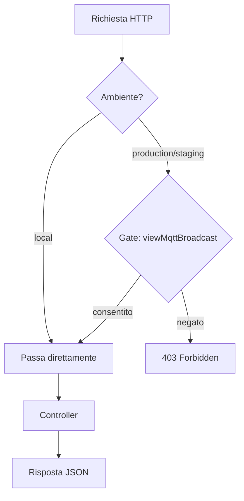
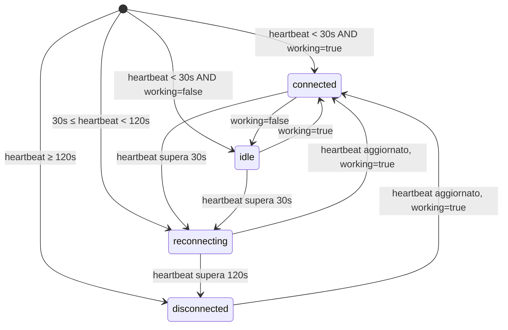
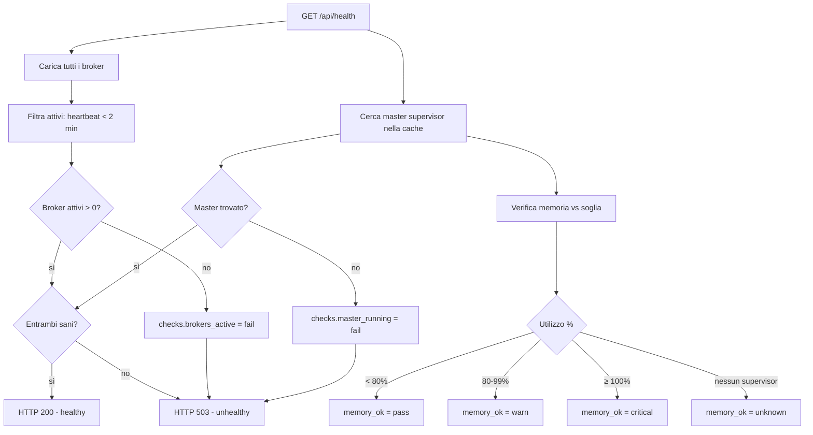
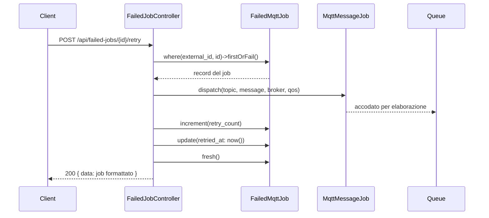

# Riferimento API HTTP

## Panoramica

La dashboard MQTT Broadcast espone 15 endpoint API JSON sotto un prefisso configurabile (default `/mqtt-broadcast/api/`). Questi endpoint alimentano la SPA React della dashboard e possono essere consumati da strumenti di monitoraggio esterni, script o health check dei load balancer.

Tutte le route vengono registrate da `MqttBroadcastServiceProvider::registerRoutes()` e protette dal middleware `Authorize`, che segue il pattern di autorizzazione di Laravel Horizon: accesso libero in ambiente `local`, verifica del Gate `viewMqttBroadcast` in tutti gli altri ambienti.

## Architettura

Il livello API segue un pattern thin-controller — ogni controller legge direttamente da repository o modelli Eloquent senza classi Request/Resource dedicate. Le strutture delle risposte sono array costruiti manualmente, non API Resources.

**Decisioni progettuali chiave:**

- **Nessuna paginazione** — tutti gli endpoint lista usano `limit` (max 100) anziché paginazione cursor/offset, mantenendo l'API semplice per il polling della dashboard
- **Dipendenza dal logging** — gli endpoint messaggi, topic e metriche restituiscono risposte vuote/disabilitate quando `mqtt-broadcast.logs.enable` è `false`, senza generare errori
- **Connection status calcolato** — `BrokerController::determineConnectionStatus()` deriva lo stato dall'età dell'heartbeat, non da un campo memorizzato
- **Failed jobs usano `external_id`** — identificazione basata su UUID tramite il trait `HasExternalId`, non l'`id` auto-increment

## Come Funziona

Tutte le richieste API seguono questo ciclo di vita:

1. La richiesta raggiunge il prefisso route configurabile (es. `GET /mqtt-broadcast/api/health`)
2. Il middleware stack `web` viene eseguito (sessione, CSRF per non-GET, ecc.)
3. Il middleware `Authorize` verifica l'accesso:
   - Ambiente `local` → passa direttamente
   - Altri ambienti → `Gate::allows('viewMqttBroadcast', [$request->user()])` → 403 se negato
4. Il metodo del controller viene eseguito, interrogando repository/modelli
5. La risposta JSON viene restituita con il codice HTTP appropriato

## Componenti Principali

| File | Classe / Metodo | Responsabilità |
|------|----------------|----------------|
| `routes/web.php` | Definizioni route | Registra tutte le 15 route API + catch-all SPA sotto il prefisso `api/` |
| `src/Http/Middleware/Authorize.php` | `Authorize::handle()` | Autorizzazione basata su Gate con bypass per ambiente locale |
| `src/Http/Controllers/HealthController.php` | `HealthController::check()` | Health check del sistema (200/503) |
| `src/Http/Controllers/DashboardStatsController.php` | `DashboardStatsController::index()` | Statistiche aggregate per la panoramica dashboard |
| `src/Http/Controllers/BrokerController.php` | `BrokerController::index()` / `show()` | Lista e dettaglio broker con stato connessione |
| `src/Http/Controllers/MessageLogController.php` | `MessageLogController::index()` / `show()` / `topics()` | Log messaggi con filtri, vista dettaglio, analisi topic |
| `src/Http/Controllers/MetricsController.php` | `MetricsController::throughput()` / `summary()` | Dati throughput time-series e riepilogo prestazioni |
| `src/Http/Controllers/FailedJobController.php` | `FailedJobController` (6 metodi) | CRUD DLQ: lista, dettaglio, retry, retry-all, elimina, flush |

## Autorizzazione

### Middleware `Authorize`

```
src/Http/Middleware/Authorize.php
```

| Ambiente | Comportamento |
|----------|--------------|
| `local` | Sempre consentito — nessuna autenticazione richiesta |
| Tutti gli altri | Verifica `Gate::allows('viewMqttBroadcast', [$request->user()])` — restituisce 403 plain text `Forbidden` se negato |

Definizione del Gate (nel proprio `AppServiceProvider` o nel `MqttBroadcastServiceProvider` pubblicato):

```php
Gate::define('viewMqttBroadcast', function ($user) {
    return in_array($user->email, ['admin@example.com']);
});
```

## Riferimento Endpoint

### Health Check

#### `GET /api/health`

**Nome route:** `mqtt-broadcast.health`
**Controller:** `HealthController::check()`

Restituisce lo stato di salute del sistema per strumenti di monitoraggio e load balancer. Restituisce HTTP 200 quando sano, 503 quando non sano.

**Criteri di salute:** almeno un broker attivo E master supervisor trovato nella cache.

**Risposta (200):**

```json
{
  "status": "healthy",
  "timestamp": "2026-03-27T10:00:00+00:00",
  "data": {
    "brokers": {
      "total": 3,
      "active": 2,
      "stale": 1
    },
    "master_supervisor": {
      "pid": 12345,
      "uptime_seconds": 3600,
      "memory_mb": 45.23,
      "supervisors_count": 2
    },
    "queues": {
      "pending": 5
    }
  },
  "checks": {
    "brokers_active": {
      "status": "pass",
      "message": "2 active broker(s)"
    },
    "master_running": {
      "status": "pass",
      "message": "Master supervisor running"
    },
    "memory_ok": {
      "status": "pass",
      "message": "Memory usage at 35.3% of threshold"
    }
  }
}
```

**Valori dello stato memoria:**

| Status | Condizione |
|--------|-----------|
| `pass` | Utilizzo < 80% di `memory.threshold_mb` |
| `warn` | Utilizzo >= 80% e < 100% |
| `critical` | Utilizzo >= 100% |
| `unknown` | Master supervisor non in esecuzione |

---

### Statistiche Dashboard

#### `GET /api/stats`

**Nome route:** `mqtt-broadcast.stats`
**Controller:** `DashboardStatsController::index()`

Restituisce statistiche aggregate per le card panoramiche della dashboard. I conteggi messaggi sono popolati solo quando `logs.enable` è `true`.

**Risposta (200):**

```json
{
  "data": {
    "status": "running",
    "brokers": {
      "total": 3,
      "active": 2,
      "stale": 1
    },
    "messages": {
      "per_minute": 12.5,
      "last_hour": 750,
      "last_24h": 18000,
      "logging_enabled": true
    },
    "queue": {
      "pending": 5,
      "name": "mqtt-broadcast"
    },
    "memory": {
      "current_mb": 45.23,
      "threshold_mb": 128,
      "usage_percent": 35.3
    },
    "failed_jobs": {
      "total": 12,
      "pending_retry": 8
    },
    "uptime_seconds": 3600
  }
}
```

**Note:**
- `status` è `"running"` se esiste almeno un broker attivo, `"stopped"` altrimenti
- `messages.*` sono tutti `0` quando `logs.enable` è `false`
- `per_minute` è calcolato come `last_hour / 60`
- `failed_jobs.pending_retry` conta i job dove `retried_at IS NULL`

---

### Broker

#### `GET /api/brokers`

**Nome route:** `mqtt-broadcast.brokers.index`
**Controller:** `BrokerController::index()`

Restituisce tutti i broker registrati con campi di stato calcolati.

**Risposta (200):**

```json
{
  "data": [
    {
      "id": 1,
      "name": "broker-hostname-abc123",
      "connection": "local",
      "pid": 12345,
      "status": "active",
      "connection_status": "connected",
      "working": true,
      "started_at": "2026-03-27T09:00:00+00:00",
      "last_heartbeat_at": "2026-03-27T10:00:00+00:00",
      "last_message_at": "2026-03-27T09:59:30+00:00",
      "uptime_seconds": 3600,
      "uptime_human": "1h 0m",
      "messages_24h": 450
    }
  ]
}
```

**Macchina a stati `connection_status`:**

| Status | Età heartbeat | Flag `working` | Significato |
|--------|--------------|----------------|-------------|
| `connected` | < 30s | `true` | Attivo e in elaborazione messaggi |
| `idle` | < 30s | `false` | Attivo ma in pausa |
| `reconnecting` | 30s – 120s | qualsiasi | Heartbeat stale, possibile riconnessione |
| `disconnected` | > 120s | qualsiasi | Nessun heartbeat recente |

**Campo `status`:** `active` se heartbeat entro gli ultimi 2 minuti, `stale` altrimenti.

**Formato `uptime_human`:** `"45s"`, `"12m"`, `"3h 15m"`

---

#### `GET /api/brokers/{id}`

**Nome route:** `mqtt-broadcast.brokers.show`
**Controller:** `BrokerController::show()`
**Parametro path:** `id` — ID auto-increment del broker (intero)

Restituisce il dettaglio del broker con gli ultimi 10 messaggi (se il logging è abilitato).

**Risposta (200):**

```json
{
  "data": {
    "id": 1,
    "name": "broker-hostname-abc123",
    "connection": "local",
    "pid": 12345,
    "status": "active",
    "working": true,
    "started_at": "2026-03-27T09:00:00+00:00",
    "last_heartbeat_at": "2026-03-27T10:00:00+00:00",
    "uptime_seconds": 3600,
    "uptime_human": "1h 0m",
    "recent_messages": [
      {
        "id": 100,
        "topic": "sensors/temperature",
        "message": "{\"value\":22.5,\"unit\":\"celsius\"}",
        "created_at": "2026-03-27T09:59:30+00:00"
      }
    ]
  }
}
```

**Errore (404):**

```json
{ "error": "Broker not found" }
```

**Note:**
- I messaggi sono troncati a 100 caratteri in `recent_messages`
- `recent_messages` è un array vuoto `[]` quando il logging è disabilitato

---

### Log Messaggi

#### `GET /api/messages`

**Nome route:** `mqtt-broadcast.messages.index`
**Controller:** `MessageLogController::index()`

Restituisce i messaggi recenti con filtri opzionali. Richiede `logs.enable: true`.

**Parametri query:**

| Parametro | Tipo | Default | Descrizione |
|-----------|------|---------|-------------|
| `broker` | string | — | Match esatto sul nome connessione broker |
| `topic` | string | — | Match parziale (`LIKE %topic%`) |
| `limit` | int | 30 | Risultati massimi (max 100) |

**Risposta (200) — logging abilitato:**

```json
{
  "data": [
    {
      "id": 100,
      "broker": "local",
      "topic": "sensors/temperature",
      "message": "{\n  \"value\": 22.5\n}",
      "message_preview": "{\"value\":22.5,\"unit\":\"celsius\"}",
      "created_at": "2026-03-27T09:59:30+00:00",
      "created_at_human": "1 minute ago"
    }
  ],
  "meta": {
    "logging_enabled": true,
    "count": 30,
    "limit": 30,
    "filters": {
      "broker": null,
      "topic": null
    }
  }
}
```

**Risposta (200) — logging disabilitato:**

```json
{
  "data": [],
  "meta": {
    "logging_enabled": false,
    "message": "Message logging is disabled. Enable it in config/mqtt-broadcast.php"
  }
}
```

**Note:**
- `message` è JSON pretty-printed (se JSON valido), stringa raw altrimenti
- `message_preview` è JSON compatto troncato a 100 caratteri

---

#### `GET /api/messages/{id}`

**Nome route:** `mqtt-broadcast.messages.show`
**Controller:** `MessageLogController::show()`
**Parametro path:** `id` — ID auto-increment del log messaggio (intero)

Restituisce il dettaglio completo del messaggio con contenuto parsato.

**Risposta (200):**

```json
{
  "data": {
    "id": 100,
    "broker": "local",
    "topic": "sensors/temperature",
    "message": "{\"value\":22.5,\"unit\":\"celsius\"}",
    "is_json": true,
    "message_parsed": {
      "value": 22.5,
      "unit": "celsius"
    },
    "created_at": "2026-03-27T09:59:30+00:00",
    "created_at_human": "1 minute ago"
  }
}
```

**Errore (404):**
- Logging disabilitato: `{ "error": "Message logging is disabled" }`
- Non trovato: `{ "error": "Message not found" }`

**Note:**
- `message` è la stringa originale completa non troncata
- `is_json` indica se il messaggio era JSON valido
- `message_parsed` è l'oggetto/array JSON decodificato, o la stringa raw se non JSON

---

#### `GET /api/topics`

**Nome route:** `mqtt-broadcast.topics`
**Controller:** `MessageLogController::topics()`

Restituisce i top 20 topic delle ultime 24 ore per conteggio messaggi.

**Risposta (200):**

```json
{
  "data": [
    { "topic": "sensors/temperature", "count": 450 },
    { "topic": "sensors/humidity", "count": 320 },
    { "topic": "devices/status", "count": 100 }
  ]
}
```

**Note:**
- Restituisce `data: []` vuoto quando il logging è disabilitato
- Limitato ai top 20 topic
- Conta solo i messaggi delle ultime 24 ore

---

### Metriche

#### `GET /api/metrics/throughput`

**Nome route:** `mqtt-broadcast.metrics.throughput`
**Controller:** `MetricsController::throughput()`

Restituisce conteggi messaggi time-series per i grafici. I gap vengono riempiti con valori zero.

**Parametri query:**

| Parametro | Tipo | Default | Descrizione |
|-----------|------|---------|-------------|
| `period` | string | `hour` | Uno tra: `hour` (per-minuto, 60 punti), `day` (per-ora, 24 punti), `week` (per-giorno, 7 punti) |

**Risposta (200):**

```json
{
  "data": [
    { "time": "09:00", "timestamp": "2026-03-27T09:00:00+00:00", "count": 12 },
    { "time": "09:01", "timestamp": "2026-03-27T09:01:00+00:00", "count": 0 },
    { "time": "09:02", "timestamp": "2026-03-27T09:02:00+00:00", "count": 8 }
  ],
  "meta": {
    "logging_enabled": true,
    "period": "hour",
    "data_points": 61
  }
}
```

**Formato `time` per periodo:**

| Periodo | Formato | Esempio |
|---------|---------|---------|
| `hour` | `H:i` | `"14:30"` |
| `day` | `H:00` | `"14:00"` |
| `week` | `M d` | `"Mar 27"` |

**Risposta (200) — logging disabilitato:**

```json
{
  "data": [],
  "meta": { "logging_enabled": false, "period": "hour" }
}
```

**Note:**
- Usa la funzione SQL `DATE_FORMAT()` (specifica MySQL)
- Il gap-filling itera dall'inizio del periodo al momento attuale, inserendo `count: 0` per i bucket mancanti

---

#### `GET /api/metrics/summary`

**Nome route:** `mqtt-broadcast.metrics.summary`
**Controller:** `MetricsController::summary()`

Restituisce statistiche aggregate sulle prestazioni su tre finestre temporali.

**Risposta (200):**

```json
{
  "data": {
    "last_hour": {
      "total": 750,
      "per_minute": 12.5
    },
    "last_24h": {
      "total": 18000,
      "per_hour": 750.0
    },
    "last_7days": {
      "total": 126000,
      "per_day": 18000.0
    },
    "peak_minute": {
      "time": "2026-03-27 09:45:00",
      "count": 42
    }
  }
}
```

**Risposta (200) — logging disabilitato:**

```json
{ "data": null }
```

**Note:**
- `per_minute` = `total / 60`, `per_hour` = `total / 24`, `per_day` = `total / 7`
- `peak_minute` trova il minuto con il conteggio più alto nell'ultima ora
- `peak_minute.time` è in formato `Y-m-d H:i:00`, `null` se non ci sono dati

---

### Job Falliti (DLQ)

#### `GET /api/failed-jobs`

**Nome route:** `mqtt-broadcast.failed-jobs.index`
**Controller:** `FailedJobController::index()`

Restituisce i job MQTT falliti ordinati per fallimento più recente.

**Parametri query:**

| Parametro | Tipo | Default | Descrizione |
|-----------|------|---------|-------------|
| `broker` | string | — | Match esatto sul nome broker |
| `topic` | string | — | Match parziale (`LIKE %topic%`) |
| `limit` | int | 30 | Risultati massimi (max 100) |

**Risposta (200):**

```json
{
  "data": [
    {
      "id": "550e8400-e29b-41d4-a716-446655440000",
      "broker": "local",
      "topic": "sensors/temperature",
      "message_preview": "{\"value\":22.5,\"unit\":\"celsius\"}",
      "exception_preview": "enzolarosa\\MqttBroadcast\\Exceptions\\RateLimitExceededException: Rate limit exceeded",
      "qos": 1,
      "retain": false,
      "failed_at": "2026-03-27T09:30:00+00:00",
      "failed_at_human": "30 minutes ago",
      "retried_at": null,
      "retry_count": 0
    }
  ],
  "meta": {
    "count": 1,
    "total": 12,
    "limit": 30,
    "filters": {
      "broker": null,
      "topic": null
    }
  }
}
```

**Note:**
- `id` è `external_id` (UUID), non la chiave primaria auto-increment
- `message_preview` troncata a 100 caratteri
- `exception_preview` è la prima riga della stringa eccezione
- `meta.total` è il conteggio globale (non filtrato)

---

#### `GET /api/failed-jobs/{id}`

**Nome route:** `mqtt-broadcast.failed-jobs.show`
**Controller:** `FailedJobController::show()`
**Parametro path:** `id` — stringa UUID `external_id`

Restituisce il dettaglio completo del job fallito inclusa eccezione e messaggio completi.

**Risposta (200):**

```json
{
  "data": {
    "id": "550e8400-e29b-41d4-a716-446655440000",
    "broker": "local",
    "topic": "sensors/temperature",
    "message_preview": "{\"value\":22.5}",
    "exception_preview": "RateLimitExceededException: Rate limit exceeded",
    "qos": 1,
    "retain": false,
    "failed_at": "2026-03-27T09:30:00+00:00",
    "failed_at_human": "30 minutes ago",
    "retried_at": null,
    "retry_count": 0,
    "exception": "enzolarosa\\MqttBroadcast\\Exceptions\\RateLimitExceededException: Rate limit exceeded\n#0 ...",
    "message": {"value": 22.5, "unit": "celsius"}
  }
}
```

**Errore:** 404 tramite `firstOrFail()` (standard Laravel `ModelNotFoundException` → JSON 404).

---

#### `POST /api/failed-jobs/{id}/retry`

**Nome route:** `mqtt-broadcast.failed-jobs.retry`
**Controller:** `FailedJobController::retry()`
**Parametro path:** `id` — stringa UUID `external_id`

Dispatcha un nuovo `MqttMessageJob` con il payload originale, incrementa `retry_count`, imposta `retried_at` a now.

**Risposta (200):**

```json
{
  "data": {
    "id": "550e8400-e29b-41d4-a716-446655440000",
    "broker": "local",
    "topic": "sensors/temperature",
    "message_preview": "{\"value\":22.5}",
    "exception_preview": "...",
    "qos": 1,
    "retain": false,
    "failed_at": "2026-03-27T09:30:00+00:00",
    "failed_at_human": "30 minutes ago",
    "retried_at": "2026-03-27T10:00:00+00:00",
    "retry_count": 1
  }
}
```

---

#### `POST /api/failed-jobs/retry-all`

**Nome route:** `mqtt-broadcast.failed-jobs.retry-all`
**Controller:** `FailedJobController::retryAll()`

Ritenta tutti i job falliti eleggibili. Un job è eleggibile se:
- `retried_at IS NULL` (mai ritentato), OPPURE
- `retried_at < now() - 1 minuto` (cooldown scaduto)

Il cooldown di 1 minuto previene retry ripetuti rapidi.

**Risposta (200):**

```json
{
  "data": { "retried": 8 }
}
```

---

#### `DELETE /api/failed-jobs/{id}`

**Nome route:** `mqtt-broadcast.failed-jobs.destroy`
**Controller:** `FailedJobController::destroy()`
**Parametro path:** `id` — stringa UUID `external_id`

Elimina un singolo job fallito.

**Risposta:** HTTP 204 (nessun body).

**Errore:** 404 tramite `firstOrFail()`.

---

#### `DELETE /api/failed-jobs`

**Nome route:** `mqtt-broadcast.failed-jobs.flush`
**Controller:** `FailedJobController::flush()`

Elimina TUTTI i job falliti tramite truncate della tabella.

**Risposta (200):**

```json
{
  "data": { "flushed": 12 }
}
```

---

### Dashboard SPA

#### `GET /`

**Nome route:** `mqtt-broadcast.dashboard`

Serve la view Blade `mqtt-broadcast::dashboard` che avvia la SPA React. È un catch-all per la UI della dashboard — non restituisce JSON.

## Configurazione

| Chiave config | Default | Descrizione |
|---------------|---------|-------------|
| `mqtt-broadcast.dashboard.prefix` | `mqtt-broadcast` | Prefisso URL per tutte le route |
| `mqtt-broadcast.dashboard.domain` | `null` | Vincolo dominio opzionale |
| `mqtt-broadcast.dashboard.middleware` | `['web']` | Stack middleware (Authorize viene sempre aggiunto) |
| `mqtt-broadcast.logs.enable` | `false` | Abilita il logging messaggi (necessario per endpoint messaggi, topic, metriche) |
| `mqtt-broadcast.queue.name` | `default` | Nome coda verificata dall'endpoint health |
| `mqtt-broadcast.memory.threshold_mb` | `128` | Soglia memoria per lo stato dell'health check |
| `mqtt-broadcast.master_supervisor.name` | `master` | Suffisso chiave cache per lookup master supervisor |

## Gestione Errori

| Scenario | Comportamento |
|----------|--------------|
| Logging disabilitato | Messaggi/topic/metriche restituiscono `data` vuoto con `logging_enabled: false` — nessun errore |
| Broker non trovato | 404 con `{ "error": "Broker not found" }` |
| Messaggio non trovato | 404 con `{ "error": "Message not found" }` |
| Job fallito non trovato | 404 tramite Laravel `ModelNotFoundException` (risposta JSON standard) |
| Non autorizzato | 403 plain text `Forbidden` dal middleware `Authorize` |
| Master supervisor non trovato | Health restituisce 503; stats restituiscono zeri per memoria/uptime |

## Diagrammi Mermaid

### Flusso Autenticazione Richieste



### Macchina a Stati Connection Status



### Flusso Decisionale Health Check



### Flusso Retry Job Fallito


