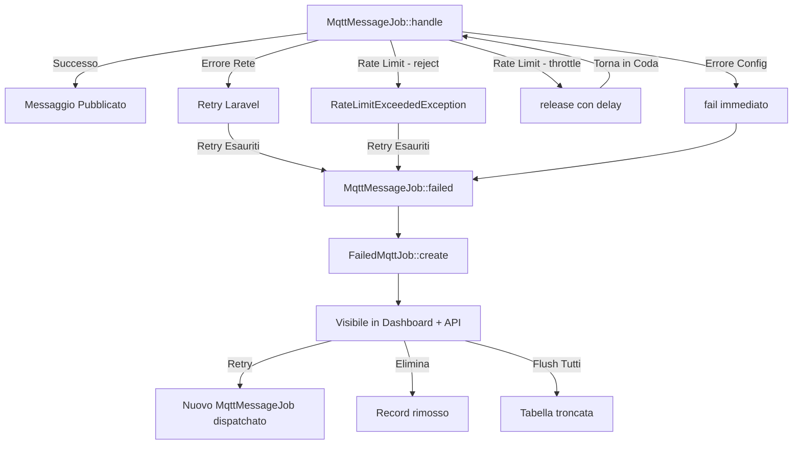
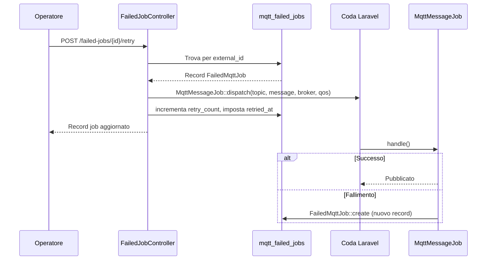

# Dead Letter Queue (Job Falliti)

## Panoramica

La Dead Letter Queue (DLQ) cattura i job di pubblicazione MQTT che falliscono dopo aver esaurito tutti i tentativi di retry. Quando `MqttMessageJob` fallisce — per irraggiungibilita del broker, superamento del rate limit, o errori di configurazione — il fallimento viene persistito nella tabella `mqtt_failed_jobs` con il contesto completo (broker, topic, payload del messaggio, eccezione). Gli operatori possono ispezionare, ritentare o eliminare i job falliti tramite la dashboard o l'API REST.

Il sistema risolve due problemi:
1. **Durabilita dei messaggi** — i publish falliti non vanno persi silenziosamente; rimangono recuperabili.
2. **Visibilita operativa** — la dashboard evidenzia pattern di fallimento (per broker, per topic) permettendo la diagnosi di problemi sistemici.

## Architettura

La DLQ e implementata come coda su database con un layer API REST e un componente React nella dashboard.

**Decisioni di design:**
- **Tabella separata, non la `failed_jobs` di Laravel** — i fallimenti MQTT contengono dati specifici del dominio (broker, topic, QoS, retain) che non entrano nello schema generico `failed_jobs`. Una tabella dedicata consente filtraggio, retry e analisi per campi specifici MQTT.
- **UUID come ID esterni** — il trait `HasExternalId` genera automaticamente un UUID `external_id` usato nelle route API. L'`id` interno (auto-increment) non viene mai esposto.
- **Connessione database configurabile** — la chiave `failed_jobs.connection` permette di salvare i fallimenti su un database diverso (ad es. per isolamento o compliance).
- **Nessun retry automatico** — i retry sono manuali (singoli o massivi). Scelta intenzionale: i job falliti spesso indicano un problema sistemico (broker giu, misconfiguration) dove il retry automatico creerebbe solo rumore.

## Come Funziona

### Flusso di Cattura dei Fallimenti

1. `MqttMessageJob::handle()` tenta di pubblicare un messaggio sul broker MQTT.
2. Se il job fallisce (esaurisce i retry o viene fallito esplicitamente via `$this->fail()`), Laravel chiama `MqttMessageJob::failed(\Throwable $exception)`.
3. `failed()` crea un record `FailedMqttJob` con il payload originale, il contesto del broker e l'eccezione in formato stringa.
4. Il job e ora visibile nella tab "Failed Jobs" della dashboard e via API REST.

### Cause di Fallimento

| Causa | Comportamento | Retry? |
|---|---|---|
| Errore di configurazione (`MqttBroadcastException`) | `$this->fail($e)` — fallimento immediato, nessun retry | No |
| Rate limit superato (strategia `reject`) | `RateLimitExceededException` lanciata, job fallisce dopo max tentativi | Si (fino a esaurimento) |
| Rate limit superato (strategia `throttle`) | `$this->release($delay)` — job rimesso in coda con delay | Rimesso in coda, non fallito |
| Errore di connessione al broker | Eccezione propagata, Laravel ritenta | Si (fino a esaurimento) |
| Errore di trasferimento dati | Eccezione propagata, Laravel ritenta | Si (fino a esaurimento) |

### Flusso di Retry

1. L'operatore clicca "Retry" su un job fallito (o "Retry All" per il retry massivo).
2. `FailedJobController::retry()` dispatcha un nuovo `MqttMessageJob` con il payload originale.
3. Il campo `retry_count` del record `FailedMqttJob` viene incrementato e `retried_at` viene impostato.
4. Il record **non viene eliminato** — persiste come traccia di audit. L'operatore deve eliminarlo o fare flush esplicitamente.

### Protezione nel Retry Massivo

`retryAll()` ritenta solo i job dove:
- `retried_at IS NULL` (mai ritentati), OPPURE
- `retried_at < now() - 1 minuto` (periodo di cooldown per prevenire spam)

Questo previene il doppio dispatch accidentale quando si clicca "Retry All" rapidamente.



## Componenti Principali

| File | Classe/Metodo | Responsabilita |
|---|---|---|
| `src/Models/FailedMqttJob.php` | `FailedMqttJob` | Modello Eloquent; tabella/connessione configurabili, cast JSON del messaggio, UUID esterni |
| `src/Models/Concerns/HasExternalId.php` | `HasExternalId` | Trait: genera UUID `external_id` automaticamente alla creazione, imposta route key |
| `src/Jobs/MqttMessageJob.php` | `failed(\Throwable)` | Hook chiamato da Laravel al fallimento del job; persiste su `mqtt_failed_jobs` |
| `src/Http/Controllers/FailedJobController.php` | `index()` | Lista i job falliti, filtrabile per `broker` e `topic`, paginato per `limit` (max 100) |
| `src/Http/Controllers/FailedJobController.php` | `show(string $id)` | Restituisce il dettaglio completo del job inclusi `exception` e `message` completi |
| `src/Http/Controllers/FailedJobController.php` | `retry(string $id)` | Dispatcha nuovo `MqttMessageJob`, incrementa `retry_count`, imposta `retried_at` |
| `src/Http/Controllers/FailedJobController.php` | `retryAll()` | Retry massivo con protezione cooldown di 1 minuto |
| `src/Http/Controllers/FailedJobController.php` | `destroy(string $id)` | Elimina singolo job fallito |
| `src/Http/Controllers/FailedJobController.php` | `flush()` | Tronca l'intera tabella `mqtt_failed_jobs` |
| `src/Http/Controllers/FailedJobController.php` | `formatJob()` | Formatta il job per la risposta API: preview messaggio 100 caratteri, preview eccezione prima riga |
| `src/Http/Controllers/DashboardStatsController.php` | `index()` | Include `failed_jobs.total` e `failed_jobs.pending_retry` nelle statistiche dashboard |
| `resources/js/mqtt-dashboard/src/components/FailedJobs.tsx` | `FailedJobs` | Componente React: lista job, retry/elimina per-job, retry massivo/flush, stati di caricamento |
| `resources/js/mqtt-dashboard/src/lib/api.ts` | `dashboardApi.*` | Metodi client API: `getFailedJobs`, `retryFailedJob`, `retryAllFailedJobs`, `deleteFailedJob`, `flushFailedJobs` |
| `database/migrations/2025_03_27_000000_create_mqtt_failed_jobs_table.php` | Migration | Crea la tabella `mqtt_failed_jobs` con connessione configurabile |

## Schema del Database

### Tabella: `mqtt_failed_jobs`

| Colonna | Tipo | Default | Note |
|---|---|---|---|
| `id` | `bigint` (PK) | auto-increment | ID interno, mai esposto via API |
| `external_id` | `uuid` | auto-generato | Unico; usato in tutte le route API |
| `broker` | `string` | `'default'` | Indicizzato; nome della connessione broker |
| `topic` | `string` | — | Topic MQTT di destinazione del messaggio |
| `message` | `longText` | nullable | Payload del messaggio in formato JSON (cast ad array da Eloquent) |
| `qos` | `tinyInteger` | `0` | Livello MQTT Quality of Service (0, 1, o 2) |
| `retain` | `boolean` | `false` | Flag MQTT retain |
| `exception` | `text` | — | Eccezione completa in formato stringa (classe + messaggio + stack trace) |
| `failed_at` | `timestamp` | — | Quando il job e fallito |
| `retried_at` | `timestamp` | nullable | Quando l'ultimo retry e stato dispatchato |
| `retry_count` | `unsigned int` | `0` | Numero di retry manuali effettuati |
| `created_at` | `timestamp` | — | Timestamp Eloquent |
| `updated_at` | `timestamp` | — | Timestamp Eloquent |

**Indici:** `external_id` (unico), `broker` (indice).

## Configurazione

```php
// config/mqtt-broadcast.php

'failed_jobs' => [
    // Connessione database per la tabella mqtt_failed_jobs.
    // null = usa la connessione Laravel predefinita.
    'connection' => env('MQTT_FAILED_JOBS_DB_CONNECTION'),

    // Nome tabella (default: mqtt_failed_jobs)
    'table' => env('MQTT_FAILED_JOBS_TABLE', 'mqtt_failed_jobs'),
],
```

| Chiave Config | Variabile Env | Default | Descrizione |
|---|---|---|---|
| `failed_jobs.connection` | `MQTT_FAILED_JOBS_DB_CONNECTION` | `null` (default) | Connessione database per lo storage DLQ |
| `failed_jobs.table` | `MQTT_FAILED_JOBS_TABLE` | `mqtt_failed_jobs` | Nome tabella |

La migration legge `failed_jobs.connection` a runtime via `Schema::connection()`, quindi la tabella viene creata sulla connessione configurata.

## Route API

Tutte le route sono prefissate con il path dashboard configurato (default: `/mqtt-broadcast/api`).

| Metodo | Route | Metodo Controller | Descrizione |
|---|---|---|---|
| `GET` | `/failed-jobs` | `index` | Lista job falliti (filtrabile: `broker`, `topic`, `limit`) |
| `GET` | `/failed-jobs/{id}` | `show` | Dettaglio completo job per `external_id` |
| `POST` | `/failed-jobs/{id}/retry` | `retry` | Retry singolo job |
| `POST` | `/failed-jobs/retry-all` | `retryAll` | Retry di tutti i job idonei |
| `DELETE` | `/failed-jobs/{id}` | `destroy` | Elimina singolo job |
| `DELETE` | `/failed-jobs` | `flush` | Elimina tutti i job falliti |

## Gestione degli Errori

- **La cattura dei fallimenti e best-effort** — se `FailedMqttJob::create()` stesso fallisce (ad es. database giu), il record del fallimento va perso. Accettabile perche l'eccezione originale viene comunque loggata dalla gestione standard dei job falliti di Laravel.
- **Il retry dispatcha un job nuovo** — il job ritentato passa attraverso l'intero ciclo di vita di `MqttMessageJob` incluso il rate limiting. Se il problema persiste, anche il retry fallira e creera un nuovo record `FailedMqttJob`.
- **`flush()` usa `TRUNCATE`** — operazione distruttiva irreversibile. La UI della dashboard mostra un dialogo di conferma prima dell'esecuzione.
- **`retryAll()` non ha transazione** — ogni retry e indipendente. Se uno fallisce a meta batch, i retry gia dispatchati procedono comunque.


