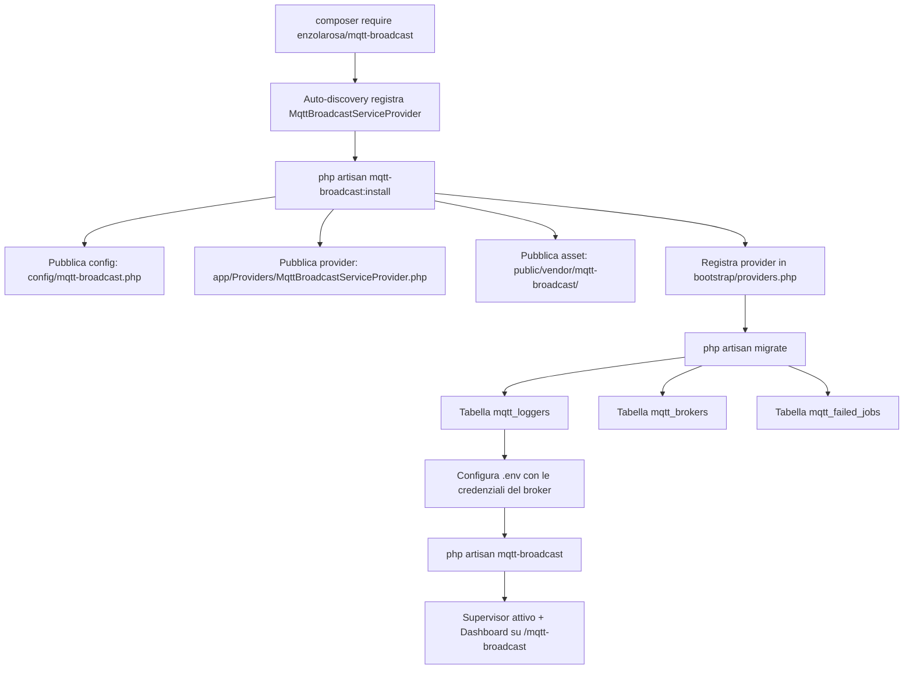
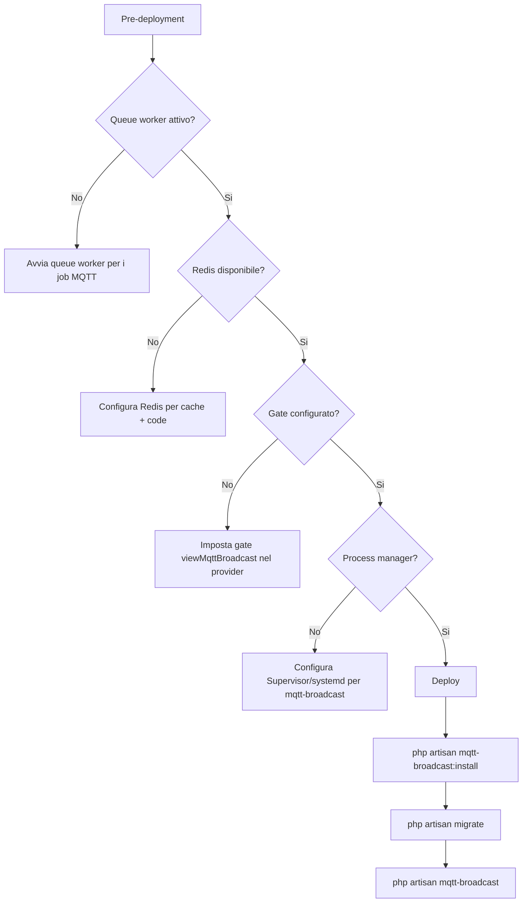

# Installazione e Configurazione

## Panoramica

`enzolarosa/mqtt-broadcast` e' un pacchetto Laravel che fornisce integrazione MQTT con supervisione dei processi in stile Horizon, supporto multi-broker, Dead Letter Queue e una dashboard di monitoraggio in React 19. Questa guida copre il processo completo di installazione, le opzioni di configurazione e le considerazioni per il deployment in produzione.

Il pacchetto richiede PHP 8.3+, Laravel 11+ e le estensioni PHP `pcntl` e `posix` per la gestione dei processi. Utilizza `php-mqtt/client` per la comunicazione con il protocollo MQTT.

## Architettura

L'installazione segue il pattern standard dei pacchetti Laravel con auto-discovery, asset pubblicabili e migrazioni auto-caricate. `InstallCommand` orchestra il setup iniziale pubblicando tre gruppi di asset e registrando un service provider locale per la personalizzazione del gate.



## Come Funziona

### Passo 1: Installazione via Composer

```bash
composer require enzolarosa/mqtt-broadcast
```

L'auto-discovery di Laravel legge `composer.json` `extra.laravel.providers` e registra automaticamente `MqttBroadcastServiceProvider`. Anche l'alias della facade `MqttBroadcast` viene registrato automaticamente.

### Passo 2: Eseguire il Comando di Installazione

```bash
php artisan mqtt-broadcast:install
```

`InstallCommand` esegue tre operazioni sequenziali:

1. **Pubblica la configurazione** (tag `mqtt-broadcast-config`) — copia `config/mqtt-broadcast.php` nella directory config dell'applicazione.
2. **Pubblica il provider** (tag `mqtt-broadcast-provider`) — copia `stubs/MqttBroadcastServiceProvider.stub` in `app/Providers/MqttBroadcastServiceProvider.php`. Questo provider locale estende quello del pacchetto e sovrascrive `registerGate()` per il controllo accessi alla dashboard.
3. **Pubblica gli asset** (tag `mqtt-broadcast-assets`) — copia i file pre-compilati della dashboard React in `public/vendor/mqtt-broadcast/`.
4. **Registra il provider** — aggiunge `App\Providers\MqttBroadcastServiceProvider::class` a `bootstrap/providers.php` (Laravel 11+) o `config/app.php` (Laravel 10). Idempotente — salta se gia' presente.

### Passo 3: Eseguire le Migrazioni

```bash
php artisan migrate
```

Le migrazioni sono auto-caricate dal service provider tramite `loadMigrationsFrom()` (pattern di Horizon). Non serve pubblicarle. Vengono create tre tabelle:

| Tabella | Migrazione | Scopo |
|---------|-----------|-------|
| `mqtt_loggers` | `2024_11_01_000000_create_mqtt_broadcast_table.php` | Archivia i messaggi MQTT ricevuti quando il logging e' attivo |
| `mqtt_brokers` | `2024_11_01_000000_create_mqtt_brokers_table.php` | Traccia i processi supervisore dei broker attivi |
| `mqtt_failed_jobs` | `2025_03_27_000000_create_mqtt_failed_jobs_table.php` | Dead Letter Queue per i job di pubblicazione falliti |

Una migrazione aggiuntiva (`2024_11_02_000000`) aggiunge la colonna `last_heartbeat_at` a `mqtt_brokers`, e un'altra (`2024_11_03_000000`) aggiunge un indice composito a `mqtt_loggers`.

### Passo 4: Configurare il Broker MQTT

Aggiungere al `.env`:

```dotenv
# Obbligatorio
MQTT_HOST=your-broker.example.com
MQTT_PORT=1883

# Opzionale: Autenticazione
MQTT_USERNAME=your-username
MQTT_PASSWORD=your-password

# Opzionale: Prefisso per tutti i topic
MQTT_PREFIX=myapp/

# Opzionale: TLS
MQTT_USE_TLS=false
```

### Passo 5: Configurare l'Accesso alla Dashboard

Modificare `app/Providers/MqttBroadcastServiceProvider.php`:

```php
protected function registerGate(): void
{
    Gate::define('viewMqttBroadcast', function ($user) {
        return in_array($user->email, [
            'admin@example.com',
        ]);
    });
}
```

Il middleware `Authorize` consente automaticamente tutti gli accessi in ambiente `local`. In tutti gli altri ambienti, verifica il gate `viewMqttBroadcast`. Il gate predefinito nega tutti gli accessi — bisogna autorizzare esplicitamente gli utenti.

### Passo 6: Avviare il Supervisor

```bash
php artisan mqtt-broadcast
```

Questo avvia il `MasterSupervisor`, che crea un `BrokerSupervisor` per ogni connessione definita nell'ambiente attivo. La dashboard e' accessibile su `/{path}` (default: `/mqtt-broadcast`).

## Componenti Chiave

| File | Classe/Metodo | Responsabilita' |
|------|--------------|-----------------|
| `src/Commands/InstallCommand.php` | `InstallCommand::handle()` | Orchestra l'installazione: pubblica config, provider, asset; registra il provider |
| `src/Commands/InstallCommand.php` | `registerMqttBroadcastServiceProvider()` | Rileva la versione Laravel, registra il provider in `bootstrap/providers.php` o `config/app.php` |
| `src/MqttBroadcastServiceProvider.php` | `register()` | Unisce la config, registra i servizi (singleton), carica le migrazioni |
| `src/MqttBroadcastServiceProvider.php` | `boot()` | Registra eventi, route, gate, viste, asset pubblicabili, comandi |
| `src/MqttBroadcastServiceProvider.php` | `registerGate()` | Gate predefinito: nega tutto in ambienti non-local |
| `stubs/MqttBroadcastServiceProvider.stub` | Provider pubblicato | Override del gate e personalizzazione config modificabile dall'utente |
| `config/mqtt-broadcast.php` | — | Tutta la configurazione con valori predefiniti sensati |
| `src/functions.php` | `mqttMessage()` / `mqttMessageSync()` | Funzioni helper globali (auto-caricate via Composer) |

## Configurazione

### Connessioni (Obbligatorio)

```php
'connections' => [
    'default' => [
        'host' => env('MQTT_HOST', '127.0.0.1'),
        'port' => env('MQTT_PORT', 1883),
        'username' => env('MQTT_USERNAME'),
        'password' => env('MQTT_PASSWORD'),
        'prefix' => env('MQTT_PREFIX', ''),
        'use_tls' => env('MQTT_USE_TLS', false),
        'clientId' => env('MQTT_CLIENT_ID'),
    ],
],
```

Sono supportate connessioni multiple. Ogni connessione corrisponde a un processo `BrokerSupervisor` separato:

```php
'connections' => [
    'default' => ['host' => env('MQTT_HOST'), 'port' => 1883],
    'backup'  => ['host' => env('MQTT_BACKUP_HOST'), 'port' => 1883],
],
```

### Ambienti

Mappa `APP_ENV` alle connessioni attive:

```php
'environments' => [
    'production' => ['default', 'backup'],
    'staging'    => ['default'],
    'local'      => ['default'],
],
```

Solo le connessioni elencate per l'ambiente corrente vengono supervisionate.

### Dashboard

| Chiave | Variabile Env | Default | Descrizione |
|--------|--------------|---------|-------------|
| `path` | `MQTT_BROADCAST_PATH` | `mqtt-broadcast` | Prefisso del percorso URL |
| `domain` | `MQTT_BROADCAST_DOMAIN` | `null` | Limita la dashboard a un dominio specifico |
| `middleware` | — | `['web', Authorize::class]` | Stack middleware |

### Logging Messaggi

| Chiave | Variabile Env | Default | Descrizione |
|--------|--------------|---------|-------------|
| `logs.enable` | `MQTT_LOG_ENABLE` | `false` | Archivia tutti i messaggi ricevuti nel DB |
| `logs.queue` | `MQTT_LOG_JOB_QUEUE` | `default` | Coda per i job di logging |
| `logs.connection` | `MQTT_LOG_CONNECTION` | `mysql` | Connessione database per la tabella dei log |
| `logs.table` | `MQTT_LOG_TABLE` | `mqtt_loggers` | Nome tabella |

### Dead Letter Queue

| Chiave | Variabile Env | Default | Descrizione |
|--------|--------------|---------|-------------|
| `failed_jobs.connection` | `MQTT_FAILED_JOBS_DB_CONNECTION` | `null` (default app) | Connessione database |
| `failed_jobs.table` | `MQTT_FAILED_JOBS_TABLE` | `mqtt_failed_jobs` | Nome tabella |

### Valori Predefiniti Protocollo MQTT

| Chiave | Default | Descrizione |
|--------|---------|-------------|
| `defaults.connection.qos` | `0` | Quality of Service: 0 (al piu' una volta), 1 (almeno una volta), 2 (esattamente una volta) |
| `defaults.connection.retain` | `false` | Il broker conserva l'ultimo messaggio per topic |
| `defaults.connection.clean_session` | `false` | Avvia con sessione pulita alla connessione |
| `defaults.connection.alive_interval` | `60` | Intervallo ping keep-alive (secondi) |
| `defaults.connection.timeout` | `3` | Timeout connessione (secondi) |
| `defaults.connection.self_signed_allowed` | `true` | Accetta certificati TLS auto-firmati |
| `defaults.connection.max_retries` | `20` | Tentativi massimi di riconnessione prima del circuit breaker |
| `defaults.connection.max_retry_delay` | `60` | Ritardo massimo tra tentativi (tetto backoff esponenziale) |
| `defaults.connection.max_failure_duration` | `3600` | Durata massima totale di fallimento prima di arrendersi (secondi) |
| `defaults.connection.terminate_on_max_retries` | `false` | Termina il supervisor dopo l'esaurimento dei tentativi massimi |

### Gestione Memoria

| Chiave | Variabile Env | Default | Descrizione |
|--------|--------------|---------|-------------|
| `memory.gc_interval` | `MQTT_GC_INTERVAL` | `100` | Esegui garbage collection ogni N messaggi |
| `memory.threshold_mb` | `MQTT_MEMORY_THRESHOLD_MB` | `128` | Limite memoria prima del riavvio automatico |
| `memory.auto_restart` | `MQTT_MEMORY_AUTO_RESTART` | `true` | Riavvia automaticamente i supervisori al superamento della soglia |
| `memory.restart_delay_seconds` | `MQTT_RESTART_DELAY_SECONDS` | `10` | Ritardo prima del riavvio dopo il superamento della soglia |

### Configurazione Code

| Chiave | Variabile Env | Default | Descrizione |
|--------|--------------|---------|-------------|
| `queue.name` | `MQTT_JOB_QUEUE` | `default` | Nome coda per i job di pubblicazione |
| `queue.listener` | `MQTT_LISTENER_QUEUE` | `default` | Nome coda per i job dei listener |
| `queue.connection` | `MQTT_JOB_CONNECTION` | `redis` | Driver connessione coda |

### Configurazione Supervisor

| Chiave | Variabile Env | Default | Descrizione |
|--------|--------------|---------|-------------|
| `master_supervisor.name` | `MQTT_MASTER_NAME` | `master` | Prefisso nome master supervisor |
| `master_supervisor.cache_ttl` | `MQTT_MASTER_CACHE_TTL` | `3600` | TTL cache per lo stato del supervisor (secondi) |
| `master_supervisor.cache_driver` | `MQTT_CACHE_DRIVER` | `redis` | Driver cache per lo stato del supervisor |
| `supervisor.heartbeat_interval` | `MQTT_HEARTBEAT_INTERVAL` | `1` | Frequenza heartbeat (secondi) |

### Impostazioni Repository

| Chiave | Variabile Env | Default | Descrizione |
|--------|--------------|---------|-------------|
| `repository.broker.heartbeat_column` | — | `last_heartbeat_at` | Nome colonna per il tracciamento dell'heartbeat |
| `repository.broker.stale_threshold` | `MQTT_STALE_THRESHOLD` | `300` | Secondi prima che un broker sia considerato stale |

## Gestione Errori

### Errori di Installazione

- **Estensioni `pcntl`/`posix` mancanti**: Composer fallira' all'installazione. Sono necessarie per la supervisione dei processi (gestione segnali, gestione PID).
- **Provider gia' registrato**: `InstallCommand` verifica la registrazione esistente del provider e salta se gia' presente (idempotente).
- **Conflitti migrazioni**: Le migrazioni usano nomi con timestamp dalla directory del vendor. Nessun rischio di collisione poiche' non vengono pubblicate.

### Errori di Configurazione

- **Host/porta non validi**: `MqttConnectionConfig::fromConnection()` valida tutti i valori di configurazione all'avvio del supervisor. Una configurazione non valida causa un fallimento immediato con un'eccezione descrittiva.
- **Connessione mancante nell'ambiente**: Se `environments.{env}` referenzia una connessione non definita in `connections`, il supervisor genera un errore all'avvio.
- **Auth senza credenziali**: Se `username` e' impostato ma `password` e' null (o viceversa), la connessione fallira' a livello di broker.

### Errori a Runtime

- **Broker irraggiungibile**: Il supervisor usa riconnessione con backoff esponenziale fino a `max_retries`. Il circuit breaker previene loop infiniti.
- **Esaurimento memoria**: `MemoryManager` monitora l'utilizzo e attiva il riavvio graduale quando `threshold_mb` viene superato.
- **Pubblicazioni fallite**: I job che esauriscono i tentativi vengono archiviati nella tabella `mqtt_failed_jobs` (DLQ) e possono essere ritentati dalla dashboard.

## Checklist Deployment Produzione



### Passi Obbligatori

1. **Queue worker** — Assicurarsi che `php artisan queue:work` sia in esecuzione per la connessione coda configurata (`redis` per default). Necessario per la pubblicazione asincrona dei messaggi e l'elaborazione dei listener.
2. **Redis** — Necessario sia per l'elaborazione delle code che per il caching dello stato del master supervisor (default `cache_driver`).
3. **Gate dashboard** — Il gate predefinito nega tutti gli accessi in ambienti non-local. Configurare `viewMqttBroadcast` nel provider pubblicato.
4. **Process manager** — Usare Supervisor (supervisord) o systemd per mantenere `php artisan mqtt-broadcast` in esecuzione. Simile alla gestione di Laravel Horizon.

### `.env` Consigliato per la Produzione

```dotenv
MQTT_HOST=mqtt.production.example.com
MQTT_PORT=8883
MQTT_USE_TLS=true
MQTT_USERNAME=prod-user
MQTT_PASSWORD=secure-password
MQTT_PREFIX=production/

MQTT_LOG_ENABLE=true
MQTT_MEMORY_THRESHOLD_MB=256
MQTT_MAX_RETRIES=50
MQTT_CACHE_DRIVER=redis
MQTT_JOB_CONNECTION=redis
```

### Esempio Configurazione Supervisord

```ini
[program:mqtt-broadcast]
process_name=%(program_name)s
command=php /path/to/artisan mqtt-broadcast
autostart=true
autorestart=true
user=www-data
redirect_stderr=true
stdout_logfile=/path/to/storage/logs/mqtt-broadcast.log
stopwaitsecs=3600
```
