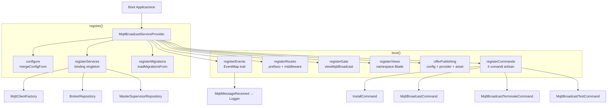
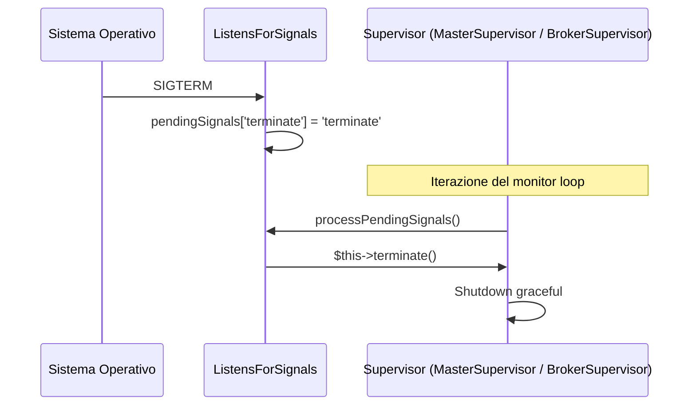
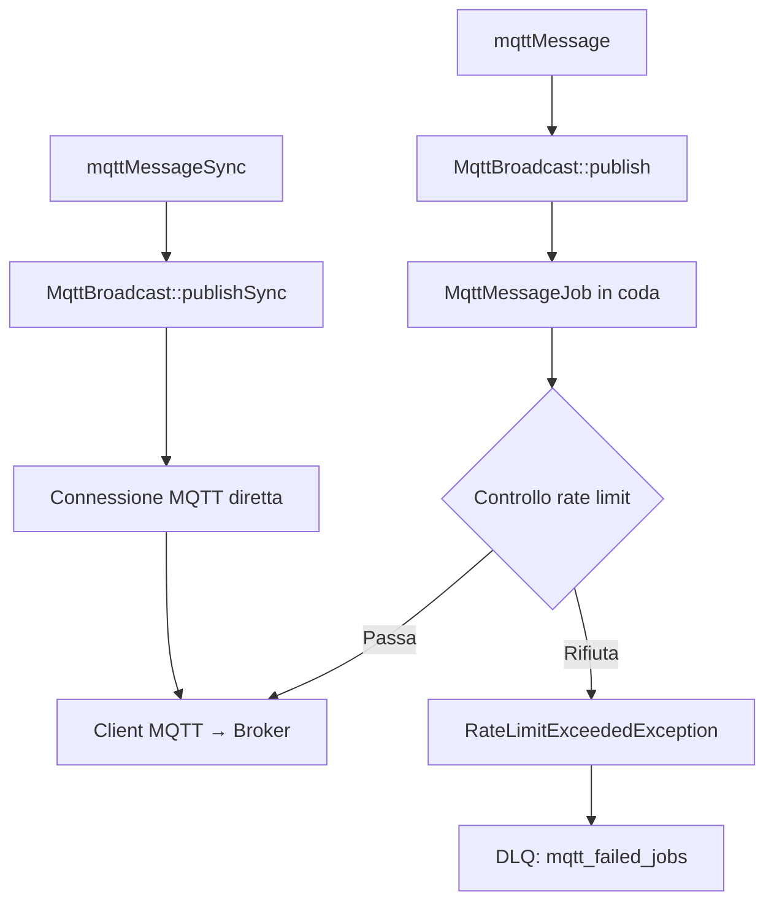

# Infrastruttura del Pacchetto

## Panoramica

`MqttBroadcastServiceProvider` e' la classe di bootstrap centrale del pacchetto `enzolarosa/mqtt-broadcast`. Collega tutti i servizi del pacchetto: binding singleton, registrazione eventi/listener, caricamento rotte, viste Blade, comandi artisan, gate di autorizzazione, migrazioni e asset pubblicabili. Il design segue le stesse convenzioni di Laravel Horizon: migrazioni auto-caricate, stub del provider pubblicabile per la personalizzazione del gate, e registrazione rotte compatibile con la cache.

L'infrastruttura di supporto include quattro contratti (`Listener`, `Pausable`, `Restartable`, `Terminable`), un trait `ListensForSignals` per il controllo dei processi Unix, due classi di eccezioni personalizzate, due funzioni helper globali e un file di configurazione completo con selezione dei broker basata sull'ambiente.

## Architettura

Il service provider utilizza due trait di composizione per separare le responsabilita':

- **`ServiceBindings`** — dichiara l'array dei singleton (`MqttClientFactory`, `BrokerRepository`, `MasterSupervisorRepository`).
- **`EventMap`** — dichiara le mappature evento → listener (`MqttMessageReceived → Logger`).

La separazione boot/register segue le convenzioni Laravel:

| Fase | Metodo | Cosa fa |
|------|--------|---------|
| `register()` | `configure()` | Unisce la config predefinita tramite `mergeConfigFrom()` |
| `register()` | `registerServices()` | Itera `$serviceBindings` e registra i singleton |
| `register()` | `registerMigrations()` | Carica le migrazioni da `database/migrations/` (solo console) |
| `boot()` | `registerEvents()` | Risolve il `Dispatcher` e registra le coppie evento/listener da `$events` |
| `boot()` | `registerRoutes()` | Registra il gruppo rotte con prefisso/dominio/middleware configurabili |
| `boot()` | `registerGate()` | Definisce il gate `viewMqttBroadcast` (default: nega tutto) |
| `boot()` | `registerViews()` | Carica le viste Blade sotto il namespace `mqtt-broadcast` |
| `boot()` | `offerPublishing()` | Registra config, stub del provider e asset frontend pubblicabili |
| `boot()` | `registerCommands()` | Registra 4 comandi artisan (solo console) |



## Come Funziona

### Flusso di Registrazione dei Servizi

1. Laravel scopre il provider tramite auto-discovery di Composer o registrazione manuale.
2. `register()` viene eseguito per primo:
   - `configure()` unisce il `config/mqtt-broadcast.php` del pacchetto con la copia pubblicata dall'app (se presente). I valori dell'app hanno la precedenza.
   - `registerServices()` itera `$serviceBindings`. Le chiavi numeriche registrano come `$this->app->singleton($class)` (self-binding); le chiavi stringa registrano come `$this->app->singleton($key, $value)` (interfaccia → implementazione).
   - `registerMigrations()` chiama `loadMigrationsFrom()` cosi' le migrazioni vengono eseguite direttamente dal vendor — nessun passaggio di pubblicazione richiesto.

3. `boot()` viene eseguito dopo che tutti i provider sono registrati:
   - `registerEvents()` risolve il contratto `Dispatcher` e itera l'array `$events` (dal trait `EventMap`), chiamando `$events->listen($event, $listener)` per ogni coppia.
   - `registerRoutes()` controlla prima `$this->app->routesAreCached()` — se le rotte sono in cache, la registrazione viene saltata. Altrimenti, le rotte vengono caricate in un `Route::group()` usando `config('mqtt-broadcast.domain')`, `config('mqtt-broadcast.path')` (default: `mqtt-broadcast`) e `config('mqtt-broadcast.middleware')` (default: `['web', Authorize::class]`).
   - `registerGate()` definisce il gate `viewMqttBroadcast` con policy deny-all. Gli utenti lo sovrascrivono nel provider pubblicato.
   - `registerViews()` carica le viste Blade da `resources/views` sotto il namespace `mqtt-broadcast`.
   - `offerPublishing()` registra tre gruppi di pubblicazione: `mqtt-broadcast-provider`, `mqtt-broadcast-config` e `mqtt-broadcast-assets` (anche taggato `laravel-assets`).
   - `registerCommands()` registra quattro comandi artisan (solo console).

### Stub del Provider Pubblicabile

Il file `stubs/MqttBroadcastServiceProvider.stub` viene pubblicato in `app/Providers/MqttBroadcastServiceProvider.php`. Estende il provider base e sovrascrive `registerGate()` per permettere logiche di autorizzazione personalizzate:

```php
Gate::define('viewMqttBroadcast', function ($user) {
    return in_array($user->email, [
        // 'admin@example.com',
    ]);
});
```

### Registrazione Rotte

Le rotte sono definite in `routes/web.php` e raggruppate sotto il prefisso configurabile. Tutti gli endpoint API sono annidati sotto il sotto-prefisso `api`:

| Metodo | Percorso | Controller | Nome |
|--------|----------|-----------|------|
| GET | `/api/health` | `HealthController@check` | `mqtt-broadcast.health` |
| GET | `/api/stats` | `DashboardStatsController@index` | `mqtt-broadcast.stats` |
| GET | `/api/brokers` | `BrokerController@index` | `mqtt-broadcast.brokers.index` |
| GET | `/api/brokers/{id}` | `BrokerController@show` | `mqtt-broadcast.brokers.show` |
| GET | `/api/messages` | `MessageLogController@index` | `mqtt-broadcast.messages.index` |
| GET | `/api/messages/{id}` | `MessageLogController@show` | `mqtt-broadcast.messages.show` |
| GET | `/api/topics` | `MessageLogController@topics` | `mqtt-broadcast.topics` |
| GET | `/api/metrics/throughput` | `MetricsController@throughput` | `mqtt-broadcast.metrics.throughput` |
| GET | `/api/metrics/summary` | `MetricsController@summary` | `mqtt-broadcast.metrics.summary` |
| GET | `/api/failed-jobs` | `FailedJobController@index` | `mqtt-broadcast.failed-jobs.index` |
| GET | `/api/failed-jobs/{id}` | `FailedJobController@show` | `mqtt-broadcast.failed-jobs.show` |
| POST | `/api/failed-jobs/retry-all` | `FailedJobController@retryAll` | `mqtt-broadcast.failed-jobs.retry-all` |
| POST | `/api/failed-jobs/{id}/retry` | `FailedJobController@retry` | `mqtt-broadcast.failed-jobs.retry` |
| DELETE | `/api/failed-jobs` | `FailedJobController@flush` | `mqtt-broadcast.failed-jobs.flush` |
| DELETE | `/api/failed-jobs/{id}` | `FailedJobController@destroy` | `mqtt-broadcast.failed-jobs.destroy` |
| GET | `/` | Vista Blade (React SPA) | `mqtt-broadcast.dashboard` |

Con la configurazione predefinita, gli URL completi sono: `https://app.example.com/mqtt-broadcast/api/health`, ecc.

## Componenti Chiave

| File | Classe/Metodo | Responsabilita' |
|------|--------------|-----------------|
| `src/MqttBroadcastServiceProvider.php` | `MqttBroadcastServiceProvider` | Bootstrap centrale — collega tutti i servizi, eventi, rotte, viste, comandi, migrazioni |
| `src/ServiceBindings.php` | `ServiceBindings` (trait) | Dichiara l'array dei binding singleton |
| `src/EventMap.php` | `EventMap` (trait) | Dichiara le mappature evento → listener |
| `src/ListensForSignals.php` | `ListensForSignals` (trait) | Gestisce SIGTERM/SIGUSR1/SIGUSR2/SIGCONT tramite coda asincrona di segnali |
| `src/Contracts/Listener.php` | `Listener` (interfaccia) | Contratto per i listener MQTT: `handle()` + `processMessage()` |
| `src/Contracts/Pausable.php` | `Pausable` (interfaccia) | Contratto per processi pausabili: `pause()` + `continue()` |
| `src/Contracts/Restartable.php` | `Restartable` (interfaccia) | Contratto per processi riavviabili: `restart()` |
| `src/Contracts/Terminable.php` | `Terminable` (interfaccia) | Contratto per processi terminabili: `terminate(int $status)` |
| `src/Exceptions/MqttBroadcastException.php` | `MqttBroadcastException` | Errori di configurazione con costruttori nominati: `connectionNotConfigured()`, `brokerNotConfigured()`, `brokerMissingConfiguration()`, `connectionMissingConfiguration()` |
| `src/Exceptions/RateLimitExceededException.php` | `RateLimitExceededException` | Violazioni del rate limit con accessor `getConnection()`, `getLimit()`, `getWindow()`, `getRetryAfter()` |
| `src/functions.php` | `mqttMessage()` | Helper globale per pubblicazione asincrona (dispatcha job in coda) |
| `src/functions.php` | `mqttMessageSync()` | Helper globale per pubblicazione sincrona (connessione MQTT diretta) |
| `config/mqtt-broadcast.php` | — | Configurazione completa: connessioni, ambienti, dashboard, logging, DLQ, default MQTT, memoria, code, supervisor |
| `routes/web.php` | — | Rotte HTTP: 16 endpoint API + 1 catch-all SPA |
| `stubs/MqttBroadcastServiceProvider.stub` | — | Stub del provider pubblicabile con scaffolding per personalizzazione gate |

## Contratti e Interfacce

Il pacchetto definisce quattro contratti implementati dal sistema di supervisione:

### `Listener`

```php
interface Listener
{
    public function handle(MqttMessageReceived $event): void;
    public function processMessage(string $topic, object $obj): void;
}
```

Utilizzato da `MqttListener` (classe base astratta) e da qualsiasi listener personalizzato. `handle()` riceve l'evento ed esegue filtraggio/decodifica; `processMessage()` e' l'hook di business logic implementato dall'utente.

### `Pausable`

```php
interface Pausable
{
    public function pause(): void;
    public function continue(): void;
}
```

Implementato da `MasterSupervisor` e `BrokerSupervisor`. La pausa ferma l'elaborazione dei messaggi senza uccidere il processo; `continue()` riprende.

### `Restartable`

```php
interface Restartable
{
    public function restart(): void;
}
```

Implementato da `BrokerSupervisor`. Abbatte e ristabilisce la connessione del client MQTT.

### `Terminable`

```php
interface Terminable
{
    public function terminate(int $status = 0): void;
}
```

Implementato da `MasterSupervisor` e `BrokerSupervisor`. Avvia lo shutdown graceful con lo stato di uscita indicato.

## Gestione Segnali — `ListensForSignals`

Il trait `ListensForSignals` fornisce la gestione asincrona dei segnali Unix per i processi supervisor long-running:

| Segnale | Azione Accodata | Effetto |
|---------|----------------|---------|
| `SIGTERM` | `terminate` | Shutdown graceful |
| `SIGUSR1` | `restart` | Riconnessione client MQTT |
| `SIGUSR2` | `pause` | Pausa elaborazione messaggi |
| `SIGCONT` | `continue` | Ripresa elaborazione messaggi |

I segnali non vengono gestiti inline. `pcntl_async_signals(true)` abilita la consegna asincrona, e ogni handler inserisce una chiave stringa in `$pendingSignals`. Il metodo `processPendingSignals()` svuota la coda chiamando `$this->{$signal}()` — basandosi sulla classe consumatrice che implementa i metodi `terminate()`, `restart()`, `pause()` e `continue()`.



## Schema Database

Il pacchetto auto-carica 5 migrazioni (nessuna pubblicazione richiesta):

### `mqtt_loggers` (connessione configurabile)

| Colonna | Tipo | Note |
|---------|------|------|
| `id` | bigint PK | Auto-incremento |
| `external_id` | uuid | Unico, chiave rotta |
| `broker` | string | Indicizzato (composito), default `'remote'` |
| `topic` | string | Nullable |
| `message` | longText | Nullable |
| `created_at` | timestamp | Parte dell'indice composito |
| `updated_at` | timestamp | — |

**Indice:** `(broker, topic, created_at)` composito — ottimizza query filtrate e ordinate.

### `mqtt_brokers`

| Colonna | Tipo | Note |
|---------|------|------|
| `id` | bigint PK | Auto-incremento |
| `name` | string | Nome supervisor |
| `connection` | string | Nome connessione config |
| `pid` | unsigned int | Nullable, ID processo OS |
| `working` | boolean | Default `false` |
| `started_at` | datetimeTz | Nullable |
| `last_heartbeat_at` | timestamp | Nullable (aggiunto in migrazione successiva) |
| `created_at` | timestamp | — |
| `updated_at` | timestamp | — |

### `mqtt_failed_jobs` (connessione configurabile)

| Colonna | Tipo | Note |
|---------|------|------|
| `id` | bigint PK | Auto-incremento |
| `external_id` | uuid | Unico, chiave rotta |
| `connection` | string | Nome connessione broker |
| `topic` | string | Topic MQTT |
| `message` | longText | Payload del messaggio |
| `exception` | longText | Traccia completa dell'eccezione |
| `failed_at` | timestamp | — |
| `created_at` | timestamp | — |
| `updated_at` | timestamp | — |

## Configurazione

Il file di configurazione (`config/mqtt-broadcast.php`) e' strutturato in sezioni:

### Connessioni

```php
'connections' => [
    'default' => [
        'host'      => env('MQTT_HOST', '127.0.0.1'),
        'port'      => env('MQTT_PORT', 1883),
        'username'  => env('MQTT_USERNAME'),
        'password'  => env('MQTT_PASSWORD'),
        'prefix'    => env('MQTT_PREFIX', ''),
        'use_tls'   => env('MQTT_USE_TLS', false),
        'clientId'  => env('MQTT_CLIENT_ID'),
    ],
],
```

Supporto per connessioni multiple. Ogni connessione definisce un broker MQTT separato.

### Mappatura Ambienti

```php
'environments' => [
    'production' => ['default'],
    'local'      => ['default'],
],
```

Mappa `APP_ENV` a un array di nomi di connessione. Il supervisor avvia un `BrokerSupervisor` per ogni connessione elencata nell'ambiente corrente.

### Dashboard

| Chiave | Variabile Env | Default | Descrizione |
|--------|--------------|---------|-------------|
| `path` | `MQTT_BROADCAST_PATH` | `mqtt-broadcast` | Prefisso percorso URL |
| `domain` | `MQTT_BROADCAST_DOMAIN` | `null` | Vincolo sottodominio opzionale |
| `middleware` | — | `['web', Authorize::class]` | Stack middleware rotte |

### Logging Messaggi

| Chiave | Variabile Env | Default | Descrizione |
|--------|--------------|---------|-------------|
| `logs.enable` | `MQTT_LOG_ENABLE` | `false` | Abilita logging DB dei messaggi ricevuti |
| `logs.queue` | `MQTT_LOG_JOB_QUEUE` | `default` | Nome coda per job di logging |
| `logs.connection` | `MQTT_LOG_CONNECTION` | `mysql` | Connessione database per `mqtt_loggers` |
| `logs.table` | `MQTT_LOG_TABLE` | `mqtt_loggers` | Nome tabella |

### Job Falliti (DLQ)

| Chiave | Variabile Env | Default | Descrizione |
|--------|--------------|---------|-------------|
| `failed_jobs.connection` | `MQTT_FAILED_JOBS_DB_CONNECTION` | `null` (default app) | Connessione database |
| `failed_jobs.table` | `MQTT_FAILED_JOBS_TABLE` | `mqtt_failed_jobs` | Nome tabella |

### Default Protocollo MQTT

| Chiave | Variabile Env | Default | Descrizione |
|--------|--------------|---------|-------------|
| `defaults.connection.qos` | — | `0` | Livello Quality of Service |
| `defaults.connection.retain` | — | `false` | Flag retain |
| `defaults.connection.clean_session` | — | `false` | Flag clean session |
| `defaults.connection.alive_interval` | — | `60` | Keep-alive (secondi) |
| `defaults.connection.timeout` | — | `3` | Timeout connessione (secondi) |
| `defaults.connection.self_signed_allowed` | — | `true` | Permetti certificati TLS auto-firmati |
| `defaults.connection.max_retries` | `MQTT_MAX_RETRIES` | `20` | Tentativi massimi di riconnessione |
| `defaults.connection.max_retry_delay` | `MQTT_MAX_RETRY_DELAY` | `60` | Ritardo massimo tra tentativi (secondi) |
| `defaults.connection.max_failure_duration` | `MQTT_MAX_FAILURE_DURATION` | `3600` | Finestra massima di fallimento prima del circuit break (secondi) |
| `defaults.connection.terminate_on_max_retries` | `MQTT_TERMINATE_ON_MAX_RETRIES` | `false` | Termina supervisor dopo tentativi massimi |

### Gestione Memoria

| Chiave | Variabile Env | Default | Descrizione |
|--------|--------------|---------|-------------|
| `memory.gc_interval` | `MQTT_GC_INTERVAL` | `100` | Forza GC ogni N messaggi |
| `memory.threshold_mb` | `MQTT_MEMORY_THRESHOLD_MB` | `128` | Limite memoria prima del riavvio automatico |
| `memory.auto_restart` | `MQTT_MEMORY_AUTO_RESTART` | `true` | Abilita riavvio basato sulla memoria |
| `memory.restart_delay_seconds` | `MQTT_RESTART_DELAY_SECONDS` | `10` | Ritardo prima del riavvio |

### Code

| Chiave | Variabile Env | Default | Descrizione |
|--------|--------------|---------|-------------|
| `queue.name` | `MQTT_JOB_QUEUE` | `default` | Coda per job di pubblicazione |
| `queue.listener` | `MQTT_LISTENER_QUEUE` | `default` | Coda per job dei listener |
| `queue.connection` | `MQTT_JOB_CONNECTION` | `redis` | Driver connessione coda |

### Supervisor

| Chiave | Variabile Env | Default | Descrizione |
|--------|--------------|---------|-------------|
| `master_supervisor.name` | `MQTT_MASTER_NAME` | `master` | Prefisso nome master supervisor |
| `master_supervisor.cache_ttl` | `MQTT_MASTER_CACHE_TTL` | `3600` | TTL cache per stato supervisor |
| `master_supervisor.cache_driver` | `MQTT_CACHE_DRIVER` | `redis` | Driver cache |
| `supervisor.heartbeat_interval` | `MQTT_HEARTBEAT_INTERVAL` | `1` | Frequenza heartbeat (secondi) |

### Repository

| Chiave | Variabile Env | Default | Descrizione |
|--------|--------------|---------|-------------|
| `repository.broker.heartbeat_column` | — | `last_heartbeat_at` | Nome colonna per heartbeat |
| `repository.broker.stale_threshold` | `MQTT_STALE_THRESHOLD` | `300` | Secondi prima che un broker sia considerato stale |

## Gestione Errori

### `MqttBroadcastException`

Lanciata per errori di configurazione. Usa metodi factory statici per messaggi chiari e azionabili:

| Metodo Factory | Quando Lanciata |
|---------------|-----------------|
| `connectionNotConfigured($connection)` | Nome connessione non trovato in `config('mqtt-broadcast.connections')` |
| `brokerNotConfigured($broker)` | Nome broker non nella mappatura ambiente |
| `brokerMissingConfiguration($broker, $key)` | Chiave richiesta (es. `host`) mancante dalla config broker |
| `connectionMissingConfiguration($connection, $key)` | Chiave richiesta mancante dalla config connessione |

Tutti i messaggi referenziano `config/mqtt-broadcast.php` per guidare lo sviluppatore.

### `RateLimitExceededException`

Estende `RuntimeException`. Lanciata da `RateLimitService` quando i limiti di frequenza di pubblicazione vengono superati. Trasporta contesto strutturato:

- `getConnection()` — quale connessione broker ha raggiunto il limite
- `getLimit()` — la soglia (es. 100)
- `getWindow()` — la finestra temporale (`'second'` o `'minute'`)
- `getRetryAfter()` — secondi fino al reset del limite

Questa eccezione viene catturata da `MqttMessageJob` e attiva la persistenza DLQ quando la strategia e' `'reject'`.

### Funzioni Helper Globali

Due funzioni di convenienza in `src/functions.php` (auto-caricate tramite Composer):

```php
mqttMessage(string $topic, mixed $message, string $broker = 'local', int $qos = 0): void
```
Dispatcha un `MqttMessageJob` asincrono tramite la facade `MqttBroadcast`.

```php
mqttMessageSync(string $topic, mixed $message, string $broker = 'local', int $qos = 0): void
```
Pubblica in modo sincrono tramite `MqttBroadcast::publishSync()`.

Entrambe sono avvolte in guard `function_exists()` per permettere override dell'utente.


