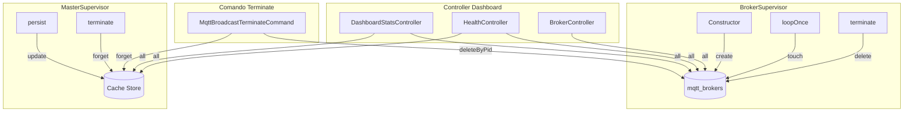
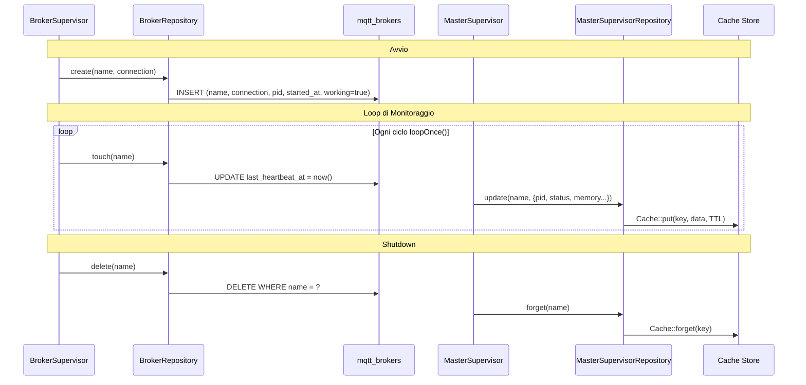

# Pattern Repository

## Panoramica

Il pacchetto utilizza un pattern dual-repository ispirato a Laravel Horizon per separare la persistenza dei processi broker (database) dalla persistenza dello stato del master supervisor (cache). `BrokerRepository` gestisce i record dei processi MQTT broker nella tabella `mqtt_brokers`, mentre `MasterSupervisorRepository` archivia lo stato effimero del supervisor nel driver di cache configurato. Entrambi sono registrati come singleton tramite il trait `ServiceBindings` e iniettati in supervisor, controller e comandi Artisan.

## Architettura

Due strategie di persistenza servono esigenze di ciclo di vita dei dati diverse:

| Ambito | Repository | Storage | Motivazione |
|---|---|---|---|
| Processi broker | `BrokerRepository` | Database (`mqtt_brokers`) | Record durevoli che sopravvivono ai riavvii; interrogabili dai controller |
| Stato master supervisor | `MasterSupervisorRepository` | Cache (Redis/File/Array) | Stato effimero con TTL; nessuna migrazione necessaria; letture veloci |

Entrambi i repository seguono il **pattern silent-fail** di Horizon: le operazioni su record inesistenti vengono completate senza lanciare eccezioni. Questo semplifica la logica di cleanup nei comandi di terminazione e negli hook di shutdown dove uno stato parziale e' atteso.

Entrambi sono registrati nel service container come singleton tramite il trait `ServiceBindings` in `MqttBroadcastServiceProvider`:

```php
// src/ServiceBindings.php
public $serviceBindings = [
    MqttClientFactory::class,
    BrokerRepository::class,
    MasterSupervisorRepository::class,
];
```

## Come Funziona

### Ciclo di Vita BrokerRepository

1. **Create** -- `BrokerSupervisor::__construct()` chiama `$repository->create($name, $connection)`, registrando il PID del processo, l'orario di avvio e il timestamp iniziale dell'heartbeat.
2. **Heartbeat** -- Ad ogni ciclo `loopOnce()`, `BrokerSupervisor` chiama `$repository->touch($name)` per aggiornare `last_heartbeat_at`. I controller usano questo timestamp per determinare lo stato della connessione (attivo se heartbeat < 2 minuti fa).
3. **Terminate** -- `BrokerSupervisor::terminate()` chiama `$repository->delete($name)`. Il comando terminate usa anche `deleteByPid()` per la pulizia basata su PID.

### Ciclo di Vita MasterSupervisorRepository

1. **Update** -- `MasterSupervisor::persist()` chiama `$repository->update($name, $attributes)` ad ogni iterazione del loop di monitoraggio, archiviando PID, stato, numero di supervisor, utilizzo memoria e un timestamp `updated_at` aggiunto automaticamente.
2. **Read** -- `DashboardStatsController` e `HealthController` chiamano `$repository->all()` e `$repository->find()` per visualizzare lo stato del supervisor nella dashboard.
3. **Forget** -- `MasterSupervisor::terminate()` chiama `$repository->forget($name)` per rimuovere lo stato prima di uscire.

### Listing delle Chiavi Cache (Multi-Driver)

`MasterSupervisorRepository::names()` deve scoprire tutti i supervisor attivi scansionando le chiavi cache con il prefisso `mqtt-broadcast:master:`. Poiche' la facade Cache di Laravel non fornisce un metodo `keys()`, il repository implementa il listing delle chiavi per ogni driver:

| Driver | Strategia | Limitazione |
|---|---|---|
| `redis` | `$connection->keys($prefix . '*')` tramite comando Redis KEYS | Supporto completo; rimuove il prefisso dello store dalle chiavi restituite |
| `file` | `glob($directory . '/*')` + deserializzazione di ogni file per estrarre la chiave | Legge e analizza ogni file cache; O(n) sulla dimensione totale della cache |
| `memcached` | Ritorna `[]` | Il protocollo Memcached non supporta l'enumerazione delle chiavi |
| `array` | Reflection sulla proprieta' `$store->storage` | Solo per testing; usa `ReflectionClass` per accedere a proprieta' private |
| Altro | Ritorna `[]` | I driver non supportati ritornano silenziosamente un array vuoto |

Per il driver file, `getKeyFromFile()` legge ogni file, salta il prefisso di scadenza di 10 byte, poi deserializza il payload per estrarre il campo `key`. I file corrotti vengono loggati come warning e saltati.

## Componenti Chiave

| File | Classe/Metodo | Responsabilita' |
|---|---|---|
| `src/Repositories/BrokerRepository.php` | `BrokerRepository::create()` | Inserire record broker con PID corrente e timestamp |
| | `BrokerRepository::find()` | Ricerca broker per nome |
| | `BrokerRepository::all()` | Restituire tutti i record broker come Collection |
| | `BrokerRepository::touch()` | Aggiornare `last_heartbeat_at` (silent fail) |
| | `BrokerRepository::delete()` | Eliminare per nome (silent fail) |
| | `BrokerRepository::deleteByPid()` | Eliminare tutti i record corrispondenti a un PID (silent fail) |
| | `BrokerRepository::generateName()` | Generare identificatore `{hostname-slug}-{random4}` |
| `src/Repositories/MasterSupervisorRepository.php` | `MasterSupervisorRepository::update()` | Archiviare/sovrascrivere stato supervisor con `updated_at` automatico |
| | `MasterSupervisorRepository::find()` | Recuperare stato per nome supervisor |
| | `MasterSupervisorRepository::forget()` | Rimuovere stato dalla cache (silent fail) |
| | `MasterSupervisorRepository::all()` | Scoprire e restituire tutti gli stati dei supervisor |
| | `MasterSupervisorRepository::names()` | Elencare nomi supervisor attivi tramite scansione chiavi driver-specifica |
| | `MasterSupervisorRepository::getCacheKeys()` | Dispatchare alla strategia di listing chiavi specifica del driver |
| `src/Models/BrokerProcess.php` | `BrokerProcess` | Modello Eloquent per la tabella `mqtt_brokers` |
| `src/ServiceBindings.php` | `ServiceBindings` | Registra entrambi i repository come singleton |

## Schema Database

### Tabella `mqtt_brokers`

| Colonna | Tipo | Note |
|---|---|---|
| `id` | `bigint` (PK) | Auto-increment |
| `name` | `string` | Identificatore univoco del broker (es. `johns-macbook-a3f2`) |
| `connection` | `string` | Nome connessione MQTT dalla configurazione |
| `pid` | `unsigned int` (nullable) | ID processo del sistema operativo |
| `working` | `boolean` | Default `false`; impostato a `true` alla creazione |
| `started_at` | `datetimetz` (nullable) | Timestamp di avvio del processo |
| `last_heartbeat_at` | `timestamp` (nullable) | Aggiornato ad ogni chiamata `touch()` |
| `created_at` / `updated_at` | `timestamp` | Timestamp Eloquent |

### Struttura stato cache (MasterSupervisorRepository)

Formato chiave cache: `mqtt-broadcast:master:{name}`

```php
[
    'pid'          => 12345,
    'status'       => 'running',    // running | paused
    'supervisors'  => 2,
    'memory'       => 45.2,         // MB
    'started_at'   => '2026-01-26 10:00:00',
    'updated_at'   => '2026-01-26 10:05:00', // aggiunto automaticamente
]
```

## Configurazione

| Chiave Config | Variabile Env | Default | Descrizione |
|---|---|---|---|
| `master_supervisor.cache_ttl` | `MQTT_MASTER_CACHE_TTL` | `3600` | TTL cache in secondi per lo stato del supervisor |
| `master_supervisor.cache_driver` | `MQTT_CACHE_DRIVER` | `redis` | Driver cache usato da `MasterSupervisorRepository` |
| `repository.broker.heartbeat_column` | -- | `last_heartbeat_at` | Nome colonna per i timestamp heartbeat |
| `repository.broker.stale_threshold` | `MQTT_STALE_THRESHOLD` | `300` | Secondi dopo i quali un broker e' considerato obsoleto |

## Gestione Errori

**BrokerRepository** -- Tutte le operazioni usano il pattern silent-fail. `touch()`, `delete()` e `deleteByPid()` su record inesistenti vengono completati silenziosamente (nessuna eccezione). Questo e' intenzionale: durante la terminazione, i record broker potrebbero gia' essere stati puliti da un altro processo.

**MasterSupervisorRepository** -- `forget()` su una chiave inesistente e' un no-op (comportamento Laravel Cache). Il metodo `getKeyFromFile()` cattura `Throwable` durante la deserializzazione, logga un warning e ritorna `null` -- i file cache corrotti non bloccano la scoperta dei supervisor. I fallimenti di reflection nel driver array sono catturati tramite `ReflectionException`.

**Limitazione Memcached** -- Il driver Memcached non puo' enumerare le chiavi. `MasterSupervisorRepository::all()` e `names()` restituiranno risultati vuoti. Questo e' documentato ma non aggirato; Redis e' il driver raccomandato in produzione.




