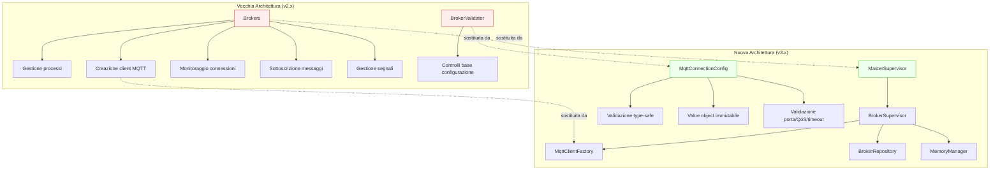

# Deprecazioni e Guida alla Migrazione

## Panoramica

La versione 2.5.0 ha introdotto un'architettura a supervisor ispirata a Horizon che sostituisce la classe monolitica `Brokers`. La versione 3.0 ha ulteriormente sostituito il validatore base `BrokerValidator` con il value object type-safe `MqttConnectionConfig`. Questa guida documenta le classi deprecate, i loro sostituti e il percorso di migrazione.

## Classi Deprecate

### `Brokers` (deprecata dalla 2.5.0, rimozione nella 3.0)

**File:** `src/Brokers.php`

La classe `Brokers` originale era un componente monolitico che gestiva la creazione dei processi broker, la creazione dei client MQTT, il monitoraggio delle connessioni, la sottoscrizione ai messaggi e la gestione dei segnali — tutto in una singola classe.

**Problemi del vecchio approccio:**

- Violazione del Single Responsibility: gestione processi, creazione client MQTT, sottoscrizione e gestione segnali fusi insieme
- Chiamate dirette a `config()` per la costruzione del client — nessuna validazione, nessuna type safety
- Loop di monitoraggio `while (true)` hardcoded senza gestione della memoria o circuit breaker
- Nessuna strategia di riconnessione — se la connessione cadeva, il processo moriva
- Chiamate `exit()` nel corpo della classe che la rendevano non testabile

### `BrokerValidator` (deprecata dalla 3.0, rimozione nella 4.0)

**File:** `src/Support/BrokerValidator.php`

Un validatore statico base che controllava la presenza di `host`, `port` e credenziali nella configurazione del broker. Dipendeva dalla classe `InvalidBrokerException`, ora rimossa.

**Problemi del vecchio approccio:**

- Nessuna validazione del range delle porte (accettava `0` o `99999`)
- Nessuna validazione dei valori QoS
- Nessuna validazione di timeout/intervalli
- `throw_unless` con factory di eccezioni statiche — messaggi di errore senza contesto strutturato
- La classe `InvalidBrokerException` da cui dipendeva è stata rimossa dal codebase

## Architettura Sostitutiva



## Migrazione: `Brokers` verso l'Architettura Supervisor

### Creazione e gestione dei processi

**Prima (v2.x):**
```php
$broker = new Brokers();
$broker->make('default');  // Crea BrokerProcess + avvia monitoraggio
$broker->monitor();        // Blocca per sempre
```

**Dopo (v3.x):**
```php
// La creazione dei processi è gestita da MasterSupervisor
// che crea istanze di BrokerSupervisor per ogni connessione configurata.
// Non si creano più processi broker manualmente.

// Avvio tramite Artisan:
// php artisan mqtt-broadcast

// Internamente:
$master = new MasterSupervisor($name, $environment);
$master->monitor();  // Crea BrokerSupervisors con gestione memoria,
                     // riconnessione, circuit breaker, shutdown graceful
```

### Creazione del client MQTT

**Prima (v2.x):**
```php
$broker = new Brokers();
$client = $broker->client('broker-name', randomId: true);
// Il client è già connesso — nessun controllo su quando avviene la connessione
// Nessuna validazione dei valori di configurazione
```

**Dopo (v3.x):**
```php
// Tramite factory (singleton risolvibile via IoC):
$factory = app(MqttClientFactory::class);
$client = $factory->create('default', clientId: 'custom-id');
// Il client NON è connesso — il chiamante decide quando chiamare connect()
// La configurazione è validata tramite MqttConnectionConfig

// Oppure con l'oggetto di configurazione validato direttamente:
$config = MqttConnectionConfig::fromConnection('default');
$client = $factory->createFromConfig($config);

// Ottenere le impostazioni di connessione per il connect manuale:
$settings = $factory->getConnectionSettings('default');
$client->connect($settings['settings'], $settings['cleanSession']);
```

### Ricerca e terminazione dei processi

**Prima (v2.x):**
```php
$broker = new Brokers();
$process = $broker->find('broker-name');
$all = $broker->all();
Brokers::terminateByPid($pid);  // Cancellazione diretta dal DB
```

**Dopo (v3.x):**
```php
// Tramite BrokerRepository (singleton risolvibile via IoC):
$repo = app(BrokerRepository::class);
$broker = $repo->find($name);
$brokers = $repo->all();

// Terminazione tramite comando Artisan con pulizia corretta:
// php artisan mqtt-broadcast:terminate
// Invia SIGTERM, pulisce DB + cache, gestisce ESRCH
```

### Gestione dei segnali

**Prima (v2.x):**
```php
// Brokers usava ListensForSignals direttamente
// Solo gestione base di SIGTERM, nessun SIGUSR1/SIGUSR2/SIGCONT
$broker->listenForSignals();
$broker->processPendingSignals();
```

**Dopo (v3.x):**
```php
// BrokerSupervisor estende la gestione dei segnali con:
// - SIGTERM  → shutdown graceful (disconnessione, pulizia, uscita)
// - SIGUSR1  → restart (riconnessione al broker)
// - SIGUSR2  → pausa (ferma elaborazione, mantiene connessione)
// - SIGCONT  → ripresa (continua elaborazione)
// Tutto orchestrato da MasterSupervisor
```

## Migrazione: `BrokerValidator` verso `MqttConnectionConfig`

**Prima (v3.x con classe deprecata):**
```php
use enzolarosa\MqttBroadcast\Support\BrokerValidator;

BrokerValidator::validate('default');
// Lancia InvalidBrokerException (classe ora rimossa) se host/port mancanti
// Nessuna ulteriore validazione dei valori di configurazione
```

**Dopo (v3.x con nuova classe):**
```php
use enzolarosa\MqttBroadcast\Support\MqttConnectionConfig;

$config = MqttConnectionConfig::fromConnection('default');
// Lancia MqttBroadcastException con contesto strutturato se:
// - Connessione non configurata
// - Host mancante
// - Porta mancante o fuori range (1-65535)
// - QoS non valido (non 0, 1 o 2)
// - Timeout/intervallo negativo
// - Auth abilitata ma credenziali mancanti

// Accesso ai valori validati come proprietà tipizzate:
$config->host();           // string
$config->port();           // int (range validato)
$config->qos();            // int (0, 1 o 2)
$config->requiresAuth();   // bool
$config->prefix();         // string
$config->useTls();         // bool
```

## Componenti Chiave

| File | Classe/Metodo | Responsabilità |
|------|--------------|----------------|
| `src/Brokers.php` | `Brokers` | **Deprecata.** Gestore monolitico processi broker (v2.x) |
| `src/Brokers.php` | `Brokers::make()` | **Deprecata.** Crea BrokerProcess + emette avviso deprecazione |
| `src/Brokers.php` | `Brokers::client()` | **Deprecata.** Crea client MQTT connesso dalla configurazione |
| `src/Brokers.php` | `Brokers::monitor()` | **Deprecata.** Loop di sottoscrizione bloccante |
| `src/Support/BrokerValidator.php` | `BrokerValidator::validate()` | **Deprecata.** Controllo base presenza configurazione |
| `src/Supervisors/MasterSupervisor.php` | `MasterSupervisor` | **Sostituto.** Orchestratore dei BrokerSupervisors |
| `src/Supervisors/BrokerSupervisor.php` | `BrokerSupervisor` | **Sostituto.** Processo per-broker con riconnessione + circuit breaker |
| `src/Factories/MqttClientFactory.php` | `MqttClientFactory::create()` | **Sostituto.** Crea client MQTT disaccoppiati e testabili |
| `src/Support/MqttConnectionConfig.php` | `MqttConnectionConfig::fromConnection()` | **Sostituto.** Value object di configurazione validata e type-safe |
| `src/Repositories/BrokerRepository.php` | `BrokerRepository` | **Sostituto.** Operazioni CRUD sui processi broker |

## Avvisi di Deprecazione a Runtime

Entrambe le classi deprecate emettono avvisi `trigger_deprecation()` quando utilizzate:

```
// Brokers::make() emette:
// "The enzolarosa\MqttBroadcast\Brokers class is deprecated,
//  use enzolarosa\MqttBroadcast\Supervisors\BrokerSupervisor instead."

// BrokerValidator::validate() emette:
// "BrokerValidator::validate() is deprecated,
//  use MqttConnectionConfig::fromConnection() instead."
```

Questi avvisi appaiono nei log (se `E_USER_DEPRECATED` è abilitato) e possono essere intercettati da strumenti di error tracking come Sentry o Flare.

## Cronologia di Rimozione

| Classe | Deprecata In | Rimossa In | Sostituto |
|--------|-------------|------------|-----------|
| `Brokers` | v2.5.0 | v3.0 | `MasterSupervisor` + `BrokerSupervisor` + `MqttClientFactory` |
| `BrokerValidator` | v3.0 | v4.0 | `MqttConnectionConfig::fromConnection()` |
| `InvalidBrokerException` | v3.0 | v3.0 (già rimossa) | `MqttBroadcastException` factory statiche |
