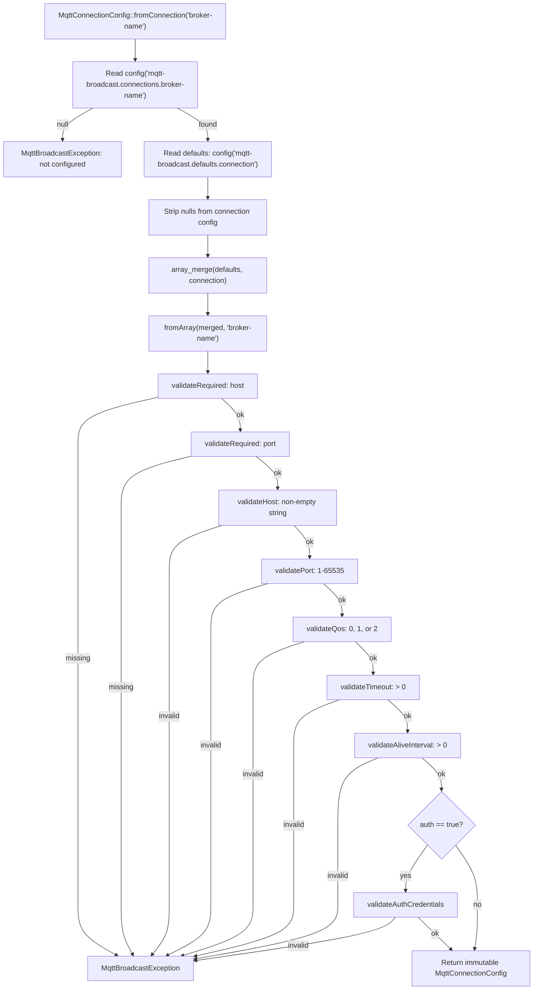
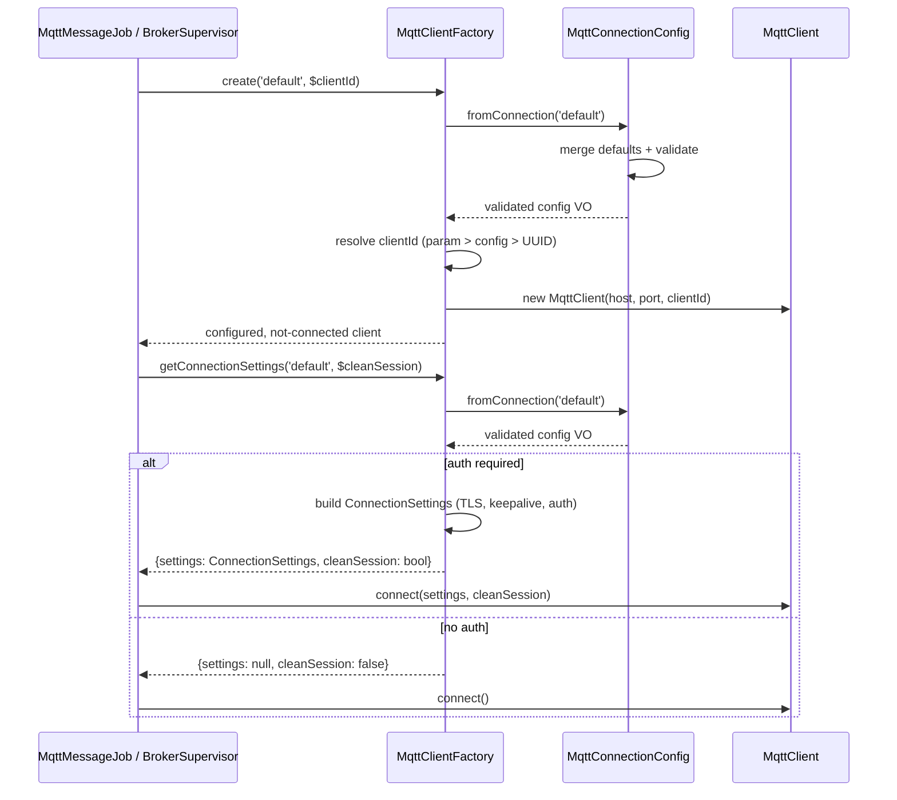
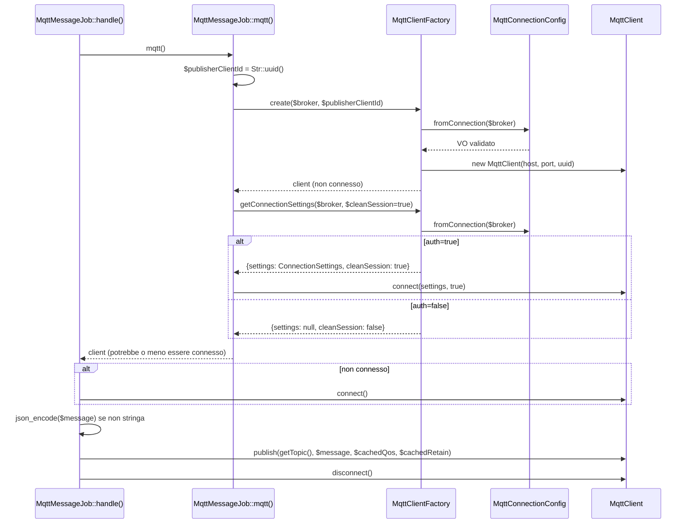
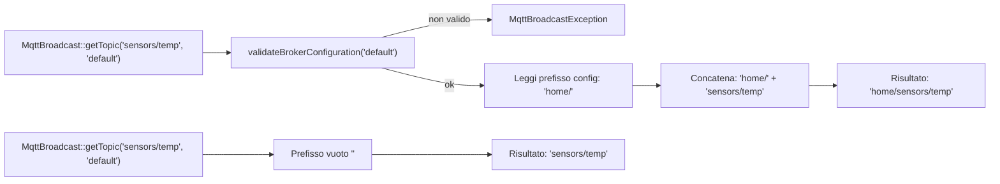
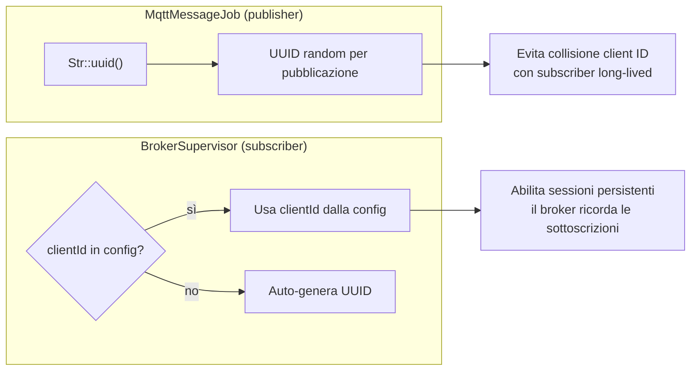

# Gestione delle Connessioni

## Panoramica

La gestione delle connessioni è il livello fondamentale da cui dipendono tutte le operazioni MQTT — publishing, subscription e supervision. Risolve tre problemi:

1. **Validazione della configurazione**: intercettare impostazioni broker non valide al momento della costruzione, anziché a runtime in profondità in un queue worker.
2. **Creazione del client**: fornire un'interfaccia factory coerente che gestisce assegnazione del client ID, TLS, autenticazione e negoziazione della clean session.
3. **Merge dei default**: consentire override per connessione ereditando default globali ragionevoli.

Le due classi principali sono `MqttConnectionConfig` (value object immutabile e validato) e `MqttClientFactory` (istanziazione del client e builder delle impostazioni di connessione).

## Architettura

Il design segue due pattern:

- **Value Object** (`MqttConnectionConfig`): immutabile, validato alla costruzione, fail-fast su configurazione non valida. Creato tramite costruttori nominati (`fromConnection`, `fromArray`). Non modificabile dopo la creazione.
- **Factory** (`MqttClientFactory`): crea istanze di `PhpMqtt\Client\MqttClient` da configurazioni validate. Restituisce client configurati-ma-non-connessi affinché il chiamante controlli il ciclo di vita della connessione.

La factory delega tutta la validazione a `MqttConnectionConfig`, il che significa che qualsiasi `MqttBroadcastException` lanciata durante la creazione del client è sempre un errore di configurazione (fail-fast, nessun retry).

## Come Funziona

### Ciclo di Vita di MqttConnectionConfig

1. **Punto di ingresso**: `MqttConnectionConfig::fromConnection('default')` legge `config('mqtt-broadcast.connections.default')`.
2. **Merge dei default**: fa il merge con `config('mqtt-broadcast.defaults.connection')` — i valori della connessione hanno precedenza sui default, ma i valori `null` vengono rimossi prima del merge così i default si applicano.
3. **Catena di validazione**: valida ogni campo in ordine:
   - `host` — richiesto, stringa non vuota
   - `port` — richiesto, intero 1–65535
   - `qos` — intero 0, 1, o 2
   - `timeout` — intero positivo
   - `alive_interval` — intero positivo
   - Credenziali `auth` — se `auth` è `true`, sia `username` che `password` devono essere stringhe non vuote
4. **Costruzione**: il costruttore privato viene chiamato con tutti i valori validati. L'oggetto è ora immutabile.

Qualsiasi errore di validazione lancia `MqttBroadcastException` con un messaggio che identifica il nome della connessione e il campo non valido.

### Ciclo di Vita di MqttClientFactory

1. **`create($connection, $clientId)`**: risolve la configurazione tramite `MqttConnectionConfig::fromConnection()`, poi delega a `createFromConfig()`.
2. **Risoluzione del client ID** (fallback a tre livelli):
   - Parametro `$clientId` esplicito (usato da `MqttMessageJob` — UUID random per ogni pubblicazione per evitare collisioni)
   - `clientId` dalla configurazione della connessione (usato da `BrokerSupervisor` — ID fisso per sottoscrizioni persistenti)
   - UUID auto-generato (fallback)
3. **Istanziazione del client**: crea `new MqttClient($host, $port, $clientId)` — configurato ma **non connesso**.
4. **`getConnectionSettings($connection, $cleanSession)`**: costruisce `PhpMqtt\Client\ConnectionSettings` con TLS, keep-alive, timeout e credenziali di autenticazione. Restituisce settings `null` quando `auth` è `false` (nessuna autenticazione necessaria).

### TLS e Autenticazione in ConnectionSettings

Quando `getConnectionSettingsFromConfig()` viene chiamato e `auth` è `true`, la factory costruisce un oggetto `PhpMqtt\Client\ConnectionSettings` con queste chiamate esatte:

```php
$connectionSettings = (new ConnectionSettings)
    ->setKeepAliveInterval($config->aliveInterval())   // chiave config alive_interval
    ->setConnectTimeout($config->timeout())             // chiave config timeout
    ->setUseTls($config->useTls())                      // chiave config use_tls
    ->setTlsSelfSignedAllowed($config->selfSignedAllowed()) // chiave config self_signed_allowed
    ->setUsername($config->username())
    ->setPassword($config->password());
```

Quando `auth` è `false`, la factory restituisce `null` per i settings. Questo significa che **le impostazioni TLS vengono applicate solo quando l'autenticazione è abilitata**. Una connessione con `use_tls: true` ma `auth: false` **non** avrà TLS applicato a livello di factory — il chiamante dovrebbe gestirlo separatamente. Questa è una scelta progettuale intenzionale: le connessioni non autenticate verso broker di sviluppo locale non necessitano dell'overhead di configurazione TLS.

Il parametro `cleanSession` segue una risoluzione a due livelli: se il chiamante passa un valore esplicito, questo ha la precedenza; altrimenti viene usato il valore dalla configurazione.

### Prefisso dei Topic tramite MqttBroadcast::getTopic()

Il metodo statico `MqttBroadcast::getTopic()` risolve la stringa topic finale anteponendo il prefisso configurato della connessione:

```php
public static function getTopic(string $topic, string $broker = 'default'): string
{
    self::validateBrokerConfiguration($broker);
    $prefix = config("mqtt-broadcast.connections.{$broker}.prefix", '');
    return $prefix . $topic;
}
```

Questo metodo viene chiamato in due punti critici:

- **`MqttMessageJob::handle()`** — risolve il topic di pubblicazione: `MqttBroadcast::getTopic($this->topic, $this->broker)`
- **`MqttListener::getTopic()`** — risolve il filtro topic per il matching del listener

Il prefisso viene concatenato direttamente (nessun separatore). Se il prefisso è `home/` e il topic è `sensors/temp`, il risultato è `home/sensors/temp`. Se il prefisso è vuoto (default), il topic passa invariato.

Il metodo valida anche la configurazione del broker prima di accedere al prefisso, quindi chiamare `getTopic()` con un broker non configurato lancia `MqttBroadcastException`.

### Ciclo di Vita della Connessione Publisher (MqttMessageJob::mqtt())

Il metodo privato `MqttMessageJob::mqtt()` orchestra la connessione completa del publisher in tre passaggi:

1. **Creazione client**: `$factory->create($broker, $publisherClientId)` con un UUID random tramite `Str::uuid()`. Questo evita collisioni di client ID con il processo subscriber long-lived.
2. **Ottenimento settings di connessione**: `$factory->getConnectionSettings($broker, $this->cleanSession)`. La proprietà `$cleanSession` ha default `true` nel costruttore del job — i publisher richiedono sempre una sessione pulita perché non hanno bisogno che il broker ricordi le sottoscrizioni.
3. **Connessione (condizionale)**: se `$connectionInfo['settings']` non è null (autenticazione abilitata), il client viene connesso con i settings. Se null, il client viene restituito senza chiamare `connect()` — il metodo `handle()` verifica `$mqtt->isConnected()` e chiama `connect()` senza argomenti per i broker non autenticati.

Il costruttore del job memorizza anche due valori di configurazione al momento del dispatch per evitare lookup ripetuti nel worker:

- **`$cachedQos`**: `$this->qos ?? config('mqtt-broadcast.connections.'.$this->broker.'.qos', 0)` — il parametro QoS esplicito ha precedenza sulla configurazione della connessione, che ricade su `0`.
- **`$cachedRetain`**: `config('mqtt-broadcast.connections.'.$this->broker.'.retain', false)` — letto dalla chiave `retain` per-connessione, default `false`. Nota: retain viene letto direttamente dalla configurazione della connessione, non da `MqttConnectionConfig`. Questo è intenzionale — il job lo memorizza al momento del dispatch prima che la factory validi la configurazione completa.

Questi valori memorizzati vengono usati nella chiamata `$mqtt->publish()` e persistiti nella DLQ se il job fallisce.

### Punti di Integrazione

- **`MqttMessageJob::mqtt()`** chiama `$factory->create($broker, $uuid)` + `$factory->getConnectionSettings($broker, true)` — publisher effimero con ID random e sessione pulita forzata.
- **`BrokerSupervisor`** chiama `$factory->create($broker)` — subscriber long-lived con ID definito in configurazione. Usa il valore `clean_session` dalla configurazione (default: `false`) per supportare sessioni persistenti.
- **`MqttBroadcastCommand`** valida l'esistenza della configurazione tramite `MqttConnectionConfig::fromConnection()` durante l'avvio.
- **`MqttBroadcast::getTopic()`** usato sia da `MqttMessageJob::handle()` che da `MqttListener::getTopic()` per risolvere i topic con prefisso.

## Componenti Principali

| File | Classe/Metodo | Responsabilità |
|------|--------------|----------------|
| `src/Support/MqttConnectionConfig.php` | `MqttConnectionConfig` | Value object immutabile per la configurazione di connessione validata |
| `src/Support/MqttConnectionConfig.php` | `::fromConnection($name)` | Costruttore nominato: legge config, merge default, valida |
| `src/Support/MqttConnectionConfig.php` | `::fromArray($config)` | Costruttore nominato: valida array raw (per testing/uso personalizzato) |
| `src/Support/MqttConnectionConfig.php` | `->toArray()` | Serializzazione per compatibilità retroattiva |
| `src/Support/MqttConnectionConfig.php` | `->requiresAuth()` | Restituisce `true` quando la chiave config `auth` è `true` |
| `src/Support/MqttConnectionConfig.php` | `->retain()` | Restituisce il flag retain (per-connessione o default) |
| `src/Support/MqttConnectionConfig.php` | `->cleanSession()` | Restituisce il flag clean session (per-connessione o default) |
| `src/Support/MqttConnectionConfig.php` | `->prefix()` | Restituisce la stringa prefisso topic |
| `src/Support/MqttConnectionConfig.php` | `->useTls()` | Restituisce `true` quando TLS è abilitato |
| `src/Support/MqttConnectionConfig.php` | `->selfSignedAllowed()` | Restituisce `true` quando certificati TLS auto-firmati sono permessi |
| `src/Support/MqttConnectionConfig.php` | `validateHost()` | Controllo stringa non vuota |
| `src/Support/MqttConnectionConfig.php` | `validatePort()` | Controllo range intero 1–65535 |
| `src/Support/MqttConnectionConfig.php` | `validateQos()` | Intero 0, 1, o 2 |
| `src/Support/MqttConnectionConfig.php` | `validateTimeout()` | Controllo intero positivo |
| `src/Support/MqttConnectionConfig.php` | `validateAliveInterval()` | Controllo intero positivo |
| `src/Support/MqttConnectionConfig.php` | `validateAuthCredentials()` | Username + password richiesti quando `auth=true` |
| `src/Factories/MqttClientFactory.php` | `MqttClientFactory` | Crea client MQTT configurati-ma-non-connessi |
| `src/Factories/MqttClientFactory.php` | `create($connection, $clientId)` | Creazione client basata su nome configurazione |
| `src/Factories/MqttClientFactory.php` | `createFromConfig($config, $clientId)` | Creazione type-safe da VO validato |
| `src/Factories/MqttClientFactory.php` | `getConnectionSettings($connection)` | Costruisce `ConnectionSettings` con auth/TLS |
| `src/Factories/MqttClientFactory.php` | `getConnectionSettingsFromConfig($config)` | Settings type-safe da VO validato |
| `src/MqttBroadcast.php` | `MqttBroadcast::getTopic($topic, $broker)` | Risolve la stringa topic con prefisso per un dato broker |

## Configurazione

Tutta la configurazione delle connessioni risiede sotto `mqtt-broadcast.connections.{name}`:

| Chiave | Tipo | Default | Descrizione |
|--------|------|---------|-------------|
| `host` | `string` | `127.0.0.1` | Hostname del broker MQTT (richiesto) |
| `port` | `int` | `1883` | Porta del broker MQTT (richiesta, 1–65535) |
| `auth` | `bool` | `false` | Abilita autenticazione. Quando `true`, `username` e `password` vengono validati come obbligatori |
| `username` | `string\|null` | `null` | Username per l'autenticazione (richiesto quando `auth=true`) |
| `password` | `string\|null` | `null` | Password per l'autenticazione (richiesta quando `auth=true`) |
| `prefix` | `string` | `''` | Prefisso topic aggiunto a tutti i topic tramite `MqttBroadcast::getTopic()` |
| `use_tls` | `bool` | `false` | Abilita crittografia TLS/SSL (applicata solo quando `auth=true`) |
| `clientId` | `string\|null` | `null` | Client ID fisso (null = auto-genera UUID) |
| `qos` | `int\|null` | `null` | Override QoS per-connessione (ricade sul default) |
| `retain` | `bool\|null` | `null` | Override retain per-connessione (ricade sul default). Letto anche direttamente dal costruttore di `MqttMessageJob` |
| `clean_session` | `bool\|null` | `null` | Override clean session per-connessione (ricade sul default). I publisher usano sempre `true`; i subscriber usano il valore dalla config |

Default globali sotto `mqtt-broadcast.defaults.connection`:

| Chiave | Tipo | Default | Descrizione |
|--------|------|---------|-------------|
| `qos` | `int` | `0` | Quality of Service (0=al più una volta, 1=almeno una volta, 2=esattamente una volta) |
| `retain` | `bool` | `false` | Mantieni messaggi sul broker |
| `clean_session` | `bool` | `false` | Richiedi sessione pulita alla connessione |
| `alive_interval` | `int` | `60` | Intervallo keep-alive in secondi |
| `timeout` | `int` | `3` | Timeout di connessione in secondi |
| `self_signed_allowed` | `bool` | `true` | Permetti certificati TLS auto-firmati |
| `max_retries` | `int` | `20` | Tentativi massimi di riconnessione |
| `max_retry_delay` | `int` | `60` | Secondi massimi tra tentativi di riconnessione |
| `max_failure_duration` | `int` | `3600` | Secondi massimi di fallimento continuo prima di arrendersi |
| `terminate_on_max_retries` | `bool` | `false` | Termina processo dopo esaurimento tentativi massimi |

### Logica di Merge dei Default

```php
$defaults = config('mqtt-broadcast.defaults.connection', []);
$config = array_merge($defaults, array_filter($config, fn ($value) => $value !== null));
```

I valori a livello di connessione sovrascrivono i default. I valori `null` nella configurazione della connessione vengono rimossi prima del merge, così il default si applica. Questo significa che impostare esplicitamente una chiave di connessione a `null` farà ricadere sul default — non c'è modo di "disattivare" un default.

## Gestione degli Errori

Tutti gli errori di validazione lanciano `MqttBroadcastException` con messaggi descrittivi:

| Scenario | Pattern del Messaggio | Recupero |
|----------|----------------------|----------|
| Connessione non in config | `Connection "{name}" is not configured` | Aggiungere connessione a `config/mqtt-broadcast.php` |
| `host` mancante | `Connection "{name}" is missing required configuration: host` | Impostare `host` nella config della connessione |
| `port` mancante | `Connection "{name}" is missing required configuration: port` | Impostare `port` nella config della connessione |
| Tipo host non valido | `Connection "{name}" has invalid host: must be non-empty string, got: {type}` | Correggere il valore di host |
| Porta fuori range | `Connection "{name}" has invalid port: must be between 1 and 65535, got: {value}` | Correggere il valore della porta |
| QoS non valido | `Connection "{name}" has invalid qos: must be 0, 1, or 2, got: {value}` | Usare 0, 1, o 2 |
| Timeout non positivo | `Connection "{name}" has invalid timeout: must be greater than 0, got: {value}` | Usare intero positivo |
| alive_interval non positivo | `Connection "{name}" has invalid alive_interval: must be greater than 0, got: {value}` | Usare intero positivo |
| Auth abilitata, username mancante | `Connection "{name}" has auth enabled but missing or invalid username` | Impostare username o disabilitare auth |
| Auth abilitata, password mancante | `Connection "{name}" has auth enabled but missing or invalid password` | Impostare password o disabilitare auth |

In `MqttMessageJob`, gli errori di configurazione vengono catturati e il job viene **fallito immediatamente** (`$this->fail($e)`) senza retry — gli errori di configurazione non si risolvono da soli tra un retry e l'altro. Gli errori di rete vengono lasciati al meccanismo standard di retry di Laravel.

## Diagrammi Mermaid

### Flusso di Risoluzione della Configurazione



### Flusso di Creazione Client e Connessione



### Ciclo di Vita della Connessione Publisher



### Risoluzione del Prefisso Topic



### Strategia del Client ID


