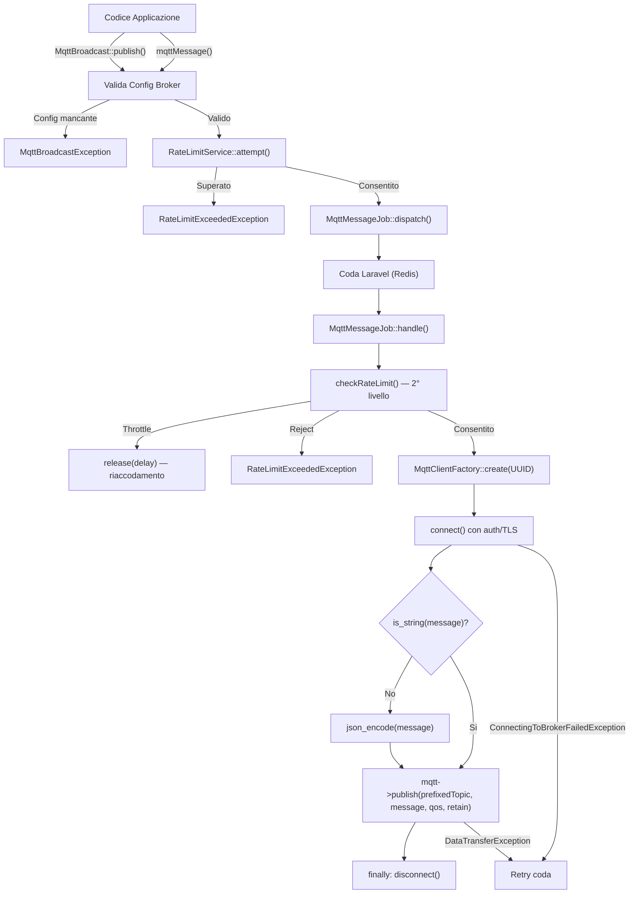
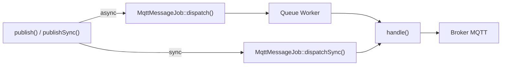
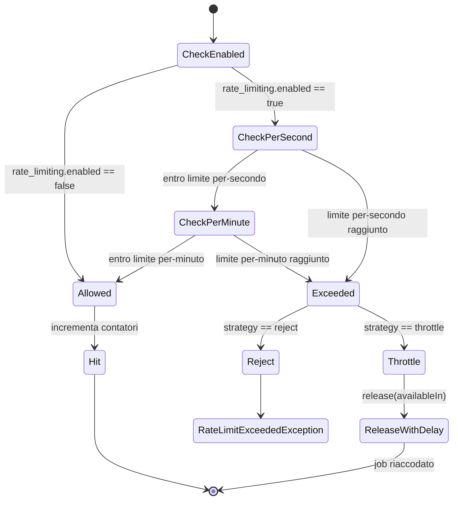
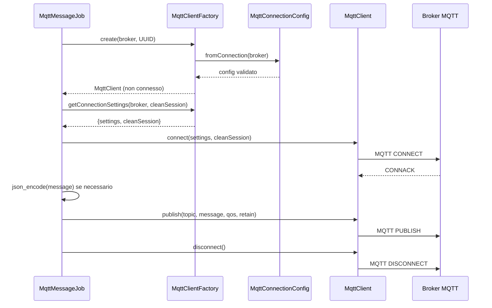

# Pubblicazione Messaggi

## Panoramica

La pubblicazione dei messaggi e' la funzionalita' principale in uscita di MQTT Broadcast. Consente alle applicazioni Laravel di inviare messaggi a qualsiasi broker MQTT tramite un'API facade pulita, con supporto per invio asincrono (in coda) e sincrono. Il sistema applica rate limiting a due livelli, serializzazione JSON automatica per payload non-stringa, prefissi sui topic, e una strategia fail-fast per errori di configurazione rispetto a errori di rete che possono essere ritentati.

La pubblicazione e' esposta attraverso tre interfacce:
- **Facade `MqttBroadcast`** — API primaria (`publish()`, `publishSync()`)
- **Funzioni helper** — `mqttMessage()` e `mqttMessageSync()` per chiamate rapide
- **`MqttMessageJob`** — il job accodabile che esegue la pubblicazione MQTT effettiva

## Architettura

La pipeline di pubblicazione segue il pattern **facade -> validazione -> rate limit -> dispatch job -> client MQTT**:

1. La facade valida la configurazione del broker e applica il primo controllo rate limit.
2. Un `MqttMessageJob` viene inviato (asincrono o sincrono in base al metodo chiamato).
3. Il job esegue un secondo controllo rate limit, crea un client MQTT effimero tramite `MqttClientFactory`, si connette, pubblica e si disconnette.

Decisioni architetturali chiave:
- **Rate limiting a due livelli**: la facade controlla i limiti _prima_ dell'accodamento per evitare di riempire la coda con messaggi che verranno rifiutati. Il job controlla di nuovo _prima_ della pubblicazione per intercettare burst che passano durante l'elaborazione della coda.
- **Connessioni effimere**: ogni pubblicazione crea un client MQTT nuovo con un UUID casuale come client ID, evitando conflitti con i client ID dei subscriber a lunga durata. La connessione viene sempre chiusa nel blocco `finally`.
- **Fail-fast per errori di configurazione**: `MqttBroadcastException` (broker mancante, host/port assenti) causa il fallimento immediato del job senza retry. Errori di rete (`ConnectingToBrokerFailedException`, `DataTransferException`) si propagano al queue worker per la gestione standard dei retry.
- **Serializzazione JSON automatica**: payload non-stringa vengono codificati tramite `json_encode(..., JSON_THROW_ON_ERROR)` all'interno del job, mantenendo l'API della facade flessibile.

## Come Funziona

### Pubblicazione Asincrona (`publish`)

1. Il chiamante invoca `MqttBroadcast::publish($topic, $message, $broker, $qos)` o `mqttMessage(...)`.
2. `validateBrokerConfiguration()` verifica che la chiave del broker esista nel config e abbia `host` + `port`. Lancia `MqttBroadcastException` in caso di errore.
3. `RateLimitService::attempt()` controlla i contatori per-secondo e per-minuto. Se il limite e' superato e la strategia e' `reject`, lancia `RateLimitExceededException`. Se la strategia e' `throttle`, viene gestita nel job.
4. `MqttMessageJob::dispatch($topic, $message, $broker, $qos)` accoda il job.
5. Il costruttore del job mette in cache i valori QoS e retain dal config, e imposta il nome della coda e la connessione da `mqtt-broadcast.queue.*`.
6. Quando il queue worker prende il job, `handle()` viene eseguito:
   - `checkRateLimit()` — secondo livello. Se `allows()` ritorna false:
     - Strategia `throttle`: `$this->release($delay)` riaccode il job con un ritardo.
     - Strategia `reject`: `$rateLimiter->attempt()` lancia `RateLimitExceededException`.
   - Se consentito: `hit()` incrementa i contatori.
   - `mqtt()` crea un client MQTT tramite `MqttClientFactory::create()` con un UUID casuale, poi chiama `getConnectionSettings()` per ottenere le impostazioni auth/TLS, e si connette.
   - Il messaggio viene codificato in JSON se non e' gia' una stringa.
   - `$mqtt->publish()` invia il messaggio con il topic prefissato, QoS e flag retain.
   - Il blocco `finally` disconnette il client.

### Pubblicazione Sincrona (`publishSync`)

Flusso identico, tranne:
- Viene usato `MqttMessageJob::dispatchSync()` — il job viene eseguito immediatamente nel processo corrente.
- Il parametro `$message` accetta `mixed` (stringa, array, oggetto).
- Utile quando il chiamante necessita conferma dell'avvenuta pubblicazione prima di proseguire.

### Prefisso Topic

`MqttBroadcast::getTopic($topic, $broker)` antepone il valore `prefix` dalla configurazione della connessione alla stringa del topic. Viene chiamato dentro `MqttMessageJob::handle()` prima della pubblicazione, assicurando che tutti i messaggi vadano al topic con il namespace corretto.

### Strategia Rate Limiting

Il `RateLimitService` utilizza il `RateLimiter` di Laravel supportato dal cache driver configurato (default: Redis). Supporta due granularita':

- **Per-secondo**: chiave cache `mqtt_rate_limit:{connection}:second` con TTL di 1 secondo
- **Per-minuto**: chiave cache `mqtt_rate_limit:{connection}:minute` con TTL di 60 secondi

Quando `by_connection` e' `true` (default), ogni connessione broker ha contatori indipendenti. Quando `false`, una singola chiave `mqtt_rate_limit:global` e' condivisa.

Due strategie gestiscono il superamento del limite:
- **`reject`**: lancia `RateLimitExceededException` con nome connessione, limite, finestra temporale e secondi di retry-after.
- **`throttle`**: nel job, chiama `$this->release($delay)` per rimettere il job in coda dopo il periodo di cooldown.

## Componenti Chiave

| File | Classe/Metodo | Responsabilita' |
|------|--------------|-----------------|
| `src/MqttBroadcast.php` | `MqttBroadcast::publish()` | Punto di ingresso asincrono: valida config, controlla rate limit, invia job |
| `src/MqttBroadcast.php` | `MqttBroadcast::publishSync()` | Punto di ingresso sincrono: stessa validazione, esegue job sincronamente |
| `src/MqttBroadcast.php` | `MqttBroadcast::getTopic()` | Applica il prefisso della connessione alla stringa del topic |
| `src/MqttBroadcast.php` | `MqttBroadcast::validateBrokerConfiguration()` | Verifica che il config del broker esista con host + port |
| `src/Facades/MqttBroadcast.php` | `MqttBroadcast` (Facade) | Facade Laravel per accesso statico |
| `src/Jobs/MqttMessageJob.php` | `MqttMessageJob` | Job accodabile: rate limit, crea client, codifica, pubblica, disconnette |
| `src/Jobs/MqttMessageJob.php` | `MqttMessageJob::checkRateLimit()` | Secondo livello rate limit con strategie throttle/reject |
| `src/Jobs/MqttMessageJob.php` | `MqttMessageJob::mqtt()` | Crea client MQTT tramite factory, si connette con impostazioni auth |
| `src/Support/RateLimitService.php` | `RateLimitService` | Applicazione rate limit per-secondo/per-minuto con Laravel RateLimiter |
| `src/Support/RateLimitService.php` | `RateLimitService::attempt()` | Controllo + incremento in una sola chiamata; lancia eccezione se superato |
| `src/Support/RateLimitService.php` | `RateLimitService::allows()` | Controllo in sola lettura senza incrementare |
| `src/Support/RateLimitService.php` | `RateLimitService::hit()` | Incrementa contatori per entrambe le finestre temporali |
| `src/Support/MqttConnectionConfig.php` | `MqttConnectionConfig` | Oggetto valore immutabile con impostazioni di connessione validate |
| `src/Factories/MqttClientFactory.php` | `MqttClientFactory::create()` | Crea client MQTT non connesso; il chiamante si connette |
| `src/Factories/MqttClientFactory.php` | `MqttClientFactory::getConnectionSettings()` | Restituisce impostazioni auth/TLS per connessione manuale |
| `src/Exceptions/MqttBroadcastException.php` | `MqttBroadcastException` | Errori di validazione config (broker non trovato, chiave mancante) |
| `src/Exceptions/RateLimitExceededException.php` | `RateLimitExceededException` | Rate limit superato con connessione, limite, finestra e retry-after |
| `src/functions.php` | `mqttMessage()` | Helper: scorciatoia per `MqttBroadcast::publish()` |
| `src/functions.php` | `mqttMessageSync()` | Helper: scorciatoia per `MqttBroadcast::publishSync()` |

## Schema Database

La pubblicazione messaggi non scrive direttamente nel database. Tuttavia, i messaggi pubblicati possono essere **registrati** nella tabella `mqtt_loggers` quando il logging e' abilitato:

### Tabella `mqtt_loggers`

| Colonna | Tipo | Descrizione |
|---------|------|-------------|
| `id` | bigint (PK) | Chiave primaria auto-incremento |
| `external_id` | uuid (unique) | Identificativo univoco del messaggio |
| `broker` | string (indicizzato) | Nome della connessione broker |
| `topic` | string (nullable) | Topic MQTT su cui il messaggio e' stato pubblicato/ricevuto |
| `message` | longText (nullable) | Payload completo del messaggio |
| `created_at` | timestamp | Quando il messaggio e' stato registrato |
| `updated_at` | timestamp | Timestamp Laravel |

**Indici**: indice composito su `(broker, topic, created_at)` per query efficienti dalla dashboard.

Il logging e' controllato da:
- `mqtt-broadcast.logs.enable` — toggle principale
- `mqtt-broadcast.logs.queue` — nome coda per il job di logging
- `mqtt-broadcast.logs.connection` — connessione database (default: `mysql`)
- `mqtt-broadcast.logs.table` — nome tabella (default: `mqtt_loggers`)

## Configurazione

### Configurazione relativa alla pubblicazione

| Chiave Config | Variabile Env | Default | Descrizione |
|--------------|--------------|---------|-------------|
| `connections.{name}.host` | `MQTT_HOST` | `127.0.0.1` | Hostname del broker (obbligatorio) |
| `connections.{name}.port` | `MQTT_PORT` | `1883` | Porta del broker (obbligatorio) |
| `connections.{name}.username` | `MQTT_USERNAME` | `null` | Username per autenticazione |
| `connections.{name}.password` | `MQTT_PASSWORD` | `null` | Password per autenticazione |
| `connections.{name}.prefix` | `MQTT_PREFIX` | `''` | Prefisso topic per tutti i messaggi |
| `connections.{name}.use_tls` | `MQTT_USE_TLS` | `false` | Abilita TLS/SSL |
| `connections.{name}.clientId` | `MQTT_CLIENT_ID` | `null` | Client ID personalizzato (i publisher usano UUID casuale) |
| `defaults.connection.qos` | — | `0` | Livello QoS predefinito (0, 1 o 2) |
| `defaults.connection.retain` | — | `false` | Flag retain predefinito |
| `defaults.connection.clean_session` | — | `false` | Flag clean session predefinito |
| `defaults.connection.alive_interval` | — | `60` | Intervallo keep-alive (secondi) |
| `defaults.connection.timeout` | — | `3` | Timeout connessione (secondi) |
| `defaults.connection.self_signed_allowed` | — | `true` | Consenti certificati TLS auto-firmati |
| `queue.name` | `MQTT_JOB_QUEUE` | `default` | Nome coda per job di pubblicazione |
| `queue.connection` | `MQTT_JOB_CONNECTION` | `redis` | Driver connessione coda |
| `rate_limiting.enabled` | — | `true` | Abilita rate limiting |
| `rate_limiting.strategy` | — | `reject` | `reject` o `throttle` |
| `rate_limiting.by_connection` | — | `true` | Limiti per-connessione o globali |
| `rate_limiting.cache_driver` | — | `redis` | Cache driver per contatori rate limit |
| `defaults.connection.rate_limiting.max_per_minute` | — | `1000` | Limite messaggi al minuto |
| `defaults.connection.rate_limiting.max_per_second` | — | `null` | Limite messaggi al secondo (opzionale) |

Override rate limit per-connessione possono essere impostati nei blocchi delle singole connessioni:

```php
'connections' => [
    'high-throughput' => [
        'host' => env('MQTT_HT_HOST'),
        'port' => env('MQTT_HT_PORT', 1883),
        'rate_limiting' => [
            'max_per_minute' => 5000,
            'max_per_second' => 100,
        ],
    ],
],
```

## Gestione Errori

| Scenario di Errore | Dove Catturato | Gestione |
|-------------------|---------------|----------|
| Broker non configurato (chiave config mancante) | `MqttBroadcast::validateBrokerConfiguration()` | Lancia `MqttBroadcastException` — impedisce il dispatch |
| Host o porta mancanti | `MqttBroadcast::validateBrokerConfiguration()` | Lancia `MqttBroadcastException` — impedisce il dispatch |
| Rate limit superato (strategia reject) | `RateLimitService::attempt()` | Lancia `RateLimitExceededException` con retry-after |
| Rate limit superato (strategia throttle, nel job) | `MqttMessageJob::checkRateLimit()` | Chiama `$this->release($delay)` — job riaccodato con ritardo |
| Config connessione non valida (validazione host/port/QoS) | `MqttMessageJob::handle()` tramite `MqttClientFactory` | `$this->fail($e)` — fallimento permanente, nessun retry |
| Broker MQTT non raggiungibile | `MqttMessageJob::handle()` | `ConnectingToBrokerFailedException` si propaga — la coda riprova |
| Connessione persa durante la pubblicazione | `MqttMessageJob::handle()` | `DataTransferException` si propaga — la coda riprova |
| Errore codifica JSON | `MqttMessageJob::handle()` | `JsonException` (JSON_THROW_ON_ERROR) si propaga — la coda riprova |
| Qualsiasi errore durante la pubblicazione | `MqttMessageJob::handle()` blocco finally | Client MQTT disconnesso indipendentemente dal risultato |

## Diagrammi Mermaid

### Flusso Pubblicazione Asincrona



### Decisione Sync vs Async



### Macchina a Stati Rate Limiting



### Ciclo di Vita Client MQTT (per pubblicazione)


