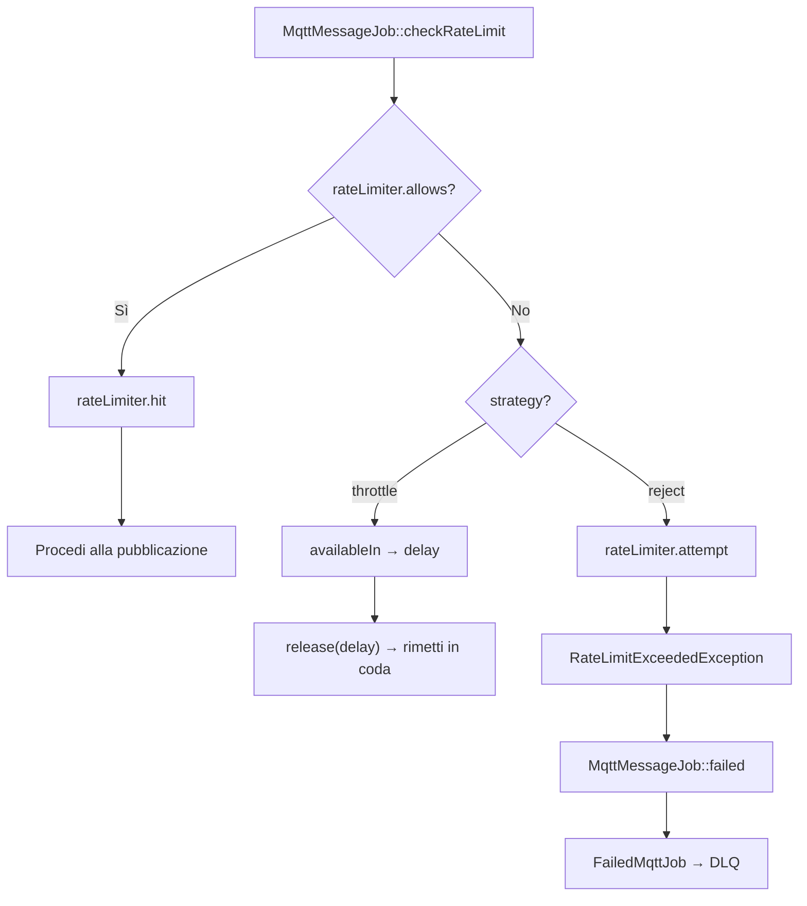
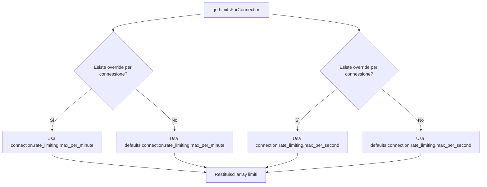
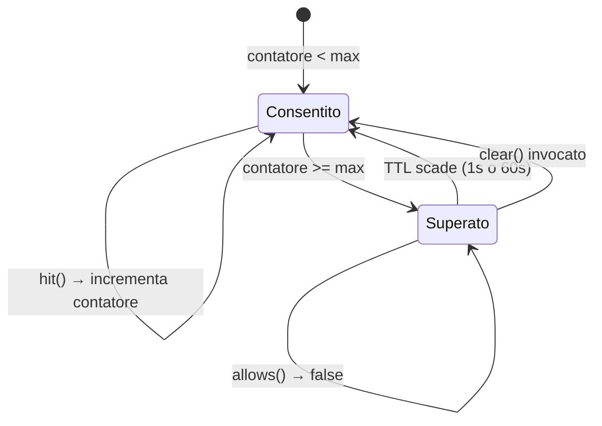
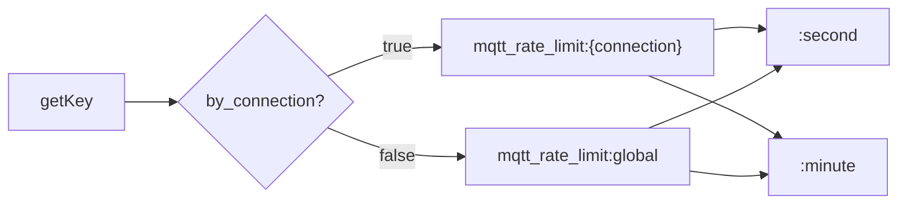

# Rate Limiting

## Panoramica

Il `RateLimitService` protegge i broker MQTT dal sovraccarico causato da traffico eccessivo di pubblicazione. Fornisce un sistema di rate limiting a due livelli (per-second e per-minute) con due strategie di enforcement (reject e throttle), isolamento per connessione o limiti globali condivisi, e override dei limiti per singola connessione.

Il rate limiting viene applicato in due punti del ciclo di vita della pubblicazione:
1. **Livello Facade** — `MqttBroadcast::publish()` invoca il rate limiter prima di dispatchare `MqttMessageJob`
2. **Livello Job** — `MqttMessageJob::checkRateLimit()` applica un secondo controllo prima della pubblicazione MQTT effettiva, come seconda linea di difesa contro le race condition tra dispatch ed esecuzione

## Architettura

Il servizio wrappa il `Illuminate\Cache\RateLimiter` di Laravel con semantica specifica per MQTT. Utilizza contatori basati su cache con scadenza TTL automatica — finestre da 1 secondo per i limiti per-second, finestre da 60 secondi per i limiti per-minute. Non servono tabelle nel database.

Decisioni architetturali chiave:
- **Due finestre temporali** — per-second per la protezione dai burst, per-minute per il controllo del throughput sostenuto. Entrambe sono controllate indipendentemente; il limite più restrittivo prevale.
- **Contatori basati su cache** — usa il `RateLimiter` di Laravel (che wrappa il cache driver configurato) per incrementi/decrementi atomici. Nessuno storage custom.
- **Isolamento per connessione di default** — ogni connessione broker ha il proprio namespace di contatori. Si può passare a modalità globale per pool di rate condivisi.
- **Override per connessione** — le singole connessioni possono definire i propri limiti, sovrascrivendo i default globali.
- **Strategy pattern** — `reject` lancia un'eccezione immediatamente (fail-fast), `throttle` rilascia il job nella coda con un delay (back-pressure).

## Come Funziona

### Flusso di Controllo del Rate

Quando un messaggio viene pubblicato via coda, `MqttMessageJob::checkRateLimit()` esegue:

1. Risolve `RateLimitService` dal container
2. Chiama `allows($connection)` — controlla sia i contatori per-second che per-minute
3. Se consentito: chiama `hit($connection)` per incrementare i contatori, poi procede alla pubblicazione
4. Se bloccato e la strategia è `throttle`: chiama `availableIn($connection)` per ottenere il delay, poi `$this->release($delay)` per rimettere il job in coda
5. Se bloccato e la strategia è `reject`: chiama `attempt($connection)` che lancia `RateLimitExceededException`, che attiva `MqttMessageJob::failed()` → DLQ

### Meccanica dei Contatori

Ogni connessione mantiene fino a due chiavi cache:

- `mqtt_rate_limit:{connection}:second` — TTL: 1 secondo, max: `max_per_second`
- `mqtt_rate_limit:{connection}:minute` — TTL: 60 secondi, max: `max_per_minute`

Quando `by_connection` è `false`, la chiave diventa `mqtt_rate_limit:global:{window}` — tutte le connessioni condividono gli stessi contatori.

Il metodo `allows()` controlla `tooManyAttempts()` per ogni finestra configurata (i limiti null vengono saltati). Il metodo `hit()` incrementa entrambi i contatori con i rispettivi TTL (1s e 60s). Il metodo `remaining()` restituisce `min(remaining_second, remaining_minute)` — il valore più restrittivo.

### Risoluzione dei Limiti

I limiti vengono risolti con un fallback a due livelli:

1. **Override per connessione**: `mqtt-broadcast.connections.{name}.rate_limiting.max_per_minute` / `max_per_second`
2. **Default globale**: `mqtt-broadcast.defaults.connection.rate_limiting.max_per_minute` / `max_per_second`

Se sia per-second che per-minute sono `null`, la connessione non ha effettivamente alcun limite (anche se il rate limiting è abilitato globalmente).

### Gestione Errori: Reject vs Throttle

Quando `handleRateLimitExceeded()` viene invocato, prima determina quale limite è stato superato (per-second ha priorità se entrambi sono superati), poi decide in base alla strategia:

**Strategia Reject** (`strategy: 'reject'`):
- Lancia `RateLimitExceededException` con nome connessione, valore limite, nome finestra e secondi di retry-after
- In `MqttMessageJob`, questo attiva `failed()` → persistenza nella DLQ
- Il messaggio non viene ritentato automaticamente

**Strategia Throttle** (`strategy: 'throttle'`):
- `MqttMessageJob::checkRateLimit()` chiama `$this->release($delay)` per rilasciare il job nella coda
- Il job verrà ritentato dopo il delay (secondi fino al reset della finestra di rate)
- Il messaggio non viene perso — viene differito

## Componenti Chiave

| File | Classe/Metodo | Responsabilit&agrave; |
|------|-------------|----------------|
| `src/Support/RateLimitService.php` | `RateLimitService` | Servizio core: controllo, enforcement e tracking dei rate limit |
| `src/Support/RateLimitService.php` | `allows()` | Controllo non distruttivo: questa connessione pu&ograve; pubblicare? |
| `src/Support/RateLimitService.php` | `attempt()` | Check + hit + throw se bloccato (strategia reject) |
| `src/Support/RateLimitService.php` | `hit()` | Incrementa i contatori di entrambe le finestre dopo un check positivo |
| `src/Support/RateLimitService.php` | `remaining()` | Tentativi rimanenti (finestra pi&ugrave; restrittiva) |
| `src/Support/RateLimitService.php` | `availableIn()` | Secondi fino al reset del rate limit |
| `src/Support/RateLimitService.php` | `clear()` | Reset dei contatori di entrambe le finestre per una connessione |
| `src/Support/RateLimitService.php` | `handleRateLimitExceeded()` | Branch sulla strategia: throw o return delay |
| `src/Support/RateLimitService.php` | `getLimitsForConnection()` | Risolve override per connessione → fallback globale |
| `src/Support/RateLimitService.php` | `getKey()` | Costruisce la chiave cache: per connessione o globale |
| `src/Support/RateLimitService.php` | `isEnabled()` | Controlla la config `rate_limiting.enabled` |
| `src/Exceptions/RateLimitExceededException.php` | `RateLimitExceededException` | Eccezione strutturata con connection, limit, window, retryAfter |
| `src/Jobs/MqttMessageJob.php` | `checkRateLimit()` | Enforcement a livello job: allows+hit oppure throttle/reject |

## Configurazione

### Impostazioni Globali di Rate Limiting

```php
// config/mqtt-broadcast.php (non pubblicato di default — impostato via config())
'rate_limiting' => [
    'enabled'       => env('MQTT_RATE_LIMIT_ENABLED', true),
    'strategy'      => env('MQTT_RATE_LIMIT_STRATEGY', 'reject'),   // 'reject' | 'throttle'
    'by_connection'  => env('MQTT_RATE_LIMIT_BY_CONNECTION', true),  // true = per-connection, false = globale
    'cache_driver'   => env('MQTT_RATE_LIMIT_CACHE_DRIVER'),         // null = cache driver di default
],
```

### Limiti di Default per Connessione

```php
'defaults' => [
    'connection' => [
        'rate_limiting' => [
            'max_per_minute' => 1000,  // null per disabilitare la finestra minuto
            'max_per_second' => null,  // null per disabilitare la finestra secondo
        ],
    ],
],
```

### Override per Connessione

```php
'connections' => [
    'high-priority' => [
        'host' => '...',
        'rate_limiting' => [
            'max_per_minute' => 5000,  // Limite più alto per traffico prioritario
        ],
    ],
    'low-priority' => [
        'host' => '...',
        'rate_limiting' => [
            'max_per_minute' => 100,   // Connessione con limiti ridotti
            'max_per_second' => 5,
        ],
    ],
],
```

| Chiave Config | Tipo | Default | Descrizione |
|-----------|------|---------|-------------|
| `rate_limiting.enabled` | `bool` | `true` | Switch principale per il rate limiting |
| `rate_limiting.strategy` | `string` | `'reject'` | `reject` = lancia eccezione, `throttle` = rimette in coda con delay |
| `rate_limiting.by_connection` | `bool` | `true` | `true` = contatori isolati per connessione, `false` = contatore globale condiviso |
| `rate_limiting.cache_driver` | `?string` | `null` | Cache driver per i contatori (null = default dell'app) |
| `defaults.connection.rate_limiting.max_per_minute` | `?int` | `1000` | Messaggi per finestra di 60s (null = nessun limite al minuto) |
| `defaults.connection.rate_limiting.max_per_second` | `?int` | `null` | Messaggi per finestra di 1s (null = nessun limite al secondo) |

## Gestione Errori

| Scenario | Comportamento |
|----------|----------|
| Rate limiting disabilitato (`enabled: false`) | `allows()` restituisce sempre `true`, `remaining()` restituisce `PHP_INT_MAX`, `hit()` &egrave; un no-op |
| Sia `max_per_minute` che `max_per_second` sono `null` | Effettivamente illimitato — nessun contatore viene controllato o incrementato |
| Strategia `reject` + limite superato | `RateLimitExceededException` lanciata → `MqttMessageJob::failed()` → DLQ |
| Strategia `throttle` + limite superato | Job rilasciato nella coda con delay = secondi fino al reset della finestra |
| Sia per-second che per-minute superati | `handleRateLimitExceeded` riporta per-second come finestra violata (controllata per prima) |
| Cache driver non disponibile | Il `RateLimiter` di Laravel lancer&agrave; un'eccezione — il job fallisce con errore infrastrutturale |

## Diagrammi Mermaid

### Flusso di Controllo Rate in MqttMessageJob



### Risoluzione dei Limiti



### Macchina a Stati del Contatore a Due Finestre



### Strategia Chiavi Cache


