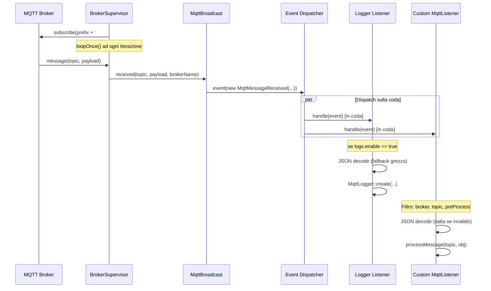
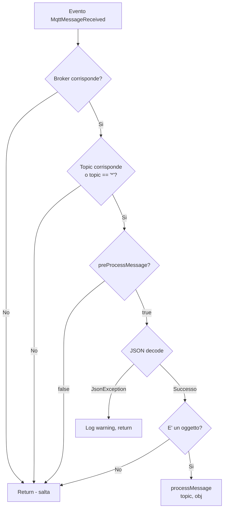
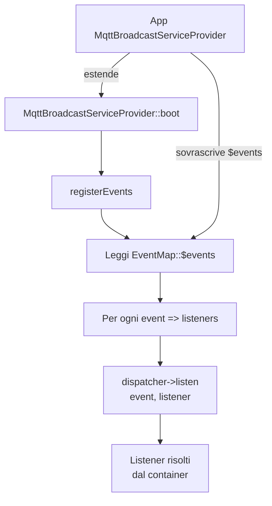

# Sottoscrizione Messaggi ed Eventi

## Panoramica

La sottoscrizione messaggi e' la controparte in ingresso della [pubblicazione messaggi](../publishing/message-publishing.md). Permette all'applicazione di ricevere messaggi MQTT da uno o piu' broker e instradarli attraverso il sistema eventi di Laravel verso listener definiti dall'applicazione.

La pipeline di sottoscrizione viene eseguita all'interno del processo supervisor di lunga durata (`mqtt:broadcast`). Ogni `BrokerSupervisor` mantiene una connessione MQTT persistente, si sottoscrive a un pattern di topic wildcard e invia un evento `MqttMessageReceived` per ogni messaggio in arrivo. I listener registrati tramite il trait `EventMap` reagiscono a questi eventi — sia il `Logger` integrato che listener personalizzati che estendono `MqttListener`.

Decisioni architetturali chiave:

- **Disaccoppiamento basato su eventi**: il processo supervisor non sa cosa succede dopo il dispatch. Tutta la logica di business risiede nei listener, risolti dal container e processati tramite la coda.
- **JSON-first con via di fuga**: la classe base astratta `MqttListener` assume payload JSON e fornisce filtraggio per topic/broker. Per messaggi non-JSON o filtraggio personalizzato, i listener possono sottoscriversi direttamente a `MqttMessageReceived`.
- **Elaborazione tramite coda**: tutti i listener implementano `ShouldQueue`, quindi la gestione dei messaggi non blocca mai il loop MQTT del supervisor.
- **Sottoscrizione wildcard**: ogni broker si sottoscrive a `prefix#` (o `#` senza prefisso), catturando tutti i topic sotto il prefisso configurato.

## Architettura

```
BrokerSupervisor          MqttBroadcast facade          Laravel Event Dispatcher
     │                           │                              │
     │  client->loopOnce()       │                              │
     │  ──> messaggio arriva     │                              │
     │                           │                              │
     │  handleMessage()  ──>  received()  ──>  event(MqttMessageReceived)
     │                           │                              │
     │                           │                     ┌────────┴────────┐
     │                           │                     │                 │
     │                           │               Logger           MqttListener
     │                           │            (integrato)         (custom, astratto)
     │                           │                │                     │
     │                           │           INSERT in DB         processMessage()
```

Il flusso e' intenzionalmente unidirezionale: il supervisor invia e prosegue. I listener processano in modo asincrono sulla coda, assicurando che il loop MQTT non venga mai bloccato da handler lenti.

## Come Funziona

### 1. Setup della Sottoscrizione

Quando `BrokerSupervisor::connect()` stabilisce una connessione, si sottoscrive a un topic wildcard:

```php
$topic = $prefix === '' ? '#' : $prefix . '#';
$this->client->subscribe($topic, function (string $topic, string $message) {
    $this->handleMessage($topic, $message);
}, $qos);
```

- Il `prefix` proviene da `config('mqtt-broadcast.connections.{broker}.prefix')`.
- `#` e' il wildcard multi-livello MQTT — corrisponde a tutti i topic sotto il prefisso.
- `$qos` e' il livello QoS della sottoscrizione dalla configurazione della connessione.

### 2. Ricezione del Messaggio

Ad ogni iterazione del loop del supervisor, `BrokerSupervisor::monitor()` chiama `$this->client->loopOnce()`. Quando il client MQTT ha un messaggio in sospeso, invoca la callback di sottoscrizione, che chiama `handleMessage()`:

```php
protected function handleMessage(string $topic, string $message): void
{
    // Log del messaggio troncato per debug
    $this->output('info', sprintf('Message received on topic [%s]: %s', $topic, $displayMessage));

    try {
        MqttBroadcast::received($topic, $message, $this->brokerName);
    } catch (Throwable $e) {
        $this->output('error', $e->getMessage());
    }
}
```

Le eccezioni dal dispatch degli eventi vengono catturate e loggate — non causano mai il crash del supervisor ne' interrompono la connessione MQTT.

### 3. Dispatch dell'Evento

`MqttBroadcast::received()` racchiude una singola riga:

```php
public static function received(string $topic, string $message, string $broker = 'default'): void
{
    event(new MqttMessageReceived($topic, $message, $broker));
}
```

Questo attiva il dispatcher eventi di Laravel, che instrada l'evento a tutti i listener registrati.

### 4. Registrazione degli Eventi

Il trait `EventMap`, utilizzato da `MqttBroadcastServiceProvider`, definisce la mappatura listener predefinita:

```php
protected array $events = [
    MqttMessageReceived::class => [
        Logger::class,
    ],
];
```

Durante `boot()`, il service provider itera `$events` e chiama `$dispatcher->listen($event, $listener)` per ogni coppia. Il `MqttBroadcastServiceProvider` pubblicato dell'applicazione puo' sovrascrivere `$events` per aggiungere listener personalizzati.

### 5. Logger Listener (Integrato)

Il listener `Logger` salva ogni messaggio ricevuto nel database. A differenza dei listener personalizzati, `Logger` **non** estende `MqttListener` ne' implementa il contratto `Listener` — implementa `ShouldQueue` direttamente con il proprio metodo `handle()`. Questo significa che bypassa tutto il filtraggio broker/topic/JSON che `MqttListener` impone.

```php
class Logger implements ShouldQueue
{
    use InteractsWithQueue, Queueable, SerializesModels;

    public function viaQueue(): string
    {
        return config('mqtt-broadcast.logs.queue');
    }

    public function handle(MqttMessageReceived $event): void
    {
        if (! config('mqtt-broadcast.logs.enable')) {
            return;
        }

        // Decodifica JSON con fallback a stringa grezza
        try {
            $message = json_decode($rawMessage, false, 512, JSON_THROW_ON_ERROR);
        } catch (\JsonException $e) {
            $message = $rawMessage;
        }

        MqttLogger::query()->create([
            'topic' => $topic,
            'message' => $message,
            'broker' => $broker,
        ]);
    }
}
```

- Disabilitato di default — abilitare con `MQTT_LOG_ENABLE=true`.
- Eseguito sulla propria coda tramite `viaQueue()`: `config('mqtt-broadcast.logs.queue')`.
- Accetta **tutti** i messaggi (JSON e non-JSON, oggetti e array) — nessun filtraggio.
- Scrive su una connessione database configurabile: `MqttLogger::getConnectionName()` legge `config('mqtt-broadcast.logs.connection')`.
- Il nome della tabella e' configurabile: `MqttLogger::getTable()` legge `config('mqtt-broadcast.logs.table', 'mqtt_loggers')`.
- Il modello `MqttLogger` usa il trait `HasExternalId`, che genera automaticamente un UUID `external_id` alla creazione e lo usa come chiave di route per l'accesso API.
- La colonna `message` ha un cast `json` — Eloquent gestisce la serializzazione automaticamente, quindi sia oggetti JSON decodificati che stringhe grezze vengono salvati correttamente.

### 6. Listener Personalizzati (MqttListener)

I listener personalizzati estendono `MqttListener` e implementano `processMessage()`:

```php
class TemperatureSensorListener extends MqttListener
{
    protected string $handleBroker = 'local';
    protected string $topic = 'sensors/temperature';

    public function processMessage(string $topic, object $obj): void
    {
        // $obj e' il payload JSON decodificato
        SensorReading::create(['value' => $obj->value]);
    }
}
```

`MqttListener` usa tre trait per le code — `InteractsWithQueue`, `Queueable`, `SerializesModels` — dando alle sottoclassi accesso a funzionalita' come `$this->release($delay)` per il re-accodamento e `$this->delete()` per la rimozione manuale.

**Valori predefiniti delle proprieta':**

| Proprieta' | Default | Descrizione |
|------------|---------|-------------|
| `$handleBroker` | `'local'` | Nome connessione broker su cui filtrare |
| `$topic` | `'*'` | Topic da matchare (wildcard `*` matcha tutto) |

Il routing della coda e' gestito da `viaQueue()`, che ritorna `config('mqtt-broadcast.queue.listener')`.

**La pipeline di filtraggio in `handle()`:**

Il metodo `handle()` applica tre filtri prima di chiamare `processMessage()`:

1. **Filtro broker**: `$event->getBroker() !== $this->handleBroker` — salta i messaggi da altri broker. E' un confronto di stringhe esatto.
2. **Filtro topic**: `$event->getTopic() !== $this->getTopic()` — salta i topic non corrispondenti. Il controllo e' invertito quando `$this->getTopic()` ritorna `'*'`. **Importante**: questo e' un matching di stringhe esatto, non matching wildcard MQTT. I wildcard MQTT `+` e `#` non sono supportati nel filtraggio topic a livello listener — solo il valore letterale `*` (che significa "matcha tutto") e' gestito come caso speciale.
3. **Hook pre-processo**: `preProcessMessage()` — ritorna `false` per saltare. Default e' `true`.

Dopo il filtraggio, decodifica il JSON del messaggio:

- JSON non valido: logga un warning con contesto (broker, topic, primi 200 caratteri del messaggio, errore) e ritorna.
- JSON valido ma non un oggetto (es. array, scalare): ritorna silenziosamente.
- Oggetto JSON valido: passato a `processMessage()`.

Il matching dei topic usa il topic con prefisso tramite `MqttBroadcast::getTopic()`, quindi `$topic = 'sensors/temperature'` con prefisso `home/` corrisponde a `home/sensors/temperature`.

### Firma di preProcessMessage()

```php
public function preProcessMessage(?string $topic = null, ?object $obj = null): bool
{
    return true;
}
```

La firma del metodo accetta parametri opzionali `$topic` e `$obj`, ma **il metodo base `handle()` lo chiama senza argomenti**: `$this->preProcessMessage()`. Questa chiamata avviene _prima_ della decodifica JSON, quindi l'oggetto decodificato non e' ancora disponibile. I parametri esistono per flessibilita' delle sottoclassi — un listener personalizzato puo' sovrascrivere `preProcessMessage()` per accettare questi parametri da altri punti di chiamata, oppure semplicemente ignorarli:

```php
class FilteredListener extends MqttListener
{
    protected string $handleBroker = 'local';
    protected string $topic = 'sensors/temperature';

    // Chiamato senza argomenti da handle() — usare per logica di gating pre-decodifica
    public function preProcessMessage(?string $topic = null, ?object $obj = null): bool
    {
        // Esempio: saltare l'elaborazione durante finestre di manutenzione
        return ! app()->isDownForMaintenance();
    }

    public function processMessage(string $topic, object $obj): void
    {
        SensorReading::create(['value' => $obj->value]);
    }
}
```

### Distinzione Contratto Logger vs MqttListener

Il contratto `Listener` (`src/Contracts/Listener.php`) richiede sia `handle()` che `processMessage()`:

```php
interface Listener
{
    public function handle(MqttMessageReceived $event): void;
    public function processMessage(string $topic, object $obj): void;
}
```

`MqttListener` implementa questo contratto — impone la pipeline di filtraggio solo-oggetto-JSON. `Logger` **non** implementa `Listener` — si sottoscrive allo stesso evento ma elabora tutti i formati di messaggio senza filtraggio. Questo e' intenzionale: il logger deve catturare tutto, mentre i listener personalizzati devono elaborare solo oggetti JSON strutturati.

## Componenti Principali

| File | Classe/Metodo | Responsabilita' |
|------|---------------|-----------------|
| `src/Events/MqttMessageReceived.php` | `MqttMessageReceived` | VO evento immutabile con topic, message, broker e PID opzionale |
| `src/Events/MqttMessageReceived.php` | `getPid()` | Ritorna il process ID opzionale (non popolato da `received()` — riservato per uso interno/testing) |
| `src/Contracts/Listener.php` | `Listener` | Interfaccia che richiede `handle()` e `processMessage()` — implementata da `MqttListener`, NON da `Logger` |
| `src/Listeners/MqttListener.php` | `MqttListener` | Base astratta per listener JSON con filtraggio broker/topic e supporto code. Usa i trait `InteractsWithQueue`, `Queueable`, `SerializesModels` |
| `src/Listeners/MqttListener.php` | `handle()` | Applica filtri broker, topic e pre-process; decodifica JSON; delega a `processMessage()` |
| `src/Listeners/MqttListener.php` | `preProcessMessage(?string, ?object): bool` | Hook per validazione personalizzata prima della decodifica JSON. Chiamato senza argomenti da `handle()`. Default: `true` |
| `src/Listeners/MqttListener.php` | `viaQueue()` | Routing coda — ritorna `config('mqtt-broadcast.queue.listener')` |
| `src/Listeners/MqttListener.php` | `getTopic()` | Ritorna il topic con prefisso tramite `MqttBroadcast::getTopic($this->topic, $this->handleBroker)` |
| `src/Listeners/Logger.php` | `Logger` | Listener integrato (implementa `ShouldQueue` direttamente, nessun contratto `Listener`). Salva tutti i messaggi in `mqtt_loggers` |
| `src/Listeners/Logger.php` | `viaQueue()` | Routing coda — ritorna `config('mqtt-broadcast.logs.queue')` |
| `src/Models/MqttLogger.php` | `MqttLogger` | Modello con `HasExternalId` (UUID), connessione/tabella configurabili, cast `json` su `message` |
| `src/EventMap.php` | `EventMap` | Trait che definisce la mappatura `MqttMessageReceived -> [listeners]` |
| `src/MqttBroadcast.php` | `received()` | Metodo statico che lancia `MqttMessageReceived` (non passa il PID) |
| `src/MqttBroadcastServiceProvider.php` | `registerEvents()` | Itera `EventMap::$events` e registra i listener con il dispatcher |
| `src/Supervisors/BrokerSupervisor.php` | `connect()` | Si sottoscrive al topic wildcard MQTT con callback per i messaggi |
| `src/Supervisors/BrokerSupervisor.php` | `handleMessage()` | Tronca il messaggio a 100 caratteri per il logging, chiama `MqttBroadcast::received()` con isolamento errori |
| `stubs/MqttBroadcastServiceProvider.stub` | Provider pubblicato | Stub per il provider a livello app dove gli utenti aggiungono listener personalizzati |

## Configurazione

| Chiave | Variabile Env | Default | Descrizione |
|--------|---------------|---------|-------------|
| `connections.{broker}.prefix` | `MQTT_PREFIX` | `''` | Prefisso topic per wildcard di sottoscrizione e matching dei listener |
| `connections.{broker}.qos` | — | `0` | Livello QoS per la sottoscrizione |
| `logs.enable` | `MQTT_LOG_ENABLE` | `false` | Abilita il listener Logger integrato |
| `logs.queue` | `MQTT_LOG_JOB_QUEUE` | `'default'` | Nome coda per i job del Logger |
| `logs.connection` | `MQTT_LOG_CONNECTION` | `'mysql'` | Connessione database per la tabella `mqtt_loggers` |
| `logs.table` | `MQTT_LOG_TABLE` | `'mqtt_loggers'` | Nome tabella per i log dei messaggi |
| `queue.listener` | `MQTT_LISTENER_QUEUE` | `'default'` | Nome coda per i job dei `MqttListener` personalizzati |
| `queue.connection` | `MQTT_JOB_CONNECTION` | `'redis'` | Connessione coda per tutti i job dei listener |

## Schema Database

Il listener `Logger` scrive nella tabella `mqtt_loggers` tramite il modello `MqttLogger`. Il modello usa due override configurabili:

- `getConnectionName()` ritorna `config('mqtt-broadcast.logs.connection')` — fallback alla connessione predefinita di Laravel se non impostato.
- `getTable()` ritorna `config('mqtt-broadcast.logs.table', 'mqtt_loggers')`.

| Colonna | Tipo | Descrizione |
|---------|------|-------------|
| `id` | `bigint` | Chiave primaria |
| `external_id` | `uuid` | UUID auto-generato tramite il trait `HasExternalId` — usato come chiave di route per gli endpoint API |
| `broker` | `string` | Nome connessione broker |
| `topic` | `string` | Topic MQTT completo (con prefisso) |
| `message` | `json` | Payload — oggetto JSON o stringa grezza (il cast `json` di Eloquent gestisce la serializzazione) |
| `created_at` | `timestamp` | Quando il messaggio e' stato ricevuto |
| `updated_at` | `timestamp` | Timestamp standard Laravel |

Il trait `HasExternalId` fornisce:
- Generazione automatica UUID sull'evento `creating` del modello tramite `Str::uuid()`
- `getRouteKeyName()` ritorna `'external_id'` — il route model binding usa l'UUID invece dell'ID database

## Gestione Errori

| Scenario | Comportamento |
|----------|---------------|
| Messaggio MQTT genera eccezione in `handleMessage()` | Catturata, loggata nell'output; il supervisor continua |
| JSON non valido in `MqttListener::handle()` | Warning loggato con messaggio troncato (primi 200 caratteri); il listener ritorna senza elaborare |
| JSON valido ma non un oggetto (array, scalare) | Saltato silenziosamente |
| Job del listener fallisce nella coda | Si applica la gestione standard retry/failure della coda Laravel |
| Logger disabilitato ma l'evento viene comunque lanciato | `Logger::handle()` ritorna immediatamente; nessuna scrittura DB |
| Mismatch broker nel listener | Il listener ritorna immediatamente; nessuna elaborazione |
| Mismatch topic nel listener | Il listener ritorna immediatamente; nessuna elaborazione |

## Diagrammi Mermaid

### Flusso Ricezione Messaggi



### Pipeline di Filtraggio del Listener



### Flusso Registrazione Eventi


