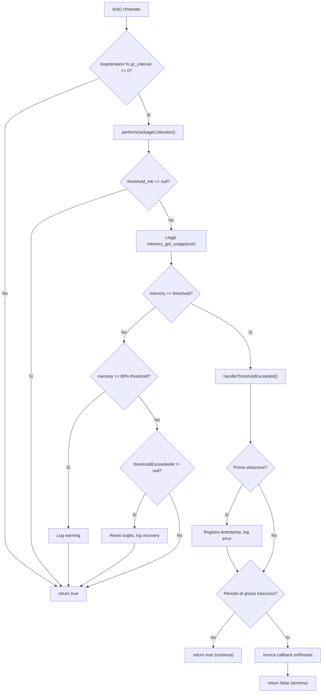
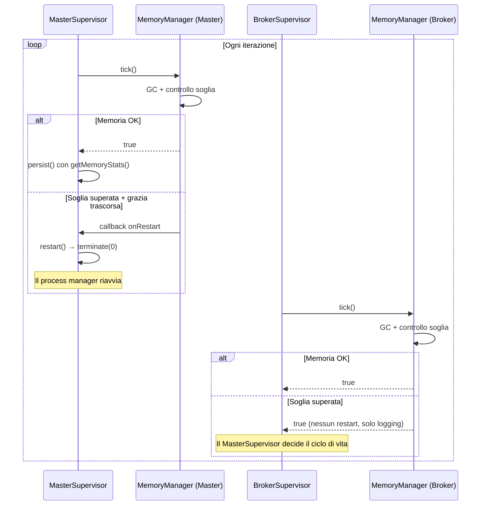
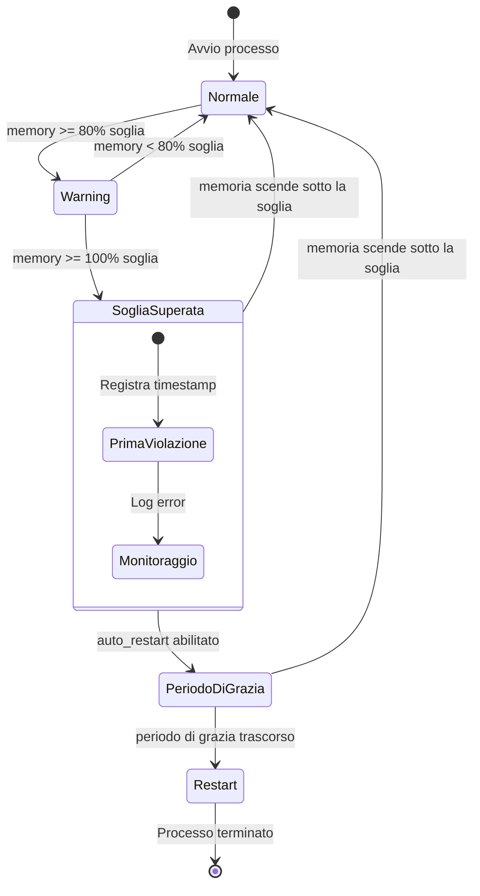

# Gestione della Memoria

## Panoramica

La classe `MemoryManager` previene la crescita incontrollata della memoria nei processi supervisor MQTT a lunga esecuzione. Fornisce garbage collection periodica, un sistema di allarme a tre livelli e capacità di auto-restart quando le soglie configurate vengono superate.

I processi PHP a lunga esecuzione — specialmente quelli con connessioni MQTT persistenti — accumulano riferimenti circolari dalle code interne del client e dai gestori di segnali. Senza una gestione attiva della memoria, questi processi esauriscono la memoria disponibile e crashano in modo imprevedibile. `MemoryManager` rende questa modalità di fallimento controllata e osservabile.

## Architettura

`MemoryManager` segue un **pattern di monitoraggio basato su tick**: il supervisor chiama `tick()` ad ogni iterazione del loop, e il manager decide quando eseguire il GC e controllare le soglie in base a un intervallo configurabile.

Decisioni architetturali chiave:
- **Separazione delle responsabilità**: `MemoryManager` gestisce la memoria; i supervisor gestiscono il ciclo di vita dei processi
- **Restart basato su callback**: il manager non termina direttamente i processi — invoca una closure `onRestart` fornita dal chiamante
- **Periodo di grazia**: le violazioni della soglia non attivano restart immediati; un ritardo configurabile permette alle operazioni in corso (pubblicazione messaggi, aggiornamento heartbeat) di completarsi
- **Monitoraggio opzionale**: impostare `threshold_mb` a `null` disabilita tutti i controlli di soglia mantenendo attivo il GC

## Come Funziona

### Ciclo di Vita del Tick

Ogni iterazione del loop del supervisor chiama `MemoryManager::tick()`:

1. Incrementa il contatore interno `loopIteration`
2. Se `loopIteration % gc_interval === 0`:
   a. Esegue `gc_collect_cycles()` per liberare i riferimenti circolari
   b. Registra la memoria liberata solo se sono stati effettivamente raccolti dei cicli (evita rumore)
   c. Controlla la memoria rispetto alla soglia configurata
3. Se non è un tick GC: ritorna `true` immediatamente (no-op)

### Sistema di Allarme a Tre Livelli

Quando `threshold_mb` è impostato, `checkMemoryThreshold()` implementa allarmi progressivi:

| Livello | Trigger | Azione |
|---------|---------|--------|
| **Warning** | Memoria ≥ 80% della soglia | Log warning con percentuale d'uso, MB correnti e MB di picco |
| **Error** | Memoria ≥ 100% della soglia | Log error, avvio countdown del periodo di grazia |
| **Restart** | Soglia superata per `restart_delay_seconds` | Invoca callback `onRestart`, ritorna `false` per segnalare la terminazione |

La soglia si resetta automaticamente se la memoria scende sotto il limite durante il periodo di grazia (es. dopo un ciclo GC riuscito).

### Flusso di Auto-Restart

Quando l'auto-restart è abilitato e il periodo di grazia è trascorso:

1. `handleThresholdExceeded()` invoca la closure `onRestart`
2. Ritorna `false` — il loop di monitoraggio del supervisor controlla questo valore di ritorno
3. In `MasterSupervisor`: `onRestart` chiama `restart()` → `terminate(0)`, terminando il processo in modo pulito
4. Il process manager esterno (systemd, supervisord) riavvia l'intero albero dei processi

In `BrokerSupervisor`: `onRestart` è `null` — i broker supervisor logano soltanto, non si riavviano autonomamente. Il `MasterSupervisor` gestisce le decisioni di ciclo di vita per i suoi supervisor figli.

## Componenti Chiave

| File | Classe/Metodo | Responsabilità |
|------|---------------|----------------|
| `src/Support/MemoryManager.php` | `MemoryManager` | Servizio core di monitoraggio memoria |
| `src/Support/MemoryManager.php` | `tick()` | Punto d'ingresso: GC + controllo soglia a intervalli |
| `src/Support/MemoryManager.php` | `performGarbageCollection()` | Esegue `gc_collect_cycles()`, logga memoria liberata |
| `src/Support/MemoryManager.php` | `checkMemoryThreshold()` | Logica a tre livelli warning/error/restart |
| `src/Support/MemoryManager.php` | `handleThresholdExceeded()` | Tracciamento periodo di grazia + trigger restart |
| `src/Support/MemoryManager.php` | `getMemoryStats()` | Ritorna memoria corrente/picco in MB e bytes |
| `src/Support/MemoryManager.php` | `reset()` | Resetta contatore iterazioni, tracciamento picco, stato soglia |
| `src/Supervisors/MasterSupervisor.php` | `__construct()` | Crea `MemoryManager` con callback output + restart |
| `src/Supervisors/MasterSupervisor.php` | `monitor()` | Chiama `tick()` ad ogni iterazione; esce dal loop se `false` |
| `src/Supervisors/MasterSupervisor.php` | `persist()` | Include `getMemoryStats()` nello stato in cache |
| `src/Supervisors/BrokerSupervisor.php` | `__construct()` | Crea `MemoryManager` con solo output (nessun restart) |
| `src/Supervisors/BrokerSupervisor.php` | `monitor()` | Chiama `tick()` ad ogni iterazione (valore di ritorno ignorato) |

## Configurazione

Tutte le impostazioni si trovano sotto `config('mqtt-broadcast.memory')`:

| Chiave | Variabile Env | Default | Descrizione |
|--------|---------------|---------|-------------|
| `gc_interval` | `MQTT_GC_INTERVAL` | `100` | Esegui GC ogni N iterazioni del loop |
| `threshold_mb` | `MQTT_MEMORY_THRESHOLD_MB` | `128` | Limite di memoria in MB; `null` disabilita il monitoraggio |
| `auto_restart` | `MQTT_MEMORY_AUTO_RESTART` | `true` | Se attivare il restart al superamento della soglia |
| `restart_delay_seconds` | `MQTT_RESTART_DELAY_SECONDS` | `10` | Periodo di grazia prima del restart dopo il superamento della soglia |

### Linee Guida per il Tuning

- **`gc_interval`**: Valori più bassi (es. 10) aumentano l'overhead CPU per il GC frequente ma rilevano i problemi di memoria più velocemente. Valori più alti (es. 500) riducono l'overhead ma ritardano il rilevamento. Il default di 100 è un buon bilanciamento per la maggior parte dei carichi di lavoro.
- **`threshold_mb`**: Impostare in base alla memoria disponibile del server. Per i container, impostare a ~75% del limite di memoria del container per lasciare spazio ai picchi di allocazione.
- **`restart_delay_seconds`**: Deve essere sufficientemente lungo per il completamento delle pubblicazioni MQTT in corso e delle scritture heartbeat. Il default di 10s è conservativo; ridurre a 3-5s se le operazioni sono veloci.

## Gestione degli Errori

| Scenario | Comportamento |
|----------|---------------|
| `threshold_mb` è `null` | Tutti i controlli soglia saltati; il GC continua a funzionare |
| `auto_restart` è `false` | Warning ed error vengono loggati ma il processo continua indefinitamente |
| La memoria scende sotto la soglia durante il periodo di grazia | Il periodo di grazia si resetta, "back below threshold" viene loggato |
| Nessun callback `onRestart` fornito | `handleThresholdExceeded()` ritorna `false` ma nessun callback viene invocato |
| `gc_collect_cycles()` ritorna 0 | Nessun output di log (evita rumore quando non c'è garbage presente) |

## Diagrammi Mermaid

### Flusso Decisionale del Tick

### Integrazione con la Gerarchia dei Supervisor

### Macchina a Stati della Memoria

