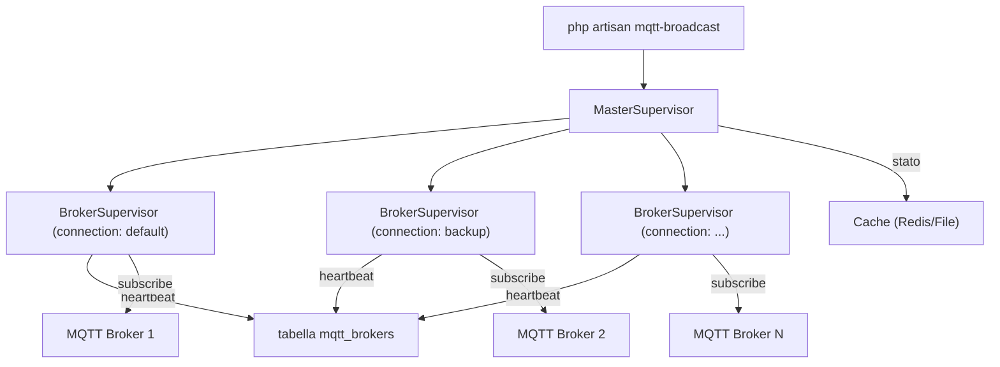
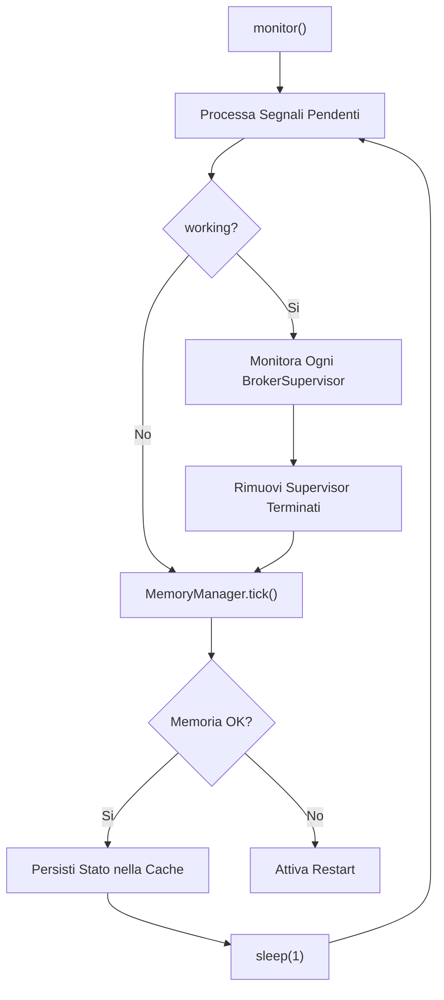
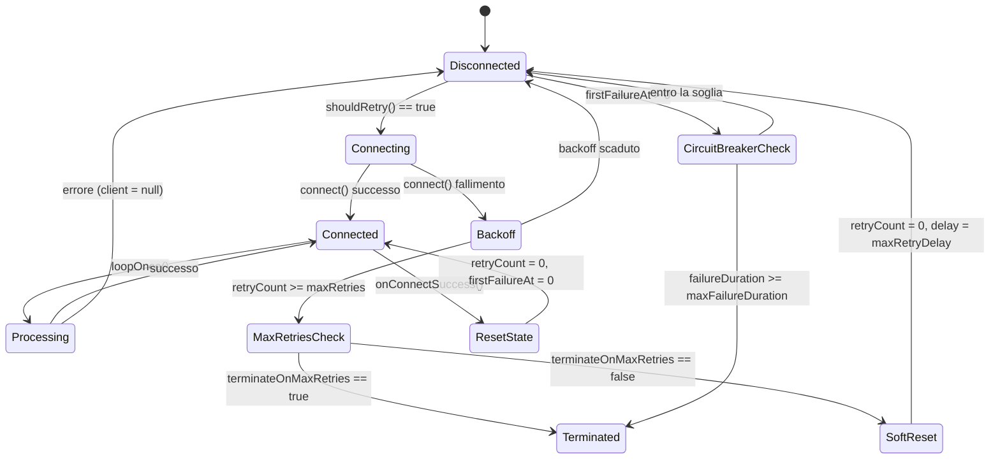
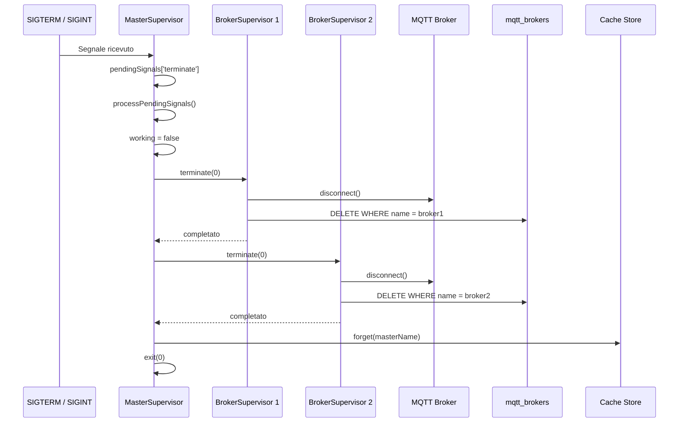

# Architettura di Supervisione dei Processi

## Panoramica

MQTT Broadcast utilizza un'architettura di supervisione a due livelli ispirata a Laravel Horizon per gestire le connessioni MQTT a lunga durata. Un singolo **MasterSupervisor** orchestra molteplici istanze di **BrokerSupervisor** — una per ogni connessione MQTT configurata. Questo design offre riconnessione automatica con backoff esponenziale, shutdown controllato tramite segnali UNIX, gestione della memoria con auto-restart e monitoraggio della salute basato su heartbeat.

Il sistema viene avviato tramite `php artisan mqtt-broadcast` e gira come processo bloccante in foreground, progettato per essere gestito da un process supervisor come systemd o Supervisor.

## Architettura

L'architettura segue un pattern ad **albero supervisor padre-figlio**:

- **MasterSupervisor** — processo singolo per macchina, esegue il loop principale (tick ogni secondo), gestisce i segnali UNIX, persiste lo stato nella cache (Redis/file), gestisce il pool di BrokerSupervisor.
- **BrokerSupervisor** — uno per connessione MQTT, gestisce il ciclo di vita del client MQTT (connessione, sottoscrizione, riconnessione), gestisce l'ingestione dei messaggi, aggiorna i timestamp di heartbeat nel database.
- **MemoryManager** — integrato in entrambi i livelli, attiva il GC periodicamente, monitora le soglie di memoria, attiva l'auto-restart quando i limiti vengono superati.

Decisioni architetturali chiave:
- **Gestione segnali stile Horizon**: i segnali vengono messi in coda come "pending" ed elaborati all'inizio di ogni iterazione del loop, prevenendo race condition.
- **Cache per stato master, DB per stato broker**: lo stato del MasterSupervisor e' effimero (cache con TTL), mentre lo stato del BrokerSupervisor viene persistito nella tabella `mqtt_brokers` per le query della dashboard.
- **Restart = terminate + riavvio dal process manager**: seguendo l'approccio di Horizon, il restart significa terminare il processo e affidarsi a systemd/Supervisor per il riavvio, garantendo uno stato pulito.

## Come Funziona

### Sequenza di Avvio

1. `MqttBroadcastCommand::handle()` genera un nome master univoco tramite `ProcessIdentifier::generateName('master')` (formato: `master-{hostname}-{token}`).
2. Verifica nella cache l'esistenza di un master con lo stesso nome — previene istanze duplicate sulla stessa macchina.
3. Legge l'environment (opzione CLI > config `mqtt-broadcast.env` > `APP_ENV`) e carica le connessioni da `mqtt-broadcast.environments.{env}`.
4. Valida tutte le configurazioni delle connessioni chiamando `MqttClientFactory::create()` per ciascuna — fail fast con errori descrittivi.
5. Crea un `BrokerSupervisor` per connessione. Ogni supervisor si auto-registra nella tabella `mqtt_brokers` al momento della costruzione.
6. Registra l'handler `SIGINT` per lo shutdown controllato via Ctrl+C.
7. Chiama `MasterSupervisor::monitor()` — entra nel loop infinito bloccante.

### Loop Principale (ogni secondo)

1. `processPendingSignals()` — processa la coda dei segnali: SIGTERM -> `terminate()`, SIGUSR1 -> `restart()`, SIGUSR2 -> `pause()`, SIGCONT -> `continue()`.
2. Se `working == true`, chiama `monitor()` su ogni BrokerSupervisor, poi filtra i supervisor terminati.
3. `MemoryManager::tick()` — incrementa il contatore del loop; ogni `gc_interval` iterazioni esegue il GC e verifica le soglie di memoria.
4. `persist()` — scrive lo stato corrente (PID, status, conteggio supervisor, statistiche memoria) nella cache.

### Ciclo di Monitoraggio del BrokerSupervisor

Ogni chiamata a `BrokerSupervisor::monitor()`:

1. Chiama `MemoryManager::tick()` per il tracciamento memoria per-broker.
2. Se disconnesso, verifica `shouldRetry()` — rispetta i tempi del backoff esponenziale e la durata del circuit breaker.
3. Al tentativo: chiama `connect()` -> crea il client MQTT tramite factory -> si connette con impostazioni auth/TLS -> si sottoscrive al topic `{prefix}#`.
4. In caso di successo: resetta lo stato di retry (`retryCount`, `retryDelay`, `firstFailureAt`).
5. In caso di fallimento: incrementa `retryCount`, applica backoff esponenziale (1s, 2s, 4s, 8s... fino a `max_retry_delay`), traccia `firstFailureAt` per il circuit breaker.
6. Se connesso: chiama `$client->loopOnce()` per processare i messaggi MQTT pendenti, poi `repository->touch()` per aggiornare l'heartbeat.

### Strategia di Riconnessione

La logica di riconnessione implementa un meccanismo di doppia protezione:

- **Backoff esponenziale**: il ritardo raddoppia ad ogni fallimento (1s -> 2s -> 4s -> ... -> `max_retry_delay`), con tetto massimo a `max_retry_delay` (default: 60s).
- **Limite massimo tentativi**: dopo `max_retries` (default: 20) fallimenti consecutivi:
  - Se `terminate_on_max_retries == true`: il supervisor termina (fail rigido).
  - Se `terminate_on_max_retries == false` (default): il contatore di retry si resetta con una lunga pausa (`max_retry_delay`), creando effettivamente cicli di retry infiniti.
- **Circuit breaker**: se la durata totale di fallimento continuo supera `max_failure_duration` (default: 3600s / 1 ora), il supervisor termina indipendentemente dal conteggio dei retry.

### Gestione dei Segnali

I segnali vengono catturati in modo asincrono tramite `pcntl_async_signals(true)` e messi in coda in `$pendingSignals`. Vengono processati in modo sincrono all'inizio di ogni iterazione del loop:

| Segnale | Azione | Effetto |
|---------|--------|---------|
| `SIGTERM` | `terminate()` | Shutdown controllato: disconnette tutti i broker, pulisce DB/cache, esce |
| `SIGUSR1` | `restart()` | Chiama `terminate(0)` — il process manager dovrebbe riavviare |
| `SIGUSR2` | `pause()` | Ferma il monitoraggio ma mantiene il loop attivo; broker in pausa |
| `SIGCONT` | `continue()` | Riprende il monitoraggio dopo la pausa |
| `SIGINT` | (via command) | Come SIGTERM — handler Ctrl+C |

### Shutdown Controllato

Quando viene chiamato `MasterSupervisor::terminate()`:

1. Imposta `working = false` per fermare il loop.
2. Itera ogni BrokerSupervisor e chiama `terminate()`:
   - Disconnette il client MQTT (ignora errori di disconnessione).
   - Elimina il record del broker dalla tabella `mqtt_brokers`.
   - Gli errori sui singoli supervisor vengono catturati — garantisce che tutti i supervisor vengano puliti.
3. Rimuove lo stato del master dalla cache tramite `repository->forget()`.
4. Chiama `exit($status)`.

### Gestione della Memoria

`MemoryManager` implementa un sistema di allarme a tre livelli:

1. **GC periodico**: ogni `gc_interval` iterazioni del loop (default: 100), chiama `gc_collect_cycles()`. Logga la memoria liberata solo quando vengono raccolti cicli.
2. **Warning all'80%**: allarme anticipato quando l'utilizzo della memoria raggiunge l'80% di `threshold_mb`.
3. **Soglia al 100% + periodo di grazia**: quando superata, avvia un conto alla rovescia (`restart_delay_seconds`, default: 10s). Se la memoria resta sopra la soglia dopo il periodo di grazia e `auto_restart == true`, attiva il callback di restart.

Nel MasterSupervisor, il callback di restart chiama `restart()` (che termina il processo). Nel BrokerSupervisor, nessun callback di restart e' configurato — la memoria viene solo monitorata e loggata.

## Componenti Chiave

| File | Classe/Metodo | Responsabilita' |
|------|--------------|-----------------|
| `src/Supervisors/MasterSupervisor.php` | `MasterSupervisor` | Orchestra i broker supervisor, esegue il loop principale, gestisce i segnali, persiste lo stato nella cache |
| `src/Supervisors/BrokerSupervisor.php` | `BrokerSupervisor` | Gestisce una singola connessione MQTT, gestisce la riconnessione con backoff esponenziale, processa i messaggi |
| `src/Commands/MqttBroadcastCommand.php` | `MqttBroadcastCommand` | Entry point Artisan — valida la config, crea i supervisor, avvia il monitoraggio |
| `src/Commands/MqttBroadcastTerminateCommand.php` | `MqttBroadcastTerminateCommand` | Invia SIGTERM ai supervisor in esecuzione, pulisce i record DB/cache |
| `src/Support/MemoryManager.php` | `MemoryManager` | GC periodico, monitoraggio soglia memoria, attivazione auto-restart |
| `src/Support/ProcessIdentifier.php` | `ProcessIdentifier` | Genera nomi univoci per i processi usando hostname + token casuale |
| `src/ListensForSignals.php` | `ListensForSignals` (trait) | Registra gli handler dei segnali UNIX, mette in coda e processa i segnali pendenti |
| `src/Repositories/MasterSupervisorRepository.php` | `MasterSupervisorRepository` | CRUD basato su cache per lo stato del master supervisor (supporta driver Redis, file, array) |
| `src/Repositories/BrokerRepository.php` | `BrokerRepository` | CRUD nel database per i record dei processi broker, aggiornamento heartbeat, generazione nomi |
| `src/Contracts/Terminable.php` | `Terminable` | Interfaccia: `terminate(int $status)` |
| `src/Contracts/Pausable.php` | `Pausable` | Interfaccia: `pause()`, `continue()` |
| `src/Contracts/Restartable.php` | `Restartable` | Interfaccia: `restart()` |

## Schema del Database

### Tabella `mqtt_brokers`

| Colonna | Tipo | Descrizione |
|---------|------|-------------|
| `id` | bigint (PK) | Chiave primaria auto-incrementale |
| `name` | string | Identificativo univoco del broker (formato: `{hostname}-{token}`) |
| `connection` | string | Nome della connessione MQTT dalla config |
| `pid` | integer | ID del processo OS del supervisor |
| `working` | boolean | Se il supervisor e' attivo |
| `started_at` | datetime | Quando il supervisor e' stato avviato |
| `last_heartbeat_at` | datetime | Ultimo timestamp di heartbeat (aggiornato ogni iterazione del loop) |
| `created_at` | timestamp | Timestamp Laravel |
| `updated_at` | timestamp | Timestamp Laravel |

**Indici**: indice composito su `(broker, topic, created_at)` sulla tabella correlata `mqtt_loggers`.

### Cache del Master Supervisor

Lo stato viene memorizzato nella cache con la chiave `mqtt-broadcast:master:{name}` con TTL configurabile (default: 3600s).

Campi memorizzati: `pid`, `status` (running/paused), `supervisors` (conteggio), `memory_mb`, `peak_memory_mb`, `updated_at`.

## Configurazione

Tutta la configurazione relativa ai supervisor si trova in `config/mqtt-broadcast.php`:

| Chiave Config | Variabile Env | Default | Descrizione |
|---------------|--------------|---------|-------------|
| `defaults.connection.max_retries` | `MQTT_MAX_RETRIES` | `20` | Massimo numero di fallimenti consecutivi prima di agire |
| `defaults.connection.max_retry_delay` | `MQTT_MAX_RETRY_DELAY` | `60` | Ritardo massimo di backoff in secondi |
| `defaults.connection.max_failure_duration` | `MQTT_MAX_FAILURE_DURATION` | `3600` | Timeout del circuit breaker in secondi |
| `defaults.connection.terminate_on_max_retries` | `MQTT_TERMINATE_ON_MAX_RETRIES` | `false` | Terminazione rigida o reset soft al raggiungimento dei tentativi massimi |
| `memory.gc_interval` | `MQTT_GC_INTERVAL` | `100` | Iterazioni del loop tra ogni esecuzione del GC |
| `memory.threshold_mb` | `MQTT_MEMORY_THRESHOLD_MB` | `128` | Soglia di memoria in MB |
| `memory.auto_restart` | `MQTT_MEMORY_AUTO_RESTART` | `true` | Auto-restart al superamento della soglia di memoria |
| `memory.restart_delay_seconds` | `MQTT_RESTART_DELAY_SECONDS` | `10` | Periodo di grazia prima dell'auto-restart |
| `master_supervisor.cache_ttl` | `MQTT_MASTER_CACHE_TTL` | `3600` | TTL della cache per lo stato del master (secondi) |
| `supervisor.heartbeat_interval` | `MQTT_HEARTBEAT_INTERVAL` | `1` | Intervallo di aggiornamento dell'heartbeat (secondi) |
| `repository.broker.stale_threshold` | `MQTT_STALE_THRESHOLD` | `300` | Secondi prima che un broker venga considerato inattivo |

Le sovrascritture per-connessione di `max_retries`, `max_retry_delay`, `max_failure_duration` e `terminate_on_max_retries` possono essere impostate all'interno dei singoli blocchi di connessione.

## Gestione degli Errori

| Scenario di Fallimento | Gestione |
|-----------------------|----------|
| Connessione MQTT rifiutata | Retry con backoff esponenziale (1s -> 2s -> 4s -> ... -> 60s) |
| Tentativi massimi superati (modalita' soft) | Il contatore si resetta, pausa di `max_retry_delay`, riprova indefinitamente |
| Tentativi massimi superati (modalita' hard) | Il supervisor termina con codice di uscita 1 |
| Circuit breaker attivato | Il supervisor termina dopo `max_failure_duration` di fallimento continuo |
| Errore nell'elaborazione dei messaggi | Catturato e loggato; il supervisor continua a funzionare |
| Errore in `loopOnce()` | Client impostato a null per attivare la riconnessione all'iterazione successiva |
| Errore nella terminazione del supervisor | Catturato e loggato; gli altri supervisor vengono comunque terminati |
| Soglia di memoria superata | Periodo di grazia -> auto-restart (uscita del processo per riavvio dal process manager) |
| Eccezione nel loop del master | Catturata e loggata tramite callback di output; il loop continua |
| Istanza master duplicata | Il comando rifiuta di avviarsi con un messaggio di warning |
| Configurazione connessione non valida | Il comando fallisce immediatamente prima di avviare qualsiasi supervisor |

## Diagrammi Mermaid

### Albero dei Supervisor

### Ciclo di Vita del Loop Principale

### Macchina a Stati della Riconnessione

### Sequenza di Shutdown Controllato

