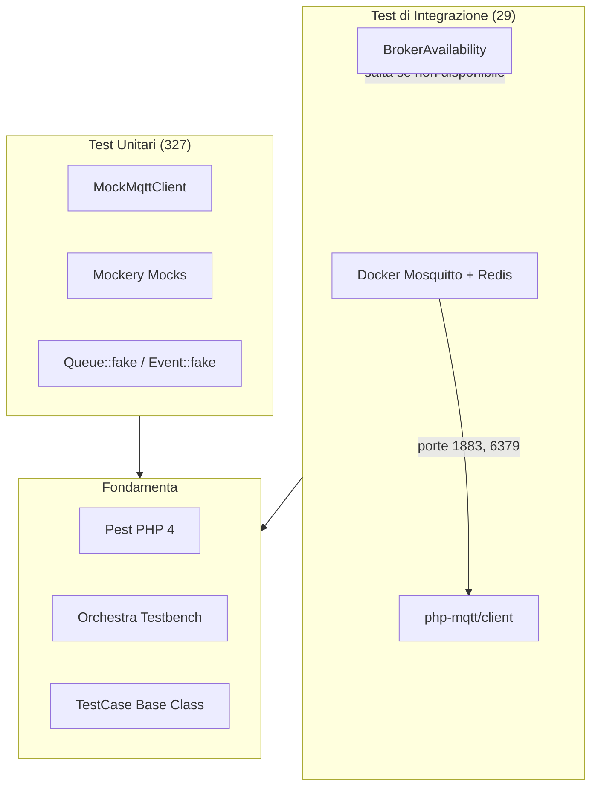
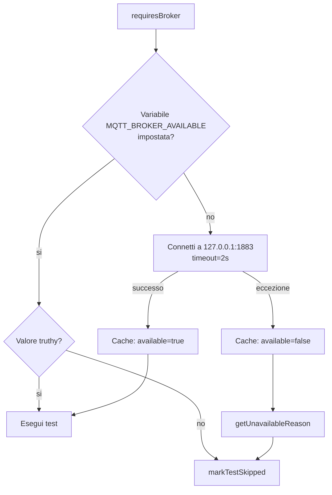

# Infrastruttura di Testing

## Panoramica

`mqtt-broadcast` include una suite di test completa basata su **Pest PHP 4** con **Orchestra Testbench** per il bootstrap di Laravel. La suite si divide in **test unitari** (327, nessun broker richiesto) e **test di integrazione** (29, broker MQTT reale via Docker). Un helper `MockMqttClient` consente test MQTT deterministici senza dipendenze di rete.

L'infrastruttura di testing risolve tre problemi:
1. Testare la logica publish/subscribe MQTT senza un broker attivo
2. Bootstrap di un ambiente Laravel completo per un pacchetto standalone
3. Verifica delle interazioni reali con il broker (ciclo di vita connessione, multi-broker, pulizia cache) in CI

## Architettura

La suite di test utilizza un approccio stratificato:

- **Pest PHP** come test runner con il plugin Laravel per `Queue::fake()`, `Event::fake()`, test HTTP
- **Orchestra Testbench** fornisce un'app Laravel minimale (route, config, migration, service provider)
- **MockMqttClient** sostituisce il client reale `php-mqtt/client` nei test unitari
- **BrokerAvailability** controlla i test di integrazione — vengono saltati quando nessun broker e' disponibile
- **Mockery** per aspettative mock dettagliate su factory, repository e servizi



## Come Funziona

### Bootstrap dei Test (`tests/Pest.php`)

Ogni test eredita dal `TestCase` personalizzato tramite la direttiva `uses()` di Pest. La pulizia di Mockery viene eseguita automaticamente dopo ogni test.

```php
uses(TestCase::class)->in(__DIR__);

afterEach(function () {
    Mockery::close();
});
```

### TestCase Base (`tests/TestCase.php`)

Estende `Orchestra\Testbench\TestCase` e gestisce:

1. **Registrazione del service provider** — carica `MqttBroadcastServiceProvider` rendendo disponibili tutti i binding, le route e le migration
2. **Caricamento migration** — esegue tutte le migration del pacchetto su un database SQLite in memoria
3. **Config di default** — configura l'intero albero `mqtt-broadcast` (connessioni, rate limiting, coda, cache, failed jobs, ambienti)
4. **Risoluzione namespace factory** — mappa le classi model a `Database\Factories\` per il supporto factory di Eloquent

Scelte di configurazione chiave:
- **Database**: SQLite `:memory:` (veloce, usa e getta)
- **Cache**: driver `array` (nessuna dipendenza Redis nei test unitari)
- **Coda**: driver `sync` (i job vengono eseguiti immediatamente, nessuna tabella jobs necessaria)
- **Rate limiting**: abilitato con strategia `reject` e cache driver `array`

#### Metodi Helper

| Metodo | Scopo |
|--------|-------|
| `setMqttConfig(string $broker, array $config)` | Override della config di connessione per un broker specifico nel singolo test |
| `getProtectedProperty(object $object, string $property)` | Accesso a proprieta' private/protected tramite reflection (utile per asserzioni sugli interni dei job) |
| `brokerAvailable()` | Verifica se un broker MQTT reale e' raggiungibile |
| `requiresBroker()` | Salta il test con messaggio se il broker non e' disponibile |

### MockMqttClient (`tests/Helpers/MockMqttClient.php`)

Sostituto drop-in per `PhpMqtt\Client\MqttClient` che registra tutte le chiamate publish/subscribe in memoria. Impone lo stato di connessione — pubblicare o sottoscrivere mentre disconnesso lancia `RuntimeException`.

#### API

| Metodo | Descrizione |
|--------|-------------|
| `connect($settings, bool $cleanSession)` | Imposta lo stato connesso a `true` |
| `disconnect()` | Imposta lo stato connesso a `false` |
| `isConnected()` | Ritorna lo stato di connessione |
| `publish(string $topic, string $message, int $qos, bool $retain)` | Registra il messaggio nell'array `publishedMessages` |
| `subscribe(string $topic, callable $callback, int $qos)` | Registra la sottoscrizione nell'array `subscribedTopics` |
| `loopOnce(int $timeout)` | No-op per testing |
| `assertPublished(string $topic, ?string $message, ?int $qos)` | Asserisce che un messaggio e' stato pubblicato (match opzionale su message/QoS) |
| `assertNotPublished(string $topic)` | Asserisce che nessun messaggio e' stato pubblicato sul topic |
| `getPublishedMessage(int $index)` | Ottieni messaggio pubblicato per indice |
| `getLastPublishedMessage()` | Ottieni l'ultimo messaggio pubblicato |
| `clearPublished()` | Resetta l'array dei messaggi pubblicati |
| `getPublishedCount()` | Conteggio dei messaggi pubblicati |

Ogni messaggio registrato e' un array:
```php
[
    'topic' => 'sensors/temperature',
    'message' => '{"value": 25.5}',
    'qos' => 0,
    'retain' => false,
    'timestamp' => 1711497600,
]
```

### BrokerAvailability (`tests/Support/BrokerAvailability.php`)

Controlla i test di integrazione con una verifica di connessione al broker reale. Il risultato viene cachato staticamente per l'intera esecuzione dei test.

Ordine di rilevamento:
1. **Variabile d'ambiente** `MQTT_BROKER_AVAILABLE` — la CI puo' impostarla a `true`/`false` per saltare il tentativo di connessione
2. **Tentativo di connessione live** — crea un `MqttClient` temporaneo, si connette con timeout di 2 secondi, si disconnette
3. **Fallback diagnostico** — se la connessione fallisce, `getUnavailableReason()` tenta un socket raw per distinguere "porta chiusa" da "handshake MQTT fallito"



### Factory del Database

Il pacchetto include due factory Eloquent per la generazione di dati di test. Entrambe sono risolte automaticamente tramite la convenzione del namespace `Database\Factories\` configurata nel `TestCase`.

#### `BrokerProcessFactory`

Crea record `BrokerProcess` per la tabella `mqtt_brokers`. Gli attributi fillable del model sono: `name`, `connection`, `pid`, `started_at`, `last_heartbeat_at`, `working`.

```php
// Default: un broker attivo con heartbeat recente
BrokerProcess::factory()->create();

// Attributi personalizzati
BrokerProcess::factory()->create([
    'name' => 'sensor-hub-ab12',
    'connection' => 'default',
    'pid' => 12345,
    'started_at' => now()->subHours(2),
    'last_heartbeat_at' => now(),
    'working' => true,
]);
```

Due stati della factory modellano scenari di test comuni:

| Stato | Effetto | Caso d'Uso |
|-------|---------|------------|
| `stopped()` | Imposta `working => false` | Test filtro dashboard dei broker inattivi, pulizia comando terminate |
| `stale()` | Imposta `last_heartbeat_at => now()->subMinutes(10)` | Test della macchina a stati connection_status (`idle`/`reconnecting`/`disconnected` basata sulle soglie di eta' dell'heartbeat) |

```php
// Broker fermato
BrokerProcess::factory()->stopped()->create();

// Broker con heartbeat obsoleto (10 minuti fa)
BrokerProcess::factory()->stale()->create();

// Combinare gli stati
BrokerProcess::factory()->stopped()->stale()->create();
```

#### `MqttLoggerFactory`

Crea record `MqttLogger` per la tabella `mqtt_loggers`. Il model usa il trait `HasExternalId`, che genera automaticamente un UUID `external_id` alla creazione e sovrascrive `getRouteKeyName()` per usarlo nel route model binding.

```php
// Default: un semplice record di log
MqttLogger::factory()->create();
// Produce: broker='broker', topic='topic', message=['msg' => 'Hi'], external_id=UUID-automatico

// Messaggio JSON personalizzato
MqttLogger::factory()->create([
    'broker' => 'production',
    'topic' => 'sensors/temperature',
    'message' => ['value' => 25.5, 'unit' => 'celsius'],
]);

// Messaggio stringa raw (memorizzato come stringa JSON per il cast 'json')
MqttLogger::factory()->create([
    'message' => 'plain text payload',
]);
```

**Importante**: `MqttLogger` supporta connessione database e nome tabella configurabili tramite `mqtt-broadcast.logs.connection` e `mqtt-broadcast.logs.table`. Nei test, questi si risolvono al database SQLite `:memory:` e alla tabella `mqtt_loggers` rispettivamente, corrispondendo ai default del `TestCase`.

#### Trait `HasExternalId`

Usato da `MqttLogger` e `FailedMqttJob`. Questo trait:

1. Assegna automaticamente un UUID a `external_id` durante l'evento `creating` (tramite `Str::uuid()`)
2. Sovrascrive `getRouteKeyName()` per restituire `'external_id'` — gli endpoint API usano UUID invece degli ID auto-incrementali

Quando si testano endpoint API che referenziano questi model, usare sempre `external_id` nelle URL:

```php
$log = MqttLogger::factory()->create();

// Corretto: usare external_id per il route model binding
$this->getJson("/mqtt-broadcast/api/messages/{$log->external_id}")
    ->assertOk();

// Errato: l'ID auto-incrementale non corrisponde al route model binding
// $this->getJson("/mqtt-broadcast/api/messages/{$log->id}") // 404
```

## Componenti Chiave

| File | Classe/Metodo | Responsabilita' |
|------|---------------|-----------------|
| `tests/Pest.php` | — | Bootstrap Pest: associa `TestCase`, chiude Mockery automaticamente |
| `tests/TestCase.php` | `TestCase` | Base Orchestra Testbench: migration, config, registrazione provider |
| `tests/TestCase.php` | `setMqttConfig()` | Override config broker per singolo test |
| `tests/TestCase.php` | `getProtectedProperty()` | Accesso tramite reflection a proprieta' private |
| `tests/TestCase.php` | `requiresBroker()` | Guardia per saltare test di integrazione |
| `tests/Helpers/MockMqttClient.php` | `MockMqttClient` | Client MQTT in memoria con metodi di asserzione |
| `tests/Support/BrokerAvailability.php` | `BrokerAvailability` | Verifica raggiungibilita' broker con cache e diagnostica |
| `database/factories/BrokerProcessFactory.php` | `BrokerProcessFactory` | Factory con stati `stopped()` e `stale()` per `BrokerProcess` |
| `database/factories/MqttLoggerFactory.php` | `MqttLoggerFactory` | Factory per `MqttLogger` con default broker/topic/message |
| `src/Models/Concerns/HasExternalId.php` | `HasExternalId` | Generazione UUID `external_id` automatica + override route key |
| `composer.json` | `scripts.test` | `vendor/bin/pest` |
| `composer.json` | `scripts.test-coverage` | `vendor/bin/pest --coverage` |

## Configurazione

### Script Composer

| Script | Comando | Scopo |
|--------|---------|-------|
| `composer test` | `vendor/bin/pest` | Esegui la suite completa (unit + integration se broker disponibile) |
| `composer test-coverage` | `vendor/bin/pest --coverage` | Esegui con copertura del codice |
| `composer pint` | `vendor/bin/pint` | Stile codice (eseguire prima del commit) |
| `composer analyse` | `vendor/bin/phpstan analyse` | Analisi statica livello 7 |

### Esecuzione dei Test

```bash
# Solo test unitari (nessun broker necessario)
vendor/bin/pest --exclude-group=integration

# Suite completa con test di integrazione
docker compose -f docker-compose.test.yml up -d
vendor/bin/pest
docker compose -f docker-compose.test.yml down
```

### Dipendenze di Sviluppo

| Pacchetto | Versione | Ruolo |
|-----------|----------|-------|
| `pestphp/pest` | ^4.0 | Test runner |
| `pestphp/pest-plugin-laravel` | ^4.0 | Asserzioni e helper specifici Laravel |
| `orchestra/testbench` | ^9.0\|^10.0 | Bootstrap app Laravel per pacchetti |
| `phpunit/phpunit` | ^10.5\|^11.0\|^12.0 | Motore di test sottostante |
| `nunomaduro/collision` | ^7.0\|^8.0 | Output errori migliorato |
| `nunomaduro/larastan` | ^2.0.1 | Regole PHPStan per Laravel |
| `phpstan/phpstan-deprecation-rules` | ^1.0 | Rilevamento deprecation |
| `phpstan/phpstan-phpunit` | ^1.0 | Analisi PHPUnit-aware |
| `spatie/laravel-ray` | ^1.26 | Strumento di debug |

## Pattern di Test

### Test Unitario: Mock della MqttClientFactory

```php
beforeEach(function () {
    $this->mockFactory = Mockery::mock(MqttClientFactory::class);
    $this->mockClient = Mockery::mock(MqttClient::class);
    $this->app->instance(MqttClientFactory::class, $this->mockFactory);
});

it('publishes message via factory', function () {
    $this->mockFactory->shouldReceive('create')
        ->once()
        ->andReturn($this->mockClient);

    $this->mockClient->shouldReceive('connect')->once();
    $this->mockClient->shouldReceive('publish')
        ->with('test/topic', '{"key":"value"}', 0, false)
        ->once();
    $this->mockClient->shouldReceive('disconnect')->once();

    // ... trigger the code under test
});
```

### Test Unitario: Queue Faking con Asserzione su Proprieta' Protette

```php
it('dispatches MqttMessageJob with correct parameters', function () {
    Queue::fake();

    MqttBroadcast::publish('sensors/temperature', '{"value": 25.5}');

    Queue::assertPushed(MqttMessageJob::class, function ($job) {
        return $this->getProtectedProperty($job, 'topic') === 'sensors/temperature'
            && $this->getProtectedProperty($job, 'message') === '{"value": 25.5}';
    });
});
```

### Test Unitario: Controller HTTP con Database

```php
it('returns healthy status when brokers are active', function () {
    BrokerProcess::factory()->create([
        'name' => 'default-ab12',
        'connection' => 'default',
        'last_heartbeat_at' => now(),
        'working' => true,
    ]);

    $response = $this->getJson('/mqtt-broadcast/api/health');

    $response->assertStatus(200)
        ->assertJson([
            'status' => 'healthy',
            'data' => [
                'brokers' => ['total' => 1, 'active' => 1, 'stale' => 0],
            ],
        ]);
});
```

### Test Unitario: BrokerSupervisor con Mockery `andReturnUsing`

```php
// Ritorna istanze model reali dal repository mockato
$this->repository->shouldReceive('create')
    ->byDefault()
    ->andReturnUsing(function ($name, $connection, $pid) {
        $broker = new BrokerProcess();
        $broker->name = $name;
        $broker->connection = $connection;
        $broker->pid = $pid;
        $broker->exists = true;
        return $broker;
    });
```

### Test di Integrazione: Ciclo di Vita del Processo Reale

```php
beforeEach(function () {
    $this->requiresBroker();
    // Avvia un processo mqtt-broadcast reale
    $this->processHandle = proc_open(
        'exec php testbench mqtt-broadcast',
        $descriptors,
        $pipes,
        getcwd()
    );
});

afterEach(function () {
    if ($this->processHandle) {
        proc_terminate($this->processHandle, SIGTERM);
        proc_close($this->processHandle);
    }
});
```

## Gestione Errori

| Scenario | Comportamento |
|----------|---------------|
| Nessun broker disponibile per test di integrazione | `markTestSkipped()` con ragione diagnostica |
| `MockMqttClient::publish()` mentre disconnesso | Lancia `RuntimeException('Not connected to MQTT broker')` |
| `MockMqttClient::assertPublished()` fallisce | Lancia `RuntimeException("Message not published to topic: {$topic}")` |
| Fallimento migration SQLite | La suite si arresta — verificare la compatibilita' della sintassi migration con SQLite |
| Aspettativa Mockery non soddisfatta | `Mockery::close()` in `afterEach` provoca fallimento dell'asserzione |

```mermaid
stateDiagram-v2
    [*] --> Setup: Pest esegue il test
    Setup --> UnitPath: Nessun broker necessario
    Setup --> IntegrationPath: requiresBroker()

    UnitPath --> MockSetup: beforeEach
    MockSetup --> Execute: Esegui corpo del test
    Execute --> Assert: Asserzioni
    Assert --> Cleanup: afterEach (Mockery::close)
    Cleanup --> [*]: Pass/Fail

    IntegrationPath --> BrokerCheck: BrokerAvailability::isAvailable()
    BrokerCheck --> Skipped: Non disponibile
    BrokerCheck --> DockerSetup: Disponibile
    DockerSetup --> Execute
    Skipped --> [*]: markTestSkipped
```
