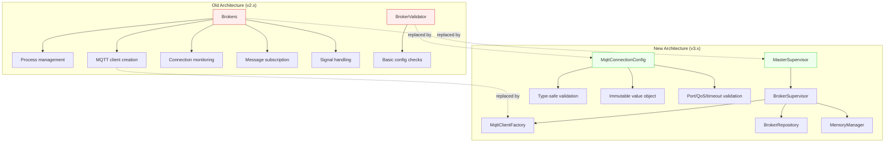
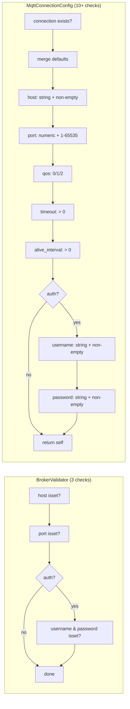
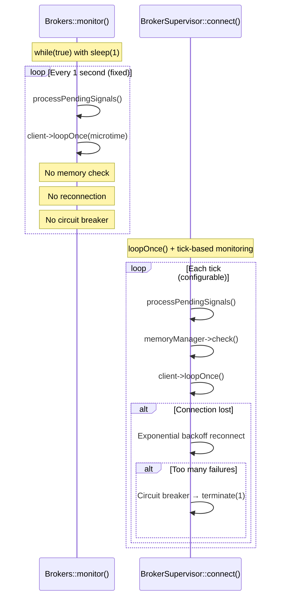

# Deprecations & Migration Guide

## Overview

Version 2.5.0 introduced a Horizon-inspired supervisor architecture that replaces the original monolithic `Brokers` class. Version 3.0 further replaced the basic `BrokerValidator` with the type-safe `MqttConnectionConfig` value object. This guide documents the deprecated classes, their replacements, and the migration path.

## Deprecated Classes

### `Brokers` (deprecated since 2.5.0, removal in 3.0)

**File:** `src/Brokers.php`

The original `Brokers` class was a monolithic component that handled broker process management, MQTT client creation, connection monitoring, message subscription, and signal handling — all in a single class.

**Problems with the old approach:**

- Single Responsibility violation: process management, MQTT client creation, subscription, and signal handling all merged together
- Direct `config()` calls for client construction — no validation, no type safety
- Hardcoded `while (true)` monitor loop with no memory management or circuit breaker
- No reconnection strategy — if the connection dropped, the process died
- `exit()` calls in the class body made it untestable

### `BrokerValidator` (deprecated since 3.0, removal in 4.0)

**File:** `src/Support/BrokerValidator.php`

A basic static validator that checked for the presence of `host`, `port`, and credentials in broker configuration. It relied on a now-removed `InvalidBrokerException` class.

> **Warning:** `BrokerValidator` is effectively **broken at runtime**. The class imports `use enzolarosa\MqttBroadcast\Exceptions\InvalidBrokerException`, which has been removed from the codebase. Calling `BrokerValidator::validate()` will trigger a `Class not found` fatal error from the autoloader before the deprecation notice even fires. Any code still referencing this class must be migrated immediately.

**Problems with the old approach:**

- No port range validation (accepted `0` or `99999`)
- No QoS value validation
- No timeout/interval validation
- `throw_unless` with static exception factories — error messages lacked structured context
- `throw_unless` evaluates the exception argument eagerly — `InvalidBrokerException::notConfigured($broker)` is instantiated even when validation passes
- The `InvalidBrokerException` class it depended on has been removed from the codebase, causing fatal errors on any usage

## `Brokers` Internals & Behavioral Quirks

Understanding the old class's quirks helps explain why the migration was necessary and what behavioral differences to expect.

### Public property exposure

All internal state is public — `$broker` (BrokerProcess model), `$client` (nullable MqttClient), `$output` (Closure). No encapsulation.

### Name generation (precursor to ProcessIdentifier)

`Brokers::name()` generates `{hostname-slug}-{random4}` using `Str::slug(gethostname())` + `Str::random(4)`. The random token is memoized via `static $token` — identical to the later `ProcessIdentifier` class, but without the `mqtt-broadcast-` prefix the new architecture adds.

### `client()` redundant DB lookup

`monitor()` calls `$this->client($this->broker->name)`, which internally does `$this->find($name)` — a DB query by name — even though `$this->broker` is already set from `make()`. This is a redundant query on every `monitor()` call.

### Auto-connect vs no-connect split

`client()` has two code paths based on the `auth` config flag:
- **`auth: true`** — creates client, builds ConnectionSettings, calls `$mqtt->connect()`, returns connected client
- **`auth: false`** — creates client, returns **disconnected** client

Then `monitor()` checks `$this->client->isConnected()` and calls `$this->client->connect()` with no ConnectionSettings (bare connect, no TLS, no keepalive, no timeout). This means **non-authenticated connections use entirely different connect parameters** than authenticated ones.

The new `MqttClientFactory` always returns disconnected clients, and the caller always connects with explicit settings.

### DB read per loop tick

`loop()` checks `$this->broker->working` every iteration. Since `$this->broker` is an Eloquent model and `working` is read as a property, this relies on the cached attribute. However, there is no `$this->broker->refresh()` call — meaning the `working` flag is never re-read from the database after the initial `make()`. The `pause`/`resume` signal path is therefore broken: SIGUSR2 sets `$this->pendingSignals['pause']` but `pause()` is not implemented on `Brokers`, causing a fatal `method not found` error.

### Fixed 1-second sleep

The `while (true)` loop has a hardcoded `sleep(1)` before each `loop()` call. The new `BrokerSupervisor` uses `client->loopOnce()` with configurable timing and no fixed sleep.

### Two-method exit indirection

`exit()` calls `exitProcess()` which calls PHP's `exit()`. The two-method chain exists for testability — tests can mock `exitProcess()` to prevent actual process termination. The `terminate()` method's return type is `never`, making the control flow explicit.

### `terminateByPid()` — DB-only cleanup

The static `Brokers::terminateByPid($pid)` only deletes the DB row — no SIGTERM sent, no cache cleanup, no ESRCH handling. The new `MqttBroadcastTerminateCommand` sends SIGTERM first, then cleans DB + cache, and gracefully handles ESRCH (process already gone).

## Replacement Architecture



## Migration: `Brokers` to Supervisor Architecture

### Process creation & management

**Before (v2.x):**
```php
$broker = new Brokers();
$broker->make('default');  // Creates BrokerProcess + starts monitoring
$broker->monitor();        // Blocks forever
```

**After (v3.x):**
```php
// Process creation is handled by MasterSupervisor
// which spawns BrokerSupervisor instances per configured connection.
// You no longer create broker processes manually.

// Start via Artisan:
// php artisan mqtt-broadcast

// Internally:
$master = new MasterSupervisor($name, $environment);
$master->monitor();  // Creates BrokerSupervisors with memory management,
                     // reconnection, circuit breaker, graceful shutdown
```

### MQTT client creation

**Before (v2.x):**
```php
$broker = new Brokers();
$client = $broker->client('broker-name', randomId: true);
// Client is already connected — no control over when connection happens
// No validation of config values
```

**After (v3.x):**
```php
// Via factory (IoC-resolved singleton):
$factory = app(MqttClientFactory::class);
$client = $factory->create('default', clientId: 'custom-id');
// Client is NOT connected — caller decides when to connect()
// Config is validated through MqttConnectionConfig

// Or with validated config object directly:
$config = MqttConnectionConfig::fromConnection('default');
$client = $factory->createFromConfig($config);

// Get connection settings for manual connect:
$settings = $factory->getConnectionSettings('default');
$client->connect($settings['settings'], $settings['cleanSession']);
```

### Process lookup & termination

**Before (v2.x):**
```php
$broker = new Brokers();
$process = $broker->find('broker-name');
$all = $broker->all();
Brokers::terminateByPid($pid);  // Direct DB delete
```

**After (v3.x):**
```php
// Via BrokerRepository (IoC-resolved singleton):
$repo = app(BrokerRepository::class);
$broker = $repo->find($name);
$brokers = $repo->all();

// Termination via Artisan command with proper cleanup:
// php artisan mqtt-broadcast:terminate
// Sends SIGTERM, cleans DB + cache, handles ESRCH
```

### Signal handling

**Before (v2.x):**
```php
// Brokers uses ListensForSignals trait which REGISTERS all 4 signals
// (SIGTERM, SIGUSR1, SIGUSR2, SIGCONT), but Brokers only implements
// terminate() — calling pause(), restart(), or continue() via
// processPendingSignals() causes a fatal "method not found" error.
$broker->listenForSignals();
$broker->processPendingSignals();  // Will fatal on SIGUSR1/SIGUSR2/SIGCONT
```

**After (v3.x):**
```php
// BrokerSupervisor extends the signal handling with:
// - SIGTERM  → graceful shutdown (disconnect, cleanup, exit)
// - SIGUSR1  → restart (reconnect to broker)
// - SIGUSR2  → pause (stop processing, keep connection)
// - SIGCONT  → resume (continue processing)
// All managed by MasterSupervisor orchestration
```

## Validation Comparison

| Check | `BrokerValidator` | `MqttConnectionConfig` |
|-------|-------------------|------------------------|
| Connection exists | `throw_unless($config, ...)` (isset) | `throw_if(is_null($config), ...)` |
| Host present | `throw_unless($config['host'] ?? null, ...)` (truthy) | `validateRequired` + `validateHost` (string type + non-empty trim) |
| Port present | `throw_unless($config['port'] ?? null, ...)` (truthy) | `validateRequired` + `validatePort` (numeric type + range 1–65535) |
| Port range | **Not checked** | 1–65535 inclusive |
| QoS value | **Not checked** | 0, 1, or 2 |
| Timeout | **Not checked** | Positive integer (> 0) |
| Keep-alive interval | **Not checked** | Positive integer (> 0) |
| Auth credentials | `($config['username'] ?? null) && ($config['password'] ?? null)` (truthy) | `is_string` + `!empty` for both username and password |
| Default merging | **None** — reads raw config | `array_merge($defaults, array_filter(...))` with null stripping |
| Exception class | `InvalidBrokerException` (**removed — fatal error**) | `MqttBroadcastException` with `sprintf` context |
| Exception evaluation | Eager — exception instantiated even on success | Lazy — only thrown on failure |
| Return value | `void` (validation only) | `self` (validated value object with typed accessors) |



## Migration: `BrokerValidator` to `MqttConnectionConfig`

**Before (v3.x with deprecated class):**
```php
use enzolarosa\MqttBroadcast\Support\BrokerValidator;

BrokerValidator::validate('default');
// Throws InvalidBrokerException (class now removed) if host/port missing
// No further validation of config values
```

**After (v3.x with new class):**
```php
use enzolarosa\MqttBroadcast\Support\MqttConnectionConfig;

$config = MqttConnectionConfig::fromConnection('default');
// Throws MqttBroadcastException with structured context if:
// - Connection not configured
// - Host missing
// - Port missing or out of range (1-65535)
// - QoS invalid (not 0, 1, or 2)
// - Timeout/interval negative
// - Auth enabled but credentials missing

// Access validated values as typed properties:
$config->host();           // string
$config->port();           // int (validated range)
$config->qos();            // int (0, 1, or 2)
$config->requiresAuth();   // bool
$config->prefix();         // string
$config->useTls();         // bool
```

## Key Components

| File | Class/Method | Responsibility |
|------|-------------|----------------|
| `src/Brokers.php` | `Brokers` | **Deprecated.** Monolithic broker process manager (v2.x). Implements `Terminable`, uses `ListensForSignals` |
| `src/Brokers.php` | `Brokers::make()` | **Deprecated.** Creates BrokerProcess + triggers deprecation notice |
| `src/Brokers.php` | `Brokers::client()` | **Deprecated.** Creates MQTT client — auto-connects when auth=true, returns disconnected when auth=false |
| `src/Brokers.php` | `Brokers::monitor()` | **Deprecated.** Blocking `while(true)` + `sleep(1)` subscription loop |
| `src/Brokers.php` | `Brokers::name()` | **Deprecated.** Static name generator: `{hostname-slug}-{random4}` with memoized token |
| `src/Brokers.php` | `Brokers::terminateByPid()` | **Deprecated.** DB-only cleanup — no SIGTERM, no cache cleanup |
| `src/Brokers.php` | `Brokers::terminate()` | **Deprecated.** Disconnect + DB delete + `exit()`. Return type `never` |
| `src/Brokers.php` | `Brokers::exitProcess()` | **Deprecated.** Testability hook — wraps PHP `exit()` for mocking |
| `src/Support/BrokerValidator.php` | `BrokerValidator::validate()` | **Deprecated + broken.** Basic config check — `InvalidBrokerException` removed, causes fatal error |
| `src/Supervisors/MasterSupervisor.php` | `MasterSupervisor` | **Replacement.** Orchestrates BrokerSupervisors with memory management |
| `src/Supervisors/BrokerSupervisor.php` | `BrokerSupervisor` | **Replacement.** Per-broker process with reconnection + circuit breaker |
| `src/Factories/MqttClientFactory.php` | `MqttClientFactory::create()` | **Replacement.** Creates uncoupled, always-disconnected MQTT clients |
| `src/Support/MqttConnectionConfig.php` | `MqttConnectionConfig::fromConnection()` | **Replacement.** Type-safe validated config VO with 10+ checks |
| `src/Repositories/BrokerRepository.php` | `BrokerRepository` | **Replacement.** Broker process CRUD with silent-fail pattern |
| `src/Support/ProcessIdentifier.php` | `ProcessIdentifier::generateName()` | **Replacement.** Name generator with `mqtt-broadcast-` prefix |

## Behavioral Differences: Old vs New



| Behavior | `Brokers` (old) | Supervisor Architecture (new) |
|----------|-----------------|-------------------------------|
| Memory management | None | MemoryManager with 3-tier warnings, GC, auto-restart |
| Reconnection | None — process dies | Exponential backoff with configurable max retries |
| Circuit breaker | None | Hard terminate after threshold failures |
| Loop interval | `sleep(1)` fixed | `loopOnce()` with configurable timing |
| Signal support | SIGTERM only (pause/restart not implemented) | SIGTERM, SIGUSR1, SIGUSR2, SIGCONT all implemented |
| Process exit | `exit()` direct — untestable | `terminate($status)` with cleanup hooks |
| Client connection | Auto-connect (auth) / bare-connect (no-auth) | Always disconnected, explicit connect with settings |
| Termination cleanup | DB row delete only | SIGTERM + DB + cache cleanup + ESRCH handling |
| Output routing | Direct Closure call | Type-prefixed callback with broker name prefix |
| Name generation | `{hostname}-{random4}` | `mqtt-broadcast-{hostname}-{random4}` |

## Deprecation Notices at Runtime

Both deprecated classes emit `trigger_deprecation()` notices when used:

```
// Brokers::make() triggers:
// "The enzolarosa\MqttBroadcast\Brokers class is deprecated,
//  use enzolarosa\MqttBroadcast\Supervisors\BrokerSupervisor instead."

// BrokerValidator::validate() triggers:
// "BrokerValidator::validate() is deprecated,
//  use MqttConnectionConfig::fromConnection() instead."
```

These notices appear in logs (if `E_USER_DEPRECATED` is enabled) and can be caught by error tracking tools like Sentry or Flare.

## Error Handling

| Scenario | Old Behavior | New Behavior |
|----------|-------------|--------------|
| `BrokerValidator::validate()` called | Fatal: `Class 'InvalidBrokerException' not found` | N/A — use `MqttConnectionConfig::fromConnection()` |
| Invalid port (e.g., 99999) | Silently accepted | `MqttBroadcastException` with port range message |
| Invalid QoS (e.g., 5) | Silently accepted | `MqttBroadcastException` with valid values |
| SIGUSR1 signal received | Fatal: `Call to undefined method Brokers::restart()` | Graceful reconnect via `BrokerSupervisor::restart()` |
| SIGUSR2 signal received | Fatal: `Call to undefined method Brokers::pause()` | Pause processing via `BrokerSupervisor::pause()` |
| Connection lost during monitor | Unhandled exception → process dies | Exponential backoff reconnection + circuit breaker |
| Memory exhaustion | No detection — OOM kill by OS | MemoryManager warning → grace period → auto-restart |
| `output` callback not set | Fatal: `call_user_func(null, ...)` in `output()` | Output callback is optional, null-checked |

## Removal Timeline

| Class | Deprecated In | Removed In | Replacement |
|-------|--------------|------------|-------------|
| `Brokers` | v2.5.0 | v3.0 | `MasterSupervisor` + `BrokerSupervisor` + `MqttClientFactory` |
| `BrokerValidator` | v3.0 | v4.0 | `MqttConnectionConfig::fromConnection()` |
| `InvalidBrokerException` | v3.0 | v3.0 (already removed) | `MqttBroadcastException` static factories |
