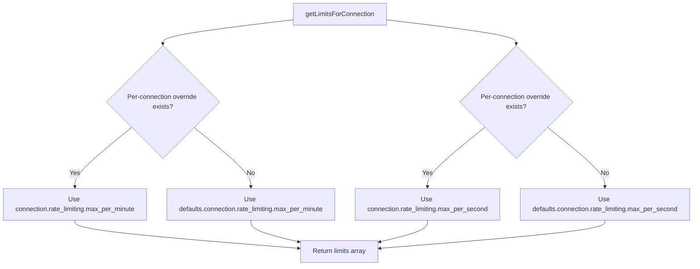
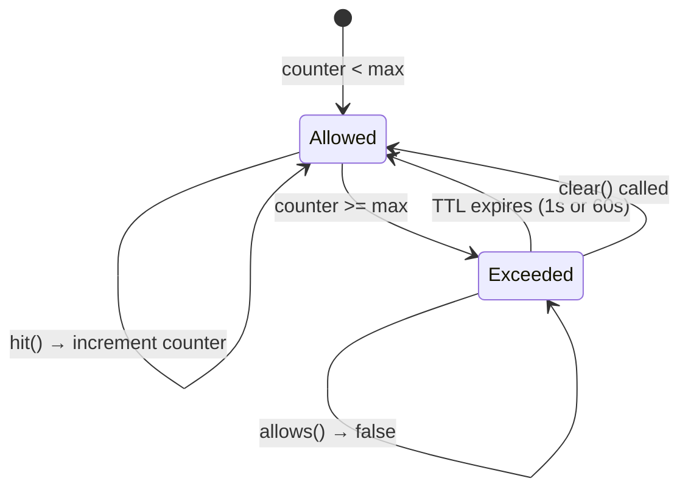
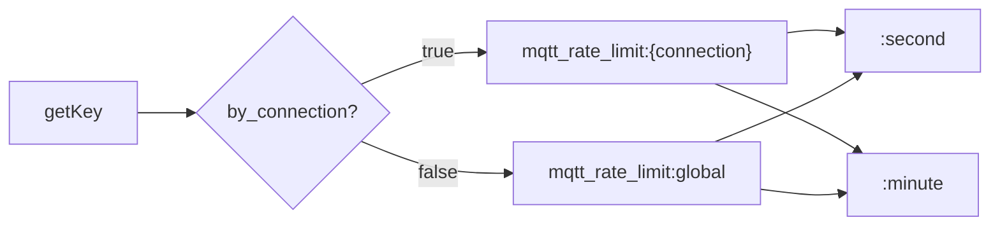
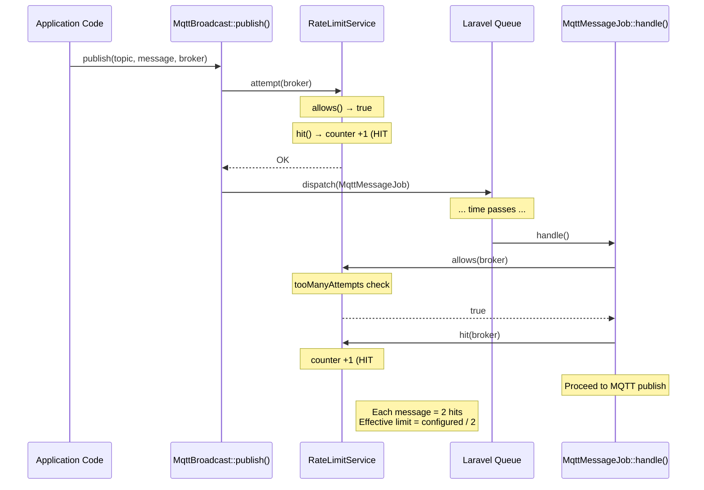

# Rate Limiting

## Overview

The `RateLimitService` protects MQTT brokers from being overwhelmed by excessive publish traffic. It provides a two-layer rate limiting system (per-second and per-minute) with two enforcement strategies (reject and throttle), per-connection isolation or global shared limits, and per-connection limit overrides.

Rate limiting is enforced at two points in the publish lifecycle:
1. **Facade layer** — `MqttBroadcast::publish()` calls the rate limiter before dispatching `MqttMessageJob`
2. **Job layer** — `MqttMessageJob::checkRateLimit()` enforces again before the actual MQTT publish, as a second line of defense against race conditions between dispatch and execution

## Architecture

The service wraps Laravel's `Illuminate\Cache\RateLimiter` with MQTT-specific semantics. It uses cache-backed counters with automatic TTL expiry — 1-second windows for per-second limits, 60-second windows for per-minute limits. No database tables are required.

Key design decisions:
- **Two time windows** — per-second for burst protection, per-minute for sustained throughput control. Both are checked independently; the most restrictive limit wins.
- **Cache-based counters** — uses Laravel's `RateLimiter` (which wraps the configured cache driver) for atomic increment/decrement. No custom storage.
- **Per-connection isolation by default** — each broker connection gets its own counter namespace. Can be switched to global mode for shared rate pools.
- **Per-connection overrides** — individual connections can define their own limits, overriding the global defaults.
- **Strategy pattern** — `reject` throws immediately (fail-fast), `throttle` releases the job back to the queue with a delay (back-pressure).

## How It Works

### Rate Check Flow

When a message is published via the queue, `MqttMessageJob::checkRateLimit()` executes:

1. Resolve `RateLimitService` from the container
2. Call `allows($connection)` — checks both per-second and per-minute counters
3. If allowed: call `hit($connection)` to increment counters, then proceed to publish
4. If blocked and strategy is `throttle`: call `availableIn($connection)` to get delay, then `$this->release($delay)` to requeue the job
5. If blocked and strategy is `reject`: call `attempt($connection)` which throws `RateLimitExceededException`, which triggers `MqttMessageJob::failed()` → DLQ

### Counter Mechanics

Each connection maintains up to two cache keys:

- `mqtt_rate_limit:{connection}:second` — TTL: 1 second, max: `max_per_second`
- `mqtt_rate_limit:{connection}:minute` — TTL: 60 seconds, max: `max_per_minute`

When `by_connection` is `false`, the key becomes `mqtt_rate_limit:global:{window}` — all connections share the same counters.

The `allows()` method checks `tooManyAttempts()` for each configured window (null limits are skipped). The `hit()` method increments both counters with their respective TTLs (1s and 60s). The `remaining()` method returns `min(remaining_second, remaining_minute)` — the most restrictive value.

### Limit Resolution

Limits are resolved with a two-tier fallback:

1. **Per-connection override**: `mqtt-broadcast.connections.{name}.rate_limiting.max_per_minute` / `max_per_second`
2. **Global default**: `mqtt-broadcast.defaults.connection.rate_limiting.max_per_minute` / `max_per_second`

If both per-second and per-minute are `null`, the connection effectively has no limit (even if rate limiting is enabled globally).

### Error Handling: Reject vs Throttle

When `handleRateLimitExceeded()` fires, it first determines which limit was hit (per-second takes priority if both are exceeded), then branches on strategy:

**Reject strategy** (`strategy: 'reject'`):
- Throws `RateLimitExceededException` with connection name, limit value, window name, and retry-after seconds
- In `MqttMessageJob`, this triggers `failed()` → DLQ persistence
- The message is not retried automatically

**Throttle strategy** (`strategy: 'throttle'`):
- `MqttMessageJob::checkRateLimit()` calls `$this->release($delay)` to release the job back to the queue
- The job will be retried after the delay (seconds until the rate window resets)
- The message is not lost — it's deferred

> **Throttle strategy execution continues after release()**: `$this->release($delay)` marks the job for re-release but does **not** stop execution. After `checkRateLimit()` returns, `handle()` continues and publishes the message via MQTT. The result is the message publishes immediately **and** a duplicate job is released to the queue. This means:
> - The rate limit is not effectively enforced in throttle mode — messages still publish immediately
> - A duplicate job will execute after the delay, publishing the same message again
> - The only way to prevent this would be to `return` from `handle()` after `checkRateLimit()` detects a throttle, but `checkRateLimit()` returns `void` with no indication that a release occurred

### Double Counting: Facade + Job Enforcement

For async publishing (`MqttBroadcast::publish()`), rate limit counters are incremented **twice** per message:

1. **Facade layer**: `MqttBroadcast::publish()` calls `$rateLimiter->attempt($broker)`, which calls `hit()` internally (incrementing both window counters)
2. **Job layer**: `MqttMessageJob::checkRateLimit()` calls `$rateLimiter->allows()` then `$rateLimiter->hit()` (incrementing both window counters again)

This means a configured limit of `max_per_minute: 1000` effectively allows only ~500 messages per minute for async publishing. Synchronous publishing via `publishSync()` has the same double-count: facade `attempt()` + job `checkRateLimit()` both fire because `dispatchSync()` runs `handle()` in the same process.

The facade-level `attempt()` uses the atomic check+hit pattern. The job-level uses split `allows()+hit()`, which introduces a TOCTOU (time-of-check-time-of-use) race condition — between `allows()` returning `true` and `hit()` being called, a concurrent worker could also pass `allows()` and both would `hit()`, potentially exceeding the configured limit by 1.

### Config Resolution Per Call

Every public method reads `config()` on every invocation — no values are cached after construction:

- `allows()` → `isEnabled()` reads `config('mqtt-broadcast.rate_limiting.enabled')`, `getKey()` reads `config('mqtt-broadcast.rate_limiting.by_connection')`, `getLimitsForConnection()` reads 2 config keys
- `hit()` → same 4 config reads
- `remaining()` → same 4 config reads
- `availableIn()` → same 4 config reads
- `handleRateLimitExceeded()` → `config('mqtt-broadcast.rate_limiting.strategy')` + `availableIn()` + `getLimitsForConnection()` + `getKey()`

A single `checkRateLimit()` call in `MqttMessageJob` (allowed path) triggers: `allows()` (4 reads) + `hit()` (4 reads) = **8 config() calls**. On the reject path: `allows()` (4) + `attempt()` which calls `allows()` (4) + `handleRateLimitExceeded()` (6+) = **14+ config() calls**.

This is by design — it allows runtime config changes to take effect immediately without restarting workers. But it adds overhead proportional to message throughput.

### Singleton Cache Driver Lock

The constructor resolves the cache driver once at instantiation time and freezes it into `$this->limiter`:

```php
$driver = config('mqtt-broadcast.rate_limiting.cache_driver');
$cache = $driver ? Cache::driver($driver) : Cache::store();
$this->limiter = new RateLimiter($cache);
```

Because `RateLimitService` is registered as a singleton in `ServiceBindings`, the cache driver is locked for the entire process lifetime. Changing `MQTT_RATE_LIMIT_CACHE_DRIVER` at runtime has no effect until the process restarts. Note the naming inconsistency: `Cache::driver()` for explicit config vs `Cache::store()` for default — these are functionally identical but use different method names.

### clear() Bypasses isEnabled()

`clear()` is the only public method that does **not** check `isEnabled()` before executing. It always clears both cache keys regardless of whether rate limiting is enabled. This means `clear()` works even when rate limiting is globally disabled — arguably correct for cleanup purposes, but inconsistent with the guard pattern used by `allows()`, `hit()`, `remaining()`, and `availableIn()`.

## Key Components

| File | Class/Method | Responsibility |
|------|-------------|----------------|
| `src/Support/RateLimitService.php` | `RateLimitService` | Core service: check, enforce, and track rate limits |
| `src/Support/RateLimitService.php` | `allows()` | Non-destructive check: can this connection publish? |
| `src/Support/RateLimitService.php` | `attempt()` | Check + hit + throw if blocked (reject strategy) |
| `src/Support/RateLimitService.php` | `hit()` | Increment both window counters after successful check |
| `src/Support/RateLimitService.php` | `remaining()` | Get remaining attempts (most restrictive window) |
| `src/Support/RateLimitService.php` | `availableIn()` | Get seconds until rate limit resets |
| `src/Support/RateLimitService.php` | `clear()` | Reset both window counters for a connection |
| `src/Support/RateLimitService.php` | `handleRateLimitExceeded()` | Branch on strategy: throw or return delay |
| `src/Support/RateLimitService.php` | `getLimitsForConnection()` | Resolve per-connection overrides → global fallback |
| `src/Support/RateLimitService.php` | `getKey()` | Build cache key: per-connection or global |
| `src/Support/RateLimitService.php` | `isEnabled()` | Check `rate_limiting.enabled` config |
| `src/Exceptions/RateLimitExceededException.php` | `RateLimitExceededException` | Structured exception with connection, limit, window, retryAfter (extends `RuntimeException`) |
| `src/Exceptions/RateLimitExceededException.php` | `getConnection()` / `getLimit()` / `getWindow()` / `getRetryAfter()` | Accessor methods for structured exception context |
| `src/Jobs/MqttMessageJob.php` | `checkRateLimit()` | Job-level enforcement: allows+hit or throttle/reject |
| `src/MqttBroadcast.php` | `publish()` | Facade-level enforcement: `attempt()` before `dispatch()` (first layer) |
| `src/MqttBroadcast.php` | `publishSync()` | Facade-level enforcement: `attempt()` before `dispatchSync()` (first layer) |

## Configuration

### Global Rate Limiting Settings

```php
// config/mqtt-broadcast.php (not published by default — set via config())
'rate_limiting' => [
    'enabled'       => env('MQTT_RATE_LIMIT_ENABLED', true),
    'strategy'      => env('MQTT_RATE_LIMIT_STRATEGY', 'reject'),   // 'reject' | 'throttle'
    'by_connection'  => env('MQTT_RATE_LIMIT_BY_CONNECTION', true),  // true = per-connection, false = global
    'cache_driver'   => env('MQTT_RATE_LIMIT_CACHE_DRIVER'),         // null = default cache driver
],
```

### Default Connection Limits

```php
'defaults' => [
    'connection' => [
        'rate_limiting' => [
            'max_per_minute' => 1000,  // null to disable minute window
            'max_per_second' => null,  // null to disable second window
        ],
    ],
],
```

### Per-Connection Overrides

```php
'connections' => [
    'high-priority' => [
        'host' => '...',
        'rate_limiting' => [
            'max_per_minute' => 5000,  // Higher limit for priority traffic
        ],
    ],
    'low-priority' => [
        'host' => '...',
        'rate_limiting' => [
            'max_per_minute' => 100,   // Restricted connection
            'max_per_second' => 5,
        ],
    ],
],
```

| Config Key | Type | Default | Description |
|-----------|------|---------|-------------|
| `rate_limiting.enabled` | `bool` | `true` | Master switch for rate limiting |
| `rate_limiting.strategy` | `string` | `'reject'` | `reject` = throw exception, `throttle` = requeue with delay |
| `rate_limiting.by_connection` | `bool` | `true` | `true` = isolated counters per connection, `false` = shared global counter |
| `rate_limiting.cache_driver` | `?string` | `null` | Cache driver for counters (null = app default) |
| `defaults.connection.rate_limiting.max_per_minute` | `?int` | `1000` | Messages per 60s window (null = no minute limit) |
| `defaults.connection.rate_limiting.max_per_second` | `?int` | `null` | Messages per 1s window (null = no second limit) |

## Error Handling

| Scenario | Behavior |
|----------|----------|
| Rate limiting disabled (`enabled: false`) | `allows()` always returns `true`, `remaining()` returns `PHP_INT_MAX`, `hit()` is a no-op. `clear()` still executes (no `isEnabled()` guard) |
| Both `max_per_minute` and `max_per_second` are `null` | Effectively unlimited — no counters are checked or incremented. `hit()` is a no-op but `allows()` still reads config twice |
| Strategy `reject` + limit exceeded | `RateLimitExceededException` thrown → `MqttMessageJob::failed()` → DLQ |
| Strategy `throttle` + limit exceeded | Job released back to queue with delay, **but `handle()` continues to publish** — message publishes immediately AND a duplicate job is queued |
| Per-second and per-minute both exceeded | `handleRateLimitExceeded` reports per-second as the violated window (checked first) |
| Cache driver unavailable | Laravel's `RateLimiter` will throw — job fails with infrastructure error |
| Async publish (facade + job) | Counters incremented twice per message — effective limit is ~50% of configured value |
| `attempt()` on reject path | `allows()` is called twice: once by `checkRateLimit()` (returns false), once by `attempt()` internally (re-checks). `hit()` is NOT called on reject path — correct behavior |
| `availableIn()` when not exceeded | Returns `0` — only calculates delay for actually-exceeded windows. If called before limit is hit, always returns 0 |
| Unknown strategy string | `handleRateLimitExceeded()` falls through to throttle behavior (returns `$retryAfter`). No validation of strategy value |
| Concurrent workers (TOCTOU) | `allows()+hit()` in job is non-atomic. Two workers can pass `allows()` simultaneously before either calls `hit()`, exceeding limit by 1. `attempt()` in facade has the same race (calls `allows()` then `hit()` internally) |

## Mermaid Diagrams

### Rate Check Flow in MqttMessageJob (with Throttle Bug)

```mermaid
flowchart TD
    A[MqttMessageJob::checkRateLimit] --> B{rateLimiter.allows?}
    B -->|Yes| C[rateLimiter.hit]
    C --> D[return → handle continues → PUBLISH]
    B -->|No| E{strategy?}
    E -->|throttle| F[availableIn → delay]
    F --> G["release(delay) → marks job for requeue"]
    G --> H["return → handle() CONTINUES"]
    H --> I["mqtt() → connect → PUBLISH ⚠️"]
    I --> J["Duplicate job executes after delay"]
    E -->|reject| K[rateLimiter.attempt]
    K --> L[allows re-checked internally]
    L --> M[handleRateLimitExceeded]
    M --> N[RateLimitExceededException thrown]
    N --> O[handle() STOPS — exception propagates]
    O --> P[MqttMessageJob::failed → DLQ]
```

### Limit Resolution



### Two-Window Counter State Machine



### Cache Key Strategy



### Double Counting: Async Publish Lifecycle



### attempt() Internal Flow

```mermaid
flowchart TD
    A["attempt(connection)"] --> B{isEnabled?}
    B -->|No| C[return — no-op]
    B -->|Yes| D["allows(connection)"]
    D -->|true| E["hit(connection)"]
    E --> F[return — success]
    D -->|false| G["handleRateLimitExceeded(connection)"]
    G --> H{strategy?}
    H -->|reject| I["throw RateLimitExceededException"]
    H -->|throttle or unknown| J["return retryAfter int"]
    Note over J: Return value discarded<br/>by facade callers
```
