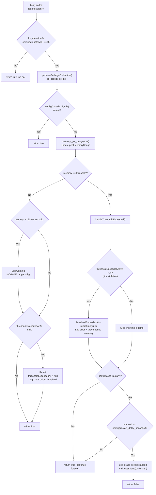
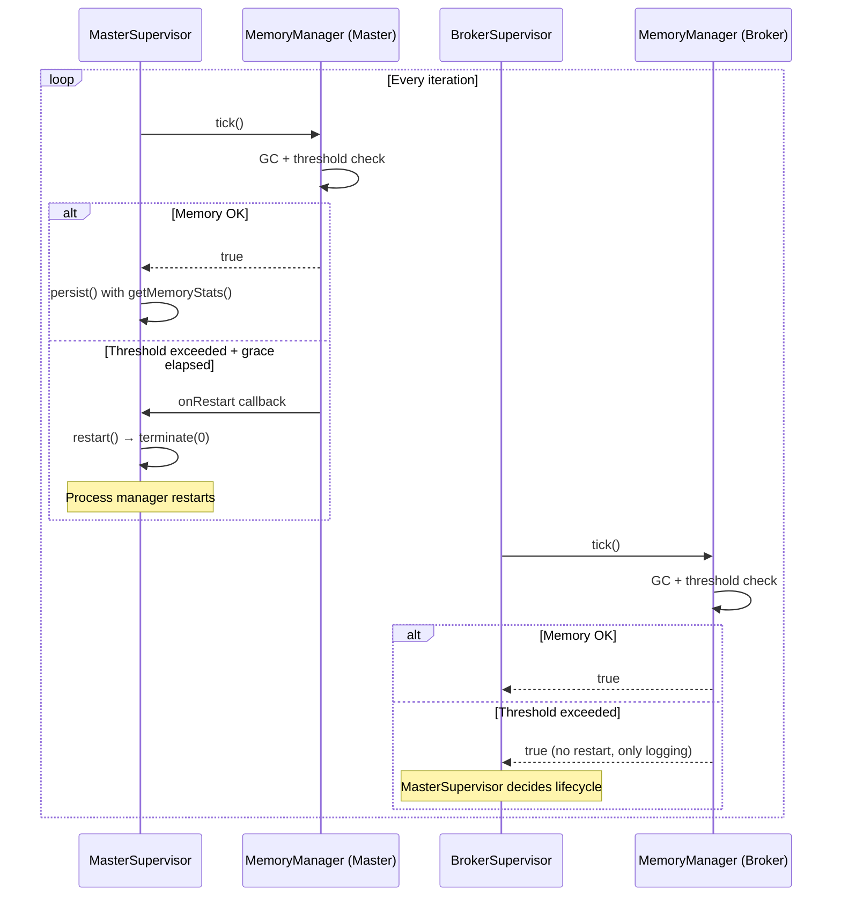
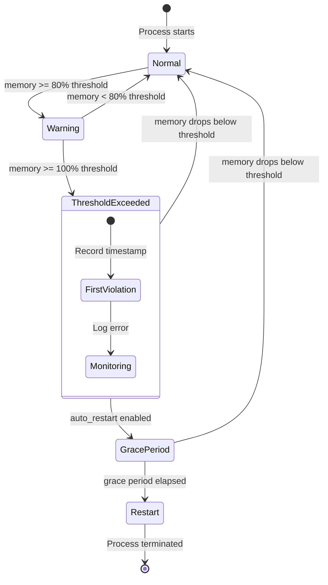

# Memory Management

## Overview

The `MemoryManager` class prevents unbounded memory growth in long-running MQTT supervisor processes. It provides periodic garbage collection, a three-tier memory warning system, and auto-restart capability when configurable thresholds are exceeded.

Long-running PHP processes — especially those holding persistent MQTT connections — accumulate circular references from client internal queues and signal handlers. Without active memory management, these processes eventually exhaust available memory and crash unpredictably. `MemoryManager` makes this failure mode controlled and observable.

## Architecture

`MemoryManager` follows a **tick-based monitoring pattern**: the supervisor calls `tick()` on every loop iteration, and the manager decides when to perform GC and check thresholds based on a configurable interval.

Key design decisions:
- **Separation of concern**: `MemoryManager` handles memory; supervisors handle process lifecycle
- **Callback-based restart**: the manager doesn't terminate processes directly — it invokes an `onRestart` closure provided by the caller
- **Grace period**: threshold violations don't trigger immediate restarts; a configurable delay allows in-progress operations (message publish, heartbeat update) to complete
- **Opt-in monitoring**: setting `threshold_mb` to `null` disables all threshold checks while keeping GC active

## How It Works

### Tick Lifecycle

Every supervisor loop iteration calls `MemoryManager::tick()`:

1. Increment internal `loopIteration` counter
2. If `loopIteration % gc_interval === 0`:
   a. Run `gc_collect_cycles()` to free circular references
   b. Log freed memory only if cycles were actually collected (avoids noise)
   c. Check memory against configured threshold
3. If not a GC tick: return `true` immediately (no-op)

**Config is read on every GC tick, not cached in the constructor.** `tick()` calls `config('mqtt-broadcast.memory.gc_interval')` each invocation, and `checkMemoryThreshold()` / `handleThresholdExceeded()` similarly read `threshold_mb`, `auto_restart`, and `restart_delay_seconds` from config on every check. This means runtime config changes (e.g., via `config()->set(...)`) take effect without restarting the process — but it also means every GC tick incurs config resolution overhead.

### memory_get_usage(true) — Real Allocation Tracking

All memory reads use `memory_get_usage(true)`, which returns the **real memory allocated from the OS**, not just the memory used by PHP variables. This is significant:

| Parameter | Measures | Typical Value |
|-----------|----------|---------------|
| `memory_get_usage(false)` | Memory used by PHP variables/objects | Lower |
| `memory_get_usage(true)` | Memory allocated from OS in chunks (Zend MM pages) | Higher, step-function |

Because PHP's memory manager allocates in chunks (typically 2 MB), `memory_get_usage(true)` increases in steps rather than continuously. A small allocation can push memory from (e.g.) 30 MB to 32 MB. This means:
- Threshold warnings may appear to fire "suddenly" — memory jumps a full chunk past 80%
- `performGarbageCollection()` may report 0 freed bytes even when cycles are collected, because freeing small objects doesn't release the OS-level chunk

### Three-Tier Warning System

When `threshold_mb` is set, `checkMemoryThreshold()` implements escalating alerts:

| Tier | Trigger | Action |
|------|---------|--------|
| **Warning** | Memory ≥ 80% of threshold AND < 100% | Log warning with usage percentage, current MB, and peak MB |
| **Error** | Memory ≥ 100% of threshold | Log error, start grace period countdown |
| **Restart** | Threshold exceeded for `restart_delay_seconds` | Invoke `onRestart` callback, return `false` to signal termination |

The threshold resets automatically if memory drops below the limit during the grace period (e.g., after a successful GC cycle).

**Recovery edge case**: when memory drops from ≥ 100% to the 80-100% range in a single GC tick, both the warning ("Memory at X%") and the recovery message ("Memory usage back below threshold") are logged on the same tick. The warning fires first (lines 120-128), then the recovery check resets `thresholdExceededAt` (lines 136-139). This is benign but produces slightly confusing log output.

**Warning-only range**: the 80% warning only fires when memory is between 80% and 100% (`$currentMemory >= $thresholdBytes * 0.8 && $currentMemory < $thresholdBytes`). If memory jumps directly from < 80% to ≥ 100% (possible with large allocations), the warning tier is skipped entirely — the first alert is the error.

### Auto-Restart Flow

When auto-restart is enabled and the grace period elapses:

1. `handleThresholdExceeded()` calls the `onRestart` closure
2. Returns `false` — the supervisor's monitor loop checks this return value
3. In `MasterSupervisor`: `onRestart` calls `restart()` → `terminate(0)`, exiting the process cleanly
4. The external process manager (systemd, supervisord) restarts the entire process tree

In `BrokerSupervisor`: `onRestart` is `null` — broker supervisors only log, they don't self-restart. The `MasterSupervisor` owns lifecycle decisions for its child supervisors.

### Grace Period Quantization

The grace period is **only evaluated on GC ticks**, not every loop iteration. Since threshold checks run inside `checkMemoryThreshold()` which only executes when `loopIteration % gc_interval === 0`, the effective minimum grace period is:

```
effective_grace = max(restart_delay_seconds, gc_interval * loop_sleep_seconds)
```

With default settings (`gc_interval=100`, `sleep(1)` in MasterSupervisor, `restart_delay_seconds=10`):
- Tick N (100 seconds): memory exceeds threshold → `thresholdExceededAt = now`
- Tick N+100 (200 seconds): elapsed = ~100s ≥ 10s → restart triggered

The configured 10-second grace period actually takes ~100 seconds to fire. Only when `gc_interval * sleep` < `restart_delay_seconds` does the configured delay actually gate the restart. To get a grace period close to the configured value, set `gc_interval` to a low value (e.g., 1-5).

### Supervisor Integration Asymmetry

| Aspect | MasterSupervisor | BrokerSupervisor |
|--------|-----------------|------------------|
| `tick()` return checked? | Yes — `if (! $this->memoryManager->tick())` in `loop()` | No — bare `$this->memoryManager->tick()` call |
| `onRestart` callback | `fn () => $this->restart()` | `null` |
| Output prefix | None (raw message) | `[$brokerName]` prefix wrapped by constructor closure |
| Memory stats persisted? | Yes — `persist()` writes to cache via repository | No — BrokerSupervisor has no `persist()` method |
| Memory observable from dashboard? | Yes — `DashboardStatsController` / `HealthController` read cache | No — broker memory is only visible in log output |

Because `BrokerSupervisor` ignores the `tick()` return value, `handleThresholdExceeded()` still returns `false` after the grace period, but the value is discarded. The only observable effect for a broker exceeding its threshold is log output — no process-level action is taken.

### Peak Memory Tracking Side-Effect

`getMemoryStats()` is not a pure read — it updates `peakMemoryUsage` as a side effect:

```php
$this->peakMemoryUsage = max($this->peakMemoryUsage, $currentMemory);
```

This means every call to `getMemoryStats()` — including from `MasterSupervisor::persist()` — can update the peak value. The peak tracks the highest `memory_get_usage(true)` seen across all calls to either `checkMemoryThreshold()` or `getMemoryStats()`, whichever happens to observe a higher value. Since `persist()` runs every loop iteration but `checkMemoryThreshold()` only runs on GC ticks, `persist()` is the primary peak tracker in practice.

## Key Components

| File | Class/Method | Responsibility |
|------|-------------|----------------|
| `src/Support/MemoryManager.php` | `MemoryManager` | Core memory monitoring service |
| `src/Support/MemoryManager.php` | `tick()` | Entry point: GC + threshold check on interval |
| `src/Support/MemoryManager.php` | `performGarbageCollection()` | Runs `gc_collect_cycles()`, logs freed memory |
| `src/Support/MemoryManager.php` | `checkMemoryThreshold()` | Three-tier warning/error/restart logic |
| `src/Support/MemoryManager.php` | `handleThresholdExceeded()` | Grace period tracking + restart trigger |
| `src/Support/MemoryManager.php` | `getMemoryStats()` | Returns current/peak memory in MB and bytes |
| `src/Support/MemoryManager.php` | `reset()` | Resets iteration counter, peak tracking, threshold state |
| `src/Supervisors/MasterSupervisor.php` | `__construct()` | Creates `MemoryManager` with output + restart callbacks |
| `src/Supervisors/MasterSupervisor.php` | `monitor()` | Calls `tick()` each iteration; exits loop if `false` |
| `src/Supervisors/MasterSupervisor.php` | `persist()` | Includes `getMemoryStats()` in cache state |
| `src/Supervisors/BrokerSupervisor.php` | `__construct()` | Creates `MemoryManager` with output only (no restart) |
| `src/Supervisors/BrokerSupervisor.php` | `monitor()` | Calls `tick()` each iteration (return value ignored) |
| `src/Support/MemoryManager.php` | `output()` | Delegates to callback; silent no-op when callback is null |
| `src/Support/MemoryManager.php` | `__construct()` | Sets initial peak from `memory_get_usage(true)` at creation time |

## Configuration

All settings live under `config('mqtt-broadcast.memory')`:

| Key | Env Var | Default | Description |
|-----|---------|---------|-------------|
| `gc_interval` | `MQTT_GC_INTERVAL` | `100` | Run GC every N loop iterations |
| `threshold_mb` | `MQTT_MEMORY_THRESHOLD_MB` | `128` | Memory limit in MB; `null` disables monitoring |
| `auto_restart` | `MQTT_MEMORY_AUTO_RESTART` | `true` | Whether to trigger restart on threshold breach |
| `restart_delay_seconds` | `MQTT_RESTART_DELAY_SECONDS` | `10` | Grace period before restart after threshold exceeded |

### Runtime Config Behavior

All four config keys are read from `config()` on every GC tick — not cached at construction. This enables hot-reconfiguration via `config()->set(...)` or environment changes picked up by a config reload, without restarting the supervisor process.

However, `gc_interval` is only effective for controlling the *next* GC timing — if you change it from 100 to 10 mid-flight, the change applies to the next modulo check of the already-incrementing `loopIteration` counter. The counter is never reset except by `reset()`.

### Tuning Guidelines

- **`gc_interval`**: Lower values (e.g., 10) increase CPU overhead from frequent GC but catch memory issues faster. Higher values (e.g., 500) reduce overhead but delay detection. Default of 100 is a good balance for most workloads. **Critical**: this value also controls how often threshold checks run, which determines the effective minimum grace period (see Grace Period Quantization above). For responsive auto-restart, use a low gc_interval.
- **`threshold_mb`**: Set based on your server's available memory. For containers, set to ~75% of the container memory limit to leave room for peak allocations. Remember that `memory_get_usage(true)` reports OS-level allocation in chunks — the threshold may trigger at a value slightly higher than the configured MB due to chunk granularity.
- **`restart_delay_seconds`**: Must be long enough for in-flight MQTT publishes and heartbeat writes to complete. Default of 10s is conservative; reduce to 3-5s if your operations are fast. **Note**: the effective delay is `max(restart_delay_seconds, gc_interval * sleep_interval)` — with default gc_interval=100, this delay is ~100 seconds regardless of this setting.

## Error Handling

| Scenario | Behavior |
|----------|----------|
| `threshold_mb` is `null` | All threshold checks skipped; GC still runs |
| `auto_restart` is `false` | Warnings and errors are logged but process continues indefinitely |
| Memory drops below threshold during grace period | Grace period resets, "back below threshold" logged |
| Memory drops from ≥100% to 80-100% range | Both warning and recovery messages logged on same tick |
| Memory jumps from <80% directly to ≥100% | Warning tier skipped, first alert is error |
| No `onRestart` callback provided | `handleThresholdExceeded()` returns `false` but no callback is invoked |
| `gc_collect_cycles()` returns 0 | No log output (avoids noise when no garbage is present) |
| `gc_collect_cycles()` frees cycles but OS chunk not released | Logs "freed 0.00 MB" due to `max(0, before - after)` on unchanged `memory_get_usage(true)` |
| BrokerSupervisor exceeds threshold | Logs error but takes no action — `tick()` return value is discarded |
| `gc_interval` set to 0 | Modulo by zero: every tick triggers GC (PHP `% 0` throws `DivisionByZeroError`) |
| `threshold_mb` set to 0 | Division produces infinity percentage; all memory ≥ 0 bytes triggers threshold exceeded |
| No output callback (`null`) | `output()` silently no-ops; all warnings/errors are lost |

## Mermaid Diagrams

### Tick Decision Flow



### Grace Period Quantization

```mermaid
sequenceDiagram
    participant Loop as MasterSupervisor loop()
    participant MM as MemoryManager
    participant Config as config()

    Note over Loop: sleep(1) per iteration
    Loop->>MM: tick() [iteration 1-99]
    MM-->>Loop: true (non-GC tick, immediate return)

    Loop->>MM: tick() [iteration 100 — GC tick]
    MM->>Config: gc_interval, threshold_mb
    MM->>MM: gc_collect_cycles()
    MM->>MM: memory_get_usage(true) >= threshold
    MM->>MM: thresholdExceededAt = microtime(true)
    MM->>Config: auto_restart, restart_delay_seconds=10
    Note over MM: elapsed = 0s < 10s
    MM-->>Loop: true (grace period started)

    Loop->>MM: tick() [iterations 101-199]
    MM-->>Loop: true (non-GC tick — no threshold check)

    Loop->>MM: tick() [iteration 200 — next GC tick]
    MM->>MM: memory still >= threshold
    MM->>Config: restart_delay_seconds=10
    Note over MM: elapsed ≈ 100s >= 10s
    MM->>Loop: onRestart callback → restart()
    MM-->>Loop: false
    Note over Loop: return (restart() calls terminate(0))
```

### Integration with Supervisor Hierarchy



### Memory State Machine


